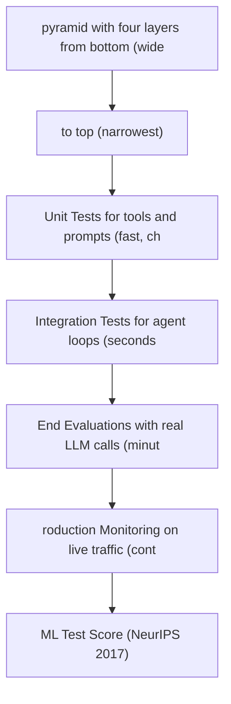

# Agent Testing Strategy

**One-Line Summary**: A comprehensive testing architecture for agent systems, covering the testing pyramid, non-determinism management, evaluation design, and CI/CD pipelines.

**Prerequisites**: `tool-interface-design.md`, `error-resilience-patterns.md`.

## What Is Agent Testing Strategy?

Think about testing a self-driving car. You do not just put it on the road and see what happens. You start with unit tests for individual sensors -- does the LIDAR return correct distance readings? Then integration tests for subsystems -- does the perception system correctly identify a pedestrian from the sensor fusion pipeline? Then closed-course road tests -- does the car stop at a stop sign in controlled conditions? Finally, supervised road tests in real traffic. Each layer catches different classes of defects, and skipping any layer creates blind spots that compound into dangerous failures.

Agent testing follows the same pyramid structure, but with a twist that traditional software does not have: non-determinism. The same agent, given the same input, may take a different path and produce a different output on every run. This means you cannot simply assert that output equals expected value. You need statistical pass criteria, semantic assertions, and evaluation rubrics that measure whether the agent achieved the goal, not whether it took the exact expected path.

A well-designed testing strategy gives you confidence that the agent works, the ability to detect when it stops working, and the data to diagnose why it stopped working.

## How It Works

### Unit Tests for Tools and Components

Unit tests validate individual components in isolation. For agent systems, the key unit-testable components are tools, prompt templates, output parsers, and routing logic.

**Tool unit tests** verify that each tool behaves correctly given known inputs:

- Test that valid inputs produce expected outputs (happy path).
- Test that invalid inputs produce structured error responses, not exceptions.
- Test edge cases: empty inputs, maximum-length inputs, special characters, Unicode, null values.
- Test idempotency: calling the tool twice with the same idempotency key produces the same result.

**Prompt template tests** verify that templates render correctly:

- Test that variable substitution produces well-formed prompts.
- Test that prompts stay within token limits for all realistic input sizes.
- Test that system prompts do not accidentally include sensitive information from templates.

**Output parser tests** verify that parsers handle both expected and unexpected LLM outputs:

- Test parsing of well-formed outputs (the happy path).
- Test parsing of common malformations: missing fields, extra fields, wrong types, markdown wrapping, trailing text.
- Test the fallback parsing chain: strict parse fails, lenient parse succeeds, extracts correct values.

**Target**: 100% coverage of tools, parsers, and routing logic. These tests are fast (milliseconds each), cheap (no LLM calls), and deterministic. Run on every commit.

### Integration Tests for Agent Loops

Integration tests verify that the agent loop -- the cycle of reasoning, tool selection, tool execution, and result incorporation -- works correctly with recorded or mocked interactions.

**Recorded interaction testing** (also called "golden path" testing):

1. Run the agent on a curated set of tasks and record the full trajectory: every LLM call, every tool call, every intermediate result.
2. Store these trajectories as fixtures.
3. On subsequent test runs, replay the recorded LLM responses (mock the LLM API to return the recorded responses in sequence) and verify that the agent orchestration logic processes them correctly.

This approach tests the orchestration code deterministically while the recorded responses represent realistic LLM behavior.

**What integration tests catch:**

| Defect Type | Example | Detection Method |
|---|---|---|
| Orchestration bugs | Agent fails to pass tool result back to LLM | Assert tool result appears in next LLM call's messages |
| State management errors | Agent loses context between steps | Assert state object contains expected data after each step |
| Error handling failures | Agent crashes instead of triggering fallback on tool error | Inject tool error in recording, assert fallback activates |
| Loop termination issues | Agent does not stop after reaching goal | Assert loop terminates within expected step count |

**Target**: 20-50 integration test cases covering the major workflow paths and error paths. These tests take seconds each (no real LLM calls). Run on every commit.

### End-to-End Evaluations

End-to-end evaluations (evals) run the agent against real tasks with real LLM calls and measure outcome quality. This is where you assess whether the agent actually solves problems.

**Evaluation suite design:**

1. **Task diversity**: Include easy, medium, and hard tasks. A suite of only easy tasks inflates pass rates and misses capability gaps. Aim for 30-40% easy, 40-50% medium, 20-30% hard.
2. **Suite size**: Minimum 50 tasks for statistical significance. Ideally 100-200 for fine-grained quality measurement. At $0.05 per task, a 200-task suite costs $10 per run.
3. **Scoring rubrics**: Define what "success" means for each task type:

| Scoring Method | When to Use | Example |
|---|---|---|
| Binary pass/fail | Clear success criteria exist | Code compiles and passes tests |
| Rubric scoring (1-5) | Quality is a spectrum | Response covers 4 of 5 required points |
| Automated metrics | Ground truth available | F1 score against reference answer |
| LLM-as-judge | Complex quality assessment | Another LLM rates helpfulness and accuracy |

4. **Reference solutions**: Where possible, include a reference solution for each task so that automated scoring can compare agent output to expected output.

**Running evals:**

- Run the full suite on every model change, prompt change, or architecture change.
- Run a 20% stratified sample nightly as a regression check.
- Run the full suite weekly even without changes to detect model drift.

*Figure: The ReAct loop (Yao et al., ICLR 2023). Integration tests must validate that this reasoning-action-observation cycle works correctly: that tool results are properly incorporated, that the agent stops at the right time, and that error paths trigger fallbacks.*

### Managing Non-Determinism

Non-determinism is the fundamental challenge that distinguishes agent testing from traditional software testing.

**Temperature control**: Set temperature to 0 for evaluation runs. This does not eliminate non-determinism entirely (batching, quantization, and sampling implementation details can still vary), but it reduces variance significantly. Expect 85-95% reproducibility at temperature 0 across runs.

**Semantic assertions**: Instead of `assert output == expected_output`, use assertions that check semantic equivalence:

- `assert output contains all required information` (check for key facts or entities).
- `assert output is valid according to schema` (structural correctness).
- `assert LLM-judge rates output >= 4/5` (quality threshold).

**Statistical pass criteria**: Run each eval task N times (typically 3-5) and require a pass rate threshold:

- **Strict**: Pass on all N runs. Use for safety-critical behaviors.
- **Majority**: Pass on >50% of runs. Use for general quality assessment.
- **Relaxed**: Pass on at least 1 of N runs. Use for capability existence testing (can the agent do this at all?).

**Variance tracking**: Record the standard deviation of scores across runs. If variance is increasing over time, the agent is becoming less reliable even if the mean score is unchanged.

### Test Fixtures and Mocking

**Mock tools** simulate tool behavior without calling real APIs. Essential for unit and integration tests. Design mock tools to be configurable: return success, return specific errors, return after a delay, return malformed data.

**Synthetic environments** provide a complete sandbox for agent testing. For a coding agent, this might be a Docker container with a known codebase. For a customer service agent, this might be a mock database with known customer records. The key property: the environment is reset to a known state before each test.

**Fixture management:**

- Store tool mocks and environment configs in version control alongside tests.
- Tag fixtures with the agent version and model version they were created with.
- Regenerate fixtures when the agent's tool interface changes.

### CI/CD for Agents

Different tests run at different stages of the deployment pipeline:

| Pipeline Stage | Tests to Run | Cost | Duration | Gate? |
|---|---|---|---|---|
| Pre-commit | Linting, type checks | $0 | <10s | Hard gate |
| Per-commit | Unit tests + integration tests | $0 | <2min | Hard gate |
| Pre-merge (PR) | Unit + integration + 20% eval sample | $2-5 | 5-15min | Hard gate |
| Pre-deploy | Full evaluation suite | $10-50 | 30-60min | Hard gate |
| Post-deploy | Production smoke tests (5-10 tasks) | $0.50-1 | 2-5min | Auto-rollback |
| Nightly | Full eval + regression analysis | $10-50 | 30-60min | Alert |

**Cost management:** Use cached LLM responses for unit and integration tests (zero LLM cost). Run full evals only on significant changes. Use smaller evaluation subsets for PR checks; reserve full suites for pre-deploy and nightly. Budget $500-2000/month for evaluation LLM costs in an active development team.

### Regression Detection

Regression means the agent got worse at something it previously handled. Detecting regression requires: (1) recording evaluation scores per task at each release as baselines, (2) comparing each task's score to baseline on new runs and flagging drops, (3) using paired statistical tests (e.g., McNemar's test) to confirm significance at p<0.05, and (4) automatically alerting when a specific task regresses or the aggregate score drops by more than 2 percentage points.

## Why It Matters

### Non-Determinism Makes Manual Testing Unreliable

When a developer tests an agent manually, they see one possible trajectory. The agent may succeed on that run but fail on 30% of other runs with the same input. Without statistical evaluation across multiple runs and diverse inputs, you have no idea what the actual reliability is.

### Model Updates Are Silent Breaking Changes

When your LLM provider updates the model behind the API endpoint, the agent's behavior can change without any code change on your side. Automated evaluation suites catch these changes. Without them, you discover regressions through user complaints.

### Agents Are Expensive to Debug Without Trajectory Data

When an agent fails in production, you need to know what it was thinking and what it tried. Integration tests that record trajectories and production monitoring that logs full trajectories provide the data needed to diagnose failures in minutes rather than hours.

## Key Technical Details

- **Temperature 0** provides 85-95% reproducibility across runs. The remaining 5-15% variance comes from API-level non-determinism (batching, quantization).
- **Minimum evaluation suite size** is 50 tasks for statistically meaningful results. With 50 binary tasks, you can detect a 15-percentage-point quality change at p<0.05.
- **LLM-as-judge** agreement with human raters is typically 80-90% when using a frontier model with a well-designed rubric. Calibrate your rubric against 50+ human-rated examples before trusting it.
- **Evaluation cost** for a 200-task suite using a frontier model is approximately $10-50 per run, depending on task complexity and token usage.
- **CI/CD test budgets** for an active development team: $500-2000/month for evaluation runs. This is a small fraction of the production LLM cost.
- **Regression detection sensitivity**: With 100-task evaluation suites run 3 times each, you can reliably detect 5-percentage-point quality changes within one nightly run.

## Common Misconceptions

**"You can test agents the same way you test traditional software."** Traditional testing assumes deterministic behavior: same input produces same output. Agent testing requires statistical evaluation, semantic assertions, and trajectory analysis. Applying only deterministic testing methods to agents gives false confidence.

**"End-to-end evals are the only tests that matter for agents."** End-to-end evals are essential but expensive, slow, and non-deterministic. Unit and integration tests are cheap, fast, and deterministic. They catch the majority of bugs (broken tools, faulty parsers, state management errors) without any LLM calls. Skipping them makes development slow and debugging painful.

**"If the agent passes evals at temperature 0, it works in production."** Production runs at non-zero temperature, with diverse inputs, under variable load, and against live tool APIs that may behave differently from test environments. Eval results are a necessary but not sufficient indicator of production reliability. Production monitoring closes the gap.

**"You need thousands of eval tasks for a good evaluation suite."** 100-200 well-designed tasks with clear scoring rubrics provide more signal than 1000 poorly designed tasks. Focus on task quality, diversity, and rubric precision rather than raw quantity.

**"Agent testing is too expensive to run frequently."** Unit and integration tests cost nothing (no LLM calls). A 50-task eval subset costs $2-5. Only full evaluation suites are expensive, and these only need to run on significant changes and nightly. The cost of not testing -- shipping regressions, debugging production failures, losing user trust -- is far higher.

## Connections to Other Concepts

- `error-resilience-patterns.md` defines the failure modes that integration tests must exercise -- fallback chains, retry behavior, checkpoint recovery.
- `cost-latency-optimization.md` constrains the testing budget and provides the cost metrics that evaluation suites should track.
- `safety-by-design.md` requires adversarial test suites as part of the pre-production safety checklist described here.
- `agent-benchmarks.md` in the ai-agent-concepts collection covers established benchmarks (SWE-bench, GAIA, etc.) that can supplement custom evaluation suites.
- `regression-testing.md` in the ai-agent-concepts collection provides foundational concepts for the regression detection system described here.
- `reliability-and-reproducibility.md` in the ai-agent-concepts collection explores the non-determinism challenge at a conceptual level.

## Further Reading

- Zhuo, T.Y. et al. (2024). "Benchmarking LLM-based Agents: Challenges and Best Practices." *arXiv*. Comprehensive analysis of agent evaluation methodology and common pitfalls.
- Jimenez, C.E. et al. (2024). "SWE-bench: Can Language Models Resolve Real-World GitHub Issues?" *ICLR 2024*. Canonical example of a well-designed agent evaluation suite with clear scoring criteria.
- Breck, E. et al. (2017). "The ML Test Score: A Rubric for ML Production Readiness." *NeurIPS Workshop*. Foundational framework for ML testing that applies to agent systems with adaptation.
- Anthropic (2024). "Evaluating AI Systems." Anthropic research. Practical guidance on building evaluation suites for LLM-based systems.
- Ribeiro, M.T. et al. (2020). "Beyond Accuracy: Behavioral Testing of NLP Models with CheckList." *ACL 2020*. Methodology for systematic behavioral testing applicable to agent output quality.
