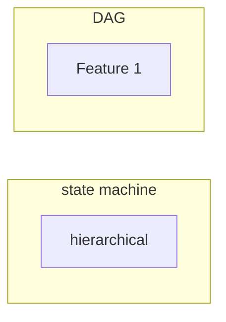

# Architecture Selection Framework

**One-Line Summary**: A decision matrix for choosing the right agent architecture pattern based on your task's structure, latency requirements, cost constraints, and error tolerance.

**Prerequisites**: `do-you-need-an-agent.md`, `complexity-gradient.md`.

## What Is Architecture Selection?

Choosing an agent architecture is like choosing a vehicle for a journey. A bicycle is simple, cheap, and efficient for short trips on smooth roads. A car handles longer distances and varied terrain. A bus moves many passengers on fixed routes. A train carries heavy loads at high speed on predefined tracks. Each vehicle is excellent for its intended use case and terrible outside of it. You would not take a bus off-road, and you would not ride a bicycle across the country.

Agent architectures work the same way. A ReAct loop is the bicycle: minimal structure, maximum flexibility, great for straightforward tool-use tasks. A plan-and-execute system is the car: more overhead, but it handles complex multi-step work. A state machine is the train: fast and reliable on its tracks, but inflexible. The right choice depends on the journey, not on which vehicle is newest or most impressive.

This framework assumes you have already decided you need an agent or a complex workflow (see `do-you-need-an-agent.md`) and that you are at the appropriate rung on the complexity gradient (see `complexity-gradient.md`). Now the question is: which architecture?

*Figure: The ReAct pattern (Yao et al., ICLR 2023) -- the "bicycle" of agent architectures. Simple, flexible, and the right default for unstructured tasks with 1-5 steps.*

## How It Works

### The Five Architecture Patterns

**ReAct Loop**: The model reasons about what to do, takes an action (tool call), observes the result, and repeats. No explicit plan, no external state tracking. The model's context window IS the state.
- Strengths: Simple to implement, flexible, works well for 1-5 step tasks.
- Weaknesses: Degrades on long tasks (10+ steps), no recovery from bad early decisions, expensive for repetitive patterns.

**Plan-and-Execute**: The model first generates a plan (a list of steps), then executes each step. The plan can be revised based on intermediate results.
- Strengths: Handles 5-20 step tasks, supports plan revision, easier to observe and debug.
- Weaknesses: Planning step adds latency and cost, plan quality depends on the model's ability to anticipate, poor for highly dynamic tasks where the plan changes every step.

**State Machine / Graph**: Predefined states and transitions. The model operates within a state, and transitions are either deterministic (coded) or model-decided. Frameworks like LangGraph implement this pattern.
- Strengths: High observability, predictable control flow, supports human-in-the-loop at specific states, recoverable.
- Weaknesses: Requires upfront design of states and transitions, less flexible for novel tasks, more code to maintain.

**DAG Workflow**: A directed acyclic graph of processing nodes. Each node is a prompt or tool call. Branching and parallelism are explicit in the graph structure. No cycles.
- Strengths: Highly parallelizable, deterministic execution order, easy to test individual nodes, excellent for batch processing.
- Weaknesses: Cannot handle iterative refinement (no cycles), fixed structure means no adaptation, not truly "agentic."

**Hierarchical / Multi-Agent**: A supervisor agent delegates to specialized sub-agents. Each sub-agent can use any of the patterns above internally.
- Strengths: Scales to very complex tasks, supports specialization, enables parallel execution of independent subtasks.
- Weaknesses: Highest cost (10-30x baseline), most complex to debug, inter-agent communication failures, requires careful role definition.

### The Decision Matrix

Rate your task on each characteristic (Low / Medium / High), then find the best-fit pattern:

| Characteristic | ReAct | Plan-and-Execute | State Machine | DAG Workflow | Hierarchical |
|---------------|-------|-------------------|---------------|--------------|--------------|
| **Unstructured input** | Best | Good | Poor | Poor | Good |
| **Long task (10+ steps)** | Poor | Best | Good | N/A | Best |
| **Low latency required** | Good | Poor | Best | Best | Poor |
| **Low cost required** | Good | Poor | Good | Best | Poor |
| **High observability needed** | Poor | Good | Best | Best | Poor |
| **High error tolerance** | Good | Good | Poor | Poor | Good |
| **Parallelizable subtasks** | Poor | Poor | Good | Best | Good |
| **Human-in-the-loop needed** | Poor | Good | Best | Good | Good |
| **Novel/varied tasks** | Best | Good | Poor | Poor | Good |
| **Predictable execution** | Poor | Medium | Best | Best | Poor |

**Reading the matrix**: For each row where your task scores "High," find the column(s) marked "Best" or "Good." The pattern with the most "Best"/"Good" marks across your high-priority rows is your starting point.

### Decision Shortcuts

For common scenarios, skip the matrix:

- **Simple tool-use chatbot** (web search, calculator, file lookup): ReAct loop.
- **Document processing pipeline** (extract, validate, transform, load): DAG workflow.
- **Coding assistant** (read code, plan changes, edit files, test): Plan-and-execute.
- **Customer service agent** (triage, route, resolve, escalate): State machine.
- **Research assistant** (search, evaluate, synthesize, iterate): Plan-and-execute or ReAct depending on depth.
- **Complex multi-domain task** (e.g., plan a project, write code, run tests, write docs): Hierarchical.

### Hybrid Patterns

In practice, production systems often combine patterns:

- **State machine with ReAct nodes**: The outer control flow is a state machine (predictable, observable), but individual states run ReAct loops internally (flexible within a state). This is the most common production hybrid.
- **Plan-and-execute with DAG execution**: The planning step produces a DAG, which is then executed with parallelism. Good for tasks with independent subtasks.
- **Hierarchical with state machine supervisor**: The supervisor follows a state machine for the overall process, delegating to specialized agents at each state. Adds predictability to multi-agent systems.

**The 80/20 hybrid rule**: If 80% of your task runs follow a predictable pattern and 20% need flexibility, build the 80% as a state machine or DAG and handle the 20% with an embedded ReAct loop. This gives you the cost and reliability benefits of a workflow for the common case and the flexibility of an agent for exceptions.

## Why It Matters

### Architecture Determines Your Constraint Envelope

Your choice of architecture determines not just how your system works, but what it can and cannot do. A DAG workflow cannot iterate. A ReAct loop cannot guarantee execution order. A state machine cannot handle novel states. These are not bugs --- they are properties of the architecture. Choosing wrong means fighting the architecture for the life of the project.

### Architecture Determines Your Debugging Experience

When something goes wrong (and it will), your architecture determines how hard it is to find and fix the problem. State machines have the best debugging story: you know exactly which state the system was in and what transition failed. ReAct loops have the worst: you must read through the entire reasoning trace to understand what happened. If your team does not have strong LLM debugging skills, prefer architectures with higher observability.

### Migration Cost Is Real

Switching architectures mid-project is expensive. Moving from a ReAct loop to a state machine requires reverse-engineering the implicit states from agent traces and encoding them explicitly. Budget 2-4 weeks for a migration. It is cheaper to spend a few hours on architecture selection upfront.

## Key Technical Details

- ReAct loops average **3-7 iterations** for typical tasks. Beyond 10 iterations, success rates drop below 50% as context fills with irrelevant history.
- Plan-and-execute adds **1-3 seconds** for the planning step but reduces total iterations by 20-40% compared to ReAct on complex tasks.
- State machines in LangGraph benchmarks show **15-25% lower token usage** than equivalent ReAct implementations for structured tasks.
- DAG workflows achieve **2-5x speedup** over sequential execution when subtasks are parallelizable.
- Hierarchical systems need a minimum of **3 inter-agent messages** per delegation (delegate, report, acknowledge), each costing a full LLM call.
- The median production agent uses **3-5 tools**. Systems with more than 8 tools should consider routing or hierarchical patterns to keep per-agent tool sets focused.
- Human-in-the-loop checkpoints in state machines add **zero token cost** (the pause is in application code, not LLM calls) but can add minutes to hours of wall-clock time.

## Common Misconceptions

**"ReAct is the default agent pattern, so start there."** ReAct is the simplest agent pattern, which makes it the right default when you need an agent for unstructured tasks. But for structured tasks, a state machine or DAG is simpler AND more capable. "Default" depends on the task.

**"Multi-agent is more capable, so use it when possible."** Multi-agent systems are more capable in the same way a 747 is more capable than a Cessna. The additional capability comes with proportional complexity. Use multi-agent only when a single agent demonstrably cannot handle the task scope.

**"State machines are too rigid for LLM applications."** The states are fixed, but the behavior within each state is LLM-driven. A state machine with LLM-powered transitions and in-state reasoning is both structured AND flexible. This is the most underrated pattern.

**"I need to pick one architecture and use it everywhere."** Different features within the same product can and should use different architectures. Your chatbot might use ReAct while your document pipeline uses a DAG. Architecture is a per-feature decision.

**"Graph frameworks like LangGraph force you into state machines."** Graph frameworks support multiple patterns. LangGraph can implement ReAct loops, DAGs, state machines, and hierarchical systems. The framework is a toolkit, not an architecture decision.

## Connections to Other Concepts

- `complexity-gradient.md` determines which rung you are on; this framework helps you choose the right pattern at that rung.
- `react-pattern.md` provides deep detail on the ReAct loop, the most common agent architecture.
- `plan-and-execute.md` covers the plan-and-execute pattern with implementation guidance.
- `state-machines-and-graphs.md` covers the state machine pattern and LangGraph-style implementations.
- `multi-agent-architectures.md` details hierarchical and multi-agent designs.

## Further Reading

- Anthropic, "Building Effective Agents," 2024 --- Introduces workflow patterns (prompt chain, routing, parallelization) alongside agent patterns, with clear guidance on when to use each.
- Yao et al., "ReAct: Synergizing Reasoning and Acting in Language Models," ICLR 2023 --- The original ReAct paper, essential for understanding the baseline agent loop.
- Wang et al., "Plan-and-Solve Prompting," ACL 2023 --- Demonstrates the plan-and-execute pattern and its advantages over direct reasoning.
- LangChain, "LangGraph Documentation," 2024 --- Practical guide to implementing state machine and graph-based agent architectures.
- Wu et al., "AutoGen: Enabling Next-Gen LLM Applications via Multi-Agent Conversation," 2023 --- Multi-agent patterns with benchmarks comparing single-agent and multi-agent performance.
