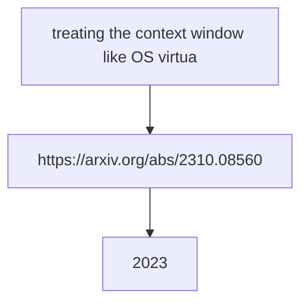

# Context and State Strategy

**One-Line Summary**: Systematic approaches for allocating, prioritizing, compressing, and persisting information within and beyond the context window.

**Prerequisites**: `system-prompt-engineering.md`, `tool-interface-design.md`.

## What Is Context and State Strategy?

Imagine packing a suitcase with a strict weight limit. You cannot take everything you own. You must decide what is essential (passport, medication), what is important (a few outfits, charger), and what is nice-to-have (extra shoes, books). You pack essentials first, then important items, then fill remaining space with nice-to-haves. If you are over the limit, you remove the least important items --- you do not randomly discard things, and you certainly do not leave out the passport to make room for a third pair of shoes.

An agent's context window is that suitcase. It has a fixed capacity (4K to 200K tokens depending on the model), and everything the agent needs to think --- the system prompt, conversation history, tool results, and working memory --- must fit inside it. When it fills up, you must remove something to add something new. What you remove, how you compress it, and what you persist outside the window determines whether the agent remains coherent or loses critical information mid-task.

State strategy extends beyond the context window to include external storage: databases, files, and memory systems that the agent can read from and write to. A well-designed state strategy treats the context window as working memory (fast, limited) and external storage as long-term memory (slower, unlimited).

*Figure: Memory architecture for LLM agents (from Lilian Weng, 2023). The context window acts as short-term/working memory, while external storage serves as long-term memory. Designing the boundary between them is the core challenge of state strategy.*

## How It Works

### Context Budget Allocation

For a 128K-token context window, allocate zones with clear budgets:

| Zone | Budget % | Tokens (128K) | Purpose |
|------|----------|---------------|---------|
| **System prompt** | 10-20% | 12,800-25,600 | Role, constraints, tool instructions, examples |
| **Conversation history** | 30-40% | 38,400-51,200 | Past user messages and assistant responses |
| **Tool results** | 25-35% | 32,000-44,800 | Data returned by tool calls in the current task |
| **Scratchpad / reasoning** | 10-15% | 12,800-19,200 | The model's own reasoning and working notes |
| **Safety buffer** | 5% | 6,400 | Prevents hard context limit errors |

**Enforcement**: Monitor token usage per zone after each turn. When a zone exceeds its budget, apply that zone's compression strategy (see below). Do not let one zone cannibalize another --- a single large tool result should not push conversation history out of the window.

**Smaller context windows** (8K-32K) require stricter discipline:

| Window Size | System Prompt | History | Tool Results | Scratchpad + Buffer |
|-------------|--------------|---------|--------------|-------------------|
| 8K | 15% (1,200) | 30% (2,400) | 35% (2,800) | 20% (1,600) |
| 32K | 15% (4,800) | 35% (11,200) | 30% (9,600) | 20% (6,400) |
| 128K | 15% (19,200) | 35% (44,800) | 30% (38,400) | 20% (25,600) |
| 200K | 10% (20,000) | 40% (80,000) | 35% (70,000) | 15% (30,000) |

### State Prioritization Patterns

When the context window fills up, you must decide what to keep and what to remove. Three prioritization signals:

**Recency**: More recent information is more likely to be relevant. Default to keeping the most recent N turns and truncating older ones. This is the simplest strategy and works well for conversational agents.

**Relevance**: Information semantically related to the current task is more valuable than unrelated content. Use embedding similarity to score each piece of context against the current query. Keep high-similarity content regardless of age. This requires an embedding model and adds 50-200ms of latency per turn.

**Importance**: Some information is always important regardless of recency or relevance --- user preferences, key constraints, earlier decisions that affect later steps. Tag these as "pinned" and never evict them.

**Recommended hybrid strategy**: Pin critical facts (importance). Keep the last 5-10 turns verbatim (recency). For older content, score by relevance and include only above-threshold items. This gives you the benefits of all three signals.

| Strategy | Latency Added | Implementation Complexity | Best For |
|----------|--------------|--------------------------|----------|
| Recency only | None | Low | Chatbots, simple Q&A |
| Relevance only | 50-200ms | Medium | Search/research tasks |
| Importance tagging | None | Medium | Multi-step workflows |
| Hybrid (all three) | 50-200ms | High | Production agents with long conversations |

### Compression Strategy Selection

When you must reduce the size of context content, choose the right compression method:

**Summarization**: Use an LLM to compress content while preserving key information. Best for conversation history and long-form text.
- Compression ratio: 5-10x reduction.
- Cost: One additional LLM call per compression (~500-2,000 tokens).
- Risk: The summarizer may drop details that turn out to be important later.
- Use when: The content is narrative or conversational, and you can tolerate some information loss.

**Truncation**: Remove content beyond a token limit. Simple and deterministic.
- Compression ratio: Variable (you choose the limit).
- Cost: Zero (pure string operation).
- Risk: May cut off important information at the boundary.
- Use when: The content is structured and the important parts are at the beginning (e.g., search results, where top results are most relevant).

**Retrieval (externalize and re-fetch)**: Move content to external storage and retrieve relevant portions on demand.
- Compression ratio: Effectively unlimited (only retrieve what you need).
- Cost: Storage + retrieval latency (100-500ms per retrieval).
- Risk: Retrieval may miss relevant information if the query is poor.
- Use when: You have large knowledge bases, long conversation histories, or need to reference specific past interactions.

**Decision table for compression**:

| Content Type | Best Compression | Rationale |
|-------------|-----------------|-----------|
| Old conversation turns | Summarize | Preserves context of the dialogue |
| Large tool results | Truncate to top N | Search results are ranked by relevance |
| Reference documents | Externalize + retrieve | Too large to fit; retrieve relevant chunks |
| User preferences / facts | Pin (never compress) | Small, always relevant |
| Agent scratchpad notes | Summarize or drop | Intermediate reasoning is often disposable |

### Persistent Memory Design

Some information must survive beyond a single conversation: user preferences, learned facts, task history, and agent-discovered knowledge. Design your persistence layer around three questions:

**What to persist**:
- User-stated preferences and corrections ("I prefer metric units," "My timezone is EST").
- Factual information the agent learned that is expensive to re-derive.
- Task outcomes and their quality (for future reference and self-improvement).
- Do NOT persist: raw conversation transcripts (too large, too noisy), ephemeral tool results, or intermediate reasoning.

**Where to persist**:
- **Key-value store** (Redis, DynamoDB): Fast reads, good for user preferences and simple facts. Typical read latency: 1-5ms.
- **Vector database** (Pinecone, Weaviate, Chroma): Semantic retrieval of past experiences and knowledge. Typical read latency: 50-200ms.
- **Relational database** (PostgreSQL): Structured data with complex query needs. Task history, usage analytics.
- **File system**: Large artifacts (generated documents, code, images).

**When to read persisted state**: Load relevant persistent memory at the start of each conversation (add to the system prompt or first turn). Re-retrieve during the conversation if the topic shifts to an area where persisted knowledge exists. Budget persistent memory reads at 5-10% of the context window.

### Context Monitoring

Track these metrics in production:

- **Context utilization**: What percentage of the window is used per turn? If consistently above 80%, you are at risk of hitting limits. If consistently below 30%, you may be using a larger (more expensive) model than necessary.
- **Zone overflow events**: How often does a single zone exceed its budget? Frequent overflow in the tool results zone means your tools are returning too much data.
- **Compression frequency**: How often is compression triggered? Frequent compression means either the conversation is unusually long or the budget allocations need adjustment.
- **Information loss incidents**: After compression, does the agent lose track of previously stated facts or user preferences? This indicates your prioritization or pinning strategy needs improvement.

## Why It Matters

### Context Overflow Is the Number One Agent Failure Mode in Long Tasks

For tasks requiring 10+ turns, context overflow (running out of space and losing critical information) is the most common failure mode. The agent forgets earlier instructions, loses track of what it has already done, or repeats work. A deliberate context strategy prevents this.

### Cost Scales Linearly with Context Size

LLM API pricing charges per input token. Every token in the context window is charged on every call. A 50K-token context that could be 20K with better management costs 2.5x more per call, multiplied by every call in every conversation. Context management is cost management.

### State Strategy Determines User Experience

Users expect agents to remember what they said earlier in the conversation, what they asked last week, and what their preferences are. Without persistent memory and intelligent context management, the agent feels stateless and frustrating. "I already told you my timezone" is a user experience failure caused by a state strategy failure.

## Key Technical Details

- Context windows range from **4K** (small models) to **200K** (Claude 3.5) to **1M** (Gemini 1.5 Pro) tokens. Design for the model you deploy, not the largest available.
- Model performance degrades on tasks requiring information from the **middle** of long contexts ("lost in the middle" effect). Place critical information at the beginning and end of the context.
- Summarizing a 5,000-token conversation history to 500 tokens costs approximately **2,000-3,000 tokens** for the summarization call itself. The cost pays off if the conversation will continue for many more turns.
- Embedding-based relevance scoring adds **50-200ms per turn** but can reduce context size by 40-60% while retaining most relevant information.
- Pinned items should total no more than **5-10% of the context budget**. If you are pinning more, you are under-investing in external persistence.
- In production agents, **30-50% of context tokens** are tool results. The single highest-impact optimization is often reducing tool result size through better return value design (see `tool-interface-design.md`).
- Agents operating on 128K+ contexts typically use only **10-15% of the model's quality** for information in the middle 50% of the context. Front-load and back-load critical content.

## Common Misconceptions

**"Larger context windows solve context management."** Larger windows help but do not eliminate the problem. They are more expensive (you pay per token), suffer from lost-in-the-middle effects at scale, and still have limits. A 200K window with poor management is worse than a 32K window with good management for most tasks.

**"Just save the entire conversation history."** Raw conversation history is noisy. Much of it is intermediate reasoning, failed attempts, and social pleasantries. Summarized history with pinned facts is more useful per token than raw transcripts.

**"Vector databases are always the right choice for agent memory."** Vector databases excel at semantic retrieval of unstructured text. But user preferences ("metric units," "timezone EST") are better served by a key-value store with deterministic lookup. Match the storage mechanism to the data type.

**"Context management is an optimization --- get the agent working first."** Context management is a correctness concern, not an optimization. An agent that loses critical information mid-task does not produce suboptimal results; it produces wrong results. Build context management from the start.

**"The model handles context management automatically."** The model uses whatever is in the context window. It cannot manage the window itself --- it does not know what was evicted or what is available in external storage. Context management is application-layer logic that you must build.

## Connections to Other Concepts

- `system-prompt-engineering.md` covers the system prompt zone, which is the first and most stable part of the context budget.
- `tool-interface-design.md` covers return value design, which directly affects how much of the context budget tool results consume.
- `context-window-management.md` provides a deeper technical treatment of context window mechanics.
- `memory-architecture-overview.md` covers the theory of short-term and long-term memory systems for agents.
- `memory-compression.md` provides detailed techniques for compressing context content.
- `conversation-management.md` addresses the specific challenge of managing multi-turn conversation state.

## Further Reading

- Liu et al., "Lost in the Middle: How Language Models Use Long Contexts," 2023 --- Demonstrates the U-shaped attention pattern and its implications for context layout.
- Anthropic, "Long Context Prompt Tips," 2024 --- Practical guidance for working with 100K+ context windows effectively.
- Packer et al., "MemGPT: Towards LLMs as Operating Systems," 2023 --- Introduces virtual context management, treating the context window like virtual memory with paging.
- LangChain, "Memory Documentation," 2024 --- Implementation guide for conversation memory patterns including summarization and vector retrieval.
- Zhong et al., "MQA: Exploring Multi-Query Attention for Memory-Efficient LLM Inference," 2023 --- Technical details on how attention mechanisms affect context utilization.
