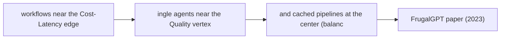

# Cost-Latency Optimization

**One-Line Summary**: Design strategies for building agent architectures that meet cost and latency targets without sacrificing task quality.

**Prerequisites**: `architecture-selection-framework.md`, `context-and-state-strategy.md`.

## What Is Cost-Latency Optimization?

Imagine a restaurant kitchen. The head chef manages three competing pressures: ingredient cost, food quality, and service speed. You can use premium ingredients and serve quickly, but the bill goes up. You can use cheap ingredients and cook slowly with care, but customers wait. You can be fast and cheap, but quality drops. Every kitchen finds its balance -- a fine dining restaurant tolerates high cost and slower service for exceptional quality, while a fast-casual spot optimizes for speed and cost at the expense of artisanal technique. The chef's job is not to eliminate these tradeoffs but to design a kitchen that makes the right tradeoff for the restaurant's goals.

Agent systems face the same three-way tension. Every LLM call has a token cost, a latency cost, and a quality contribution. A 10-step agent workflow using a frontier model might cost $0.50 and take 45 seconds but achieve 92% task success. The same workflow with a smaller model might cost $0.02 and take 8 seconds but achieve only 71% success. The design question is not "how do I make it cheaper?" but "where in the architecture can I reduce cost or latency without crossing below my quality threshold?"

Cost-latency optimization is not a one-time tuning exercise. It is a set of architectural patterns -- model routing, caching layers, budget enforcement -- that are designed into the system from the start and calibrated with production data.

## How It Works

### The Cost-Quality-Latency Triangle

Every design decision in an agent system trades off between these three dimensions. The first step is defining your constraints.

**Step 1: Define your quality floor.** What is the minimum acceptable task success rate? For a coding agent, this might be 85% of generated code passing tests. For a customer service agent, 90% of responses rated satisfactory. Everything else is optimized subject to this floor.

**Step 2: Identify your binding constraint.** Which matters more -- cost or latency?

| Scenario | Binding Constraint | Optimization Target |
|---|---|---|
| Interactive chatbot (user waiting) | Latency (<3s per response) | Minimize cost at quality floor |
| Batch document processing | Cost (<$0.01 per document) | Minimize latency at quality floor |
| Safety-critical medical agent | Quality (>98% accuracy) | Accept higher cost and latency |
| Internal developer tool | Latency (<10s) | Moderate cost tolerance |

**Step 3: Design the architecture to optimize the non-binding dimension.** If latency is the binding constraint, design for minimum latency first, then reduce cost where possible without adding latency.

### Model Routing Architecture

Model routing is the highest-impact optimization pattern. The core insight: not every step in an agent workflow requires a frontier model. A router directs each request to the cheapest model that can handle it at acceptable quality.

**Router design options:**

| Router Type | How It Works | Latency Overhead | Best For |
|---|---|---|---|
| Rule-based | Classify by task type, input length, tool count | <1ms | Predictable task distributions |
| Classifier-based | Small ML model predicts required capability | 10-50ms | Variable task complexity |
| Cascade | Try cheap model first, escalate if confidence is low | 0ms (fast path) to full latency (slow path) | Tasks with bimodal difficulty |
| Hybrid | Rules for obvious cases, classifier for ambiguous | 1-20ms | Production systems |

**Routing decision criteria:**

- **Task complexity**: Simple extraction or classification tasks route to small models (GPT-4o-mini, Claude Haiku, Gemini Flash). Multi-step reasoning routes to frontier models.
- **Output format**: Structured output generation (JSON, function calls) can often use smaller models. Open-ended generation benefits from larger models.
- **Context length**: If the prompt exceeds 8K tokens, you need a model that handles long context well. If it is under 2K tokens, even very small models perform adequately.
- **Tool count**: Steps involving 1-2 tools can use smaller models. Steps involving 5+ tools with complex selection logic benefit from frontier models.

**Typical cost savings**: Model routing reduces total LLM cost by 40-70% with less than 5% quality degradation on well-characterized workloads.

*Figure: Mixture-of-Experts routing (Switch Transformer, Fedus et al., 2022). Model routing in agent systems follows the same principle: a lightweight router classifies each request and directs it to the cheapest model that can handle it at acceptable quality, saving 40-70% on LLM costs.*

### Caching Architecture

Caching eliminates redundant LLM calls entirely -- zero cost and zero latency for cache hits.

**Layer 1: Exact API cache.** Cache the full (model, messages, parameters) tuple and return the same response for identical requests. Hit rates are typically 5-15% for interactive agents and 30-60% for batch processing. Use a TTL of 1-24 hours depending on data freshness requirements.

**Layer 2: Semantic cache.** Embed the user query and check for semantically similar past queries. If a cached query is above a similarity threshold (typically 0.92-0.95 cosine similarity), return the cached response. Hit rates are typically 10-25% on top of exact caching. Caution: semantic caching introduces a risk of returning stale or slightly mismatched responses. Monitor false-positive rates.

**Layer 3: Prompt prefix cache.** Many LLM providers cache the KV-cache for shared prompt prefixes. If your system prompt and tool definitions are identical across calls (which they should be), the provider caches the prefix computation. This does not eliminate the call but reduces latency by 30-50% and cost by up to 50% on the cached prefix tokens. Design your prompts with static prefixes and variable suffixes to maximize prefix cache hits.

**Layer 4: Tool result cache.** Cache the results of deterministic tool calls. If the same database query was run 30 seconds ago, return the cached result. This avoids both the tool execution latency and the tokens spent on the tool response.

### Latency Budget Design

A latency budget allocates the total acceptable response time across the components of an agent workflow.

**Example budget for a 10-second interactive agent:**

| Component | Budget | Typical Actual | Notes |
|---|---|---|---|
| Input processing + routing | 200ms | 50-150ms | Includes model router decision |
| LLM call 1 (planning) | 3000ms | 1500-2500ms | Frontier model, streaming |
| Tool execution (1-2 tools) | 2000ms | 200-1500ms | Depends on external APIs |
| LLM call 2 (synthesis) | 3000ms | 1000-2000ms | Can use smaller model |
| Output formatting + validation | 500ms | 50-200ms | Schema validation, rendering |
| Buffer for retries | 1300ms | 0ms (usually) | Consumed only on failure |

**Latency budget rules:**

1. Always include a retry buffer (10-15% of total budget).
2. Allocate tool execution budgets based on P95 latency of the tool, not average.
3. If total budget is tight, consider parallelizing independent tool calls.
4. Streaming the final LLM response improves perceived latency even if total time is unchanged. Time-to-first-token matters more than total generation time for interactive use cases.

### Token Budget Enforcement

Token budgets cap the total tokens consumed per task to prevent cost blowouts from runaway agent loops.

**Hard caps**: Absolute maximum tokens per task. When hit, the agent stops immediately and returns whatever partial result it has. Set at 3-5x the expected token usage for the task type.

**Soft caps**: Warning threshold set at 1.5-2x expected usage. When hit, the agent receives a signal to wrap up -- finish the current step, summarize results, and stop taking on new subtasks. This produces better outcomes than hard caps because the agent can produce a coherent final response.

**Adaptive budgets**: Allocate budget per step rather than per task. If step 1 uses fewer tokens than budgeted, the surplus rolls over to later steps. If step 1 uses more, later steps get reduced budgets. This prevents early steps from consuming the entire budget.

**Measuring budget utilization**: Track the ratio of actual tokens used to budget allocated. If utilization is consistently below 30%, your budgets are too generous and not providing meaningful protection. If utilization frequently hits 100%, your budgets are too tight and degrading quality.

### Measuring Optimization Impact

Every optimization must be validated against the quality floor. The process:

1. **Baseline**: Measure cost, latency, and quality on a representative evaluation set using the unoptimized architecture.
2. **Change one variable**: Apply one optimization (e.g., route simple steps to a smaller model).
3. **Measure**: Re-run the evaluation set. Record cost, latency, and quality.
4. **Accept or reject**: If quality stays above the floor, keep the optimization. If quality drops below, revert or adjust.

**Key metrics to track:**

- Cost per successful task (not cost per task -- failed tasks that cost money are waste).
- P50 and P95 latency (P95 matters more for user experience).
- Quality score on evaluation suite (task success rate, output correctness).
- Cache hit rate by layer.
- Model routing distribution (what percentage of calls go to each model tier).

## Why It Matters

### Cost Scales Linearly Without Optimization

An unoptimized agent using a frontier model for every step costs $0.03-0.15 per task. At 100K tasks per day, that is $3,000-15,000 per day in LLM costs alone. Model routing and caching can reduce this to $1,000-4,000 per day -- savings of $60K-330K per month. These are not theoretical numbers; they reflect real production agent workloads.

### Latency Determines User Experience

Research on user tolerance for wait times shows that interactive systems lose 10% of users per additional second of latency beyond 3 seconds. An agent that takes 15 seconds to respond will lose most interactive users regardless of how good the response is. Latency optimization is not a nice-to-have -- it determines whether the agent is usable.

### Optimization Is an Ongoing Process

Model prices drop, new models are released, and workload characteristics change. An optimization strategy from six months ago may be suboptimal today. Build the measurement infrastructure (cost tracking, latency histograms, quality evaluations) as a permanent part of the system, not a one-time exercise.

## Key Technical Details

- **Model routing** typically saves 40-70% on LLM costs with <5% quality degradation. The exact savings depend on workload composition (what fraction of steps are "easy").
- **Prompt prefix caching** reduces latency by 30-50% and cost by up to 50% on cached prefix tokens. Requires stable system prompts -- redesign prompts to maximize the static prefix length.
- **Semantic cache** hit rates of 10-25% are typical for production agents. Set similarity thresholds conservatively (0.93+) to avoid serving wrong cached answers.
- **Token budget soft caps** at 2x expected usage catch 95% of runaway loops while rarely constraining normal operation.
- **Streaming** reduces perceived latency by 40-60% for interactive use cases. Time-to-first-token of <500ms is the target.
- **Parallel tool execution** can reduce tool latency by 50-80% when 2+ independent tools are called in the same step. Requires tools to be designed without ordering dependencies.
- **Cost per successful task** is a better metric than cost per task. If your agent fails 20% of the time, your effective cost is 25% higher than the raw per-task cost.

## Common Misconceptions

**"Use the cheapest model possible to minimize cost."** The cheapest model is only cheapest if it succeeds. A model that costs 1/10th as much but fails 3x as often has a higher cost per successful task. Always measure cost against quality, not in isolation.

**"Caching does not work for agent systems because every request is unique."** Exact-match caching has low hit rates for agents, but semantic caching, prompt prefix caching, and tool result caching all provide meaningful savings. The combined cache hit rate across all layers is typically 20-40%.

**"Latency optimization means making each LLM call faster."** The biggest latency wins come from eliminating calls entirely (caching), parallelizing independent calls, and routing to faster models. Making a single call 10% faster is far less impactful than eliminating one of five calls.

**"You should optimize cost and latency from the start."** Build the unoptimized version first, measure, and then optimize. Premature optimization makes the architecture harder to change and may optimize the wrong bottleneck. Get the quality right first, then reduce cost and latency.

## Connections to Other Concepts

- `architecture-selection-framework.md` determines the base architecture, which defines how many LLM calls and tool invocations the agent makes -- the starting point for optimization.
- `error-resilience-patterns.md` addresses the cost of retries and fallback chains, which directly affect the latency and token budgets discussed here.
- `context-and-state-strategy.md` covers context window management, which determines token usage per call -- a major input to the cost model.
- `cost-optimization.md` in the ai-agent-concepts collection covers cost concepts at a broader level; this file provides specific architectural patterns for implementing those concepts.
- `latency-and-performance.md` in the ai-agent-concepts collection provides foundational latency measurement concepts that this file builds upon.

## Further Reading

- Chen, L. et al. (2023). "FrugalGPT: How to Use Large Language Models While Reducing Cost and Improving Performance." *arXiv:2305.05176*. Introduces model cascading and caching strategies with empirical cost savings data.
- Ding, Y. et al. (2024). "Hybrid LLM: Cost-Efficient and Quality-Aware Query Routing." *arXiv:2404.14618*. Presents a router architecture that balances cost and quality across model tiers.
- Anthropic (2024). "Prompt Caching." Anthropic documentation. Technical details on prompt prefix caching implementation and cost savings.
- Vavekanand, S. et al. (2024). "Semantic Caching for Large Language Models." *arXiv:2404.09537*. Empirical analysis of semantic cache hit rates and quality tradeoffs.
- Patterson, D. et al. (2022). "The Carbon Footprint of Machine Learning Training Will Plateau, Then Shrink." *IEEE Computer*. Broader context on why cost optimization matters at scale.
