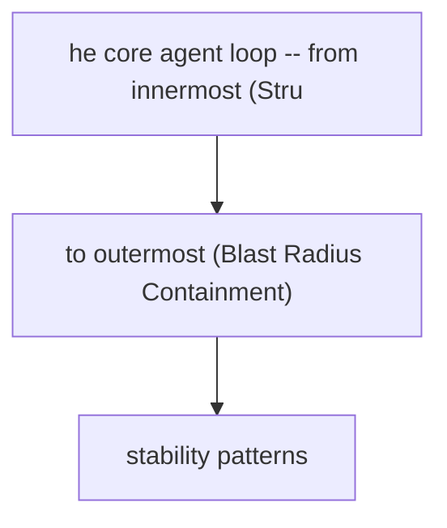

# Error Resilience Patterns

**One-Line Summary**: Architectural patterns for designing agent systems that anticipate, contain, and recover from failures before they happen.

**Prerequisites**: `tool-interface-design.md`, `context-and-state-strategy.md`.

## What Is Error Resilience?

Think of designing a building in an earthquake zone. You do not wait for the earthquake to figure out your response plan. Instead, you engineer flexible foundations, redundant load paths, and controlled crumple zones into the structure from the start. The building does not prevent earthquakes -- it survives them by design. Error resilience in agent systems follows the same principle: you architect for failure at design time, not at runtime.

Agent systems face a uniquely hostile error landscape. Every LLM call can produce malformed output. Every tool invocation can timeout, return unexpected data, or fail silently. Every multi-step plan can go off the rails at step three of twelve. Traditional software handles errors with try-catch blocks and retries. Agent systems need something deeper: structural patterns that make the entire architecture tolerant of the unpredictable failures that emerge from combining non-deterministic reasoning with real-world side effects.

Error resilience is not about eliminating errors -- that is impossible with stochastic systems. It is about ensuring that when errors occur, the system degrades predictably, recovers automatically where possible, and limits damage where recovery is not possible.

## How It Works

### Defensive Output Design

The first line of defense is ensuring the agent's outputs are parseable and actionable even when the LLM deviates from instructions.

**Structured output enforcement** constrains the LLM to produce valid JSON, function calls, or other machine-readable formats. Use the model provider's native structured output mode (e.g., JSON mode, tool use mode) rather than relying on prompt instructions alone. Prompt-only structured output has a 5-15% malformation rate; constrained decoding drops this below 0.5%.

**Validation schemas** sit between the LLM output and the action executor. Define a schema for every tool call and every agent decision point. When validation fails, you have three options:

| Validation Failure Strategy | When to Use | Cost |
|---|---|---|
| Retry with error feedback | LLM nearly got it right (missing field, wrong type) | 1 additional LLM call |
| Parse with fallback | Output is structurally close but not exact | Minimal (regex/heuristic) |
| Abort and escalate | Output is completely off-structure | 0 LLM calls, requires human |

**Parsing with fallbacks** means writing parsers that try the strict path first, then progressively looser strategies. For example: try JSON parse, then try extracting JSON from markdown code fences, then try regex extraction of key fields, then fail gracefully.

*Figure: The Reflexion pattern (Shinn et al., NeurIPS 2023) demonstrates error recovery through self-critique. The agent evaluates its own trajectory, identifies failures, and uses verbal reinforcement to improve on retry -- a form of designed-in error resilience.*

### Fallback Chain Architecture

Design tool invocations as chains with primary, secondary, and tertiary paths. The agent should not be aware of the fallback mechanism -- it should be handled at the infrastructure layer.

**Primary path**: The preferred tool or API. Example: a production database query.
**Secondary path**: A degraded but functional alternative. Example: a cached copy of the data from the last successful query.
**Tertiary path**: A minimal viable response. Example: returning a "data unavailable" structured response that the agent can reason about.

Decision framework for fallback triggers:

| Trigger Condition | Action | Example |
|---|---|---|
| Timeout (>5s for sync tools) | Switch to secondary | API call hangs, use cached result |
| HTTP 5xx error | Retry once, then secondary | Server error, retry then fallback |
| Malformed response | Parse with fallback logic | Unexpected response shape |
| Rate limit (429) | Queue and retry with backoff | Too many requests |
| Complete failure | Tertiary or abort | Service completely down |

### Idempotency in Agent Actions

An idempotent action produces the same result whether executed once or multiple times. This is critical because agent loops frequently retry failed steps, and without idempotency, retries can cause duplicate side effects (double-sending emails, creating duplicate records, charging a credit card twice).

**Design rules for idempotent agent tools:**

1. **Use idempotency keys.** Generate a unique key for each intended action at planning time. Pass this key to every tool call. The tool checks whether that key has already been executed.
2. **Prefer PUT over POST semantics.** Design tools to set state to a target value rather than incrementing or appending. "Set user email to X" is idempotent; "add email to list" is not.
3. **Separate read from write.** Tools that only read data are naturally idempotent. Tools that write should be explicitly marked as such and wrapped with idempotency protection.
4. **Log before executing.** Write the intended action to a log before executing it. On retry, check the log to determine if the action already succeeded.

### Checkpoint and Recovery Design

Checkpoints save agent state at strategic points so that a failed run can resume rather than restart from scratch. This is especially important for long-running agents (>10 steps) where restarting from zero wastes significant compute and time.

**Where to place checkpoints:**

- After every successful tool call that produces data the agent will need later.
- Before any action with side effects (so you can skip it on recovery if it already executed).
- At natural subtask boundaries in plan-and-execute architectures.
- After expensive LLM calls whose results are reusable.

**Checkpoint content** should include: the current plan state, accumulated tool results, the conversation history (or a compressed summary), and a step counter indicating where execution left off.

**Recovery strategy**: On restart, load the most recent valid checkpoint, verify that any side effects from the last attempted step either completed or can be safely retried (this is where idempotency matters), and resume from the next step.

### Blast Radius Containment

When a failure occurs, how much of the system does it affect? Blast radius containment means architecting boundaries so that a failure in one component does not cascade.

**Scope boundaries:**

- **Tool-level isolation**: A failing tool should return a structured error, not crash the agent loop. Wrap every tool call in a timeout and exception handler at the orchestration layer.
- **Subtask isolation**: In plan-and-execute architectures, a failed subtask should not corrupt the state of other subtasks. Use separate context windows or state objects per subtask.
- **Session isolation**: One user's agent session failing should never affect another user's session. Use separate process/container boundaries for concurrent sessions.
- **Resource isolation**: Set per-session limits on LLM tokens, tool calls, and wall-clock time. A runaway agent loop should hit a ceiling before consuming unbounded resources.

### Graceful Degradation

Design your agent to provide progressively less capable but still useful responses as components fail.

**Degradation levels:**

| Level | Condition | Agent Behavior |
|---|---|---|
| Full capability | All systems operational | Normal operation |
| Degraded tools | Some tools unavailable | Use available tools, inform user of limitations |
| Degraded reasoning | LLM errors or low-quality output | Simplify task, reduce autonomy, ask for clarification |
| Minimal viable | Most systems down | Return cached/static response with explanation |
| Safe failure | Unrecoverable state | Stop execution, preserve state, alert human |

The key design principle: the agent should always be able to tell the user what happened and what it could not do. A silent failure is worse than an explicit one.

## Why It Matters

### Agent Failures Are Structural, Not Exceptional

In traditional software, errors are exceptional -- most code paths succeed most of the time. In agent systems, failures are routine. LLMs hallucinate tool names. APIs return unexpected schemas. Multi-step plans fail at intermediate steps. A production agent system without resilience patterns will fail on 15-30% of non-trivial tasks, and many of those failures will be unrecoverable without human intervention.

### Cost of Uncontained Failure

Without blast radius containment and checkpoint design, a single failure in a 20-step agent workflow means restarting from scratch. At $0.01-0.10 per LLM call and 5-15 calls per task, an unrecoverable failure at step 18 wastes $0.09-1.35 in compute and 30-120 seconds of latency. For high-volume systems processing thousands of tasks daily, this adds up to significant waste.

### User Trust Depends on Predictable Failure

Users can tolerate an agent that fails gracefully and explains what happened. Users will not tolerate an agent that silently produces wrong results, hangs indefinitely, or loses their work. Resilience patterns directly affect user trust and adoption.

## Key Technical Details

- **Structured output modes** reduce malformation rates from 5-15% (prompt-only) to below 0.5% (constrained decoding). Always use them when available.
- **Retry budgets** should be capped at 2-3 retries per tool call with exponential backoff starting at 1 second. Beyond 3 retries, switch to fallback.
- **Checkpoint storage** adds 50-200ms overhead per checkpoint write. For most agent tasks, 3-5 checkpoints are sufficient. Store in-memory for short tasks, persist to disk/database for tasks over 60 seconds.
- **Idempotency keys** should be generated deterministically from the task ID and step number, not randomly, so that retries produce the same key.
- **Timeout defaults**: 5 seconds for synchronous tool calls, 30 seconds for LLM calls, 300 seconds for total task execution. Adjust based on measured P95 latencies.
- **Blast radius metrics**: Track the failure cascade ratio -- when one component fails, how many other components are affected? Target ratio is 1.0 (no cascade). Alert if it exceeds 1.5.
- **Validation schema coverage** should be 100% of tool outputs. Any tool output that is not validated is a source of silent downstream failures.

## Common Misconceptions

**"Error handling means adding try-catch blocks around tool calls."** Try-catch is necessary but insufficient. Error resilience is an architectural concern that affects how you design tools, structure plans, manage state, and scope failures. A try-catch block around a tool call does not help if the agent has no fallback strategy for what to do when that tool is unavailable.

**"If the LLM is good enough, you do not need resilience patterns."** Even the best models produce malformed outputs, hallucinate tool names, and make reasoning errors. GPT-4 class models still fail on 10-20% of complex multi-step tasks in benchmarks. Resilience is not about compensating for bad models -- it is about designing for the inherent unpredictability of stochastic systems.

**"Retrying a failed step is always the right first response."** Retries are only safe for idempotent operations. Retrying a non-idempotent tool call (e.g., sending an email, creating a database record) without idempotency protection causes duplicate side effects. The correct first response depends on the failure type and the tool's idempotency guarantees.

**"Checkpointing slows down the agent too much to be practical."** Checkpoint writes take 50-200ms each. For a typical 10-step agent task running 30-120 seconds, 3-5 checkpoints add 0.15-1.0 seconds -- less than 3% overhead. The cost of not checkpointing (restarting from zero on failure) is far higher.

## Connections to Other Concepts

- `tool-interface-design.md` covers how to design tool APIs that support idempotency keys, structured error returns, and timeout contracts -- all prerequisites for the patterns described here.
- `context-and-state-strategy.md` provides the foundation for checkpoint design, since checkpoint content is essentially a snapshot of agent state.
- `cost-latency-optimization.md` addresses the cost implications of retries, fallback chains, and checkpoint overhead as part of the overall latency budget.
- `safety-by-design.md` shares the blast radius containment principle, applying it to safety-critical failures rather than operational failures.
- `error-handling-and-retries.md` in the ai-agent-concepts collection covers runtime error handling mechanics; this file focuses on design-time architectural decisions.
- `agent-state-management.md` provides foundational concepts for the state snapshots that checkpoints depend on.

## Further Reading

- Baresi, L. & Ghezzi, C. (2010). "The Disappearing Boundary Between Development-Time and Run-Time." Found in *FoSE 2010*. Relevant for understanding design-time vs runtime resilience.
- Nygard, M. (2018). *Release It! Design and Deploy Production-Ready Software*, 2nd edition. Pragmatic Bookshelf. The canonical reference for stability patterns (circuit breakers, bulkheads, timeouts) applicable to agent systems.
- Yao, S. et al. (2023). "ReAct: Synergizing Reasoning and Acting in Language Models." *ICLR 2023*. Demonstrates how reasoning-action loops fail and how error feedback enables recovery.
- Anthropic (2024). "Building Effective Agents." Anthropic research blog. Practical guidance on failure handling in production agent architectures.
- Amazon Web Services (2023). "Idempotency in Serverless Architectures." AWS documentation. Directly applicable patterns for making agent tool calls safe to retry.
