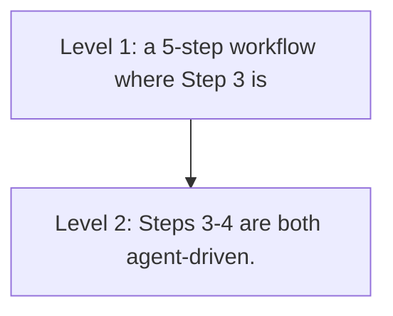

# Incremental Migration Patterns

**One-Line Summary**: Patterns for introducing agent capabilities into existing systems gradually, minimizing risk while capturing value at each stage.

**Prerequisites**: `do-you-need-an-agent.md`, `complexity-gradient.md`.

## What Is Incremental Migration?

Think about renovating a house while living in it. You do not demolish the entire structure and rebuild from scratch -- you would have nowhere to live during construction. Instead, you renovate one room at a time. You update the kitchen while the rest of the house functions normally. You test the new kitchen, fix any plumbing issues, and only then move on to the bathroom. If the kitchen renovation goes badly, you have only one room to fix, not an entire house. And at every stage, the house is livable.

Incremental migration applies the same principle to adding agent capabilities to existing software systems. Most organizations do not have the luxury of building an agent system from scratch on a blank canvas. They have existing workflows, existing APIs, existing user expectations, and existing reliability standards. Ripping out a working system and replacing it with an agent is high risk: if the agent fails, the business process fails. Incremental migration patterns let you introduce agent capabilities one step at a time, validate each step, and maintain the ability to revert to the existing system at any point.



The core principle: at every stage of migration, the system must be fully functional. There is no "big bang" cutover. There is no period where the system is half-agent, half-broken. Every intermediate state is a valid production system.

## How It Works

### The Strangler Pattern

Borrowed from Martin Fowler's Strangler Fig Application pattern, this approach replaces individual steps in an existing workflow with agent-driven decisions, one at a time.

**Process:**

1. **Map the existing workflow.** Document every step, its inputs, its outputs, and its decision logic. Identify which steps involve judgment, interpretation, or decision-making (these are agent candidates) versus which steps are purely mechanical (these are not).

2. **Select the lowest-risk agent candidate.** Choose a step where: the inputs and outputs are well-defined, the quality of the step can be measured objectively, failure of the step is recoverable, and the step does not have irreversible side effects.

3. **Build the agent replacement for that single step.** The agent receives the same inputs as the existing step and must produce outputs in the same format.

4. **Run both in parallel** (see Shadow Mode below). Compare results. Tune the agent until it meets or exceeds the existing step's quality.

5. **Cut over.** Route production traffic to the agent for that step. Keep the old implementation available for rollback.

6. **Repeat** for the next step.

**Step selection priority matrix:**

| Criterion | Weight | Scoring |
|---|---|---|
| Decision complexity (higher = better agent candidate) | 30% | 1-5 scale |
| Output measurability (can you score correctness?) | 25% | 1-5 scale |
| Failure recoverability (can you undo/retry?) | 20% | 1-5 scale |
| Business impact of improvement | 15% | 1-5 scale |
| Implementation difficulty | 10% | 1-5 scale (inverted: easier = higher score) |

Score each workflow step and start with the highest-scoring step.

### Tool Wrapping Existing APIs

The fastest way to give an agent capabilities is to wrap your existing backend APIs as agent tools. This avoids building new backend functionality and leverages tested, production-hardened code.

**Wrapping process:**

1. **Identify candidate APIs.** Look for REST endpoints, database queries, or internal services that the agent should be able to call.

2. **Create tool definitions.** For each API, write a tool definition that includes:
   - A clear, descriptive name (the agent selects tools by name).
   - A natural language description explaining when and why to use this tool.
   - A JSON schema for parameters with descriptions for each parameter.
   - A response schema documenting what the tool returns.

3. **Add a translation layer.** The tool wrapper translates between the agent's tool call format and the existing API's request/response format. This layer also handles authentication, error mapping, and response simplification.

4. **Constrain parameters.** Do not expose every API parameter as a tool parameter. Expose only the parameters the agent needs and hardcode or default the rest. Fewer parameters mean fewer opportunities for misuse.

**Example transformation:**

```
Existing API:
  POST /api/orders/search
  Body: { customer_id, date_from, date_to, status, page, page_size, sort_by, sort_order, include_items, include_shipping }

Wrapped Tool:
  search_customer_orders(customer_id: string, date_range: "last_week" | "last_month" | "last_year")
  Hardcoded: page_size=10, sort_by=date, sort_order=desc, include_items=true, include_shipping=false
```

The wrapped tool is simpler, safer, and easier for the agent to use correctly.


*Figure: The ReAct loop (Yao et al., ICLR 2023). During incremental migration, individual workflow steps are replaced with this reasoning-action-observation loop. Shadow mode validates that this loop produces equivalent or better outputs than the legacy step before cutover.*

### Shadow Mode Deployment

Shadow mode runs the agent in parallel with the existing system. The existing system handles production traffic. The agent processes the same inputs but its outputs are logged, not acted upon.

**Shadow mode architecture:**

1. **Duplicate inputs.** Every request that hits the existing workflow step is also sent to the agent.
2. **Capture both outputs.** The existing system's output is used for production. The agent's output is stored for comparison.
3. **Compare automatically.** A comparison job scores the agent's output against the existing system's output using the same metrics you will use for production evaluation.
4. **Generate reports.** Daily reports showing: agent agreement rate with existing system, cases where agent was better, cases where agent was worse, failure cases.

**Shadow mode metrics:**

| Metric | Target Before Cutover | How to Measure |
|---|---|---|
| Agreement rate | >90% for routine cases | Exact or semantic match between outputs |
| Agent-better rate | >0% (agent adds value) | Human review of disagreements |
| Agent-worse rate | <5% | Human review of disagreements |
| Agent failure rate | <2% | Agent crashes, timeouts, malformed output |
| Latency overhead | <2x existing step latency | P95 latency comparison |

**Duration:** Run shadow mode for 1-4 weeks, depending on traffic volume. You need at least 500-1000 comparison data points for statistical confidence. High-stakes steps (financial decisions, medical recommendations) warrant longer shadow periods.

### Progressive Autonomy Rollout

Even after an agent is validated, increase its autonomy gradually rather than flipping from "human does everything" to "agent does everything."

**Autonomy stages:**

| Stage | Agent Role | Human Role | Criteria to Advance |
|---|---|---|---|
| Copilot | Agent suggests, human decides | Reviews and approves/rejects every suggestion | Agent suggestion acceptance rate >80% for 2+ weeks |
| Assistant | Agent acts, human reviews | Reviews output before it is delivered | Human override rate <10% for 2+ weeks |
| Semi-autonomous | Agent acts independently for routine cases, escalates edge cases | Handles escalations, spot-checks routine output | Escalation rate <15%, spot-check error rate <3% |
| Fully autonomous | Agent acts independently for all cases | Monitors dashboards, handles exceptions | Error rate <1% over 4+ weeks, no critical incidents |

**Escalation design is critical.** At the semi-autonomous stage, design explicit escalation triggers: confidence below a threshold, input matching a known edge-case pattern, task requiring capabilities outside the agent's tool set, or output affecting more than N users/dollars/records.

### Rollback Strategies

Every migration stage must have a tested rollback plan.

**Rollback mechanisms:**

| Mechanism | Implementation | Rollback Time | Best For |
|---|---|---|---|
| Feature flag | Toggle agent on/off per workflow step | Seconds | Steps without state |
| Traffic routing | Shift traffic percentage from agent to legacy | Seconds-minutes | Gradual rollback |
| Blue-green deployment | Maintain both agent and legacy as parallel deployments | Minutes | Full system rollback |
| Database versioning | Keep pre-agent state alongside agent-modified state | Minutes-hours | Steps with data mutations |

**Rollback triggers (automate these):** Agent error rate exceeds 5% over a 15-minute window, agent latency P95 exceeds 3x legacy P95, safety filter flags exceed 3 per hour, or any critical incident (data loss, unauthorized action, PII exposure). Test rollbacks monthly before you need them -- a rollback plan that has not been tested is not a plan.

### Measuring Migration Success

Define success metrics before starting migration, not after.

**Migration-specific metrics:**

| Metric | What It Measures | Target |
|---|---|---|
| Task quality delta | Agent quality minus legacy quality on same tasks | Positive (agent is at least as good) |
| Throughput delta | Tasks per hour: agent vs legacy | Equal or better |
| Cost delta | Per-task cost: agent (including LLM) vs legacy (including human labor) | Depends on business case |
| Time-to-resolution | End-to-end task completion time | Equal or better |
| User satisfaction | NPS or CSAT score before and after migration | No regression |
| Rollback count | Number of times rollback was triggered | Decreasing over time |
| Escalation rate | Percentage of tasks escalated to humans | Decreasing over time |

**The migration is successful when:** The agent-driven workflow meets or exceeds the legacy system on quality, throughput, and user satisfaction, the rollback count has reached zero for 4+ consecutive weeks, and the escalation rate is stable and within the target range.

## Why It Matters

### Big-Bang Migrations Fail

Industry data shows that large-scale system replacements fail 60-70% of the time, and this was true before agents added non-determinism to the equation. Incremental migration reduces risk by validating each change independently and maintaining rollback capability at every stage.

### Value Accrues Incrementally

You do not need to migrate the entire workflow to start getting value. Replacing a single step with an agent improves that step immediately while the rest of the workflow remains unchanged.

### Organizational Change Is Gradual

People need time to trust agent systems. Progressive autonomy lets stakeholders see the agent work correctly at low stakes before trusting it with high stakes, building the organizational confidence needed to expand capabilities.

## Key Technical Details

- **Shadow mode** requires at least 500-1000 comparison data points before cutover. At 100 tasks per day, this takes 5-10 days of shadow running.
- **Feature flag rollback** takes seconds when properly implemented. This is the preferred rollback mechanism for stateless workflow steps.
- **Tool wrapping** an existing API typically takes 1-3 days per tool, including testing. Budget 2-4 weeks to wrap 10-15 APIs.
- **Progressive autonomy advancement** should require 2+ weeks of sustained metric performance at each stage. Do not rush the progression based on short-term results.
- **Copilot acceptance rate** below 60% indicates the agent is not ready for the assistant stage. Investigate whether the issue is agent quality or user expectations.
- **Rollback drills** should be conducted monthly and documented. A rollback plan that has not been tested is not a plan.
- **Migration timeline**: A typical 5-step workflow migration from legacy to fully autonomous agent takes 3-6 months with proper shadow mode, progressive autonomy, and validation at each stage.

## Common Misconceptions

**"You should migrate the entire workflow at once to avoid running two systems."** Running two systems is the point. The parallel operation period is what gives you safety and confidence. The operational cost of maintaining both systems for a few months is far less than the cost of a failed big-bang migration.

**"Shadow mode is unnecessary if you have good evals."** Evals test the agent against a curated task suite. Shadow mode tests the agent against real production traffic, which includes edge cases, unexpected inputs, and usage patterns that no eval suite fully captures. They are complementary, not substitutes.

**"Progressive autonomy is too slow -- just let the agent run."** For low-stakes tasks, faster progression is reasonable. For tasks with financial, legal, or safety implications, the progressive approach prevents costly incidents during the learning period. The pace should match the stakes.

**"Once migrated, you can decommission the legacy system."** Keep the legacy system available (even if not actively running) for at least 3-6 months after full migration. Model updates, provider outages, or newly discovered edge cases may require temporary rollback.

## Connections to Other Concepts

- `do-you-need-an-agent.md` determines which workflow steps are candidates for agent migration in the first place.
- `complexity-gradient.md` provides the principle of starting simple -- migration follows the same gradient from copilot to full autonomy.
- `agent-testing-strategy.md` provides the evaluation framework used to validate each migration stage.
- `safety-by-design.md` defines the safety constraints that must be maintained at every migration stage.
- `agent-deployment.md` in the ai-agent-concepts collection covers deployment mechanics that support the blue-green and feature-flag rollback strategies described here.
- `monitoring-and-observability.md` in the ai-agent-concepts collection provides the monitoring infrastructure needed for shadow mode and progressive autonomy.

## Further Reading

- Fowler, M. (2004). "StranglerFigApplication." martinfowler.com. The original strangler pattern for incremental system migration, directly applicable to agent migration.
- Sato, D. et al. (2019). "Continuous Delivery for Machine Learning." martinfowler.com. Shadow mode and progressive rollout patterns for ML systems, applicable to agents.
- Anthropic (2024). "Building Effective Agents." Anthropic research blog. Advocates for incremental complexity and validates the copilot-to-autonomous progression.
- Sculley, D. et al. (2015). "Hidden Technical Debt in Machine Learning Systems." *NeurIPS 2015*. Describes the risks of ML system migrations and the importance of maintaining rollback capability.
- Humble, J. & Farley, D. (2010). *Continuous Delivery*. Addison-Wesley. Foundational text on deployment patterns (blue-green, canary, feature flags) used in the rollback strategies here.
