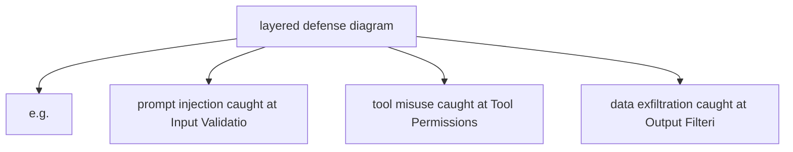

# Safety by Design

**One-Line Summary**: A holistic approach to engineering safety into agent architecture from the ground up, covering threat modeling, layered defenses, permission design, and the safety-capability tradeoff.

**Prerequisites**: `tool-interface-design.md`, `error-resilience-patterns.md`.

## What Is Safety by Design?

Consider how building security works. You do not install a single lock on the front door and call it secure. Instead, you design layers: a perimeter fence, a lobby with ID badge access, locked doors on individual floors, security cameras in hallways, and a guard monitoring the feeds. Each layer stops a different class of threat. A tailgater gets past the fence but is stopped by the badge reader. A stolen badge gets past the reader but is caught on camera. No single layer is foolproof, but the combination makes breach extremely difficult and detection nearly certain.

Agent safety follows the same layered principle. An agent that can read files, call APIs, execute code, and send messages has a large attack surface. A single guardrail -- say, an output filter -- is insufficient. Adversarial inputs can bypass prompt-level defenses. Tool misuse can occur without any adversarial intent (the agent simply reasons incorrectly about which tool to call). Scope creep happens when the agent pursues a subtask beyond its intended boundaries. Safety by design means composing multiple independent defense mechanisms so that no single failure compromises the system.

The critical insight: safety is not a feature you bolt on after the agent works. It is a set of architectural constraints that shape every design decision from the start. Retrofitting safety into a working agent is 3-5x more expensive than designing it in from the beginning.

## How It Works

### Agent Threat Modeling

Before designing defenses, enumerate what can go wrong. Agent-specific threats fall into five categories:

| Threat Category | Description | Example | Severity |
|---|---|---|---|
| Adversarial inputs | Malicious prompts designed to subvert agent behavior | Prompt injection in user message or retrieved document | Critical |
| Tool misuse | Agent calls the wrong tool or uses correct tool with wrong parameters | Deleting a file instead of reading it; sending email to wrong recipient | High |
| Scope creep | Agent pursues actions beyond its intended task boundary | Asked to summarize a file, agent starts editing it | Medium |
| Data exfiltration | Agent leaks sensitive data through tool calls or outputs | Including PII from a database in a response to an unauthorized user | Critical |
| Resource abuse | Agent consumes excessive compute, API calls, or time | Infinite loop calling an API; generating millions of tokens | Medium |

**Threat modeling process:**

1. List every tool the agent can access and classify each as read-only, write, or destructive.
2. For each tool, enumerate the worst-case outcome if called incorrectly or maliciously.
3. For each worst-case outcome, identify which defense layer prevents or detects it.
4. Any worst-case outcome with no defense layer is a gap that must be addressed before production deployment.

### Layered Defense Architecture

Each layer operates independently. If one layer fails, the next layer catches the threat.

**Layer 1: Input validation.** Sanitize and validate all inputs before they reach the LLM. This includes user messages, retrieved documents, and tool outputs that will be fed back to the agent. Specific techniques:
- Detect known prompt injection patterns using a lightweight classifier (fine-tuned model or regex patterns for common attacks).
- Enforce input length limits. Inputs over 10K tokens should be summarized or truncated before reaching the agent.
- Tag the provenance of each input (user-provided, system-generated, retrieved-from-external-source) so downstream layers can apply different trust levels.

**Layer 2: Tool permissions.** Restrict which tools the agent can call and with what parameters. Implement as an allowlist, not a denylist.
- Define a permission manifest for each agent role: which tools are available, which parameter values are allowed, and what rate limits apply.
- Require confirmation for destructive operations (delete, send, publish, pay) unless the agent has been explicitly granted autonomous authority for that operation.
- Enforce parameter constraints at the tool gateway. If a file-read tool should only access `/data/reports/`, reject any path outside that directory.

**Layer 3: Output filtering.** Inspect agent outputs before they reach the user or external systems.
- Check for PII, credentials, or internal system information that should not be exposed.
- Validate that outputs match the expected format and content policy.
- For code generation agents, run static analysis on generated code before execution.

**Layer 4: Monitoring.** Log and analyze agent behavior in real time.
- Track tool call patterns and alert on anomalies (e.g., an agent that normally makes 3-5 tool calls suddenly making 50).
- Monitor token usage per session and flag sessions that exceed 3x the median.
- Record full agent trajectories (reasoning + actions) for post-hoc review.

**Layer 5: Human oversight.** Provide mechanisms for human review and intervention.
- Implement approval queues for high-risk actions.
- Provide a kill switch that immediately halts agent execution.
- Schedule regular audits of agent trajectories sampled from production traffic.

*Figure: The full agent architecture (from Lilian Weng, 2023). Each component -- planning, memory, tool use -- is an attack surface that the layered defense must protect. Safety by design means applying constraints at every component, not just at the input or output.*

### The Safety-Capability Tradeoff

Every safety measure reduces the agent's capability or performance in some way. The question is not whether to accept this tradeoff but how to quantify it so you can make informed decisions.

**Quantifying the cost of safety:**

| Safety Measure | Capability Cost | Latency Cost | When to Accept |
|---|---|---|---|
| Input injection classifier | <1% false positive rate blocking legitimate queries | 20-50ms | Always in production |
| Tool allowlisting | Agent cannot use unlisted tools (reduces flexibility) | 0ms | Always in production |
| Destructive action confirmation | Human delay (seconds to hours) for confirmed actions | Variable | When actions are irreversible |
| Output PII filter | May redact legitimate data the user needs | 10-30ms | When handling sensitive data |
| Token rate limits | Agent may be stopped before completing complex tasks | 0ms (until hit) | Always, set at 3-5x median |
| Full trajectory logging | Storage and privacy cost | 5-10ms per step | Always in production |

**The decision framework:** Start with all safety layers enabled. Selectively relax constraints only when you have data showing the capability cost is unacceptable AND you have compensating controls in place. Never remove a safety layer without adding monitoring for the threat it was catching.

### Permission Architecture Design

Three principles govern agent permissions:

**Least privilege.** The agent should have the minimum permissions needed for its current task, not the maximum permissions it might ever need. If an agent only needs to read files in one directory, do not grant it filesystem-wide read access "for convenience."

**Progressive trust.** Start new agent deployments with maximum restrictions and relax them as the agent demonstrates reliable behavior. Concrete stages:

| Trust Level | Permissions | Criteria to Advance |
|---|---|---|
| Probation | Read-only tools, all outputs reviewed | 100+ tasks with 0 safety incidents |
| Standard | Read + write tools, destructive actions require confirmation | 500+ tasks with <0.1% safety incident rate |
| Elevated | Most actions autonomous, high-risk actions confirmed | 2000+ tasks with <0.01% safety incident rate |
| Full autonomy | All actions autonomous | Continuous monitoring, immediate revocation on incident |

**Scoped credentials.** When an agent needs to access external services (databases, APIs, cloud resources), issue credentials scoped to exactly the operations it needs. Use short-lived tokens (1-hour expiry) rather than long-lived API keys. Rotate credentials on a schedule, not just when compromised.

### Pre-Production Safety Checklist

Before deploying an agent to production, verify:

1. **Threat model complete.** Every tool has been assessed for worst-case misuse, and every worst case has at least one defense layer.
2. **Input validation active.** Prompt injection detection is running. Input length limits are enforced.
3. **Tool permissions locked.** Allowlist is defined. Destructive actions require confirmation. Parameter constraints are enforced.
4. **Output filtering active.** PII detection is running. Content policy checks are in place.
5. **Monitoring configured.** Tool call anomaly detection is active. Token usage alerts are set. Trajectory logging is enabled.
6. **Human oversight ready.** Kill switch is tested. Approval queue is functional. Audit schedule is defined.
7. **Resource limits set.** Token budgets, tool call limits, and wall-clock timeouts are configured.
8. **Rollback plan documented.** If the agent misbehaves in production, you can revert to non-agent behavior within minutes.
9. **Red team testing complete.** At least one round of adversarial testing has been performed (prompt injection, tool misuse, scope escalation attempts).

## Why It Matters

### Agents Have Real-World Side Effects

Unlike a chatbot that only generates text, agents take actions: sending emails, modifying databases, executing code, making purchases. A safety failure in a chatbot produces an embarrassing response. A safety failure in an agent produces real-world damage -- deleted data, unauthorized transactions, leaked confidential information.

### Regulatory and Compliance Requirements

As agent systems handle sensitive data and make consequential decisions, they fall under existing regulatory frameworks (GDPR, HIPAA, SOC2, financial regulations). These frameworks require documented access controls, audit trails, and data protection measures -- exactly the mechanisms that safety by design provides.

### The Cost of Retrofitting Safety

Organizations that build agents without safety architecture and then try to add safety later find it 3-5x more expensive than designing it in from the start. This is because safety constraints affect fundamental architectural decisions: how tools are invoked, how state is managed, how outputs are delivered. Changing these after the fact requires rearchitecting, not just adding a filter.

## Key Technical Details

- **Prompt injection classifiers** achieve 95-99% detection rates with <1% false positive rates when fine-tuned on domain-specific data. Off-the-shelf classifiers typically achieve 85-92%.
- **Tool permission enforcement** adds negligible latency (<1ms per check) when implemented as an allowlist lookup at the tool gateway.
- **PII detection** adds 10-30ms per output scan. Use regex for structured PII (SSN, credit card) and a small NER model for unstructured PII (names, addresses).
- **Trajectory logging** requires approximately 2-5KB per agent step. At 10 steps per task and 100K tasks per day, budget 2-5GB per day of log storage.
- **Red team testing** should cover at minimum: direct prompt injection, indirect prompt injection (in retrieved documents), tool parameter manipulation, scope escalation, and resource exhaustion.
- **Credential rotation** every 1-4 hours for agent service accounts reduces the blast radius of credential compromise to at most a few hours of unauthorized access.
- **Kill switch response time** should be under 5 seconds from trigger to full agent halt. Test this monthly.

## Common Misconceptions

**"Safety is primarily about preventing prompt injection."** Prompt injection is one threat among many. Tool misuse, scope creep, data exfiltration, and resource abuse are equally important and often more likely in practice. A comprehensive safety architecture addresses all five threat categories.

**"If you add enough safety measures, the agent becomes too restricted to be useful."** Well-designed safety measures have minimal impact on normal operation. An input classifier with <1% false positive rate blocks almost no legitimate queries. Tool allowlisting only restricts tools the agent was never meant to use. The goal is surgical precision, not blanket restriction.

**"Safety testing can be done once before launch."** Threat landscapes evolve. New prompt injection techniques emerge regularly. Agent capabilities change as models are updated. Safety testing must be continuous -- run adversarial evaluations on every model update and at least monthly on stable systems.

**"Human-in-the-loop solves all safety problems."** Human oversight is the last layer, not the only layer. If every safety failure requires human intervention, the system does not scale. Automated layers should catch 95%+ of issues, with human oversight handling the remaining edge cases and providing audit oversight.

## Connections to Other Concepts

- `error-resilience-patterns.md` covers blast radius containment, which is the operational counterpart to the safety containment discussed here.
- `agent-testing-strategy.md` provides the testing framework for validating that safety measures work, including adversarial test suites.
- `tool-interface-design.md` determines the tool API surface that safety permissions must constrain.
- `agent-guardrails.md` in the ai-agent-concepts collection covers guardrail concepts in depth; this file focuses on composing guardrails into a complete safety architecture.
- `human-in-the-loop.md` in the ai-agent-concepts collection explores when and how to involve humans in agent decisions -- the innermost layer of the defense architecture.
- `authorization-and-permissions.md` in the ai-agent-concepts collection provides foundational concepts for the permission architecture discussed here.

## Further Reading

- Greshake, K. et al. (2023). "Not What You've Signed Up For: Compromising Real-World LLM-Integrated Applications with Indirect Prompt Injection." *AISec 2023*. Demonstrates practical prompt injection attacks against agent systems with tool access.
- OWASP (2025). "OWASP Top 10 for LLM Applications." OWASP Foundation. Industry-standard threat taxonomy for LLM-based systems including agents.
- Anthropic (2024). "Responsible Scaling Policy." Anthropic research. Framework for calibrating safety measures to capability levels, directly applicable to progressive trust.
- Zeng, Y. et al. (2024). "AI Agents That Matter." *arXiv:2407.01502*. Discusses how safety evaluations should be integrated into agent benchmarks alongside capability evaluations.
- Microsoft (2024). "Lessons Learned from Red Teaming 100 Generative AI Products." Microsoft security blog. Practical adversarial testing methodology for AI systems.
