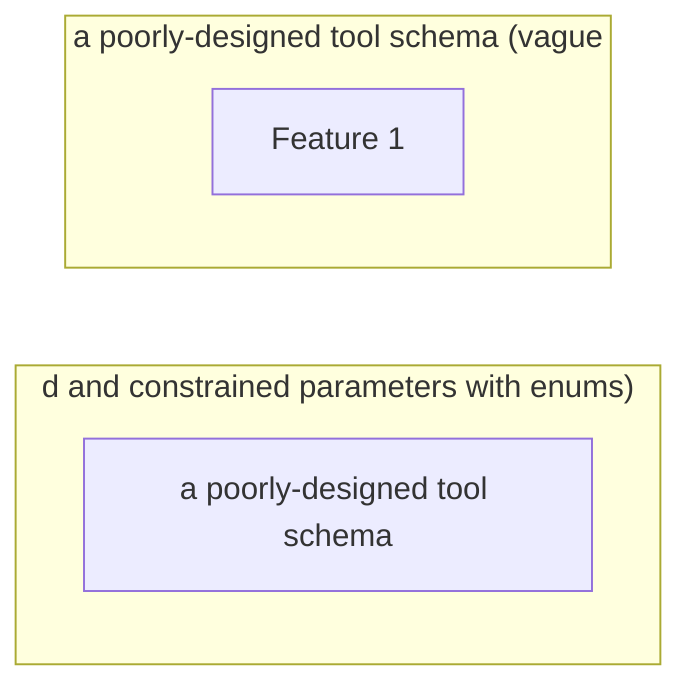

# Tool Interface Design

**One-Line Summary**: Design principles for building tool APIs that LLMs can discover, understand, and invoke correctly without human intervention.

**Prerequisites**: `system-prompt-engineering.md`.

## What Is Tool Interface Design?

Think about designing a TV remote control. A good remote has clearly labeled buttons (Play, Pause, Volume Up), each button does exactly one thing, and the labels match what happens. A bad remote has 80 unlabeled buttons, some that do multiple things depending on context, and a manual you need to read before pressing anything. No one reads the manual. They press buttons and hope.

LLMs interact with tools the same way. The model reads the tool name, description, and parameter schema, then decides whether and how to invoke the tool. It does not have supplementary documentation, cannot ask clarifying questions about the API, and will make assumptions about anything ambiguous. The tool's name, description, and schema ARE the documentation. If they are unclear, the model will call the tool incorrectly, pass wrong parameters, or avoid using the tool entirely. Tool interface design is the practice of making your tools as self-explanatory as a well-designed remote.



## How It Works

### Naming Conventions

Tool names are the model's first signal about what a tool does. Use the **verb_noun** pattern consistently:

| Pattern | Good Example | Bad Example | Why Bad |
|---------|-------------|-------------|---------|
| verb_noun | `search_documents` | `documentSearcher` | Class-style names obscure the action |
| verb_noun | `create_ticket` | `ticket` | No verb --- is this read, create, update, or delete? |
| verb_noun | `get_weather` | `fetchCurrentWeatherDataFromAPI` | Too verbose; the model wastes tokens on the name |
| verb_noun | `list_files` | `ls` | Abbreviations assume knowledge the model may not have |

**Naming rules**:
- 2-4 words, underscore-separated.
- Start with a verb: `get`, `search`, `create`, `update`, `delete`, `list`, `calculate`, `send`, `validate`.
- The noun should be the domain object: `documents`, `tickets`, `users`, `files`, `emails`.
- Avoid synonyms across your tool set. If one tool uses `search`, do not have another use `find` or `query` for the same semantic operation.

### Description Writing

The description is the most important field in the tool schema. It tells the model when to use the tool, what it does, and what to expect. Treat the description as the complete documentation --- because it is.

**Structure of an effective description**:
1. **When to use** (1 sentence): "Use this tool when the user asks about the status of a specific order."
2. **What it does** (1 sentence): "Retrieves the current status, tracking number, and estimated delivery date for an order."
3. **Key constraints** (1-2 sentences, if needed): "Requires an order ID in the format ORD-XXXXX. Returns an error if the order is older than 90 days."

**Total length**: 2-4 sentences, 30-80 tokens. Longer descriptions waste context budget on every call. Shorter descriptions leave the model guessing.

**Anti-pattern: the non-description**:
- "Gets order info." --- When? What info? What format?
- "Searches the database." --- Which database? What can be searched? What is returned?

### Parameter Schema Design

Every parameter should have a type, a description, and constraints where applicable.

```json
{
  "name": "search_documents",
  "parameters": {
    "type": "object",
    "properties": {
      "query": {
        "type": "string",
        "description": "Natural language search query. Be specific: include key terms, date ranges, and document types."
      },
      "max_results": {
        "type": "integer",
        "description": "Maximum number of documents to return. Default: 5.",
        "minimum": 1,
        "maximum": 20,
        "default": 5
      },
      "date_filter": {
        "type": "string",
        "description": "Filter results to this date range. Format: 'YYYY-MM-DD to YYYY-MM-DD'. Optional.",
        "pattern": "^\\d{4}-\\d{2}-\\d{2} to \\d{4}-\\d{2}-\\d{2}$"
      },
      "doc_type": {
        "type": "string",
        "description": "Filter by document type.",
        "enum": ["report", "memo", "email", "contract", "all"]
      }
    },
    "required": ["query"]
  }
}
```

**Schema design rules**:
- Use **enums** for any parameter with a fixed set of valid values. Models select from enums far more reliably than generating freeform strings that must match specific values.
- Set **defaults** for optional parameters. If the model omits a parameter, the default should produce sensible behavior.
- Include **format hints** in descriptions for string parameters: date formats, ID patterns, URL formats.
- Use **required** accurately. A parameter that is almost always needed but technically optional should still be required --- the model handles required parameters more reliably.
- Keep parameter count to **3-5 per tool**. Tools with 8+ parameters see increased invocation errors.


*Figure: Mixture-of-Experts routing (Switch Transformer, Fedus et al., 2022). This routing principle is analogous to tool selection: a router layer directs inputs to the most appropriate specialist (tool), and well-designed interfaces make routing decisions clearer.*

### Return Value Design

What a tool returns shapes how the model interprets and presents the result.

**Return structured data**, not prose:
- Good: `{"status": "shipped", "tracking_id": "1Z999AA10123456784", "eta": "2024-03-15"}`
- Bad: `"Your order has been shipped! The tracking number is 1Z999AA10123456784 and it should arrive by March 15, 2024."`

The structured format lets the model format the presentation in context. The prose format forces the model to parse natural language to extract facts, which is error-prone and wastes tokens.

**Error signaling**: Return errors as structured data with an error type and message, not as exceptions or HTTP status codes.
- Good: `{"error": "not_found", "message": "No order found with ID ORD-12345. Verify the ID format (ORD-XXXXX)."}`
- Bad: Throwing a 404 exception that crashes the agent loop.

**Size management**: Tool results go into the context window. If a tool can return large results (e.g., file contents, search results), implement pagination or truncation within the tool. Return a summary and a way to get more detail, not the entire payload.

### Tool Granularity

**Fine-grained** tools do one thing each: `get_order_status`, `get_order_items`, `get_order_address`. The model must call multiple tools to get complete information.

**Coarse-grained** tools do multiple things: `get_order_details` returns status, items, and address in one call.

| Factor | Fine-Grained | Coarse-Grained |
|--------|-------------|----------------|
| **Token cost per invocation** | Lower per call, but more calls | Higher per call, fewer calls |
| **Model decision complexity** | Higher (must choose between many tools) | Lower (fewer tools to choose from) |
| **Flexibility** | High (model retrieves only what it needs) | Low (always returns everything) |
| **Typical error rate** | Higher (more invocations = more chances for error) | Lower |

**The guideline**: Default to coarse-grained tools (combining 2-3 related operations) unless you have evidence that the model frequently needs only a subset of the data. Keep total tool count under 8 for a single agent. If you need more, use tool routing or hierarchical agents.

### Common Anti-Patterns

- **The god tool**: One tool with 15 parameters that does everything. The model cannot reliably fill 15 parameters, and errors are hard to diagnose.
- **Ambiguous twins**: Two tools with overlapping functionality (`search_docs` and `find_documents`). The model will pick arbitrarily or oscillate between them.
- **The silent failure**: A tool that returns an empty result instead of an error when something goes wrong. The model cannot distinguish "no results found" from "the query was malformed."
- **The chatty tool**: A tool that returns 10,000 tokens of raw data when 500 tokens of structured summary would suffice. This wastes context window and degrades downstream reasoning.
- **The undocumented parameter**: A parameter with no description. The model infers its purpose from the name, which works for `query` but not for `mode` or `flag` or `options`.

## Why It Matters

### Tool Quality Determines Agent Quality

In benchmarks (BFCL, ToolBench, API-Bank), tool invocation accuracy varies by 20-40 percentage points depending on description and schema quality, holding the model constant. A well-described tool with a well-typed schema is called correctly 85-95% of the time. A poorly described tool with loose typing is called correctly 50-65% of the time. The tools are often the bottleneck, not the model.

### Tools Are the Agent's Interface to the World

An agent without tools is just a chatbot. Tools define what the agent can actually do. If the tools are poorly designed, the agent's capabilities are limited regardless of how good the model is. Investing in tool quality directly expands what your agent can accomplish.

### Tool Interfaces Are Hard to Change

Once an agent is in production, changing a tool's name, parameters, or return format requires updating the system prompt, retraining user expectations, and potentially breaking existing conversation flows. Getting tool interfaces right the first time saves significant rework.

## Key Technical Details

- Models call tools with **3-5 parameters** most reliably. Error rates increase roughly 8% per additional parameter beyond 5.
- Tool descriptions between **30-80 tokens** hit the sweet spot. Under 20 tokens, the model lacks guidance. Over 100 tokens, the description consumes too much context budget across many tools.
- **Enum parameters** are selected correctly 95%+ of the time. Freeform strings that must match specific values are correct only 70-80% of the time.
- In production LangSmith traces, **60-70% of tool call failures** are parameter errors (wrong type, missing required field, invalid format), not tool selection errors.
- Structured return values reduce downstream hallucination by **15-25%** compared to natural language tool returns, because the model can directly reference structured fields.
- Agents with **5-8 tools** show optimal performance. Below 5, the agent may lack necessary capabilities. Above 8, tool selection accuracy degrades as the model must distinguish between similar tools.
- Adding **one well-crafted example** of correct tool invocation to the system prompt improves first-call accuracy by 20-30%.

## Common Misconceptions

**"The model will read external documentation if I provide a URL."** Models cannot browse URLs from tool descriptions. The description itself must contain all the information the model needs. Anything not in the schema is invisible.

**"More tools give the agent more capabilities."** More tools increase the tool selection search space. Beyond 8-10 tools, models increasingly select the wrong tool or fail to use tools at all. Capability comes from having the right tools, well-designed, not from having many tools.

**"Parameter validation should happen in the tool, not the schema."** Both. The schema prevents the model from generating invalid calls in the first place (by specifying types, enums, and patterns). The tool should validate as a second layer, returning structured errors for anything the schema did not catch.

**"Natural language tool names are better because they are more descriptive."** `search_for_documents_in_the_knowledge_base_by_keyword` is 8 tokens just for the name, repeated in every tool call and every tool result reference. `search_documents` is 2 tokens and equally clear. Conciseness in tool names saves tokens across every interaction.

**"Tool descriptions do not matter if the system prompt explains when to use each tool."** Some models attend to tool descriptions more than system prompt instructions about tools. Both should be aligned, but the tool description should be self-sufficient --- do not rely on the system prompt to compensate for a vague description.

## Connections to Other Concepts

- `system-prompt-engineering.md` covers the system prompt side: how to instruct the agent about tool use. Well-designed tools reduce the system prompt burden.
- `function-calling.md` covers the LLM function-calling mechanism that tool interfaces are built on.
- `tool-selection-and-routing.md` addresses how agents choose between tools, which is directly affected by naming and description quality.
- `action-space-design.md` discusses the conceptual framework for defining what actions an agent can take.
- `model-context-protocol.md` covers MCP, a standardized way to expose tool interfaces to LLMs.

## Further Reading

- Anthropic, "Tool Use Documentation," 2024 --- Practical guide to designing tool schemas for Claude, with examples of good and bad design.
- Patil et al., "Gorilla: Large Language Model Connected with Massive APIs," 2023 --- Benchmarks on tool invocation accuracy across different API designs.
- Qin et al., "ToolLLM: Facilitating Large Language Models to Master 16000+ Real-World APIs," 2023 --- Large-scale study on how API design affects LLM tool-use success.
- Berkeley Function Calling Leaderboard (BFCL), 2024 --- Ongoing benchmark tracking tool-call accuracy across models and tool designs.
- OpenAI, "Function Calling Guide," 2024 --- Best practices for schema design and description writing with practical examples.
