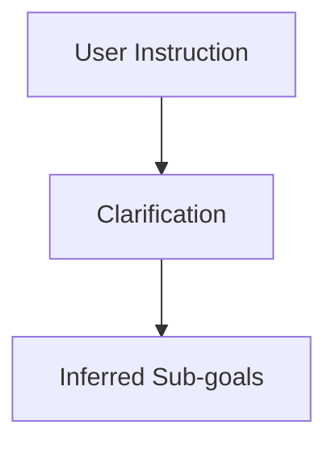

# Goal Specification

**One-Line Summary**: Goal specification is the process of translating human intent into machine-actionable objectives — through system prompts, user instructions, success criteria, and multi-turn refinement — and the gap between what the human means and what the agent understands is the single largest source of agent failure.

**Prerequisites**: `what-is-an-ai-agent.md`, `llm-as-reasoning-engine.md`

## What Is Goal Specification?

Consider hiring a contractor to renovate your kitchen. If you say "make it look nice," you will get something that reflects the contractor's taste, not yours. If you provide detailed blueprints, material specifications, and reference photos, you will get something close to what you envisioned. But even with detailed specs, there are gaps — you did not specify the exact grout color, the cabinet handle style, or what to do if the plumbing is different from what the blueprints assumed. The contractor fills these gaps with their own judgment. The quality of the outcome depends on: (1) how clearly you communicated your intent, (2) how well the contractor understands unstated assumptions, and (3) whether you have checkpoints to correct course during the project. AI agent goal specification faces exactly the same challenges.

Goal specification encompasses all the ways an agent receives, interprets, and refines its understanding of what it should accomplish. This includes the system prompt (persistent behavioral instructions), user messages (task-specific instructions), success criteria (how to know when done), and the ongoing dialogue through which ambiguity is resolved. It is not a single input but a multi-layered, evolving specification that the agent must continuously interpret.

The fundamental challenge is the intent-specification gap: humans know what they want but often cannot articulate it precisely, while agents require precise instructions to act correctly. Natural language is inherently ambiguous — "fix the bug" could mean fix the root cause, apply a workaround, or simply suppress the error message. Effective goal specification systems bridge this gap through a combination of structured prompting, clarification mechanisms, and progressive refinement.

## How It Works

### Layers of Goal Specification

Goal specification is not a single input but a layered system, with each layer adding specificity:

**Layer 1: System Prompt (Identity and Constraints)**
The system prompt defines *who* the agent is and *how* it should behave. It establishes:
- The agent's role ("You are an expert software engineer...")
- Available tools and their appropriate use
- Behavioral constraints ("Never modify files outside the project directory")
- Response format expectations ("Show your reasoning before acting")
- Safety guidelines ("Ask for confirmation before deleting files")

The system prompt is set by the agent's developers and is typically invisible to the end user. It ranges from 500 to 5,000+ tokens. Claude Code's system prompt, for instance, runs to several thousand tokens and includes detailed instructions on tool usage, git safety, coding practices, and communication style.

**Layer 2: User Instructions (Task Definition)**
The user provides the specific task: "Refactor the authentication module to use JWT tokens instead of session cookies." This is the primary goal input. Its quality varies enormously:
- **Vague**: "Fix the login" (what is broken? How should it work?)
- **Moderate**: "The login page returns a 500 error when users enter special characters in their password" (clear problem, unclear desired solution)
- **Specific**: "The login endpoint at /api/auth/login throws an unhandled exception when the password contains angle brackets. Add input sanitization using the existing `sanitize_input` utility and add a test case." (clear problem, clear solution, clear verification)

**Layer 3: Clarification Dialogue (Ambiguity Resolution)**
When instructions are ambiguous, well-designed agents ask clarifying questions rather than making assumptions. This requires the agent to:
1. Recognize that ambiguity exists (not always obvious to the LLM).
2. Formulate a useful clarifying question (not too broad, not too narrow).
3. Integrate the answer into its plan.

The tension is between being helpful (acting on reasonable assumptions) and being correct (asking about every ambiguity). Production agents typically ask clarifying questions for high-impact ambiguities and make reasonable assumptions for low-impact ones.

**Layer 4: Agent-Inferred Sub-goals (Task Decomposition)**
The agent decomposes the user's goal into sub-goals it can pursue through its agent loop. "Refactor authentication to JWT" becomes:
1. Read current authentication code.
2. Understand the existing session-based flow.
3. Design the JWT-based replacement.
4. Implement the changes.
5. Update tests.
6. Run tests and verify.

This decomposition happens implicitly through the LLM's reasoning. Some agent architectures make it explicit by having a planning phase that produces a written plan.

**Layer 5: Success Criteria (Verification)**
How does the agent know it is done? Success criteria can be:
- **Explicit**: "The task is complete when all tests pass." "Create a PR and post the URL."
- **Implicit**: The agent infers that it is done when the code compiles and tests pass (for coding tasks) or when the requested information has been provided (for research tasks).
- **Verifiable**: "Run `npm test` and confirm zero failures." The agent can check this mechanically.
- **Subjective**: "Make the code cleaner." The agent must use judgment about what constitutes "clean."

### The Intent-Specification Gap

The gap between human intent and machine-readable objectives manifests in several ways:

**Unstated context**: "Fix the bug" assumes the agent knows which bug, in which file, and what correct behavior looks like. Humans operate with enormous amounts of implicit context that they do not articulate.

**Ambiguous scope**: "Improve the documentation" could mean fixing typos, rewriting unclear sections, adding missing examples, or restructuring the entire docs site. Without scope boundaries, the agent may over- or under-deliver.

**Conflicting constraints**: "Make the code faster and more readable" can create tension — sometimes the fastest implementation is less readable. The agent must navigate tradeoffs the user has not explicitly addressed.

**Evolving goals**: The user's understanding of what they want often changes as they see partial results. "Actually, I also want it to handle the edge case where..." Goal specification is iterative, not one-shot.

### Multi-Turn Goal Refinement

The most effective agent interactions involve multi-turn refinement:

1. **Initial instruction**: User provides the task.
2. **Agent investigation**: Agent examines the codebase, asks clarifying questions.
3. **Plan proposal**: Agent proposes an approach for user feedback.
4. **Execution with checkpoints**: Agent executes, pausing at key decision points.
5. **Correction and adjustment**: User redirects when the agent's interpretation diverges from intent.
6. **Completion verification**: Both agent and user confirm the task is done.

This pattern acknowledges that goal specification is a collaborative process, not a one-shot transmission. The agent's autonomy level (see `autonomy-spectrum.md`) determines how many of these checkpoints are explicit vs. implicit.

## Why It Matters

### The Largest Source of Agent Failure

Studies of agent failures consistently find that the most common root cause is not LLM reasoning errors or tool failures — it is goal misunderstanding. The agent executes competently on the wrong objective. Investing in goal specification quality (better prompts, clarification mechanisms, success criteria) yields more improvement than investing in better models or more tools.

### Scalability of Clear Specifications

A well-specified goal can be pursued with minimal human intervention. A poorly specified goal requires constant course correction. As agents move toward higher autonomy levels, the quality of initial goal specification becomes increasingly critical because there are fewer opportunities for mid-task correction.

### System Prompt as Product Design

For agent products (Claude Code, Cursor, Devin), the system prompt is a core product design artifact. It determines the agent's personality, capabilities, safety boundaries, and default behaviors. Teams iterate on system prompts with the same rigor they apply to user interfaces.

## Key Technical Details

- **System prompt token budget**: Production agent system prompts range from 500 to 8,000 tokens. Claude Code's system prompt is approximately 3,000-5,000 tokens. Each additional token of system prompt is consumed on every LLM call, making it a recurring cost.
- **Clarification question rate**: Well-calibrated agents ask clarifying questions on roughly 10-20% of tasks — enough to catch critical ambiguities without being annoying. Agents that never clarify make assumption errors on 15-25% of ambiguous tasks. Agents that always clarify frustrate users.
- **Goal decomposition depth**: Simple tasks decompose into 2-5 sub-goals. Complex tasks decompose into 10-20 sub-goals. Very complex tasks (multi-day projects) may have 50+ sub-goals, requiring explicit planning and tracking.
- **Success criteria correlation**: Tasks with explicit, verifiable success criteria ("all tests pass") have 70-85% completion rates. Tasks with vague success criteria ("make it better") have 40-60% completion rates. The difference is entirely attributable to goal clarity.
- **Instruction following benchmarks**: Claude 3.5 Sonnet scores 85-92% on IFEval (instruction following evaluation). GPT-4o scores similarly. This means even the best models miss or misinterpret 8-15% of specific instructions, reinforcing the need for verification.
- **Prompt engineering impact**: Structured prompts (with explicit sections for context, task, constraints, and output format) improve task completion by 15-30% compared to unstructured natural language instructions.
- **Goal drift over long tasks**: On tasks exceeding 30 agent loop iterations, goal drift becomes measurable — the agent's actions gradually diverge from the original intent as immediate sub-task details overshadow the high-level objective. Periodic goal re-anchoring (re-reading the original instruction) mitigates this.

## Common Misconceptions

**"If the LLM is smart enough, you don't need to be precise in your instructions."**
Even the most capable LLMs cannot read minds. Ambiguous instructions produce variable results regardless of model capability. Precision in goal specification is a force multiplier — it makes every model more effective.

**"The system prompt is just boilerplate — the user's message is what matters."**
The system prompt profoundly shapes agent behavior. It determines tool usage patterns, safety compliance, communication style, and default assumptions. Two agents with identical user instructions but different system prompts will behave very differently.

**"Agents should never ask clarifying questions — they should just figure it out."**
This is only true for low-ambiguity tasks. For high-ambiguity tasks, making assumptions leads to wasted computation and incorrect results. The cost of one clarifying question (10-30 seconds of user time) is far less than the cost of redoing a task (minutes to hours of agent and user time).

**"Success criteria should be defined by the user."**
Often, the user does not know what success looks like in technical terms. A user might say "fix the bug" without knowing that success means: the specific function handles edge cases, tests pass, and no regressions are introduced. Part of the agent's job is to *infer* and *propose* concrete success criteria that the user can validate.

**"A single well-written prompt is sufficient for any task."**
Complex tasks require iterative goal refinement. The user's initial understanding evolves as the agent explores the problem space and surfaces relevant details. Treating goal specification as a one-shot process leads to suboptimal outcomes on complex tasks.

## Connections to Other Concepts

- `what-is-an-ai-agent.md` — Goal specification is the mechanism by which the agent's purpose is defined.
- `autonomy-spectrum.md` — Higher autonomy requires higher-quality goal specification because mid-task correction opportunities decrease.
- `agent-loop.md` — The agent loop is goal-directed: each iteration moves toward (or should move toward) the specified goal.
- `llm-as-reasoning-engine.md` — The LLM's instruction-following and reasoning capabilities determine how well it interprets goal specifications.
- `agent-state-management.md` — The agent's understanding of the current goal and sub-goals is a critical component of agent state.

## Further Reading

- **Ouyang et al., "Training Language Models to Follow Instructions with Human Feedback" (2022)** — The InstructGPT paper that established RLHF for instruction following, directly relevant to how LLMs interpret goal specifications.
- **Zhou et al., "Instruction-Following Evaluation for Large Language Models" (2023)** — IFEval benchmark for measuring how well LLMs follow specific instructions, revealing the gap between stated and actual instruction-following capability.
- **Zheng et al., "STEVE-1: A Generative Model for Text-to-Behavior in Minecraft" (2023)** — Illustrates goal specification challenges in embodied agents, where the gap between text instructions and desired behavior is particularly evident.
- **Jiang et al., "FollowBench: A Multi-level Fine-grained Constraints Following Benchmark" (2023)** — Measures LLM ability to follow constraints at different granularity levels, revealing that constraint adherence decreases with constraint complexity.
- **Anthropic, "Prompt Engineering Guide" (2024)** — Practical techniques for writing effective prompts that minimize the intent-specification gap.
