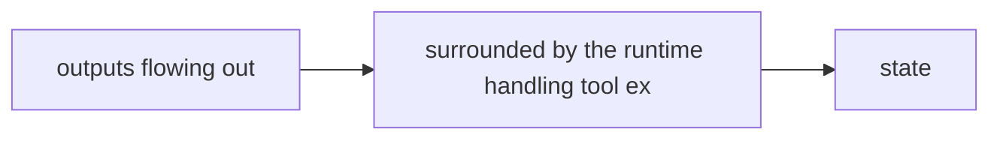

# LLM as Reasoning Engine

**One-Line Summary**: The large language model serves as the "brain" of an AI agent — providing language understanding, common-sense reasoning, planning, and few-shot learning — but it is a stateless, probabilistic engine with fundamental limitations that the agent architecture must compensate for.

**Prerequisites**: `what-is-an-ai-agent.md`

## What Is the LLM as Reasoning Engine?

Think of the LLM as a highly knowledgeable consultant you can call on the phone. Every time you call, you must re-explain the entire situation from scratch — they have no memory of previous calls. They are brilliant at understanding complex situations, making connections, and suggesting next steps. But they occasionally state things with confidence that turn out to be wrong. They cannot browse the internet, run code, or check facts during the call — they can only reason based on what you tell them. And if your explanation runs too long, they start losing track of the early details. Despite all this, their reasoning ability is so strong that building a system around them — one that handles memory, fact-checking, and tool execution externally — produces a remarkably capable agent.

In agent architecture, the LLM is the component that takes in a context (system prompt, conversation history, recent observations) and produces a decision: what to do next. It does not execute actions, store state, or access external information directly. It reasons about the information it receives and outputs either a tool call (an action to take) or a final response (the task is complete). Everything the agent can do flows through the LLM's ability to understand situations and make decisions expressed in natural language.

This architecture works because modern LLMs possess an extraordinary combination of capabilities: they understand natural language instructions, they possess broad world knowledge from training, they can decompose complex problems into steps, they can interpret error messages and adjust strategies, and they can generate structured outputs (tool calls, code, JSON) with high reliability. No other single technology provides this combination, which is why LLMs have become the default reasoning engine for agent systems.

*Source: [Lilian Weng, "LLM Powered Autonomous Agents" (2023)](https://lilianweng.github.io/posts/2023-06-23-agent/) — The LLM is the central reasoning engine; memory, tools, and planning are external scaffolding.*

## How It Works

### The Reasoning Process

When an LLM receives a context and generates a response, it is performing several interleaved cognitive operations:

1. **Situation assessment**: Understanding the current state — what has been tried, what succeeded, what failed, what the goal is.
2. **Option generation**: Considering possible next actions — which tool to call, with what parameters, or whether to respond directly.
3. **Option evaluation**: Implicitly weighing options against the goal, constraints, and likely outcomes.
4. **Decision output**: Selecting the best option and expressing it as a structured tool call or natural language response.

This process is not explicit — the LLM does not maintain separate "assessment" and "evaluation" stages internally. It is an emergent behavior arising from next-token prediction on vast training data that includes problem-solving, planning, and decision-making text. Techniques like chain-of-thought prompting make the reasoning more explicit and improve decision quality by forcing the model to "show its work."

### Strengths That Enable Agency

**Language understanding and instruction following**: LLMs can parse complex, nuanced instructions expressed in natural language. "Refactor this module to use dependency injection, but keep the public API backward compatible" is a perfectly valid instruction that an LLM can decompose and execute.

**Common-sense reasoning**: LLMs possess broad world knowledge that enables them to fill in unstated assumptions. If told to "set up a Python project," they know this typically involves creating a virtual environment, a `requirements.txt`, and a basic directory structure — without being told explicitly.

**Few-shot and zero-shot learning**: LLMs can learn new tasks from a few examples in the prompt or even from just a description. This is critical for agents because it means tool descriptions and usage examples in the system prompt are sufficient for the LLM to use tools it has never seen before.

**Error interpretation and recovery**: When a tool call returns an error, the LLM can read the error message, understand what went wrong, and formulate a corrective action. "FileNotFoundError: config.yaml" leads the LLM to search for the file in a different location or check the expected path. This recovery capability is what makes the agent loop viable.

**Structured output generation**: Modern LLMs reliably generate JSON tool calls, code in specific languages, and formatted data. This mechanical reliability in output formatting enables the agent runtime to parse and dispatch LLM outputs with high confidence.

### Limitations That Shape Agent Design

**Hallucination**: LLMs generate plausible-sounding but incorrect information. In agent contexts, this manifests as: fabricating file paths that do not exist, inventing API parameters, misremembering function signatures, or asserting that a change was made when it was not. Mitigation: agents must verify claims by reading files, running tests, and checking results rather than trusting the LLM's assertions.

**No persistent state**: The LLM retains nothing between calls. Every time the agent loop calls the LLM, it must provide the full context: system prompt, conversation history, all previous tool calls and results. The LLM has no "memory" — what appears to be memory is simply the message history being re-sent each turn. Mitigation: the agent runtime manages state explicitly through conversation history and external storage.

**Context window limits**: Current models support 128K-200K tokens (Claude), 128K tokens (GPT-4o), or 1M tokens (Gemini). Once the context exceeds the window, information is lost. Even within the window, reasoning quality degrades in the "lost in the middle" phenomenon — information in the middle of long contexts is less reliably recalled than information at the beginning or end. Mitigation: context management strategies (summarization, truncation, selective inclusion).

**Latency**: Each LLM call takes 0.5-5 seconds depending on model size, provider, and output length. In an agent loop with 20-50 iterations, LLM latency dominates total task time. Mitigation: parallel tool calls, caching, and choosing faster models for simpler decisions.

**Cost**: LLM API calls are priced per token. A single agent task consuming 200K total tokens costs $0.50-$5.00 depending on the model. High-volume applications must budget for this. Mitigation: model routing (use cheaper models for simple decisions), caching, and workflow-based approaches for predictable subtasks.

### Why This Architecture Works Despite Limitations

The key insight is that the agent runtime compensates for every LLM limitation:

| LLM Limitation | Runtime Compensation |
|---------------|---------------------|
| No persistent state | Runtime maintains conversation history and external state |
| Hallucination | Tools provide ground truth (file contents, test results, API responses) |
| No tool execution | Runtime dispatches tool calls and returns results |
| Context window limits | Runtime manages context (summarization, pruning, selection) |
| Probabilistic output | Runtime validates outputs and retries on failures |

The LLM provides the reasoning; the runtime provides the reliability. Neither alone is sufficient, but together they form a capable system.

## Why It Matters

### The Right Level of Abstraction

LLMs operate at the level of natural language and common-sense reasoning — the same level at which humans specify tasks. This alignment is why LLM-based agents feel natural to use. You describe what you want in plain English, and the agent understands and acts. No other reasoning engine (rule engines, planning algorithms, symbolic AI) offers this level of input flexibility.

### Rapid Capability Improvement

LLM capabilities improve with each model generation. GPT-3.5 (2022) could barely follow multi-step tool-use instructions. GPT-4 (2023) was reliable at tool use but struggled with complex planning. Claude 3.5 Sonnet and GPT-4o (2024) handle sophisticated multi-step tasks with high reliability. Each generation makes agents more capable without changing the agent architecture. The runtime remains the same; the reasoning engine gets better.

### The Bottleneck Is Clear

Understanding that the LLM is the reasoning engine makes the bottleneck obvious: agent performance is bounded by LLM reasoning quality. This focuses improvement efforts on the right places — better prompting, better context management, better tool descriptions — rather than adding more infrastructure.

## Key Technical Details

- **Context window sizes (2024-2025)**: Claude 3.5/4 supports 200K tokens. GPT-4o supports 128K tokens. Gemini 1.5 Pro supports 1M tokens. Effective usable context (before reasoning quality degrades) is typically 60-80% of the maximum.
- **Tokens per reasoning step**: An LLM typically generates 100-500 tokens of reasoning (chain-of-thought) and 50-200 tokens of tool call per agent loop iteration.
- **Tool call accuracy**: On well-described tools, Claude 3.5 Sonnet achieves 85-95% correct tool selection and parameter filling on first attempt. Accuracy drops to 70-80% with more than 20 tools or when tool descriptions are ambiguous.
- **Inference latency**: Time-to-first-token is 200-800ms for most API providers. Full response generation for a typical agent turn (300 tokens) takes 1-3 seconds. Extended thinking modes (Claude) can take 5-30 seconds but produce better plans.
- **Hallucination rate in agent contexts**: LLMs fabricate file paths, function names, or tool parameters in approximately 5-10% of turns on complex tasks. Verification through tool use (reading the actual file, checking actual output) catches nearly all of these.
- **Model routing**: Some agent systems use cheaper, faster models (Claude 3.5 Haiku, GPT-4o-mini) for simple decisions (file reading, search queries) and more capable models (Claude 3.5 Sonnet, GPT-4o) for complex reasoning (planning, debugging, code generation). This can reduce costs by 40-60%.
- **Temperature settings for agents**: Most production agents use temperature 0 or near-zero (0.0-0.2) for maximum consistency. Higher temperatures (0.5-0.8) are sometimes used for creative tasks or exploration.

## Common Misconceptions

**"The LLM understands the task the way a human does."**
LLMs process text statistically. They produce outputs that are consistent with patterns in training data. This often resembles understanding and produces correct behavior, but it can break down in ways that genuine understanding would not — particularly on tasks that require novel reasoning outside training distribution.

**"A better LLM eliminates the need for good agent design."**
Even the most capable LLMs benefit enormously from well-designed tools, clear system prompts, and effective context management. A mediocre LLM with excellent agent design often outperforms a superior LLM with poor agent design. The system matters, not just the model.

**"The LLM remembers previous conversations."**
The LLM is stateless. What appears to be memory is the message history being re-sent with each API call. If a piece of information is not in the current context, the LLM does not know about it. This is a fundamental architectural fact with major implications for agent state management.

**"LLMs can reason reliably about very long contexts."**
While models accept 128K-200K tokens, reasoning quality degrades well before the limit. The "lost in the middle" effect means information placed in the middle of a long context is recalled less reliably than information at the beginning or end. Effective context management is essential, not optional.

**"LLMs are deterministic if you set temperature to 0."**
Even at temperature 0, LLM outputs can vary across API calls due to floating-point non-determinism in parallel GPU computation, batching effects, and infrastructure changes. True determinism requires additional measures like seed pinning, and even then is not guaranteed across provider infrastructure updates.

## Connections to Other Concepts

- `what-is-an-ai-agent.md` — The LLM is the reasoning component within the three-part agent architecture (perception, reasoning, action).
- `agent-loop.md` — Each iteration of the agent loop involves one LLM call that produces reasoning and an action decision.
- `agent-state-management.md` — State management compensates for the LLM's lack of persistent memory by maintaining context across turns.
- `environment-and-observations.md` — Observations provide the ground-truth inputs that the LLM reasons about, counteracting hallucination.
- `determinism-vs-stochasticity.md` — The LLM's probabilistic nature is the primary source of non-determinism in agent systems.

## Further Reading

- **Wei et al., "Chain-of-Thought Prompting Elicits Reasoning in Large Language Models" (2022)** — Demonstrates that prompting LLMs to show reasoning steps dramatically improves complex task performance, a technique foundational to agent reasoning.
- **Huang & Chang, "Towards Reasoning in Large Language Models: A Survey" (2023)** — Comprehensive survey of LLM reasoning capabilities and limitations across mathematical, commonsense, and symbolic domains.
- **Mialon et al., "Augmented Language Models: A Survey" (2023)** — Covers the paradigm of augmenting LLMs with tools, retrieval, and other external capabilities — the theoretical foundation of agent architecture.
- **Liu et al., "Lost in the Middle: How Language Models Use Long Contexts" (2023)** — Empirical study showing that LLMs struggle with information placed in the middle of long contexts, with direct implications for agent context management.
- **Anthropic, "Claude's Character" (2024)** — Discusses how Claude's training shapes its reasoning tendencies, including honesty about uncertainty, which affects agent reliability.
