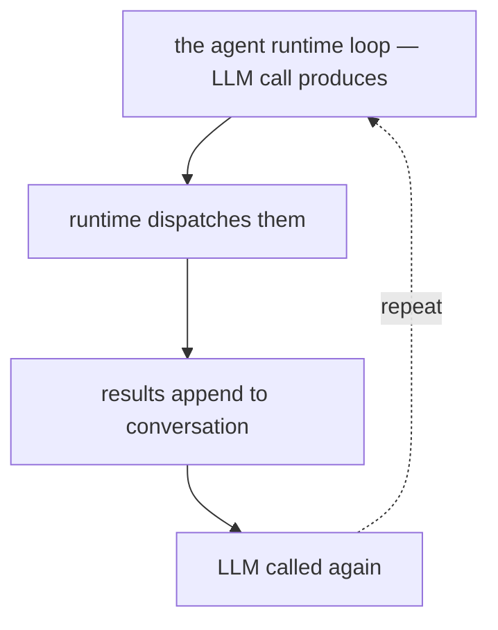

# What Is an AI Agent?

**One-Line Summary**: An AI agent is a software system that uses a language model to autonomously perceive its environment, reason about goals, and take actions — going beyond simple question-answering into sustained, goal-directed behavior.

**Prerequisites**: None (this is the entry point)

## What Is an AI Agent?

Imagine you hire a human assistant and hand them a laptop, a set of written instructions, and access to various tools — a web browser, a code editor, a calendar, and a database. You say, "Here's what I need done," and walk away. The assistant reads your instructions, figures out which tools to use, tries things, checks results, adjusts course, and eventually delivers the outcome. An AI agent works in essentially the same way, except the "assistant" is a large language model and the "tools" are programmatic interfaces.

An AI agent is a system built around an LLM that goes beyond the single-turn pattern of "user asks, model answers." Instead, it operates in a loop: it receives observations from its environment (tool outputs, user messages, file contents), reasons about what to do next, takes an action (calling a tool, writing code, sending a message), and then processes the result of that action to decide the next step. This loop continues until the agent determines the goal has been achieved, encounters an unrecoverable error, or hits a predefined step limit.

What distinguishes an agent from a chatbot is precisely this capacity for autonomous multi-step action. A chatbot generates text in response to a prompt. An agent generates text *and* executes operations that change the state of the world — creating files, querying APIs, modifying databases, running code. The chatbot is reactive; the agent is proactive. The chatbot ends at the response boundary; the agent persists across an entire task lifecycle.

*Source: [Lilian Weng, "LLM Powered Autonomous Agents" (2023)](https://lilianweng.github.io/posts/2023-06-23-agent/)*

## How It Works

### Core Components

Every AI agent architecture includes three fundamental components:

1. **Perception** — The agent's ability to receive and interpret information from its environment. This includes parsing tool outputs (JSON responses, file contents, error messages), reading user instructions, and processing multimodal inputs like screenshots or logs.

2. **Reasoning** — The LLM serves as the reasoning engine. It takes the accumulated context (system prompt, conversation history, recent observations) and decides what action to take next. This is where planning, decomposition, and error recovery happen.

3. **Action** — The agent executes operations through defined tools. Each tool has a schema describing its name, parameters, and expected behavior. The LLM generates structured tool calls that the agent runtime dispatches to the appropriate handler.

### The Runtime Layer

The agent does not run inside the LLM. The LLM is a stateless function that takes text in and produces text out. The *agent runtime* (sometimes called the orchestrator or harness) manages the loop: it sends prompts to the LLM, parses the LLM's output for tool calls, executes those tools, appends results to the conversation, and calls the LLM again. Frameworks like LangGraph, CrewAI, and Anthropic's agent SDK provide this runtime.

### Tool Integration

Tools are the agent's hands. A typical agent might have access to 5-30 tools, each defined by a JSON schema. For example, a coding agent might have tools like `read_file`, `write_file`, `run_command`, `search_codebase`, and `web_search`. The LLM selects which tool to call and with what arguments based on the current context and goal. Tool design is critical — poorly designed tools lead to poor agent performance regardless of the LLM's capability.

### System Prompt and Identity

The system prompt defines the agent's role, capabilities, constraints, and behavioral guidelines. It is the equivalent of the written instructions you hand your human assistant. A well-crafted system prompt includes: what the agent is, what tools it has, how it should approach problems, what it should avoid, and how to handle edge cases. Production agents like Claude Code, Devin, and Cursor all rely on detailed system prompts running to thousands of tokens.

## Why It Matters

### Beyond Chat: Completing Real Work

The shift from chatbot to agent represents a qualitative change in what AI systems can accomplish. A chatbot can explain how to refactor a codebase; an agent can actually do the refactoring — reading files, making changes, running tests, and iterating until the tests pass. This is the difference between advice and execution.

### The Compound Effect of Autonomy

Each individual step an agent takes may be simple (read a file, run a search, edit a line). But the ability to chain dozens or hundreds of these steps together, with reasoning between each one, enables the completion of complex, multi-faceted tasks that would take a human significant time. A coding agent routinely completes tasks involving 20-50 tool calls across 10+ files.

### Unlocking Non-Expert Capabilities

Agents allow users to accomplish tasks outside their expertise. A product manager can use a coding agent to prototype a feature. A developer can use a data analysis agent to explore a dataset. The agent bridges the gap between intent and execution by handling the technical details.

## Key Technical Details

- **Token budget per turn**: A single agent turn typically consumes 1,000-4,000 input tokens (context) and 200-1,000 output tokens (reasoning + tool call). A full task may consume 50,000-500,000 total tokens.
- **Tool call latency**: Each tool execution adds 100ms-30s of latency depending on the tool (file read vs. web request vs. code execution). Total task time is dominated by the number of LLM calls multiplied by inference latency.
- **Context window utilization**: Modern agents operate within 128K-200K token context windows. Effective agents rarely fill the full window; they use summarization and pruning to stay within 30-60% utilization for optimal reasoning quality.
- **Error rates**: LLM-based agents make incorrect tool selections roughly 5-15% of the time on complex tasks, necessitating retry logic, validation, and human oversight.
- **Tool count sweet spot**: Empirical testing suggests 5-20 well-designed tools outperform 50+ poorly designed ones. Tool selection accuracy degrades as the number of available tools increases beyond approximately 20-30.
- **Multi-agent vs. single-agent**: Single-agent architectures are simpler and sufficient for most tasks. Multi-agent setups (multiple specialized agents coordinating) add complexity and are justified primarily when tasks require genuinely distinct expertise domains.
- **Cost per task**: A typical coding agent task costs $0.05-$2.00 in API fees depending on model, context length, and number of turns. Complex multi-file refactoring tasks can reach $5-$15.

## Common Misconceptions

**"An AI agent is just a chatbot with extra steps."**
A chatbot is stateless and reactive — it responds to prompts. An agent maintains a goal across multiple steps, takes actions that change the world, observes results, and adapts. The architectural difference is fundamental: agents have a runtime loop, tool access, and persistent task state.

**"Agents are fully autonomous and don't need human involvement."**
Most production agents operate with significant human oversight. Users provide goals, approve critical actions, correct course when the agent goes astray, and validate outputs. Fully autonomous agents exist on one end of a spectrum, but most deployed systems are semi-autonomous at best.

**"The LLM does everything — it runs tools, stores memory, and manages state."**
The LLM is a stateless text-generation function. Everything else — tool execution, state management, context assembly, retry logic — is handled by the agent runtime layer that wraps the LLM. The LLM *decides*; the runtime *executes*.

**"More tools always make an agent more capable."**
There is a clear diminishing return. Beyond 20-30 tools, LLMs struggle with tool selection. Well-designed, composable tools with clear descriptions outperform a sprawling collection of narrow, overlapping tools.

**"AI agents will replace human workers entirely."**
Current agents excel at well-scoped, verifiable tasks (write code, analyze data, search information) but struggle with tasks requiring deep domain judgment, political navigation, creative vision, or accountability. They are best understood as powerful tools that amplify human capability.

## Connections to Other Concepts

- `agent-loop.md` — The observe-think-act cycle is the operational heart of every agent.
- `llm-as-reasoning-engine.md` — Deep dive into why LLMs work as the "brain" of agents and their inherent limitations.
- `action-space-design.md` — How to design the tool set that defines what an agent can do.
- `autonomy-spectrum.md` — Where different agent systems fall on the continuum from copilot to fully autonomous.
- `goal-specification.md` — How agents receive and interpret the objectives they pursue.

## Further Reading

- **Yao et al., "ReAct: Synergizing Reasoning and Acting in Language Models" (2023)** — The foundational paper establishing the reason-then-act paradigm that most modern agents use.
- **Anthropic, "Building Effective Agents" (2024)** — Practical architectural guidance for building production agent systems, emphasizing simplicity and composability.
- **Shinn et al., "Reflexion: Language Agents with Verbal Reinforcement Learning" (2023)** — Introduces self-reflection as a mechanism for agents to learn from their mistakes within a single task.
- **Wang et al., "A Survey on Large Language Model based Autonomous Agents" (2023)** — Comprehensive taxonomy of agent architectures, capabilities, and evaluation approaches.
- **OpenAI, "Practices for Governing Agentic AI Systems" (2023)** — Framework for thinking about safety, oversight, and governance of autonomous AI agents.
