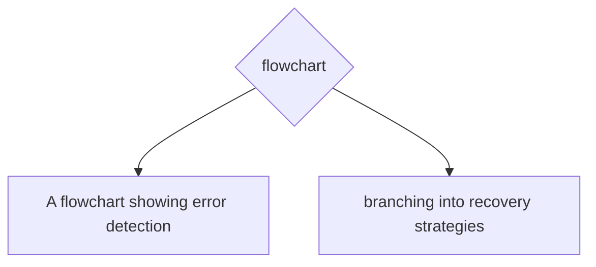

# Error Detection and Recovery

**One-Line Summary**: Error detection and recovery is the agent's ability to recognize when actions fail or produce incorrect results, classify the type of failure, and apply appropriate recovery strategies ranging from simple retries to full replanning.

**Prerequisites**: ReAct pattern, plan-and-execute, reflection and self-critique

## What Is Error Detection and Recovery?

Think of a pilot flying a commercial aircraft. They do not assume every system will work perfectly. They are trained to detect anomalies (an unusual engine reading, unexpected weather ahead, a failed instrument), classify the severity (minor annoyance vs critical emergency), and apply the appropriate recovery procedure (switch to backup system, divert to alternate airport, declare emergency). The pilot's training includes hundreds of failure scenarios and their corresponding responses. This systematic approach to handling things going wrong is exactly what agents need.

For AI agents, error detection and recovery is the capability to identify when something has gone wrong during task execution, diagnose the nature of the failure, and take corrective action. This is not optional: in any sufficiently complex task, things will go wrong. APIs return errors, search results are irrelevant, code has bugs, files are not where expected, and the agent's own reasoning produces incorrect conclusions. An agent without error handling will blindly continue executing a broken plan, compounding errors until the output is useless.



Robust agents treat errors as expected events, not exceptional ones. They have explicit detection mechanisms, typed error taxonomies, and a repertoire of recovery strategies that they select based on error type, severity, and context. The difference between a fragile demo agent and a production-grade agent is largely the quality of its error handling.

## How It Works

### Error Detection Mechanisms

**Explicit error signals**: Tool calls return error codes or exception messages. API responses include HTTP status codes (4xx, 5xx). File operations raise exceptions (file not found, permission denied). These are the easiest to detect: the agent just needs to check the return status.

**Semantic error detection**: The tool succeeds technically but returns wrong or irrelevant results. A search returns results about a different topic. A code execution produces output but with incorrect values. The agent must evaluate the content of the result, not just its status. This typically requires the agent to compare the result against its expectation.

**Logical error detection**: The agent's own reasoning contains a flaw. It draws an incorrect conclusion, uses the wrong formula, or makes a false assumption. These are the hardest to detect because the error is in the agent's thinking, not in external systems. Detection often requires self-critique or external verification.

**Progress monitoring**: The agent detects that it is not making progress toward the goal. It has been executing steps but the task is no closer to completion. This "stuckness" detection triggers a strategic reassessment.

### Error Taxonomy

A practical error taxonomy for agents:

| Error Type | Example | Typical Severity | Detection Method |
|---|---|---|---|
| Tool failure | API returns 500 | Medium | Status code check |
| Rate limit | API returns 429 | Low | Status code + headers |
| Timeout | Request exceeds 30s | Medium | Timer |
| Wrong result | Search returns irrelevant data | Medium | Semantic evaluation |
| Empty result | Search returns no results | Low | Null/empty check |
| Permission error | File access denied | High | Exception handling |
| Logical error | Wrong conclusion from correct data | High | Self-critique |
| State error | Expected file does not exist | Medium | Precondition check |
| Resource exhaustion | Context window full | High | Token counter |
| Infinite loop | Agent repeats same action | High | Action history comparison |

### Recovery Strategies

**Retry**: Execute the same action again, possibly with exponential backoff for rate limits or transient errors. Appropriate for: tool failures, timeouts, rate limits. Not appropriate for: logical errors, permission errors, wrong results.

```
Strategy: Retry with backoff
Condition: Transient error (5xx, timeout, rate limit)
Max retries: 3
Backoff: 1s, 4s, 16s (exponential)
Fallback: Escalate to replan
```

**Rephrase and retry**: Modify the action parameters and try again. A search query returned irrelevant results? Rephrase the query. A code execution had a syntax error? Fix the code and re-execute. Appropriate for: wrong results, empty results.

**Replan**: Abandon the current plan step and generate a new approach. Appropriate for: persistent failures after retries, logical errors, state errors that invalidate the plan.

**Fallback**: Use an alternative tool or approach to accomplish the same subtask. If the primary search API is down, try a different search engine. If the database is unavailable, use a cached version. Appropriate for: tool failures where alternatives exist.

**Escalate**: Report the error to the user and ask for guidance. Appropriate for: permission errors, ambiguous situations, errors that require human judgment.

**Skip and continue**: Mark the current subtask as failed and proceed with the remaining plan, noting the gap. Appropriate for: optional subtasks where partial results are acceptable.

### Error Budgets

An error budget defines how many failures the agent will tolerate before changing strategy. For example:

- Per-step budget: 3 retries before escalating to replan
- Per-task budget: 5 total errors before asking the user for guidance
- Time budget: 60 seconds per step before timeout
- Token budget: Reserve 20% of context window for error recovery

Error budgets prevent the agent from spending unlimited resources on recovery, which can be worse than the original error.

## Why It Matters

### Production Reliability

In production agent systems, the question is not whether errors will occur but how often and how gracefully they are handled. A user-facing agent that crashes on the first API error is unusable. Error recovery transforms fragile prototypes into reliable tools.

### Prevents Error Cascading

Without detection and recovery, a single error in step 3 of a 10-step plan corrupts the inputs to steps 4-10, producing garbage output. Early detection and correction contains the damage to the failed step.

### Builds User Trust

Users trust agents that handle failures gracefully. An agent that says "The search returned no relevant results, so I'm trying a different query" is more trustworthy than one that silently produces an answer based on irrelevant data.

## Key Technical Details

- **Retry success rate**: Transient errors (rate limits, timeouts) resolve on retry 70-90% of the time with appropriate backoff; semantic errors resolve on rephrase-and-retry 40-60% of the time
- **Detection cost**: Explicit error detection is essentially free (status code check). Semantic error detection costs one additional LLM call per action (~200-500 tokens). Logical error detection via self-critique costs ~500-1000 tokens
- **Common failure pattern**: The agent enters a "retry loop" where it retries the same failing action with minimal variation. Mitigation: require meaningful modification between retries and enforce retry limits
- **Stuck detection heuristic**: If the last 3 actions produced similar observations and no progress metric improved, the agent is stuck. Trigger replanning
- **Error logging**: All errors should be logged with: timestamp, action attempted, error type, error message, recovery strategy applied, recovery outcome. This data is essential for improving agent reliability over time
- **Graceful degradation**: Design agents so that partial failure produces partial (but still useful) results rather than total failure. If 7 of 8 research queries succeed, deliver the 7 results rather than failing the entire task
- **Precondition checking**: Before executing an action, verify that its preconditions are met (file exists, API is reachable, required data is available). This prevents many errors entirely

## Common Misconceptions

- **"Good agents don't make errors."** All agents operating in real environments encounter errors. The quality of an agent is measured not by the absence of errors but by the sophistication of its error handling.

- **"Retrying is always the right first response."** Retrying only works for transient errors. Retrying a logical error or a fundamentally wrong approach wastes resources. The agent must first classify the error type before choosing a recovery strategy.

- **"Error handling is an edge case concern."** In production systems, error handling code often exceeds the happy-path code in both volume and complexity. Treating it as an afterthought produces fragile systems.

- **"The user should not know about errors."** While the agent should handle routine errors silently (retrying a rate-limited API call), significant errors that affect output quality should be transparently communicated to the user.

- **"Automatic recovery is always preferable to escalation."** For high-stakes actions (deleting files, sending emails, making purchases), the agent should escalate to the user rather than attempting autonomous recovery. The cost of incorrect autonomous recovery may exceed the cost of the original error.

## Connections to Other Concepts

- `reflection-and-self-critique.md` — Reflection is the primary mechanism for detecting logical errors and for analyzing failed attempts to generate better recovery strategies
- `plan-and-execute.md` — The "replan" recovery strategy leverages the planning phase of Plan-and-Execute to generate a new approach after failure
- `react-pattern.md` — Within a ReAct loop, the Observation step is where most errors are detected; the subsequent Thought step is where recovery is planned
- `world-models.md` — A world model helps predict which actions are likely to fail (precondition checking) and which recovery strategies are most likely to succeed
- `metacognition.md` — Knowing when to retry vs replan vs escalate requires metacognitive assessment of the agent's own capabilities and the situation's complexity

## Further Reading

- Raman, S., Cohen, V., Ratliff, N., et al. (2022). "Planning with Large Language Models via Corrective Re-prompting." Demonstrates error correction through iterative re-prompting when plan execution fails.
- Shinn, N., Cassano, F., Gopinath, A., et al. (2023). "Reflexion: Language Agents with Verbal Reinforcement Learning." The reflection mechanism is fundamentally an error detection and recovery system applied across task attempts.
- Wang, G., Xie, Y., Jiang, Y., et al. (2023). "Voyager: An Open-Ended Embodied Agent with Large Language Models." Implements a skill library that grows from error recovery, turning failures into reusable solutions.
- Yang, J., Jimenez, C., Wettig, A., et al. (2024). "SWE-agent: Agent-Computer Interfaces for Software Engineering." Demonstrates sophisticated error handling in a code-editing agent that recovers from failed test runs through iterative debugging.
