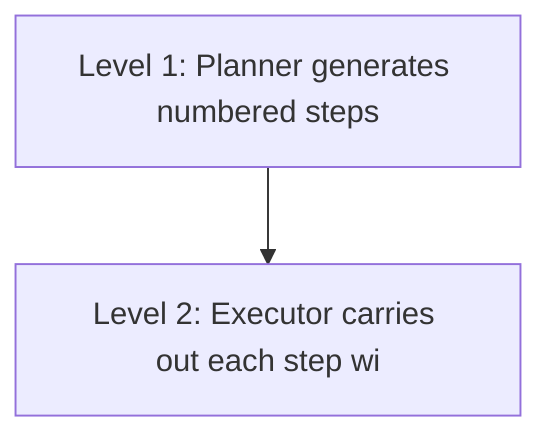

# Plan-and-Execute

**One-Line Summary**: Plan-and-Execute separates strategic planning (deciding what steps to take) from tactical execution (carrying out each step), enabling agents to handle complex multi-step tasks with structured oversight and adaptive replanning.

**Prerequisites**: ReAct pattern, task decomposition basics, agent loop fundamentals

## What Is Plan-and-Execute?

Think of a project manager who creates a detailed project plan before any work begins: "First, gather requirements from the client. Second, design the database schema. Third, implement the API endpoints. Fourth, write integration tests." The project manager does not personally execute each task; instead, they assign steps to team members, review results, and revise the plan if something goes off track. The planning and execution are distinct phases with different concerns.

Plan-and-Execute applies this same separation to AI agents. Instead of interleaving reasoning and acting step-by-step (as in ReAct), the agent first generates a complete multi-step plan for achieving the goal, then executes each step sequentially. After each step completes, the agent can optionally revise the remaining plan based on what it learned. This two-phase approach is particularly effective for tasks where the overall strategy can be determined upfront and individual steps are relatively well-defined.



The advantage over pure ReAct is strategic coherence. When an agent interleaves planning and acting at each step, it can lose sight of the big picture, especially over long task horizons. By committing to a plan first, the agent maintains a global perspective on the task structure. The trade-off is reduced flexibility: if the plan is wrong, the agent may waste effort executing flawed steps before replanning.

## How It Works

### Phase 1: Planning

The planner component receives the user's goal and generates a numbered list of steps. This is typically done with a single LLM call using a prompt like:

```
Given the following objective, create a step-by-step plan.
Each step should be a concrete, actionable task.

Objective: Research and summarize the key differences between PostgreSQL and MySQL for a web application.

Plan:
1. Search for PostgreSQL vs MySQL comparison articles from 2023-2024
2. Identify the key comparison dimensions (performance, scalability, features, ecosystem)
3. Gather specific benchmarks and technical details for each dimension
4. Summarize findings into a structured comparison table
5. Write a recommendation section based on the gathered evidence
```

The planner should produce steps that are specific enough to be individually executable but abstract enough to allow flexibility in how each step is carried out.

### Phase 2: Execution

The executor takes each step from the plan and carries it out, typically using a ReAct-style loop or a direct tool call. The executor operates with a narrower focus: it only needs to accomplish the current step, not reason about the overall strategy. This separation of concerns means the executor can be a simpler, more focused agent.

Each step's execution produces a result that is stored and passed as context to subsequent steps. This creates a growing body of intermediate results that inform later execution.

### Phase 3: Replanning

After each step completes (or after a step fails), the agent can optionally invoke the planner again with the updated context: "Here was the original plan, here are the results so far, and here is what went wrong. Generate an updated plan for the remaining work." This adaptive replanning handles cases where early assumptions were wrong or new information changes the strategy.

### Architecture Variants

**Static Plan-and-Execute**: The plan is generated once and executed without revision. Simplest to implement, but brittle if the plan has errors. Suitable for well-understood, predictable tasks.

**Dynamic Plan-and-Execute**: The plan is revised after each step. More robust but more expensive (additional LLM calls for replanning). Suitable for exploratory tasks where the path is uncertain.

**Hierarchical Plan-and-Execute**: High-level plans are decomposed into sub-plans, which are further decomposed into atomic actions. This creates a tree of plans at different abstraction levels. Suitable for very complex tasks with multiple layers of structure.

## Why It Matters

### Handles Long-Horizon Tasks

Tasks that require 10+ steps are difficult for ReAct because the growing context window fills with intermediate reasoning traces, and the model can lose track of the overall goal. Plan-and-Execute maintains a compact plan representation that keeps the agent oriented toward the final objective regardless of how many steps have been executed.

### Enables Human-in-the-Loop Review

Because the plan is generated as an explicit artifact, humans can review and approve it before execution begins. This is critical in production systems where autonomous agents might take irreversible actions (e.g., sending emails, modifying databases, deploying code). The plan serves as a checkpoint for human oversight.

### Supports Parallelization

When steps in the plan are independent of each other, they can be executed in parallel. A DAG-structured plan (rather than a linear sequence) enables concurrent execution of independent branches, significantly reducing total execution time. This is difficult to achieve in a purely sequential ReAct loop.

## Key Technical Details

- **LangChain implementation**: The `PlanAndExecute` agent in LangChain uses a `Planner` (LLM that generates plans) and an `Executor` (ReAct agent that handles individual steps)
- **Plan format**: Plans are typically ordered lists of natural language instructions, but can also be structured as JSON with dependencies, expected outputs, and success criteria
- **Replanning trigger**: Common triggers include step failure, unexpected results, or completion of a checkpoint step that reveals new information
- **Token efficiency**: Planning costs ~500-1000 tokens; each execution step costs ~1000-3000 tokens; replanning costs ~800-1500 tokens. Total cost scales linearly with the number of steps
- **Failure handling**: If a step fails after 2-3 retries, the agent should trigger replanning rather than continuing with subsequent steps that depend on the failed step's output
- **Plan validation**: Some implementations include a validation step where the LLM reviews its own plan for logical consistency, missing steps, or incorrect ordering before execution begins
- **Typical plan length**: 3-8 steps for most tasks; plans longer than 10 steps often indicate insufficient decomposition and should be hierarchically structured

## Common Misconceptions

- **"Plan-and-Execute is always better than ReAct."** For short, exploratory tasks where the path is unclear, ReAct's flexibility outperforms Plan-and-Execute. The planning overhead is wasted if the task only requires 2-3 steps or if the plan needs to change after every step.

- **"The plan must be followed exactly."** Good Plan-and-Execute implementations treat the plan as a living document. The plan provides direction, but the agent should deviate or replan when execution reveals that the plan is suboptimal.

- **"Planning and execution use the same model."** In many implementations, the planner is a more capable (and expensive) model that runs once, while the executor is a faster, cheaper model that runs many times. This asymmetry optimizes cost.

- **"Replanning means the original plan failed."** Replanning is a normal, expected part of the process, not an error condition. Even good plans need refinement as new information emerges during execution.

## Connections to Other Concepts

- `react-pattern.md` — ReAct is often used as the executor within Plan-and-Execute; the two patterns are complementary rather than competing
- `task-decomposition.md` — The planning phase is essentially a task decomposition problem; techniques for breaking goals into subtasks apply directly
- `reflection-and-self-critique.md` — Reflection can be applied between plan steps to evaluate progress and decide whether replanning is needed
- `error-detection-and-recovery.md` — When a plan step fails, the error recovery strategy determines whether to retry, replan, or escalate
- `world-models.md` — The planner benefits from a world model to predict which plans are feasible and what resources each step requires

## Further Reading

- Wang, L., Ma, C., Feng, X., et al. (2023). "A Survey on Large Language Model based Autonomous Agents." Comprehensive survey covering Plan-and-Execute among other agent architectures.
- LangChain Team. (2023). "Plan-and-Execute Agents." Blog post and documentation describing the LangChain implementation with code examples and benchmarks.
- Huang, W., Abbeel, P., Pathak, D., et al. (2022). "Inner Monologue: Embodied Reasoning through Planning with Language Models." Demonstrates plan-and-execute in robotic settings with language feedback.
- Yao, S., Yu, D., Zhao, J., et al. (2023). "Tree of Thoughts: Deliberate Problem Solving with Large Language Models." Explores planning as search over thought structures, related to plan generation.
