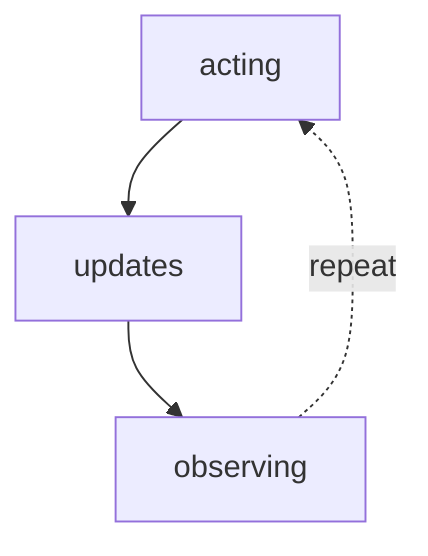

# World Models

**One-Line Summary**: A world model is the agent's internal representation of its environment's state, enabling it to predict consequences of actions, maintain awareness of what has changed, and simulate outcomes before committing to irreversible operations.

**Prerequisites**: ReAct pattern, plan-and-execute, error detection and recovery

## What Is a World Model?

Think of an experienced chess player who can "see" the board several moves ahead without physically moving any pieces. They maintain a mental model of the board state: where every piece is, which squares are controlled, what captures are available. When they consider a move, they update this mental model: "If I move my bishop to e5, then my opponent will likely take with the knight, and then I can recapture with my pawn, opening the f-file for my rook." This mental simulation, running on an internal representation of the world, is what allows strategic play without trial-and-error on the actual board.

For AI agents, a world model is an internal representation of the environment's current state and the rules governing how actions change that state. When a coding agent operates on a repository, its world model includes knowledge of which files exist, what they contain, what has been modified during the session, what tests are expected to pass, and what side effects each edit might have. When a research agent navigates the web, its world model tracks what information has been gathered, what sources have been consulted, what questions remain unanswered, and what the user's expectations are.



The critical value of a world model is that it enables prediction: the agent can mentally simulate "if I take action X, the state will change to Y, which means Z will happen next." This prediction capability supports planning (choosing actions whose predicted consequences are desirable), safety checking (avoiding actions whose predicted consequences are harmful), and efficiency (avoiding actions whose predicted consequences are useless).

## How It Works

### State Representation

The world model maintains a structured representation of relevant environment state. For different agent domains:

**Coding agent world model**:
```
{
  "files_modified": ["src/main.py", "tests/test_main.py"],
  "files_created": ["src/utils.py"],
  "current_test_status": "3 passing, 1 failing",
  "failing_test": "test_parse_input - AssertionError on line 42",
  "git_status": "2 staged, 1 unstaged",
  "dependencies_changed": false,
  "open_issues": ["Input validation incomplete"]
}
```

**Research agent world model**:
```
{
  "query": "Impact of microplastics on marine ecosystems",
  "sources_consulted": 5,
  "key_findings": ["Finding 1...", "Finding 2..."],
  "gaps_remaining": ["No data on deep-sea impact", "Need economic estimates"],
  "confidence_level": "medium - primary sources found but no meta-analysis"
}
```

The state representation does not need to be literally stored as a JSON object. It can be maintained implicitly in the agent's context window through natural language summaries that are updated after each action.

### State Transition Prediction

Given the current state S and a candidate action A, the world model predicts the next state S':

- **Deterministic predictions**: "If I write `import pandas` to utils.py, the file will have that import line, and any function in utils.py can now use pandas." These are straightforward and highly reliable.
- **Probabilistic predictions**: "If I search for 'microplastic marine ecosystem meta-analysis 2024', I will likely get 3-5 relevant academic papers, but there's a chance the results will be dominated by news articles." These require the agent to reason about likely vs unlikely outcomes.
- **Unknown outcomes**: "If I run this modified code, I'm not sure whether it will pass the test because the change interacts with a module I haven't fully analyzed." The agent should acknowledge uncertainty rather than make a confident but unreliable prediction.

### Mental Simulation

Before taking an action, the agent can run a mental simulation:

```
[Inner reasoning]
I'm considering adding a new parameter to the process() function.
Let me trace the consequences:
1. process() is called in api_handler.py line 45 with 2 args -> will break
2. process() is called in cli.py line 89 with keyword args -> might work if
   new param has a default value
3. process() is mocked in test_main.py -> mock signature needs updating
4. The function docstring will be out of date

Decision: Add the parameter with a default value of None to maintain
backward compatibility. Update the mock and docstring.
```

This simulation prevents the agent from making a change that would break other parts of the codebase, without needing to actually make the change and run tests to discover the breakage.

### Model Updating

After each action, the agent updates its world model based on the observation:

1. **Expected outcome matches**: State update is straightforward. "I created the file, and the file now exists. Update model."
2. **Unexpected outcome**: The world model was wrong. The agent must correct its model: "I expected the API to return JSON, but it returned XML. Update my understanding of this API's response format."
3. **Partial observation**: The agent observes some but not all consequences of its action. The model is updated with what is known, and uncertainty is noted for what is not.

## Why It Matters

### Prevents Harmful Actions

By predicting the consequences of actions before executing them, the agent can avoid actions that would cause irreversible damage. A coding agent that simulates the consequences of a file deletion before executing it can catch cases where the file is a critical dependency.

### Enables Efficient Planning

Planning without a world model requires trial-and-error: try an action, observe the result, adjust. Planning with a world model can evaluate candidate plans through mental simulation, selecting the best plan without executing any of them. This is dramatically more efficient for tasks with expensive or irreversible actions.

### Supports Contextual Awareness

A world model gives the agent "situational awareness": understanding of where it is in the task, what has been accomplished, what remains, and what constraints apply. Without this, the agent operates in a memoryless mode where each action is decided based only on the immediate prompt, not on a holistic understanding of the situation.

## Key Technical Details

- **Implicit vs explicit models**: Most LLM agents maintain implicit world models within their context window (the accumulated conversation history IS the model). Explicit models use structured data stores that are updated programmatically
- **Model fidelity**: LLM world models are approximate; they can lose track of state details over long conversations. Explicit state tracking (e.g., maintaining a file modification log) improves fidelity at the cost of implementation complexity
- **Simulation accuracy**: Mental simulation is only as accurate as the world model. For well-understood domains (file operations, API calls), accuracy is high. For poorly understood domains (complex code interactions, user preferences), accuracy degrades
- **Context cost**: Maintaining a world model state summary in the context window costs 200-1000 tokens per update. For long tasks, this overhead is justified by the reduction in errors and wasted actions
- **Stale state**: The world model can become stale if the environment changes outside the agent's actions (another process modifies a file, a database is updated). Periodic state refresh is necessary for long-running agents
- **Model scope**: The world model should represent only task-relevant state. Attempting to model the entire environment is infeasible and unnecessary. The agent should track what matters for the current task
- **Prediction horizons**: Single-step predictions (what happens immediately after this action) are much more reliable than multi-step predictions (what happens after a sequence of 5 actions). Prediction accuracy degrades exponentially with horizon length

## Common Misconceptions

- **"LLMs cannot maintain world models."** LLMs demonstrate considerable world-modeling capability through in-context state tracking. They can track which files have been modified, what variables contain, and what the conversation state is. The model is imperfect and degrades over long contexts, but it exists and is useful.

- **"World models must be formally specified."** While formal state machines and planning domains (PDDL) are one approach, most practical agent world models are informal: natural language summaries of the current state maintained in the context window. The informality is a feature, not a bug, because it handles the open-ended nature of real-world agent tasks.

- **"Mental simulation replaces actual execution."** Simulation is a complement to execution, not a replacement. Simulation helps the agent choose better actions, but the real environment always has the final word. Agents should simulate to plan, then execute to confirm.

- **"World models are only for physical/robotic agents."** Even purely text-based agents (coding agents, research agents, conversation agents) benefit from world models. The "world" is the state of the codebase, the set of gathered information, or the conversation history.

## Connections to Other Concepts

- `plan-and-execute.md` — The planning phase benefits from a world model to predict which plans are feasible. Each execution step updates the world model to inform subsequent steps
- `tree-search-and-branching.md` — World models enable simulated evaluation of tree search branches without actually executing actions, reducing the cost of exploring alternatives
- `error-detection-and-recovery.md` — A world model helps predict which actions might fail (precondition checking) and which recovery strategies are most likely to succeed
- `inner-monologue.md` — Mental simulation happens within inner monologue: the agent privately reasons about action consequences before committing
- `short-term-context-memory.md` — The context window is the primary substrate for implicit world models; world model state competes with other information for limited context space

## Further Reading

- Hao, S., Gu, Y., Ma, H., et al. (2023). "Reasoning with Language Model is Planning with World Model." Formalizes LLM reasoning as planning with a learned world model, using MCTS for search.
- Li, B., Chen, Y., Pinnaparaju, N., et al. (2023). "LLM as World Model for Text-Based Games." Demonstrates that LLMs can serve as approximate world models for predicting state transitions in interactive environments.
- Ha, D. and Schmidhuber, J. (2018). "World Models." Foundational work on learning world models for RL agents, describing the dream-simulate-act paradigm.
- Huang, W., Abbeel, P., Pathak, D., et al. (2022). "Inner Monologue: Embodied Reasoning through Planning with Language Models." Shows how language-based world models enable robotic agents to plan and recover from failures.
- LeCun, Y. (2022). "A Path Towards Autonomous Machine Intelligence." Proposes world models as a core component of autonomous intelligent systems, bridging perception, planning, and action.
