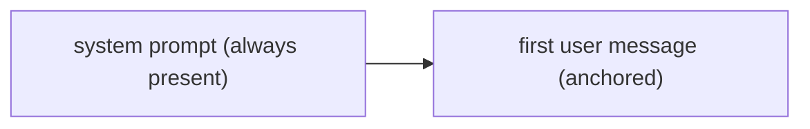

# Conversation Management

**One-Line Summary**: Conversation management tracks dialogue state across multiple turns, deciding when to keep full history versus summarize, how to structure system/user/assistant message roles, and how to maintain coherent multi-turn context within token constraints.

**Prerequisites**: Short-term context memory, memory architecture overview, LLM message role formats

## What Is Conversation Management?

Consider a skilled executive assistant who has been in a long meeting. They do not transcribe every word spoken; instead, they maintain structured notes: who said what on which topic, what decisions were made, what action items were assigned, and what remains unresolved. When a participant asks "What did we decide about the budget?", the assistant can find the relevant note instantly, even though the actual discussion happened 45 minutes and many topics ago. The assistant's value is not in recording everything but in organizing information for quick retrieval and maintaining a coherent understanding of the evolving conversation.

Conversation management for agents is this same skill applied to multi-turn dialogue. Every conversation generates a growing stream of messages: user requests, agent responses, tool calls, tool outputs, system instructions, and internal reasoning. Managing this stream involves decisions about what to keep, what to summarize, what to discard, and how to structure what remains. Poor conversation management leads to agents that forget what was discussed, contradict earlier statements, lose track of the user's original request, or run out of context window space on verbose tool outputs.



The challenge is particularly acute for agents (as opposed to simple chatbots) because agent conversations include not just dialogue but also tool interactions. A single agent turn might involve multiple tool calls, each returning substantial output. A 10-turn agent conversation can easily consume 50,000-100,000 tokens if tool outputs are retained in full. Without active management, the conversation quickly exceeds context limits.

## How It Works

### Message Role Architecture

Modern LLM APIs structure conversations using role-based messages. Understanding and leveraging these roles is fundamental to conversation management:

**System message**: Sets the agent's behavior, personality, and constraints. Persistent across the conversation. Typically placed at the start and not modified during the conversation. Models give system messages elevated attention weight.

**User message**: The human's input. Contains requests, questions, feedback, and corrections.

**Assistant message**: The agent's responses. Contains reasoning, answers, and tool call requests.

**Tool message**: Results returned from tool execution. These are typically attributed to a "tool" role and associated with a specific tool call.

```
[System] You are a research assistant specializing in climate science.
         Always cite sources. Ask clarifying questions when the request
         is ambiguous.
[User]   What's the current scientific consensus on sea level rise?
[Assistant] I'll search for recent IPCC data on this topic.
           [Tool call: search("IPCC AR6 sea level rise projections")]
[Tool]   Results: "The IPCC AR6 report projects global mean sea level
         rise of 0.28-0.55m by 2100 under SSP1-2.6..."
[Assistant] According to the IPCC AR6 report, global mean sea level is
           projected to rise between 0.28m and 1.01m by 2100...
[User]   What about the worst-case scenario?
```

### Dialogue State Tracking

Beyond raw message history, conversation management maintains higher-level state:

**Task state**: What the user originally asked for, what has been accomplished, what remains. This is distinct from the message history; it is a summary of the conversation's purpose and progress.

```
Task State:
  Original request: "Help me analyze sales data and create a report"
  Completed: Data loaded, cleaned, basic statistics computed
  In progress: Generating visualizations
  Remaining: Write executive summary, format as PDF
  Blockers: None
```

**User context**: Information about the user that has been revealed during the conversation: their expertise level, preferences, constraints, and expectations.

**Decision log**: Key decisions made during the conversation that affect subsequent actions: "We decided to use a bar chart instead of a pie chart for the regional breakdown."

### When to Summarize vs Keep Full History

The core trade-off in conversation management:

**Keep full history** when:
- The conversation is short (under 20 messages, under 10K tokens)
- Earlier messages contain specific details that may be referenced again (code snippets, data values, exact user phrasing)
- The user has corrected or refined their request, and the full correction context matters

**Summarize** when:
- The conversation exceeds 50% of the context window
- Earlier exchanges covered topics that are now resolved and unlikely to be revisited
- Tool outputs were verbose but the extracted information is compact

**Hybrid approach** (recommended):
- Keep the system prompt in full (always)
- Keep the first user message in full (contains the original request)
- Summarize middle exchanges into a compact "conversation so far" block
- Keep the most recent 3-5 exchanges in full (active working context)

```
[System] ...full system prompt...
[Summary] "Earlier in this conversation, the user asked about sea level
rise projections. I retrieved IPCC AR6 data showing 0.28-1.01m rise by
2100 across scenarios. The user then asked about tipping points, and I
found research from Lenton et al. (2019) identifying 9 key tipping
elements. We discussed the AMOC weakening scenario in detail."
[User] Now let's compare these projections with historical data.
[Assistant] ...
```

### Multi-Turn Context Coherence

Maintaining coherence across turns requires explicit tracking of:

**Anaphora resolution**: When the user says "Can you fix that?", the agent must determine what "that" refers to. This requires maintaining a reference chain from recent messages.

**Topic continuity**: The agent must track when the conversation shifts topics and when it returns to a previous topic. Summarization should be topic-aware: keep details about the active topic, compress details about concluded topics.

**Instruction accumulation**: Users often refine instructions incrementally: "Make a chart" -> "Make it a bar chart" -> "Use blue for domestic, red for international." The agent must maintain the full accumulated instruction set, not just the latest refinement.

### Tool Output Management

Tool outputs are the biggest consumer of context window space in agent conversations. Management strategies:

**Truncation**: Cap tool output at N tokens (e.g., 1000). Risk: losing important information in truncated content.

**Extraction**: Parse the tool output and extract only the relevant information. A search returning 10 results can be reduced to the 3 most relevant titles and snippets.

**Summarization**: Use an LLM call to summarize verbose tool output before inserting it into the conversation. Adds latency and cost but dramatically reduces token usage.

**Reference-based storage**: Store the full tool output in external memory and insert only a summary with a reference: "Search returned 10 results [stored in memory, retrievable on demand]. Top result: ..."

## Why It Matters

### Maintains Conversation Coherence

Without active management, long conversations degrade: the agent forgets the original goal, contradicts earlier statements, or loses track of accumulated context. Conversation management ensures the agent maintains a coherent understanding of the dialogue state regardless of conversation length.

### Extends Effective Conversation Length

By summarizing resolved topics and managing tool outputs, conversation management extends how long a productive conversation can continue before hitting context limits. A well-managed conversation can productively span 50-100+ turns, while an unmanaged one may degrade after 10-20 turns.

### Improves User Experience

Users expect agents to remember what was discussed, respect their preferences, and build on prior exchanges. Conversation management makes this possible, creating the experience of interacting with a consistent, attentive assistant rather than a memoryless model.

## Key Technical Details

- **Summarization cost**: Generating a conversation summary costs one LLM call (typically 500-1500 tokens). This is amortized across many turns: summarize every 5-10 turns, not every turn
- **Summary quality matters**: A lossy summary can cause the agent to lose critical details. Include key decisions, specific data points, and unresolved items. Exclude pleasantries, routine acknowledgments, and verbose tool outputs
- **Role-specific token budgets**: System message: 5-15% of total budget. Conversation history: 40-60%. Current exchange: 20-30%. Retrieved context: 10-20%. Reserve 15% for response generation
- **Message deduplication**: When the same information appears in multiple messages (user repeats request, tool returns overlapping results), deduplicate during summarization to avoid wasting tokens
- **Conversation checkpointing**: For long conversations, periodically save a full snapshot (all messages + state) to persistent storage. This enables recovery from context window overflow and allows the conversation to span multiple sessions
- **Framework implementations**: LangChain's `ConversationSummaryBufferMemory` combines a summary of old messages with a buffer of recent messages. This is the recommended default for most agent applications
- **System prompt updates**: Some agents dynamically update the system prompt based on conversation context (adding user preferences, task state). This leverages the elevated attention weight of system messages

## Common Misconceptions

- **"Just keep all messages and let the model figure it out."** This works for short conversations but fails as conversations grow. Context window limits are hard constraints, and even within limits, attention quality degrades with length. Active management is necessary.

- **"Summarization always loses important information."** Well-designed summarization preserves key information while discarding redundant content. The net effect is often positive: a focused summary in the context window is more useful than verbose raw history that dilutes attention.

- **"The system message should be minimal."** System messages receive elevated attention weight. Using this space effectively (including task context, user preferences, and behavioral guidelines) significantly improves response quality. A well-crafted 500-token system message is one of the highest-value investments in conversation management.

- **"Conversation management is just about token counting."** Token management is one aspect, but conversation management also includes state tracking, coherence maintenance, topic management, and instruction accumulation. These higher-level concerns are at least as important as token budgets.

## Connections to Other Concepts

- `short-term-context-memory.md` — Conversation management operates within the short-term context memory, deciding how to allocate the context window budget across different types of information
- `memory-compression.md` — Compression techniques (summarization, hierarchical compression) are the core tools used in conversation management to fit more information in less space
- `memory-architecture-overview.md` — Conversation management bridges working memory (current context) and long-term memory (persisted conversation state), managing the flow between them
- `long-term-persistent-memory.md` — When conversation content is summarized out of the context window, the full content can be persisted to long-term memory for potential later retrieval
- `memory-retrieval-strategies.md` — In multi-session conversations, retrieval strategies pull relevant context from past sessions into the current conversation

## Further Reading

- LangChain Documentation. (2024). "Memory." Comprehensive guide to conversation memory implementations including buffer, window, summary, and hybrid strategies.
- Xu, W., Alon, U., Neubig, G. (2023). "A Critical Evaluation of Context Length in Language Models." Evaluates how conversation length affects model performance, informing conversation management strategies.
- Zheng, L., Chiang, W., Sheng, Y., et al. (2023). "Judging LLM-as-a-Judge with MT-Bench and Chatbot Arena." Multi-turn benchmark that evaluates conversation coherence and management, relevant to measuring conversation management quality.
- Liu, N., Lin, K., Hewitt, J., et al. (2023). "Lost in the Middle: How Language Models Use Long Contexts." Informs conversation management by showing that message placement within the context affects how well the model uses the information.
