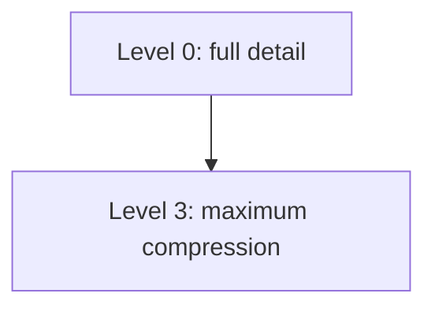

# Memory Compression

**One-Line Summary**: Memory compression reduces the token footprint of stored information through summarization, hierarchical compression, and selective forgetting, enabling agents to maintain longer effective memories within fixed context window budgets.

**Prerequisites**: Short-term context memory, conversation management, long-term persistent memory

## What Is Memory Compression?

Consider how a historian writes about a decade of events. They do not reproduce every newspaper article, every speech, every meeting transcript from the 2010s. Instead, they compress: major events are described in paragraphs, minor events in sentences, and most events are omitted entirely. The further back in time, the more compressed the account becomes. Yesterday might fill a page; last year fills a paragraph; a decade fills a chapter. This progressive compression is how humans manage finite cognitive resources against an ever-growing body of experience.

Memory compression for agents is the same principle applied to information stored in and retrieved from memory systems. As agents operate over long conversations or many sessions, the accumulated information far exceeds what fits in the context window. Compression reduces this information to its essential content: key facts, decisions, outcomes, and lessons, while discarding redundant details, routine exchanges, and transient observations. The goal is to preserve the maximum decision-relevant information in the minimum number of tokens.



Compression is not just about saving space; it is about improving signal-to-noise ratio. A context window filled with 50,000 tokens of raw conversation history contains significant noise: greetings, repeated explanations, verbose tool outputs, dead-end reasoning. Compressing this to 5,000 tokens of distilled information can actually improve agent performance because the model's attention is focused on signal rather than diluted across noise.

## How It Works

### Summarization-Based Compression

The most straightforward compression technique: use an LLM to generate a summary of a block of conversation or memory content.

**Single-pass summarization**: Take a block of text (e.g., 5000 tokens of conversation history) and produce a summary (e.g., 500 tokens):

```
Prompt: "Summarize the following conversation, preserving all key decisions,
factual findings, user preferences, and unresolved items. Omit pleasantries,
routine acknowledgments, and verbose tool output details."

Input: [5000 tokens of raw conversation]
Output: "The user requested analysis of Q3 sales data. Key findings: revenue
up 12% YoY, APAC region underperforming (down 3%), top product is Enterprise
Suite. User decided to focus the report on APAC underperformance. Data source:
company_sales_q3.csv. Remaining work: create APAC-focused visualizations and
draft executive summary."
```

**Compression ratio**: Typical ratios are 5:1 to 20:1. A 10:1 ratio means 5000 tokens compress to 500 tokens. Higher ratios lose more detail; lower ratios preserve more but save less space.

### Hierarchical Compression

Different information ages deserve different compression levels. Recent information is kept in full detail; older information is progressively compressed:

```
Level 0 (current turn): Full detail, no compression
  "The user just asked me to add error handling to the parse_config function.
   They specified they want try/except with specific exception types, not
   bare except clauses."

Level 1 (last 5 turns): Light compression, key details preserved
  "We discussed the config module. User wants: (1) type hints on all public
   functions, (2) docstrings in Google style, (3) specific exception handling.
   I've completed type hints and docstrings. Error handling is next."

Level 2 (last 20 turns): Heavy compression, only outcomes and decisions
  "Session focused on refactoring config.py. Completed: type hints, docstrings,
   input validation. In progress: error handling. User preferences: Google-style
   docstrings, specific exception types, no bare except."

Level 3 (older sessions): Maximum compression, only key facts
  "Previous session: refactored config.py (type hints, docstrings, validation).
   User prefers Google-style docstrings and specific exception handling."
```

This tiered approach mimics human memory: vivid detail for recent events, progressively compressed summaries for older events. Implementation requires periodic re-compression as information ages from one level to the next.

### Running Summaries

Instead of periodically summarizing the entire history, maintain a running summary that is updated incrementally:

1. Start with an empty summary
2. After each N turns (typically 3-5), generate an updated summary that incorporates the new turns into the existing summary
3. The summary grows slowly (or stays constant size) even as the conversation grows

```
After turns 1-5:
Summary: "User wants to build a REST API for a todo app using FastAPI and
PostgreSQL. We've set up the project structure and database models."

After turns 6-10 (updated, not rewritten from scratch):
Summary: "User wants to build a REST API for a todo app using FastAPI and
PostgreSQL. Project structure and database models are complete. CRUD endpoints
for tasks are implemented and tested. User requested adding user authentication
next, preferring JWT tokens."

After turns 11-15 (updated):
Summary: "Building a FastAPI + PostgreSQL todo app. Complete: project structure,
DB models, CRUD endpoints (tested). In progress: JWT authentication. Decided to
use python-jose for JWT and passlib for password hashing. Auth middleware is
partially implemented."
```

The key technique is the update prompt: "Here is the current summary and the recent conversation. Produce an updated summary that incorporates all new information while keeping the total length under 300 words."

### Selective Forgetting

Not all information deserves to be remembered, even in compressed form. Strategic forgetting improves memory quality:

**Importance-based forgetting**: Memories with low importance scores are candidates for deletion. A casual greeting or a routine acknowledgment can be safely forgotten.

**Redundancy-based forgetting**: When newer information supersedes older information, the older version can be forgotten. "The user prefers Python 3.11" supersedes the earlier memory "The user prefers Python 3.9."

**Staleness-based forgetting**: Information with known expiry (API rate limits that change, temporary workarounds, session-specific context) can be automatically expired.

**Capacity-based forgetting**: When the memory store reaches a size threshold, the least-accessed, lowest-importance, oldest memories are pruned.

### Token Budget Management

Compression is ultimately about fitting information into a token budget. Effective budget management requires:

```
Total context window: 128,000 tokens
  System prompt: 2,000 tokens (fixed)
  Retrieved long-term memories: 3,000 tokens
  Compressed conversation history: 5,000 tokens
  Recent turns (full detail): 8,000 tokens
  Current tool output: 4,000 tokens
  Reserved for response: 10,000 tokens
  Buffer/safety margin: 6,000 tokens
  ─────────────────────────────────
  Remaining for extended thinking: ~90,000 tokens
```

When any category exceeds its budget, compression is triggered for that category. The budget allocation should be configurable per task type: research tasks need more memory budget; coding tasks need more tool output budget.

## Why It Matters

### Extends Effective Conversation Length

Without compression, useful conversation length is capped by the context window. With hierarchical compression, an agent can maintain useful context from hundreds of turns of conversation within a fixed token budget, because older turns are compressed to their essential content.

### Improves Signal-to-Noise Ratio

Raw conversation history contains significant noise. Compression is not just about space savings; it actively improves agent performance by focusing attention on the most important information. Research has shown that a compressed, relevant context outperforms a full but noisy context on many tasks.

### Enables Scalable Memory Systems

As long-term memory stores grow, retrieval returns more and more candidate memories. Compression ensures that retrieved memories can be loaded into context without exceeding budgets, by compressing each retrieved item to its essential content.

## Key Technical Details

- **Compression LLM calls**: Each summarization costs one LLM call (typically 200-800 input tokens for the prompt + source, 100-500 output tokens for the summary). For running summaries updated every 5 turns, this is ~2 LLM calls per 10 conversation turns
- **Compression quality**: LLM-based summarization preserves 70-90% of task-relevant information at 10:1 compression ratios. The 10-30% loss is primarily in nuance, hedging language, and peripheral details
- **Lossless compression is impossible**: Unlike data compression (ZIP, gzip), semantic compression is inherently lossy. Some information is always lost. The goal is to minimize loss of decision-relevant information
- **Compression latency**: Summarization calls add 0.5-2 seconds of latency. For running summaries triggered every 5 turns, this latency is experienced once per 5 turns, not every turn
- **Optimal summary length**: For conversation history, 200-500 tokens of summary per 10 conversation turns provides a good balance of compression and information retention
- **Summary drift**: Over many incremental updates, running summaries can drift from the original content, emphasizing themes that were recently discussed while losing earlier themes. Periodic "full refresh" summarization (summarizing from raw history, not from the previous summary) corrects drift
- **Multi-level cache**: Implement compression as a cache hierarchy: Level 0 (raw, 0% compressed), Level 1 (light, 50% compressed), Level 2 (heavy, 90% compressed), Level 3 (archived, 95% compressed). Information moves through levels as it ages

## Common Misconceptions

- **"Compression is only needed when the context window fills up."** Proactive compression improves performance even when the context window is not full. A focused 20K-token context with compressed history outperforms a sprawling 100K-token context with full history, because attention quality is higher.

- **"LLM summarization preserves all important information."** No summarization is perfect. LLMs may drop information that seems unimportant to the summarizer but is critical to the task. Critical information (user-specified requirements, key decisions, error findings) should be preserved in a separate "never compress" section.

- **"Compression should happen at fixed intervals."** Adaptive compression (triggered by token budget thresholds) is more efficient than fixed-interval compression. Compress when needed, not on a schedule.

- **"Older information should always be compressed more."** While this is generally true, some old information is eternally important (user's fundamental preferences, project architecture decisions, critical constraints). Importance scoring should override age-based compression for high-importance memories.

- **"Forgetting is always bad."** Strategic forgetting improves memory quality by removing noise, redundancy, and stale information. A clean memory store with 1000 relevant items outperforms a cluttered store with 10,000 items where 90% are noise.

## Connections to Other Concepts

- `short-term-context-memory.md` — Compression directly manages the content of short-term context memory, ensuring the context window is used efficiently
- `conversation-management.md` — Conversation management uses compression as its primary tool for handling growing dialogue histories within token budgets
- `long-term-persistent-memory.md` — Information compressed out of the context window can be persisted to long-term memory in its compressed form, with the full version also stored for potential detailed retrieval
- `memory-retrieval-strategies.md` — Retrieved memories may need compression before injection into context, especially when multiple memories are retrieved and token budget is tight
- `memory-architecture-overview.md` — Compression manages the flow of information between memory layers: from detailed working memory to compressed long-term storage, with progressive compression as information ages

## Further Reading

- Xu, W., Alon, U., Neubig, G. (2023). "A Critical Evaluation of Context Length in Language Models." Demonstrates that more context is not always better, motivating compression strategies that prioritize quality over quantity.
- Packer, C., Wooders, S., Lin, K., et al. (2023). "MemGPT: Towards LLMs as Operating Systems." Implements automatic compression and paging between context (working memory) and external storage (archival memory).
- Chevalier, A., Wettig, A., Clinciu, A., et al. (2023). "Adapting Language Models to Compress Contexts." Trains models specifically for context compression, achieving higher compression ratios with less information loss.
- Jiang, H., Wu, Q., Luo, X., et al. (2023). "LongLLMLingua: Accelerating and Enhancing LLMs in Long Context Scenarios via Prompt Compression." Introduces prompt compression techniques that reduce input length while preserving task performance.
- Mu, J., Li, X., Goodman, N. (2023). "Learning to Compress Prompts with Gist Tokens." Proposes learned compression tokens that represent compressed information, enabling ultra-high compression ratios.
