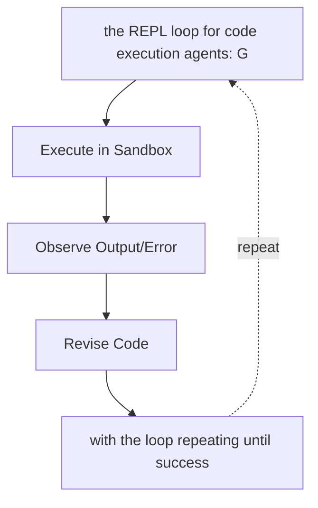

# Code Generation and Execution

**One-Line Summary**: Agents that write and execute code gain a universal tool — computation, data manipulation, visualization, and system interaction all become possible through generated programs run in sandboxed environments.

**Prerequisites**: Function calling, programming fundamentals, sandboxing concepts, REPL environments

## What Is Code Generation and Execution?

Imagine giving someone a calculator versus teaching them algebra. The calculator handles specific pre-programmed operations, but algebra lets them solve any mathematical problem they can formulate. Code generation and execution is the "algebra" of agent tools: instead of relying on a fixed set of predefined functions, the agent writes custom programs on the fly to solve whatever problem it encounters. Need to parse a CSV, compute statistics, generate a chart, and format results as a table? Rather than requiring four separate tools, the agent writes a Python script that does all four.

Code generation and execution means the agent produces source code (typically Python, JavaScript, or shell commands) in response to a task, then runs that code in a sandboxed environment, observes the output (including errors), and iterates. This pattern — generate, execute, observe, revise — mirrors how human developers work in a REPL (Read-Eval-Print Loop). The key difference is that the agent can generate code tailored to each unique problem rather than being limited to predefined tool interfaces.

This capability transforms the agent from a tool user into a tool maker. When the agent encounters a task that no existing tool handles, it can write code to accomplish it. This is why code execution is often called a "universal tool" — any computable task can theoretically be addressed by generating the right program. In practice, LLMs like GPT-4, Claude, and Gemini are remarkably effective code generators, making this a highly practical approach.

## How It Works

### Code Generation from Natural Language

The LLM receives a task description and generates code to accomplish it. This is typically done via a `run_code` or `execute_python` tool that accepts a code string as its parameter. The model leverages its training on millions of code repositories to produce syntactically correct, functionally appropriate code. For data tasks, it commonly generates pandas or numpy code; for visualization, matplotlib or plotly; for web scraping, requests or BeautifulSoup.

### Sandboxed Execution Environments

Running LLM-generated code on a production system without isolation is a critical security risk. The agent could generate code that deletes files, exfiltrates data, or consumes unbounded resources. Sandboxed environments address this:

- **Docker containers**: Ephemeral containers with resource limits (CPU, memory, network). The code runs inside the container, and only stdout/stderr is returned. Popular for server-side agent systems.
- **E2B (e2b.dev)**: Cloud-based sandboxed environments specifically designed for AI agent code execution. Provides isolated Linux VMs with pre-installed packages, file system access, and configurable timeouts.
- **Pyodide/WebAssembly**: Python compiled to WebAssembly, running in the browser. Used by tools like JupyterLite and some agent UIs. No network access, limited library support, but zero server cost.
- **gVisor/Firecracker**: Lightweight VM technologies used by cloud providers for stronger isolation than containers with lower overhead than full VMs.

### The REPL Pattern

The most effective code execution agents follow a REPL loop: (1) Generate code based on the task and current state, (2) Execute it, (3) Observe stdout, stderr, and return values, (4) If there are errors, analyze them and generate corrected code, (5) If successful, use the output to continue reasoning or generate the next code block. This loop typically runs 2-5 iterations for complex tasks. OpenAI's Code Interpreter (now Advanced Data Analysis) pioneered this pattern.

### State Management Across Executions

Within a session, variables and imported libraries persist between code executions. This means the agent can build up state incrementally: first load a dataset into a DataFrame, then in a subsequent execution compute statistics on it, then generate a visualization. The runtime maintains a persistent kernel (like a Jupyter notebook kernel) that keeps the Python environment alive between calls.

## Why It Matters

### The Universal Tool

Code execution subsumes most other tools. Need to call an API? Write `requests.get()`. Need to parse a file? Write file I/O code. Need to do math? Write the computation. Need to generate a chart? Write matplotlib code. This universality means an agent with code execution and nothing else can handle a remarkably wide range of tasks.

### Error Self-Recovery

Unlike predefined tools that either work or fail opaquely, code execution gives the agent rich error information (stack traces, error messages) that it can use to debug and fix its approach. An agent that gets a `KeyError: 'price'` can inspect the actual column names and correct its code — a self-healing capability that is difficult to achieve with static tool interfaces.

### Data Analysis and Exploration

Code execution is particularly powerful for data tasks. The agent can load datasets, explore their structure (`.head()`, `.describe()`, `.dtypes`), clean data, perform analysis, and create visualizations — all through generated code. This is why code execution is central to products like ChatGPT's Advanced Data Analysis and Claude's analysis tool.

## Key Technical Details

- **Language choice**: Python dominates due to its data science ecosystem (pandas, numpy, matplotlib, scikit-learn) and LLMs' extensive training on Python code. JavaScript is used for web-related tasks. Shell commands serve for system operations.
- **Timeout enforcement**: Every code execution must have a hard timeout (typically 30-120 seconds). Without it, infinite loops or long-running computations can hang the agent indefinitely.
- **Output capture**: Capture both stdout and stderr, plus the return value of the last expression. Truncate output to a reasonable length (e.g., 10,000 characters) to avoid flooding the LLM context.
- **File I/O in sandbox**: Sandboxed environments typically provide a temporary directory where the agent can read/write files. Uploaded user files are placed there; generated files (charts, CSVs) can be returned from there.
- **Package availability**: Pre-install common packages in the sandbox image. Allowing `pip install` at runtime adds flexibility but also latency and security risk. Many implementations use a curated set of ~50-100 pre-installed packages.
- **Resource limits**: Set explicit limits: max 2 CPU cores, 512MB-2GB RAM, no network access (or restricted network), and max execution time. These prevent both accidental and adversarial resource abuse.
- **Multimodal output**: Code execution can produce images (matplotlib plots saved as PNG), which are then displayed to the user. This makes the agent capable of data visualization without dedicated visualization tools.

## Common Misconceptions

- **"LLM-generated code is always correct on the first try"**: Studies show that LLMs produce correct code on the first attempt roughly 50-70% of the time for moderately complex tasks. The REPL loop with error feedback is essential — accuracy jumps to 80-90% with 2-3 retries.
- **"Code execution is too dangerous to use in production"**: With proper sandboxing (Docker, E2B, gVisor), code execution is used safely in production by OpenAI, Anthropic, Google, and numerous startups. The key is defense in depth: sandboxing, resource limits, network restrictions, and output filtering.
- **"Code execution replaces all other tools"**: While code execution is universal in theory, purpose-built tools are faster, more reliable, and cheaper for common operations. Calling a dedicated `get_weather` API tool is better than having the agent write `requests.get("https://api.weather.com/...")` every time.
- **"The agent needs to write perfect, production-quality code"**: Agent-generated code is ephemeral — it runs once to accomplish a task and is discarded. It does not need tests, documentation, or clean architecture. Functional correctness is all that matters.

## Connections to Other Concepts

- `function-calling.md` — Code execution is typically invoked via a function call (e.g., a `run_python` tool). The generated code is the function's argument.
- `dynamic-tool-creation.md` — Code generation is the mechanism by which agents create new tools at runtime: they generate code that defines a function, then register it as a callable tool.
- `file-and-system-operations.md` — Code execution provides an alternative to dedicated file operation tools; the agent can write Python file I/O instead.
- `tool-chaining.md` — The REPL pattern is a special case of tool chaining where the same tool (code execution) is called repeatedly with state carried across invocations.
- `browser-automation.md` — Code execution with libraries like Playwright or Selenium enables programmatic browser automation from within the agent's code sandbox.

## Further Reading

- Chen et al., "Evaluating Large Language Models Trained on Code" (2021) — The Codex paper establishing benchmarks for LLM code generation (HumanEval), foundational to understanding agent code capabilities.
- OpenAI, "Code Interpreter / Advanced Data Analysis" (2023) — Product documentation and blog post describing the sandboxed code execution environment integrated into ChatGPT.
- E2B Documentation, "Code Interpreter SDK" (2024) — Open-source sandboxed execution environment designed specifically for AI agents, with guides on integration.
- Anthropic, "The analysis tool" (2025) — Documentation on Claude's built-in code execution capability for data analysis, with architecture details on the sandboxed environment.
- Yang et al., "InterCode: Standardizing and Benchmarking Interactive Coding with Execution Feedback" (2023) — Benchmark for evaluating agents that iteratively generate and execute code with feedback.
