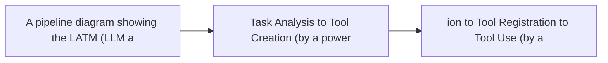

# Dynamic Tool Creation

**One-Line Summary**: Dynamic tool creation enables agents to write, validate, and register new tools at runtime when existing tools are insufficient, turning the agent from a tool user into a tool maker that extends its own capabilities.

**Prerequisites**: Function calling, code generation and execution, tool selection and routing

## What Is Dynamic Tool Creation?

Imagine a chef who, upon encountering an unusual ingredient that none of their existing kitchen tools can properly handle, fabricates a custom tool on the spot — maybe bending a piece of metal into a specialized scraper. They test it on a small piece first, and if it works, they add it to their tool rack for future use. Dynamic tool creation in AI agents follows the same principle: when the agent encounters a task that no predefined tool handles well, it writes code to define a new function, tests it, and registers it as a reusable tool in its toolkit.

This capability represents a qualitative shift in agent design. Most agents operate with a fixed toolkit defined by developers at design time. An agent with dynamic tool creation can extend its own capabilities at runtime, adapting to novel situations without human intervention. The agent might create a new tool to interact with an unfamiliar API, process a data format it has never seen, or automate a repetitive workflow it discovers during a task.

The concept connects to a deeper idea in AI: self-improvement. An agent that can create its own tools is, in a limited sense, improving its own capabilities. This is bounded — the agent does not modify its core reasoning model — but it meaningfully expands the action space available to it. The practical implication is fewer hardcoded integrations and more adaptable agents that handle long-tail use cases.



## How It Works

### Tool Generation Process

Dynamic tool creation follows a consistent pipeline:

1. **Gap identification**: The agent encounters a sub-task where no existing tool is suitable. This might be explicit ("I don't have a tool for this") or implicit (attempting to use an existing tool and failing).
2. **Function design**: The agent writes a function definition, including name, parameters (with types), docstring (which becomes the tool description), and implementation.
3. **Validation**: The generated function is tested with sample inputs. If it fails, the agent debugs and revises it — the same REPL loop used in code execution.
4. **Registration**: The validated function is added to the agent's available tool set, making it callable in future turns.
5. **Persistence (optional)**: The tool definition is saved to disk or a tool registry so it persists across sessions.

### Implementation Patterns

**Code generation + exec**: The simplest pattern. The agent generates Python code defining a function, executes it in a persistent runtime (making the function available in memory), and adds it to the tool registry. Example:

```python
def convert_currency(amount: float, from_currency: str, to_currency: str) -> float:
    """Convert an amount between currencies using current exchange rates."""
    import requests
    rates = requests.get(f"https://api.exchangerate.host/convert?from={from_currency}&to={to_currency}").json()
    return amount * rates["result"]
```

**Template-based generation**: For common tool patterns (API wrappers, data transformers, file processors), the agent fills in a template rather than writing from scratch. This is more reliable and faster.

**Tool composition**: The agent creates a new tool by composing existing tools. For example, a "weekly_report" tool might chain a database query tool, a statistics computation tool, and a formatting tool into a single reusable function.

### Validation and Safety

Generated tools carry risks that predefined tools do not:

- **Correctness**: The function might have bugs that only surface with certain inputs. Testing with diverse inputs helps but cannot guarantee correctness.
- **Security**: The generated code might introduce vulnerabilities — SQL injection if it constructs queries, path traversal if it handles file paths, or data exfiltration if it makes network requests.
- **Resource abuse**: A poorly written tool might leak memory, create infinite loops, or make excessive API calls.

Mitigation strategies include: running generated tools in sandboxes, requiring human approval before registration, imposing resource limits (timeout, memory caps), restricting network access, and maintaining an audit log of all generated tools.

### Storage and Retrieval

For dynamic tools to provide lasting value, they must be stored and retrieved across sessions:

- **Tool registry**: A database or file store containing tool definitions (name, description, code, metadata like creation date and success rate).
- **Semantic retrieval**: When the agent encounters a new task, it searches the registry using embedding similarity to see if a previously created tool is relevant.
- **Versioning**: Tools can be updated when they fail or when better implementations are found. Version history helps with debugging regressions.

## Why It Matters

### Handling the Long Tail

No fixed tool set covers every possible task. The long tail of user requests — unusual data formats, niche APIs, custom workflows — inevitably falls outside predefined tools. Dynamic tool creation addresses this by letting the agent handle novel situations adaptively.

### Reducing Developer Burden

Traditionally, adding a new capability to an agent requires a developer to write a tool, test it, and deploy it. Dynamic tool creation shifts some of this burden to the agent itself, which can create simple tools on demand. This is particularly valuable for internal tools and one-off integrations that do not justify developer time.

### Compounding Capability

Each tool the agent creates makes it more capable for future tasks. Over many sessions, an agent can build up a specialized toolkit tailored to its user's specific needs and workflows. This creates a flywheel: more tools lead to more successful task completions, which generate more opportunities to create tools.

## Key Technical Details

- **Name and description quality**: A generated tool is only useful if the agent can find and select it later. The agent must generate clear, descriptive names and docstrings — the same qualities that make predefined tools discoverable.
- **Parameter typing**: Generated tools should have typed parameters (Python type hints or JSON schema) so the LLM can generate valid calls. Untyped tools lead to more invocation errors.
- **Dependency management**: Generated tools may require libraries not in the standard environment. The system must handle `import` failures gracefully, potentially installing missing packages or falling back to alternative implementations.
- **Tool deprecation**: Tools that consistently fail or are superseded should be deprecated or removed from the registry to prevent clutter and selection errors.
- **Human-in-the-loop approval**: For production systems, having a human review generated tools before they enter the permanent registry balances autonomy with safety. The agent creates the tool, uses it for the current task, but only persists it after human approval.
- **Reuse rate**: In practice, dynamically created tools have a low reuse rate — many are too specific to the original task. Tracking which tools are reused helps identify which are worth keeping.

## Common Misconceptions

- **"Dynamic tool creation means the agent can do anything"**: The agent is limited by its code generation capabilities, available libraries, sandbox constraints, and the data it can access. It cannot create tools that require resources outside its environment.
- **"Generated tools are as reliable as developer-written tools"**: Generated tools are typically more fragile, less tested, and narrower in scope than tools written by engineers. They are best for one-off tasks or prototyping, not as replacements for production-grade integrations.
- **"The agent will naturally create tools when needed"**: Most LLMs do not spontaneously create tools unless explicitly prompted or trained to do so. The system must include instructions or examples that encourage tool creation when existing tools are insufficient.
- **"Dynamic tool creation is self-improving AI"**: While the agent's toolkit improves, its core reasoning does not. The model itself does not get smarter — it simply has more tools to choose from. This is capability extension, not self-improvement in the AGI sense.
- **"Every created tool should be saved"**: Most dynamically created tools are too specific to reuse. A selective persistence strategy — saving only tools that are general enough to apply to future tasks — keeps the registry manageable.

## Connections to Other Concepts

- `code-generation-and-execution.md` — Dynamic tool creation is built on code generation. The agent writes code that defines a function, then executes and registers it.
- `function-calling.md` — Generated tools must conform to function calling conventions (name, description, parameters) to be invocable by the LLM.
- `tool-selection-and-routing.md` — As the tool set grows with dynamically created tools, selection quality becomes critical to avoid confusion between similar tools.
- `tool-chaining.md` — Tool composition (creating a new tool by chaining existing ones) is a common pattern in dynamic tool creation.
- `file-and-system-operations.md` — Persisting tools to disk and loading them across sessions relies on file system operations.

## Further Reading

- Cai et al., "LATM: Large Language Models as Tool Makers" (2023) — Foundational paper proposing that LLMs create reusable tools from complex tasks, then use lighter-weight models to invoke them.
- Qian et al., "CREATOR: Tool Creation for Disentangling Abstract and Concrete Reasoning" (2023) — Research showing that LLMs produce better results when they first create a tool for a problem rather than solving it directly.
- Wang et al., "CRAFT: Customizing LLMs by Creating and Retrieving from Specialized Toolsets" (2024) — Framework for building and managing task-specific tool collections created by LLMs.
- Yuan et al., "EASYTOOL: Enhancing LLM-based Agents with Concise Tool Instruction" (2024) — Studies how tool description quality affects both human-created and dynamically generated tool usage.
- Schick et al., "Toolformer: Language Models Can Teach Themselves to Use Tools" (2023) — While focused on tool use rather than creation, establishes the self-supervised approach to tool learning that underpins dynamic creation systems.
