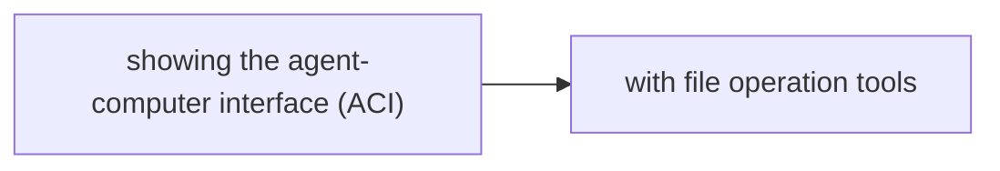

# File and System Operations

**One-Line Summary**: File and system operations give agents the ability to read, write, search, and manage files and execute system commands — turning the local file system into the agent's workspace like a desk where it can organize, review, and modify its materials.

**Prerequisites**: Function calling, operating system basics, file system concepts, shell command fundamentals

## What Is File and System Operations?

Picture a knowledge worker at a desk piled with documents. They can open a folder and read a report, scribble edits on a draft, organize files into labeled folders, search through stacks of papers for a specific clause, and run processes on their computer. File and system operations give an AI agent the same capabilities: reading file contents, writing new files, editing existing ones, navigating directory structures, searching for patterns, and executing shell commands. The file system becomes the agent's "desk" — the surface where all its work happens.

This category of tools is foundational to coding agents (like Claude Code, Cursor, GitHub Copilot Workspace, and Devin), which spend most of their time reading codebases, writing code, running tests, and managing build processes. But it extends beyond coding: any agent that works with documents, data files, configurations, or system processes needs file and system operation capabilities.

The key design challenge is balancing power with safety. An agent with unrestricted file system access could delete critical files, overwrite important data, or execute destructive commands. Production systems implement careful permission boundaries: read access to specific directories, write access to designated workspaces, and curated command execution with explicit allowlists.

## How It Works

### File Reading

Reading tools let the agent inspect file contents. Implementations range from simple (read entire file) to sophisticated:

- **Full file read**: Returns the complete content of a file. Suitable for files under a few hundred lines. Risk: large files overflow the context window.
- **Partial read with line ranges**: Read lines 50-100 of a file. Essential for navigating large codebases where files can be thousands of lines long.
- **Search-then-read**: Use grep or ripgrep to find relevant lines, then read surrounding context. This is the dominant pattern for code understanding — search for a function name, then read the surrounding implementation.
- **Directory listing**: List files and subdirectories, often with metadata (size, modification date). Helps the agent understand project structure before diving into specific files.

### File Writing and Editing

Writing tools range from overwrite (replace entire file) to surgical edit:

- **Full file write**: Replace a file's entire content. Simple but risky for large files where the agent might inadvertently drop content.
- **String replacement edits**: Specify an exact string to find and its replacement. Precise and safe for targeted changes. This is the approach used by Claude Code's Edit tool.
- **Diff-based edits**: Generate unified diffs that patch files. More compact for multi-location edits but harder for LLMs to generate correctly.
- **Insert/append**: Add content at a specific line number or at the end of a file. Useful for adding functions, imports, or configuration entries.

### Search Operations

Search tools let the agent find information across a codebase or document collection:

- **Pattern search (grep/ripgrep)**: Search for regex patterns across files. Essential for finding function definitions, usages, configuration values, and error messages.
- **File search (glob/find)**: Find files by name pattern. Used to locate configuration files, test files, or files with specific extensions.
- **Semantic search**: In some systems, embedding-based search over code or documents complements pattern matching for conceptual queries.

### System Command Execution

Running shell commands extends the agent beyond the file system:

- **Build commands**: `npm install`, `pip install`, `cargo build` — setting up and building projects.
- **Test runners**: `pytest`, `jest`, `go test` — running test suites and interpreting results.
- **Version control**: `git status`, `git diff`, `git commit` — managing source code history.
- **Process management**: Starting servers, checking ports, managing background processes.

## Why It Matters

### The Foundation of Coding Agents

Every coding agent — from simple code completion to autonomous software engineers — relies on file operations as its primary interface. Reading source code, understanding project structure, writing changes, and running tests are the core loop. The quality of these file operation tools directly determines how effective the agent is at software engineering tasks.

### Persistent State

Unlike conversation (which is ephemeral), files represent persistent state. An agent that writes a configuration file, generates a report, or saves intermediate results creates artifacts that outlast the conversation. This persistence is what makes agents useful for real work rather than just conversation.

### Workspace as Context

The agent's ability to navigate and search a file system gives it a form of "environmental memory." Rather than holding an entire codebase in context, the agent can strategically read files as needed, effectively using the file system as an external memory that it queries on demand. This is critical for working with large codebases that exceed context window limits.

## Key Technical Details

- **Working directory management**: Agents need a consistent working directory concept. Stateless shell environments (where each command starts fresh) require using absolute paths or explicit `cd` commands. Stateful environments maintain the working directory across commands.
- **File size limits**: Reading files larger than 10,000 lines into the LLM context is impractical. Tools should implement pagination (read N lines starting at line M) and summary modes for large files.
- **Encoding handling**: Files are not always UTF-8. Binary files, images, and files with different encodings need special handling. Attempting to read a binary file as text produces garbage output that wastes context.
- **Atomic writes**: Writing should be atomic (write to temp file, then rename) to prevent data loss if the process is interrupted mid-write.
- **Permission boundaries**: Production agents restrict file access to specific directory trees. An agent working on project A should not be able to read project B's files or access system-level files like `/etc/passwd`.
- **Command timeouts**: Shell commands must have timeouts. A `find /` command or a hung build process can block indefinitely without timeout enforcement.
- **Output truncation**: Command output (especially from builds or test suites) can be thousands of lines. Truncating to the most relevant portion (typically the end, where errors appear) keeps the context usable.
- **Undo and safety**: Implementing undo (keeping backups of overwritten files) and confirmation prompts for destructive operations (delete, overwrite) protects against agent mistakes.

## Common Misconceptions

- **"Agents should read entire codebases into context"**: Even with large context windows (200K tokens), reading an entire codebase is wasteful and degrades performance. Effective agents use targeted search-then-read patterns, loading only the files relevant to the current task.
- **"File operations are simple and do not need much design"**: The interface design of file tools dramatically affects agent performance. Whether the tool returns line numbers, how it handles large files, whether search results include context lines — these details determine whether the agent can effectively navigate a codebase.
- **"Shell command execution is too dangerous for agents"**: With proper sandboxing (restricted user, allowlisted commands, resource limits, no network access), shell execution is safe and essential. The risk is not in executing commands but in executing them without boundaries.
- **"The agent remembers every file it has read"**: Files read early in a long conversation may fall out of the effective context window or be overwritten by newer information. Agents should re-read files when working on them rather than relying on stale memory.

## Connections to Other Concepts

- `code-generation-and-execution.md` — Code execution produces output; file operations persist that output. Code generated by the agent is written to files and executed via system commands.
- `function-calling.md` — File and system operations are exposed as function calls (read_file, write_file, run_command) that the LLM invokes.
- `tool-chaining.md` — A typical coding workflow chains: search for relevant files, read them, generate edits, write changes, run tests, read test output, fix failures.
- `browser-automation.md` — Browser automation downloads and uploads files that file operations manage locally.
- `model-context-protocol.md` — MCP's "resources" primitive is designed specifically for exposing file-like content to agents in a standardized way.

## Further Reading

- Yang et al., "SWE-bench: Can Language Models Resolve Real-World GitHub Issues?" (2023) — Benchmark requiring agents to read codebases, understand issues, write patches, and pass tests — all through file and system operations.
- Anthropic, "Claude Code Documentation" (2025) — Documentation for Claude Code's file operation tools (Read, Edit, Write, Glob, Grep, Bash), representing a mature design for agent-file interaction.
- Jimenez et al., "SWE-agent: Agent-Computer Interfaces Are All You Need" (2024) — Research showing that the design of file/system operation tools significantly impacts coding agent performance.
- OpenAI, "Assistants API File Search" (2024) — Documentation on how OpenAI's Assistants handle file operations and code interpreter file I/O.
- Cognition AI, "Devin Technical Report" (2024) — Details on how Devin (an autonomous coding agent) manages workspace, file operations, and system processes for end-to-end software engineering.
