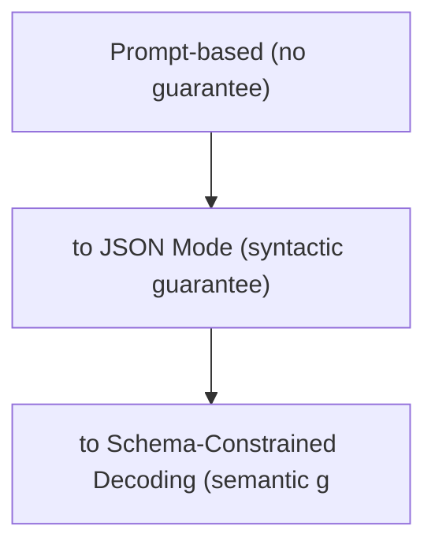

# Structured Output for Actions

**One-Line Summary**: Structured output techniques — JSON mode, constrained decoding, and schema validation — ensure that LLM-generated actions conform to precise, machine-readable formats, eliminating the fragility of parsing free-text responses.

**Prerequisites**: Function calling, JSON schema, type systems (Pydantic, Zod), tokenization basics

## What Is Structured Output for Actions?

Imagine asking a colleague to fill out a tax form. If you give them a blank sheet of paper and say "write down your tax information," you will get wildly inconsistent results — some write prose, others use bullet points, some miss critical fields. But if you hand them a structured form with labeled boxes, dropdowns, and required fields, you get consistent, machine-processable data every time. Structured output does the same for LLM responses: instead of hoping the model produces text you can parse, you constrain the model to output data in a predefined structure.

Structured output for actions specifically addresses the problem of getting reliable, machine-readable outputs from LLMs when those outputs will drive tool invocations, API calls, or state changes. When the model says "I'll search for restaurants in Seattle," that is informative text for a human but useless for a machine. What the system needs is `{"tool": "search_restaurants", "params": {"location": "Seattle"}}` — a precise, validated JSON object that code can process deterministically.

This is not merely a formatting concern. Unreliable output structure is the single most common source of agent failures in production. A missing comma in JSON, an unexpected field name, a string where an integer was expected — any of these breaks the execution pipeline. Structured output techniques range from prompting strategies (asking the model to output JSON) to hard guarantees (constrained decoding that makes invalid output impossible at the token level).



## How It Works

### JSON Mode

The simplest structured output mechanism is "JSON mode," offered by OpenAI, Anthropic, and other providers. When enabled, the model is guaranteed to produce valid JSON in its response. However, JSON mode only guarantees syntactic validity — the output will parse as JSON — not semantic validity. The JSON might have wrong field names, missing required fields, or incorrect types. JSON mode is a necessary but insufficient first step.

### Schema-Constrained Generation (Structured Outputs)

A stronger approach constrains the model to produce JSON that conforms to a specific JSON Schema. OpenAI's "Structured Outputs" feature (released August 2024) guarantees that every response matches the provided schema — correct field names, types, required fields, and enum values. This is implemented through constrained decoding: at each token generation step, the model's output distribution is masked to only allow tokens that could lead to valid schema-conforming JSON.

For example, given this schema:
```json
{
  "type": "object",
  "properties": {
    "action": {"type": "string", "enum": ["search", "create", "delete"]},
    "target": {"type": "string"},
    "priority": {"type": "integer", "minimum": 1, "maximum": 5}
  },
  "required": ["action", "target"]
}
```

The model cannot output `"action": "update"` (not in enum), cannot omit `target` (required), and cannot set `priority` to `"high"` (wrong type). These guarantees are enforced at the decoding level, not through post-hoc validation.

### Constrained Decoding Mechanics

Constrained decoding works by maintaining a state machine (often derived from a context-free grammar or JSON Schema) that tracks which tokens are valid at each generation step. When the model generates the token `"action": "`, the state machine knows only `search`, `create`, or `delete` can follow (from the enum constraint). Tokens that would lead to invalid output receive a probability of zero. Libraries like Outlines (for open-source models) and LMQL implement this for custom schemas.

### Application-Side Validation

Even with constrained generation, application-side validation provides defense in depth. Libraries like Pydantic (Python) and Zod (TypeScript) define schemas as code and validate LLM outputs at runtime:

```python
from pydantic import BaseModel

class SearchAction(BaseModel):
    query: str
    max_results: int = 10
    filters: list[str] = []

# Parse and validate LLM output
action = SearchAction.model_validate_json(llm_output)
```

If validation fails, the error message can be sent back to the LLM for correction — a retry loop that handles the small percentage of outputs that slip through.

## Why It Matters

### Eliminating Parse Errors in Production

In production agent systems, every tool invocation relies on structured output. A system handling thousands of requests per day cannot afford even a 1% parse failure rate — that is dozens of broken interactions daily. Hard-constrained structured output reduces parse failures to effectively zero, making agents reliable enough for production deployment.

### Type Safety Across the Agent Stack

Structured output with Pydantic/Zod models creates type safety from the LLM output through the application logic to the tool execution. The same model class that validates LLM output can be used as the function signature for the tool, ensuring end-to-end type consistency. This eliminates an entire class of runtime errors.

### Enabling Complex Action Schemas

Simple tool calls (one function, a few parameters) can survive with basic JSON mode. But complex agent actions — multi-step plans, conditional logic, nested objects — require robust structured output to be reliable. Structured output is what makes it feasible for agents to produce complex action specifications like workflow definitions, query plans, or multi-tool invocation sequences.

## Key Technical Details

- **Schema complexity limits**: Constrained decoding slows down as schema complexity increases. Deeply nested schemas (4+ levels), large enums (100+ values), or complex `oneOf`/`anyOf` patterns can degrade generation speed by 2-5x.
- **Pydantic v2 performance**: Pydantic v2 (Rust-based core) validates JSON 5-50x faster than Pydantic v1. For high-throughput agent systems, this difference matters. Always use v2 for new projects.
- **Recursive schemas**: Some providers do not support recursive JSON schemas (where a type references itself). This limits the ability to represent tree structures or recursive plans in constrained output.
- **Streaming compatibility**: Structured output can be streamed token-by-token, but the consumer cannot parse until the JSON is complete (or uses a streaming JSON parser that handles partial documents). OpenAI supports partial JSON streaming for structured outputs.
- **Default values and optional fields**: Optional fields in the schema may or may not be included in the output. Design schemas so that missing optional fields have sensible defaults, and validate with Pydantic's default mechanisms.
- **Token overhead**: Structured JSON output uses more tokens than equivalent free-text (field names, braces, quotes add up). A structured response is typically 20-40% more tokens than a free-text response conveying the same information.
- **Enum vs. free text**: Wherever possible, use enums to constrain categorical fields. `"status": {"enum": ["open", "closed", "pending"]}` is vastly more reliable than `"status": {"type": "string"}` with a prompt instruction to use one of three values.

## Common Misconceptions

- **"Asking the model to output JSON in the prompt is sufficient"**: Prompt-based JSON formatting fails 5-15% of the time, depending on the model and complexity. The model may add markdown code fences, include explanatory text, or produce syntactically invalid JSON. Only JSON mode or constrained decoding provides guarantees.
- **"Structured output makes function calling unnecessary"**: Function calling and structured output serve different purposes. Function calling is the mechanism for tool invocation (the model decides to call a tool). Structured output ensures the arguments are correctly formatted. They are complementary, not competing.
- **"Constrained decoding hurts output quality"**: Research shows that constrained decoding has minimal impact on the quality or creativity of the content within the structure. The model still uses its full capability to fill in values; it is just constrained to do so in a valid format.
- **"You only need validation on one side"**: Best practice is belt-and-suspenders: constrained generation on the model side AND validation on the application side. Models can be updated, APIs can change, and edge cases exist. Application-side validation is your safety net.
- **"All LLM providers support structured output equally"**: Support varies significantly. OpenAI offers full schema-constrained generation. Anthropic supports tool use with schemas but not arbitrary structured output with the same guarantees. Open-source models require libraries like Outlines or llama.cpp grammars. Always check provider-specific capabilities.

## Connections to Other Concepts

- `function-calling.md` — Function calling is the primary consumer of structured output: the tool arguments must be valid JSON matching the function's parameter schema.
- `model-context-protocol.md` — MCP tool input schemas are JSON Schemas, and structured output ensures the model generates valid inputs for MCP tool invocations.
- `tool-chaining.md` — In multi-step chains, structured output at each step ensures data flows correctly between tools without format mismatches.
- `api-integration.md` — API request bodies require specific formats (JSON payloads, query parameters). Structured output ensures the LLM produces valid API requests.
- `code-generation-and-execution.md` — While code is technically "structured output," it uses different techniques (syntax-aware generation) rather than JSON schema constraints.

## Further Reading

- OpenAI, "Introducing Structured Outputs in the API" (2024) — Announcement of schema-constrained JSON generation, with technical details on the implementation and supported schema features.
- Willard and Louf, "Efficient Guided Generation for Large Language Models" (2023) — The Outlines paper, describing the theory behind constrained decoding using finite-state machines and context-free grammars.
- Pydantic Documentation, "Model Validation" (2024) — Comprehensive guide to defining and validating data models in Python, the most common validation library for LLM outputs.
- Zod Documentation, "Schema Validation" (2024) — TypeScript equivalent of Pydantic, widely used in JavaScript/TypeScript agent frameworks for validating LLM outputs.
- Beurer-Kellner et al., "Prompting Is Programming: A Query Language for Large Language Models (LMQL)" (2023) — Introduces LMQL, a query language that integrates constrained decoding directly into LLM prompting, enabling type-safe output generation.
