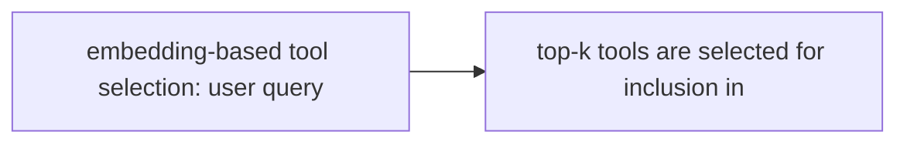

# Tool Selection and Routing

**One-Line Summary**: Tool selection is the process by which an agent examines available tools, matches them against the user's intent, and picks the right one to invoke — a decision that becomes harder as the tool catalog grows.

**Prerequisites**: Function calling, prompt engineering, embedding similarity basics

## What Is Tool Selection and Routing?

Think of a skilled craftsperson standing in front of a large workbench with dozens of tools. When asked to join two pieces of wood, they instinctively reach for the right tool — wood glue for a permanent bond, clamps for holding, a drill for screws. They never consider the soldering iron because their understanding of each tool's purpose lets them filter instantly. Tool selection for AI agents works the same way: the agent reads tool descriptions, understands the user's request, and selects the appropriate tool(s) to accomplish the task.

Tool selection is the decision-making layer between understanding intent and executing action. When an LLM receives a user request alongside a set of tool definitions (name, description, parameters), it must determine: (1) Does this request require a tool at all, or can it be answered directly? (2) If a tool is needed, which one? (3) What arguments should be passed? For small tool sets (3-5 tools), this is straightforward. For large catalogs (50+ tools), it becomes a significant engineering challenge.

The quality of tool selection directly determines agent reliability. A perfectly implemented tool is useless if the agent never selects it, and a well-formed request fails catastrophically if routed to the wrong tool. This makes tool selection one of the most practically important problems in agent engineering — and one where the details of tool descriptions, organization, and routing strategies matter enormously.

## How It Works

### Tool Descriptions as LLM Documentation

The tool description is the single most important factor in selection accuracy. The LLM reads the name, description, and parameter schema to decide relevance. Effective descriptions follow specific patterns: they state what the tool does (not how), when to use it, and when NOT to use it. For example, a search tool description might read: "Search the knowledge base for factual information. Use this when the user asks questions about company policies, product specs, or historical data. Do NOT use this for general conversation or opinions."

### Semantic Matching

The model performs implicit semantic matching between the user's request and available tool descriptions. This is not keyword matching — the model understands that "What's the weather like?" maps to a `get_weather` tool even though the word "weather" might not appear in the query (e.g., "Should I bring an umbrella today?"). The model leverages its training to understand functional equivalence between natural language intent and tool capabilities.

### The "Too Many Tools" Problem

LLM performance on tool selection degrades as the number of available tools increases. Research from the Berkeley Function-Calling Leaderboard shows accuracy dropping from ~90% with 5 tools to ~70% with 20+ tools. Root causes include: increased token cost for schemas, confusion between similar tools, and the model's tendency to pick the first plausible match rather than the best one.

### Mitigation Strategies

Several approaches address the scaling problem:

- **Tool groups / namespaces**: Organize tools into categories (e.g., "email tools," "calendar tools"). The agent first selects a group, then a specific tool within it — a two-step hierarchical selection.
- **Dynamic tool loading**: Use embedding similarity to pre-filter tools based on the user query. Only the top-k most relevant tools (typically 5-10) are included in the prompt. This is the approach used by systems like LangChain's tool retrieval.
- **Few-shot examples**: Include 2-3 examples in the system prompt showing correct tool selection for representative queries. This anchors the model's decision-making.
- **Routing agents**: A lightweight, fast model (e.g., GPT-4o-mini or Haiku) first classifies the request and selects relevant tools, then a more capable model handles the actual invocation.
- **Tool deduplication**: Remove overlapping tools that confuse the model. If two tools do similar things, either merge them or add explicit disambiguation in descriptions.

## Why It Matters

### Agent Reliability at Scale

Real-world agents often need access to dozens or hundreds of tools — CRM operations, database queries, email, calendar, file management, code execution, web search, and domain-specific APIs. Without effective tool selection, these agents become unreliable as the catalog grows, selecting wrong tools or hallucinating nonexistent ones.

### Cost and Latency

Every tool schema included in the prompt costs input tokens. Twenty tools with detailed schemas can consume 5,000-8,000 tokens per request. Dynamic tool selection via pre-filtering reduces this cost dramatically while maintaining accuracy, making it essential for production systems with usage-based pricing.

### User Experience

Incorrect tool selection is one of the most visible failure modes for end users. When an agent calls the wrong API or uses the wrong tool, the error is obvious and trust-damaging. Good tool routing is invisible when it works but immediately apparent when it fails.

## Key Technical Details

- **Description length sweet spot**: Tool descriptions between 50-150 words perform best. Shorter descriptions lack disambiguation cues; longer ones waste tokens and can confuse the model.
- **Negative examples in descriptions**: Adding "Do NOT use this tool for X" is surprisingly effective at reducing misrouting, especially for tools with overlapping functionality.
- **Embedding-based pre-filtering**: Convert tool descriptions to embeddings, compute cosine similarity with the user query embedding, and include only tools above a threshold (typically top 5-10). OpenAI embeddings or sentence-transformers work well for this.
- **Tool name matters**: Models weight the function name heavily. A tool named `search_knowledge_base` is selected more accurately than one named `kb_query_v2`.
- **Parallel selection**: When multiple tools are needed, models can select several in one turn. Accuracy of multi-tool selection is lower than single-tool selection and requires explicit prompting.
- **Fallback behavior**: Always include a mechanism for the agent to say "I don't have a suitable tool for this" rather than forcing it to pick from an inadequate set.
- **A/B testing tool descriptions**: Small changes in description wording can cause 10-20% swings in selection accuracy. Treat descriptions as code that requires testing.

## Common Misconceptions

- **"Just add all tools to the prompt"**: This fails at scale. Beyond 15-20 tools, accuracy drops, tokens costs balloon, and latency increases. Pre-filtering or hierarchical selection is necessary for large catalogs.
- **"Tool names don't matter if descriptions are good"**: Models use the function name as a strong signal. Poorly named tools (e.g., `util_7`, `process_data`) are consistently misused regardless of description quality.
- **"The model will always pick the most specific tool"**: Models often exhibit a bias toward general-purpose tools. A generic `search` tool may be selected over a more appropriate `search_product_catalog` tool unless descriptions explicitly differentiate them.
- **"Few-shot examples are not needed for tool selection"**: Even capable models like GPT-4 and Claude Opus benefit from 2-3 tool selection examples in the system prompt, especially for domain-specific or ambiguous cases.

## Connections to Other Concepts

- `function-calling.md` — Tool selection is the decision layer that precedes function calling; function calling is the execution mechanism.
- `model-context-protocol.md` — MCP standardizes tool discovery, providing a consistent way to expose tool descriptions for selection.
- `tool-chaining.md` — After selecting individual tools, the agent may need to chain them; selection quality at each step in the chain compounds.
- `dynamic-tool-creation.md` — When no existing tool matches, the agent may create a new one rather than misusing an existing tool.
- `api-integration.md` — API endpoints are a primary source of tools; good API documentation translates into good tool descriptions.

## Further Reading

- Patil et al., "Gorilla: Large Language Model Connected with Massive APIs" (2023) — Investigates LLM accuracy when selecting from large API catalogs and proposes retrieval-augmented approaches.
- Qin et al., "ToolLLM: Facilitating Large Language Models to Master 16000+ Real-world APIs" (2023) — Addresses tool selection at massive scale using a decision tree approach.
- Hao et al., "ToolkenGPT: Augmenting Frozen Language Models with Massive Tools" (2024) — Proposes representing tools as tokens for efficient selection in large catalogs.
- LangChain Documentation, "Tool Retrieval" (2024) — Practical guide to implementing embedding-based tool pre-filtering for agent applications.
- Berkeley Function-Calling Leaderboard (2024) — Empirical comparison of tool selection accuracy across models, tool counts, and description styles.
