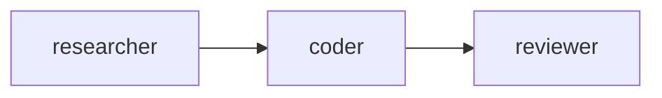

# Agent Delegation

**One-Line Summary**: Agent delegation is the process by which a manager agent decomposes a complex task into subtasks, assigns each to a specialist sub-agent with a defined scope, collects their results, and synthesizes a final output.

**Prerequisites**: Multi-agent architectures, function calling, prompt engineering, task decomposition

## What Is Agent Delegation?

Imagine a senior architect receiving a commission to design a hospital. They do not design every detail themselves. Instead, they decompose the project: structural engineering goes to a structural specialist, HVAC to a mechanical engineer, electrical systems to an electrician, and interior design to a specialist. The architect writes a clear brief for each — scope, constraints, requirements, interfaces — then reviews and integrates their work. If the HVAC design conflicts with the structural plan, the architect mediates. This is agent delegation: the art of breaking work apart, specifying sub-tasks precisely, and reassembling the results.

In AI agent systems, delegation occurs when a manager agent (sometimes called an orchestrator, supervisor, or planner) receives a task too complex or broad for a single agent and spawns or routes to specialist sub-agents. Each sub-agent receives a focused task specification, operates within a defined scope (its own system prompt, tools, and context), and returns a result. The manager then evaluates the results, resolves conflicts, and produces the final output.

Delegation is the primary mechanism by which agent systems scale to handle complex, multi-domain tasks. A single agent trying to research a topic, write code, design a UI, and test the result will perform worse than four specialists each handling one domain — provided the delegation is well-specified. The quality of delegation — how clearly the manager defines sub-tasks, how well it scopes each agent's authority, and how effectively it synthesizes results — is often the bottleneck in multi-agent system performance.

## How It Works

### Task Decomposition

The manager agent analyzes the incoming task and breaks it into discrete, assignable subtasks. Effective decomposition follows principles:

- **Independence**: Subtasks should be as independent as possible, minimizing dependencies between sub-agents.
- **Completeness**: The subtasks should collectively cover the entire original task with no gaps.
- **Appropriate granularity**: Too coarse and the sub-agent faces the same complexity as the original; too fine and the coordination overhead exceeds the delegation benefit.

The manager typically produces a structured plan: a list of subtasks with descriptions, assigned agent types, dependencies, and expected outputs.

### Sub-Agent Specification

Each sub-agent receives a specification that defines its operating context:

- **System prompt**: Defines the agent's role, expertise, and behavioral guidelines (e.g., "You are a senior Python developer. Write clean, well-tested code.").
- **Task description**: The specific work to be done, including success criteria.
- **Context**: Relevant information from the original task or from other sub-agents' outputs.
- **Tools**: The subset of tools this agent needs (a code agent gets file operations and code execution; a research agent gets web search).
- **Constraints**: Boundaries on scope ("Do not modify the database schema"), time, or token budget.

### Execution Patterns

**Sequential delegation**: Sub-agents run one after another, each receiving the previous one's output. Used when subtasks have dependencies. A research agent gathers information, then a writing agent uses it to draft content.

**Parallel delegation**: Independent sub-agents run simultaneously. The manager fans out tasks and collects all results. A manager analyzing a company might send market analysis, financial analysis, and competitive analysis to three agents simultaneously.

**Recursive delegation**: A sub-agent can itself be a manager, further decomposing its subtask and delegating to its own sub-agents. This creates multi-level hierarchies. A "build feature X" task delegates to a planning agent, which delegates to design and implementation agents, which may further delegate.

### Result Synthesis

The manager collects sub-agent outputs and combines them into a coherent result. This may involve:
- Concatenating outputs (simple assembly)
- Resolving contradictions between agents
- Filling gaps where subtasks did not fully cover the original request
- Quality checking each output against the original requirements
- Requesting revisions from sub-agents whose output is insufficient

## Why It Matters

### Handling Complexity Beyond Single-Agent Limits

Real-world tasks — building software, conducting research, managing projects — involve multiple domains and skills. No single system prompt can make one agent expert in everything. Delegation allows the system to apply specialized expertise where needed while maintaining coherent overall execution.

### Context Window Management

A single agent tackling a large task accumulates context rapidly: research results, code snippets, intermediate outputs. This can exhaust the context window. Delegation distributes context across sub-agents, each with a fresh, focused context window. The manager only needs to hold the high-level plan and synthesis, not every detail.

### Quality Through Specialization

Agents with narrow, well-defined roles produce better output than generalist agents. A "code reviewer" agent with review-specific instructions and examples catches more issues than a general agent asked to "also review the code." Delegation enables this specialization by creating distinct agent instances with role-specific configurations.

## Key Technical Details

- **Spawning vs. routing**: Some systems spawn new agent instances for each subtask (fresh context, full isolation). Others route to pre-configured agent types (faster startup, shared configuration). Spawning is more flexible; routing is more efficient.
- **Token budget allocation**: The manager should allocate token budgets to sub-agents based on subtask complexity. A simple lookup task gets a small budget; a complex analysis task gets more. This prevents sub-agents from rambling or the overall system from exceeding cost limits.
- **Error propagation**: When a sub-agent fails, the manager must decide: retry with adjusted instructions, assign to a different agent, skip the subtask, or escalate to the user. Robust delegation includes failure handling at the manager level.
- **Delegation depth limits**: Recursive delegation should have a maximum depth (typically 2-3 levels). Deeper hierarchies increase latency, cost, and the risk of goal drift (each level slightly misinterpreting the original task).
- **Sub-agent result format**: Specifying the expected output format for sub-agents (structured JSON, markdown template, specific sections) makes synthesis easier and reduces manager reasoning load.
- **Tool scoping**: Sub-agents should receive only the tools relevant to their task. A research agent does not need code execution; a coding agent does not need email tools. Reduced tool sets improve selection accuracy and reduce risk.
- **Observation and monitoring**: The manager should be able to observe sub-agent progress for long-running tasks. Streaming intermediate outputs or progress updates enables the manager to intervene if a sub-agent goes off track.

## Common Misconceptions

- **"The manager agent just needs to split the task"**: Task splitting is the easy part. The hard part is writing clear specifications for each sub-agent, providing the right context, handling failures, and synthesizing potentially contradictory results. The quality of the delegation specification is often more important than the quality of individual sub-agents.
- **"Sub-agents automatically know their scope"**: Sub-agents only know what the manager tells them. Without explicit scope boundaries, a code agent might try to make design decisions, or a research agent might start implementing. Clear scope definition in the system prompt and task description is essential.
- **"Delegation always improves quality"**: Delegation adds coordination overhead. For simple tasks, a single agent outperforms a delegated system because there is no information loss at handoff boundaries and no synthesis step. Delegation is beneficial only when task complexity justifies the overhead.
- **"Recursive delegation is always better than flat delegation"**: Deep hierarchies multiply communication overhead and goal drift. Flat delegation (one manager, multiple workers) is often more reliable for tasks that can be decomposed into 3-7 parallel subtasks.
- **"All sub-agents should use the most capable model"**: Using a powerful model (GPT-4, Claude Opus) for simple subtasks (data formatting, lookups) wastes money. Match model capability to subtask complexity: use fast, cheap models for simple tasks and capable models for complex reasoning.

## Connections to Other Concepts

- `multi-agent-architectures.md` — Delegation is the core mechanism of the hierarchy architecture pattern.
- `hierarchical-agent-systems.md` — Explores multi-level delegation structures with recursive decomposition and escalation.
- `role-based-specialization.md` — Sub-agents in delegation systems are typically role-specialized, with each agent configured for a specific domain.
- `inter-agent-communication.md` — Delegation requires structured communication between manager and workers: task specifications, progress updates, and result reporting.
- `tool-chaining.md` — Delegation can be seen as a meta-level tool chain where each "tool" is an agent that performs complex multi-step work.

## Further Reading

- Wu et al., "AutoGen: Enabling Next-Gen LLM Applications via Multi-Agent Conversation" (2023) — Framework supporting flexible agent delegation patterns including nested conversations and group chat.
- Hong et al., "MetaGPT: Meta Programming for a Multi-Agent Collaborative Framework" (2023) — Demonstrates delegation in a software development context where a product manager agent delegates to architect, engineer, and QA agents.
- Anthropic, "Building Effective Agents" (2024) — Guidance on orchestrator-workers pattern, including when delegation is worth the added complexity.
- OpenAI, "Orchestrating Agents" (2025) — Practical patterns for manager-worker delegation, including task specification templates and result synthesis strategies.
- Khattab et al., "DSPy: Compiling Declarative Language Model Calls into Self-Improving Pipelines" (2024) — Demonstrates how delegation can be formalized as composable modules with optimizable interfaces.
