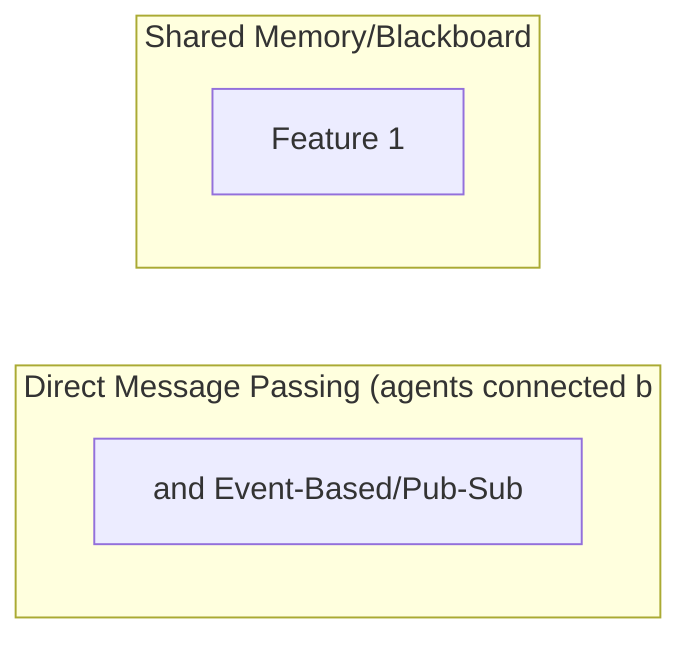

# Inter-Agent Communication

**One-Line Summary**: Inter-agent communication defines how agents in a multi-agent system exchange information — through direct message passing, shared memory (blackboard), or event-based (pub/sub) patterns — with protocol design determining whether agents use structured formats or natural language.

**Prerequisites**: Multi-agent architectures, agent delegation, distributed systems basics, message queue concepts

## What Is Inter-Agent Communication?

Consider three different ways a team might coordinate. In a meeting (direct message passing), people talk directly to each other, taking turns and responding to what was just said. On a shared whiteboard (blackboard/shared memory), anyone can write information and anyone can read it — there is no direct conversation, just a shared workspace. Through a notification system (event-based/pub/sub), team members subscribe to updates they care about and get notified when relevant information appears, without knowing who produced it. Each method works, but each suits different situations.

Inter-agent communication is the mechanism by which agents in a multi-agent system share information, coordinate actions, and collaborate toward shared goals. The choice of communication pattern fundamentally shapes how the system behaves: direct messaging creates tight coupling but precise coordination; shared memory enables flexible collaboration but requires conflict management; event-based communication supports loose coupling but makes it harder to guarantee all agents stay synchronized.

Unlike human communication, which naturally handles ambiguity and context-switching, inter-agent communication must be explicitly designed. Agents do not share an implicit understanding of context — every piece of information an agent needs must be explicitly communicated. The protocol design (what format messages take, what information they contain, how conversations are structured) is as important as the agents themselves, because poor communication design is the most common cause of multi-agent system failures.

## How It Works

### Direct Message Passing

Agents communicate by sending messages directly to specific other agents. This is the most common pattern in current multi-agent frameworks:

- **Conversational**: Agents exchange natural language messages in a turn-based conversation. AutoGen's multi-agent chat is a prime example — agents take turns speaking in a group chat or direct message thread.
- **Request-response**: One agent sends a structured request (task specification), and the receiving agent returns a structured response (result). This is the delegation pattern.
- **Streaming**: One agent streams its output to another agent in real-time, enabling the receiver to begin processing before the sender finishes.

**Advantages**: Clear communication channels, easy to trace information flow, natural fit for delegation patterns. **Disadvantages**: Requires agents to know about each other (tight coupling), does not scale well to many-to-many communication.

### Shared Memory (Blackboard)

All agents read from and write to a shared data structure:

- **Global state store**: A key-value store, database, or document that all agents can access. Agents write their findings and read others' contributions.
- **Shared workspace**: A file system or code repository that multiple agents modify. Changes by one agent are visible to all others.
- **Structured blackboard**: A typed data structure with sections for different kinds of information (facts, hypotheses, plans, status), inspired by classic AI blackboard architectures.

**Advantages**: Decoupled communication (agents do not need to know about each other), naturally supports asynchronous collaboration, flexible. **Disadvantages**: Concurrent write conflicts, no guaranteed read order, harder to trace which agent contributed what.

### Event-Based (Pub/Sub)

Agents publish events to named channels, and other agents subscribe to channels they care about:

- **Topic-based**: Agents subscribe to topics ("code-changes", "test-results", "user-feedback"). When an agent publishes to a topic, all subscribers receive the message.
- **Event-driven**: Agents react to events rather than being explicitly invoked. A test failure event triggers the debugger agent; a code commit event triggers the reviewer agent.

**Advantages**: Very loose coupling, scales to many agents, natural for reactive workflows. **Disadvantages**: Harder to reason about system behavior (who reacts to what), message ordering challenges, debugging is difficult.

### Structured vs. Natural Language Communication

A fundamental design choice is the format of inter-agent messages:

**Natural language**: Agents communicate in prose, as they would with a human. This is flexible and easy to implement but introduces ambiguity. Agent A's summary might omit details Agent B needs, or use terms Agent B interprets differently.

**Structured format**: Agents exchange typed, schema-validated messages (JSON objects with defined fields). More reliable and machine-processable, but requires upfront schema design and reduces the flexibility of what agents can express.

**Hybrid**: Structured metadata (task type, priority, status) combined with natural language content (analysis, reasoning, explanations). This is the most practical approach for most systems.

## Why It Matters

### Communication Failures Dominate Multi-Agent Errors

Studies of multi-agent system failures consistently show that most errors stem from communication issues, not individual agent failures: agents misunderstanding task specifications, missing critical context, working with stale information, or producing outputs in formats other agents cannot consume. Getting communication right is the single highest-leverage improvement for multi-agent systems.

### Scalability Requirements

As multi-agent systems grow from 2-3 agents to 10+ agents, communication becomes the binding constraint. Direct messaging creates O(n^2) potential communication channels. Shared memory creates contention. The communication architecture must scale with the number of agents while maintaining coherence.

### Debugging and Observability

When a multi-agent system produces incorrect output, diagnosing the problem requires tracing information flow between agents. Well-designed communication protocols with logging, message IDs, and timestamps make debugging possible. Poorly designed communication (unstructured natural language with no logging) makes debugging nearly impossible.

## Key Technical Details

- **Message schemas**: Define explicit schemas for inter-agent messages. At minimum: sender ID, recipient ID (or topic), message type (task, result, question, escalation), timestamp, and payload. This structure enables routing, logging, and automated processing.
- **Context passing**: The most common communication failure is insufficient context. When Agent A delegates to Agent B, it must include not just the task but the relevant background: why this task matters, what constraints apply, what related work has been done. Err on the side of over-communicating.
- **Conversation memory**: In turn-based communication, the conversation history grows with each exchange. Long agent-to-agent conversations face the same context window pressures as human-to-agent conversations. Implement summarization or sliding window approaches for long exchanges.
- **Serialization format**: JSON is the dominant serialization format for inter-agent messages due to LLM affinity with JSON. Protocol Buffers or MessagePack offer efficiency advantages for high-throughput systems but are less LLM-friendly.
- **Ordering guarantees**: In event-based systems, messages may arrive out of order. If ordering matters (and it usually does), use sequence numbers or vector clocks, or serialize communication through a single message broker.
- **Dead letter queues**: Messages that cannot be delivered (agent crashed, unknown recipient) should be captured in a dead letter queue for debugging rather than silently dropped.
- **Bandwidth management**: Agents can be verbose. Establishing maximum message sizes and encouraging concise communication (especially for status updates and intermediate results) keeps the system efficient.

## Common Misconceptions

- **"Natural language communication between agents is always best because LLMs speak natural language"**: Natural language introduces ambiguity that compounds across multiple exchanges. Structured communication for operational messages (tasks, results, status) combined with natural language for reasoning and analysis is more reliable than pure natural language.
- **"Agents can infer context from previous messages"**: LLMs have no memory beyond their context window. If critical information was communicated 20 messages ago and has scrolled out of context, it is effectively forgotten. Important context must be re-communicated or stored in shared state.
- **"More communication between agents is better"**: Excessive communication wastes tokens and clutters context. Define what information needs to flow between which agents and communicate only that. Status updates should be periodic, not continuous.
- **"Shared memory eliminates coordination problems"**: Shared memory introduces new problems: concurrent modification conflicts, stale reads, and the challenge of agents knowing when to re-read the shared state. It simplifies some coordination patterns but does not eliminate coordination complexity.
- **"Event-based systems are always more scalable"**: Event systems scale in terms of loose coupling but can become unmanageable in terms of complexity. When 15 agents each subscribe to 5 topics, understanding the system's behavior requires tracing 75 potential event flows.

## Connections to Other Concepts

- `multi-agent-architectures.md` — Each architecture pattern (pipeline, debate, hierarchy, swarm, blackboard) implies a different communication pattern.
- `agent-delegation.md` — Delegation is a specific communication pattern: structured task specification flowing down, structured results flowing up.
- `agent-debate-and-verification.md` — Debate requires turn-based direct communication with specific protocols for proposals, critiques, and rebuttals.
- `hierarchical-agent-systems.md` — Hierarchies use structured communication channels between levels, with different message types for different directions (instructions down, reports up, escalations up).
- `swarm-and-emergent-behavior.md` — Swarm communication is typically indirect (stigmergy, shared environment) rather than direct messaging.

## Further Reading

- Wu et al., "AutoGen: Enabling Next-Gen LLM Applications via Multi-Agent Conversation" (2023) — Defines conversational patterns for multi-agent communication, including two-agent chat, group chat, and nested conversations.
- Park et al., "Generative Agents: Interactive Simulacra of Human Behavior" (2023) — Implements agent communication through a shared environment and direct speech, demonstrating emergent social behaviors from communication design.
- Li et al., "CAMEL: Communicative Agents for 'Mind' Exploration of Large Language Model Society" (2023) — Studies communication protocols between role-playing agents, including inception prompting for structured exchanges.
- Qian et al., "ChatDev: Communicative Agents for Software Development" (2023) — Implements structured chat chains between agents in specific phases (design, coding, testing), with defined communication protocols per phase.
- Marro et al., "A Scalable Communication Protocol for Networks of Large Language Models" (2024) — Proposes formal communication protocols optimized for LLM-to-LLM information exchange, addressing efficiency and reliability.
