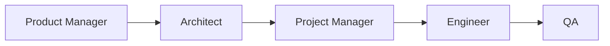

# Role-Based Specialization

**One-Line Summary**: Role-based specialization assigns distinct personas, expertise domains, and behavioral guidelines to different agents in a multi-agent system, improving output quality through focused competence — just as a team of specialists outperforms a team of generalists on complex projects.

**Prerequisites**: Multi-agent architectures, agent delegation, prompt engineering, system prompt design

## What Is Role-Based Specialization?

Consider a film production crew. The director, cinematographer, sound engineer, editor, and production designer each bring deep expertise to their domain. The director does not operate the camera; the editor does not mix sound. Each role has defined responsibilities, specialized knowledge, and clear interfaces with other roles. The film is better because each person focuses on what they do best, and the boundaries between roles prevent them from interfering with each other's work.

Role-based specialization in multi-agent systems works identically. Each agent is configured with a specific role — coder, researcher, reviewer, planner, designer — through its system prompt, available tools, and behavioral guidelines. A "senior Python developer" agent writes better code than a generic agent because its system prompt narrows its focus, provides domain-specific instructions, and sets expectations about output format and quality standards. The role acts as both an expertise amplifier and a scope constraint.

This approach exploits a well-documented property of LLMs: they perform better when given a specific persona and domain context than when asked to be generalists. A model prompted as "an expert security researcher looking for vulnerabilities" finds more security issues than the same model prompted generically. Specialization through prompting is not as deep as training a separate model, but it is surprisingly effective and requires zero additional training — only prompt engineering.

## How It Works

### Role Definition

A role specification typically includes:

- **Identity and expertise**: "You are a senior backend engineer with 10 years of experience in distributed systems and Python."
- **Responsibilities**: "Your job is to implement the backend API endpoints according to the provided specifications."
- **Quality standards**: "All code must include type hints, docstrings, and error handling. Follow PEP 8."
- **Boundaries**: "Do not modify the frontend code. Do not make database schema changes without approval from the architect agent."
- **Communication style**: "Report progress in structured JSON. Flag blockers immediately."
- **Tools**: The agent receives only tools relevant to its role. A researcher gets web search; a coder gets file operations and code execution.

### Common Role Archetypes

**Planner/Architect**: Analyzes tasks, creates plans, decomposes work. Does not execute — only directs. Tools: note-taking, task management.

**Researcher**: Gathers information from external sources. Tools: web search, document retrieval, knowledge base queries. Outputs structured findings.

**Coder/Developer**: Writes, modifies, and debugs code. Tools: file operations, code execution, version control. Outputs working code with tests.

**Reviewer/QA**: Evaluates others' outputs for quality, correctness, and standards compliance. Tools: read-only file access, testing frameworks. Outputs critiques and approval/rejection decisions.

**Writer/Communicator**: Produces user-facing content — documentation, reports, emails, summaries. Tools: document editing, formatting. Outputs polished text.

**Domain Expert**: Specialized knowledge in a specific field (legal, medical, financial). Provides domain-specific analysis and recommendations. Tools: domain-specific databases and references.

### Specialization Through System Prompts

The system prompt is the primary mechanism for role specialization. Effective role prompts follow a pattern:

1. **Who you are**: Establish expertise and persona.
2. **What you do**: Define responsibilities concretely.
3. **How you work**: Specify methodology, quality standards, and output format.
4. **What you do NOT do**: Explicitly scope boundaries.
5. **Examples**: 2-3 examples of good role performance for the specific agent type.

### Dynamic Role Assignment

In some systems, roles are not hardcoded but assigned dynamically based on the task. A manager agent analyzes the incoming request and determines which roles are needed, then configures sub-agents accordingly. This allows the system to adapt its team composition to each unique task rather than maintaining a fixed roster.

## Why It Matters

### Quality Through Focus

An agent with a narrow, well-defined role produces higher-quality output within that domain than a generalist agent. This is empirically demonstrated: MetaGPT's role-specialized agents (product manager, architect, engineer, QA) produce higher-quality software than a single agent handling all roles. The specialization effect comes from both focused attention and domain-appropriate instructions.

### Reduced Error and Scope Creep

Without role boundaries, agents tend toward scope creep — a coding agent might start making design decisions, or a research agent might start writing conclusions. Role boundaries prevent this by explicitly constraining what each agent should and should not do. This containment reduces errors caused by agents operating outside their competence.

### Modular Improvement

When agents have distinct roles, you can improve the system by optimizing individual roles without affecting others. A better reviewer prompt does not require changing the coder prompt. You can A/B test role definitions, use different models for different roles (a fast model for routine coding, a powerful model for architectural decisions), and upgrade roles independently.

## Key Technical Details

- **Prompt length for roles**: Effective role prompts are typically 200-500 tokens. Shorter prompts underspecify; longer prompts dilute focus. Include the most important behavioral guidance first, as LLMs weight early context more heavily.
- **Model selection per role**: Match model capability to role complexity. Simple roles (data formatting, basic search) can use smaller, cheaper models (GPT-4o-mini, Haiku). Complex roles (architectural decisions, nuanced analysis) benefit from larger models (GPT-4, Opus). This mixed-model strategy reduces cost by 40-60% compared to using the largest model for all roles.
- **Tool scoping by role**: A researcher with access to code execution tools may waste time writing scripts instead of searching. A coder with web search may spend time browsing instead of coding. Restricting tools to role-relevant ones keeps agents focused.
- **Role vs. agent instance**: A role is a configuration template; an agent is a running instance of that template. Multiple instances of the same role can exist (e.g., three parallel researcher agents investigating different subtopics).
- **Persona stability**: LLMs can "drift" from their assigned persona during long interactions. Reinforcing the role in each message or using periodic role-reminder injections helps maintain consistency.
- **Inter-role interfaces**: Define what each role produces and what each role consumes. A researcher produces "structured findings with sources"; a writer consumes "research findings" and produces "draft document." Clear interfaces reduce integration friction.
- **Over-specialization risk**: Agents specialized too narrowly may fail on tasks slightly outside their defined scope. A "Python backend developer" agent may refuse to write a simple bash script that is clearly within a developer's capabilities. Balance specificity with reasonable flexibility.

## Common Misconceptions

- **"Role prompts need to be elaborate and detailed"**: Some of the most effective role prompts are concise. "You are a code reviewer. Find bugs, security issues, and style violations. Be specific and cite line numbers." outperforms paragraph-long role descriptions that the model struggles to follow entirely.
- **"Different roles need different models"**: While model matching is an optimization, all roles can use the same model. The role prompt alone creates meaningful specialization. Different models are a cost optimization, not a functional requirement.
- **"Roles should mirror human job titles exactly"**: Agent roles should be defined by what the system needs, not by human organizational charts. A "fact-checker" role (verify claims against sources) may be more useful than a "researcher" role if the primary need is verification rather than discovery.
- **"More specialized roles always produce better results"**: Splitting work across too many narrow roles increases coordination overhead and handoff errors. A "write code" + "review code" split is valuable; a "write functions" + "write classes" + "write imports" split is counterproductive.
- **"Role-playing is just a prompting trick with no real effect"**: Research consistently shows that role-specific prompting improves output quality by 10-30% on domain-specific tasks. The effect is real and measurable, likely because it activates relevant knowledge patterns in the model's training data.

## Connections to Other Concepts

- `agent-delegation.md` — Delegation assigns tasks to role-specialized agents. The quality of delegation depends on matching subtasks to the right roles.
- `multi-agent-architectures.md` — Roles are the building blocks of all multi-agent architectures. Pipeline, hierarchy, and debate patterns all rely on agents with distinct roles.
- `agent-debate-and-verification.md` — The proposer and critic in debate are specialized roles, each with opposing objectives.
- `hierarchical-agent-systems.md` — Different levels in a hierarchy typically have different roles: strategist at the top, tactical planner in the middle, executor at the bottom.
- `inter-agent-communication.md` — Role definitions include communication protocols: what format to use, what information to share, and when to escalate.

## Further Reading

- Hong et al., "MetaGPT: Meta Programming for a Multi-Agent Collaborative Framework" (2023) — Demonstrates role-specialized agents (product manager, architect, project manager, engineer, QA) collaborating to produce software, with significant quality improvements over single-agent approaches.
- Li et al., "CAMEL: Communicative Agents for 'Mind' Exploration of Large Language Model Society" (2023) — Systematic study of role-playing between LLM agents, showing how different role assignments affect collaboration dynamics and output quality.
- Xu et al., "ExpertPrompting: Instructing Large Language Models to be Distinguished Experts" (2023) — Research showing that expert role prompts significantly improve LLM performance across diverse tasks.
- Chen et al., "AgentVerse: Facilitating Multi-Agent Collaboration and Exploring Emergent Behaviors" (2023) — Framework for dynamically assembling role-specialized agent teams based on task requirements.
- Salewski et al., "In-Context Impersonation Reveals Large Language Models' Strengths and Biases" (2023) — Studies how role/persona prompting affects LLM capabilities and identifies which roles produce the largest performance gains.
