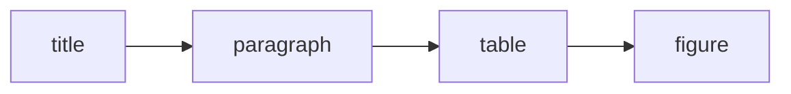
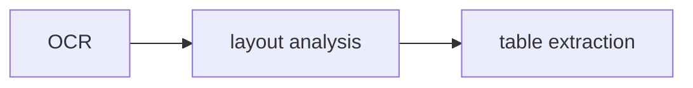

# Document Understanding

**One-Line Summary**: Document understanding enables agents to extract structured, actionable information from complex document formats -- PDFs, tables, images, spreadsheets, and scanned documents -- through multi-modal parsing, layout analysis, and structured data extraction.

**Prerequisites**: Multi-modal LLMs, optical character recognition (OCR), retrieval-augmented generation, data extraction pipelines

## What Is Document Understanding?

Imagine handing a stack of documents to a new employee: a PDF contract with tables and footnotes, a scanned invoice, a spreadsheet with merged cells, and a technical diagram with annotations. A competent employee understands not just the text but the structure -- they know that a number in the "Total" row of a table means something different from the same number in a footnote. They can read the diagram, extract data from the spreadsheet, and parse the legal clauses of the contract. Document understanding gives AI agents this same structural literacy.

Most RAG systems treat documents as flat text. They run a PDF through a text extractor, chop the output into chunks, embed them, and call it done. This works for simple text-heavy documents but fails catastrophically for documents where layout, tables, images, and formatting carry meaning. A financial report with a table showing quarterly revenue becomes garbled text when naively extracted. A scanned form with checkboxes loses its structure entirely.

Document understanding is the discipline of processing complex documents while preserving their structure and semantics. It encompasses OCR for scanned documents, layout analysis for identifying headers, paragraphs, tables, and figures, table extraction for converting visual tables into structured data, chart and diagram interpretation, and multi-modal processing that understands images and text together. The output is not just text but structured data that agents can reason over effectively.

## How It Works

### Layout Analysis and Segmentation

Before extracting content, the system must understand the document's visual structure. Layout analysis models (like LayoutLMv3, DiT, or YOLO-based detectors) identify regions of the page and classify them as titles, paragraphs, tables, figures, headers, footers, or sidebars. This segmentation is critical because different region types require different extraction strategies. A paragraph gets standard text extraction; a table needs structured parsing; a figure needs image understanding. Modern layout models achieve 90-95% accuracy on standard benchmarks.

### OCR and Text Extraction

For born-digital PDFs, text can be extracted directly from the PDF structure. For scanned documents, images, or photographed pages, OCR converts visual text to machine-readable characters. Modern OCR engines (Tesseract, Google Cloud Vision, AWS Textract, Azure Document Intelligence) achieve 95-99% character accuracy on clean documents but degrade on poor-quality scans, unusual fonts, or handwriting. Post-OCR correction using LLMs can fix common OCR errors by leveraging linguistic context.

### Table Extraction

Tables are one of the most challenging document elements. A table that looks simple to a human -- rows, columns, headers, merged cells -- is complex to extract programmatically. Table extraction involves detecting table boundaries, identifying row and column structure, recognizing headers and data cells, handling merged cells and multi-line entries, and converting the result into a structured format (CSV, JSON, or markdown). Specialized models (Table Transformer, TATR) detect tables and parse their structure. For complex tables, LLMs can interpret table images directly, especially vision-language models.

### Multi-Modal Document Processing

Modern multi-modal LLMs (GPT-4o, Claude with vision, Gemini) can process document pages as images, understanding text, layout, tables, charts, and figures simultaneously. This approach bypasses the need for separate OCR, layout analysis, and table extraction pipelines. The LLM "sees" the document as a human would and can answer questions about it directly. While this is slower and more expensive per page, it handles complex layouts, unusual formats, and mixed content that pipeline-based approaches struggle with.

## Why It Matters

### Unlocking Enterprise Knowledge

The majority of enterprise knowledge is locked in documents: contracts, reports, invoices, manuals, presentations, and emails with attachments. IDC estimates that 80% of enterprise data is unstructured. Without document understanding, RAG systems can only access the easy fraction (clean text documents), leaving the most valuable and complex documents inaccessible.

### Accurate Data Extraction

Errors in document parsing propagate through the entire RAG pipeline. A garbled table produces wrong retrieved context, which produces wrong answers. For financial documents, medical records, or legal contracts, extraction errors can have serious consequences. High-fidelity document understanding ensures the data entering the retrieval system is accurate and structured.

### Supporting Complex Queries

Users ask questions that require understanding document structure: "What was the year-over-year revenue change from the table on page 12?" "Does clause 7.3 of the contract conflict with clause 4.1?" "What does the trend in Figure 3 suggest?" Only systems with proper document understanding can answer these questions, because the answers depend on table parsing, cross-reference resolution, and chart interpretation.

## Key Technical Details

- **PDF parsing libraries**: PyMuPDF (fitz), pdfplumber, and PyPDF2 extract text from born-digital PDFs. pdfplumber is particularly strong at preserving table structure. For complex PDFs, combining library extraction with LLM-based correction yields the best results.
- **Chunking strategies for structured documents**: Naive fixed-size chunking destroys document structure. Structure-aware chunking respects document sections, keeps tables intact, associates figures with their captions, and maintains header hierarchy. Each chunk should include its structural context (e.g., "Section 3.2 > Table 4 > Row: Q3 Revenue").
- **Image extraction and captioning**: Figures and charts embedded in documents are extracted as images and processed separately. Vision models generate descriptive captions or structured data (e.g., extracting data points from a bar chart). These captions are indexed alongside the text for retrieval.
- **Metadata preservation**: Document understanding preserves metadata: page numbers, section titles, document title, author, date, and the position of each element. This metadata is critical for source citation and for answering questions that reference specific locations in a document.
- **Quality scoring**: Each extracted element receives a quality score based on OCR confidence, layout detection confidence, and structural consistency. Low-quality extractions are flagged for human review or excluded from the retrieval index.
- **Batch vs real-time processing**: Document understanding is computationally expensive. Production systems typically process documents in batch during ingestion, storing the extracted structured data. Real-time processing (for newly uploaded documents) uses a separate fast pipeline, possibly with lower fidelity.
- **Format-specific strategies**: Spreadsheets (XLSX) are parsed with openpyxl or pandas, preserving formulas and cell references. Presentations (PPTX) are parsed slide-by-slide, associating text with visual elements. Emails are parsed with structure for headers, body, and attachments.

## Common Misconceptions

- **"PDFs are just text files."** PDFs are a presentation format, not a data format. They specify where to draw characters on a page but do not encode paragraph structure, reading order, or table relationships. Extracting meaningful content from PDFs is a non-trivial computer vision and NLP challenge.

- **"OCR is a solved problem."** OCR works well on clean, printed documents with standard fonts. It degrades significantly on handwriting, degraded scans, unusual layouts, watermarks, and non-Latin scripts. For production systems, OCR accuracy should be measured and monitored, not assumed.

- **"Vision models eliminate the need for document parsing pipelines."** Vision models are powerful but expensive ($0.01-0.05 per page), slow (seconds per page), and can hallucinate details in tables and figures. For high-volume processing, pipeline-based approaches are more cost-effective, with vision models reserved for complex pages that pipelines handle poorly.

- **"You can just concatenate all the text from a document."** Concatenation loses structure, mixes content from different sections, and destroys the meaning carried by spatial layout. A table becomes meaningless when its rows and columns are collapsed into running text.

## Connections to Other Concepts

- `hybrid-search-strategies.md` -- Extracted structured data from documents can be indexed differently (semantic embeddings for text, structured queries for tables), requiring hybrid search to access effectively.
- `knowledge-graph-navigation.md` -- Entities and relationships extracted from documents feed knowledge graph construction, turning unstructured documents into structured, queryable graphs.
- `knowledge-base-maintenance.md` -- Document understanding pipelines must be re-run when parsing technology improves or when documents are updated, adding to the maintenance burden of RAG systems.
- `agentic-rag.md` -- Agents may need to process a specific document in real-time (e.g., a user-uploaded file), triggering the document understanding pipeline as part of the retrieval flow.
- `source-verification.md` -- Accurate document understanding is a prerequisite for source verification, as claims must be correctly extracted before they can be cross-referenced.

## Further Reading

- **Huang et al., 2022** -- "LayoutLMv3: Pre-training for Document AI with Unified Text and Image Masking." The leading model for document layout understanding, jointly pre-trained on text and image representations.
- **Smock et al., 2022** -- "PubTables-1M: Towards Comprehensive Table Extraction From Unstructured Documents." Introduces a large-scale table detection and recognition dataset and the Table Transformer architecture.
- **Kim et al., 2022** -- "OCR-free Document Understanding Transformer (Donut)." Proposes an end-to-end model that understands documents directly from images without an OCR step, simplifying the pipeline.
- **Borchmann et al., 2021** -- "DUE: End-to-End Document Understanding Benchmark." A comprehensive benchmark for evaluating document understanding systems across multiple tasks and document types.
- **Zhang et al., 2024** -- "DocPedia: Unleashing the Power of Large Multimodal Model in the Frequency Domain for Versatile Document Understanding." Explores using large multimodal models for diverse document understanding tasks including charts, tables, and diagrams.
