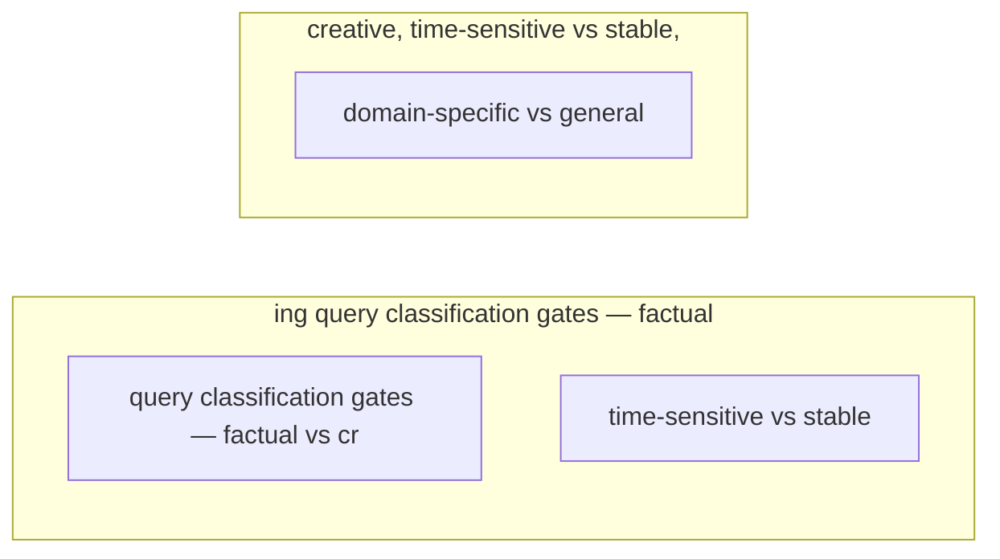

# Dynamic Retrieval Decisions

**One-Line Summary**: Dynamic retrieval decisions determine when an agent should fetch external information versus relying on its own parametric knowledge, using confidence-based triggers and retrieval budgets to optimize for both accuracy and efficiency.

**Prerequisites**: Retrieval-Augmented Generation basics, LLM confidence and calibration, token economics

## What Is Dynamic Retrieval Decisions?

Think of how you decide whether to Google something. If someone asks your birthday, you just answer. If someone asks the GDP of Turkmenistan, you search. If someone asks a question you half-remember, you might try to answer first and then verify. You are making dynamic retrieval decisions constantly, guided by your confidence level and the stakes of being wrong.

Dynamic retrieval decisions apply this same judgment to AI agents. Instead of retrieving for every single query (expensive and sometimes counterproductive) or never retrieving (missing critical information), the agent evaluates each query in real time and decides the appropriate retrieval strategy. This evaluation considers factors like the factual nature of the question, the recency of the information needed, the agent's confidence in its parametric knowledge, and the cost of being wrong.

The core insight is that retrieval is not free. Every retrieval operation costs latency, compute, tokens, and money. It also introduces noise -- irrelevant retrieved documents can actually confuse the model and degrade output quality. A well-calibrated retrieval decision system saves resources on easy questions while ensuring the agent seeks help on hard ones.

## How It Works

### The Decision Tree

The agent evaluates incoming queries through a series of gates. First: is this a factual question or an opinion/creative task? Creative tasks rarely benefit from retrieval. Second: does this require information likely to change over time (stock prices, current events, live data)? Time-sensitive information almost always warrants retrieval. Third: does this reference specific entities, documents, or proprietary data the model would not have been trained on? Domain-specific queries need retrieval. Fourth: how confident is the model in its parametric answer? Low confidence triggers retrieval.

### Confidence-Based Triggers

The agent can assess its own certainty through several mechanisms. Token-level probabilities provide a direct measure -- if the model's top predicted tokens have low probability, it is uncertain. Self-consistency checking runs the query multiple times and compares answers; high variance indicates low confidence. Explicit self-assessment asks the model to rate its confidence before answering. When any of these signals fall below a calibrated threshold, retrieval is triggered.

### Retrieval Budgets

Not all queries deserve the same retrieval investment. A retrieval budget framework assigns different resource limits based on query importance and complexity. Simple factual lookups get a single retrieval call with a small document limit. Complex analytical questions get multiple retrieval rounds with larger budgets. Trivial or conversational queries get zero retrieval. The budget can be expressed in terms of maximum retrieval calls, maximum tokens allocated to retrieved context, or maximum latency added.

### Adaptive Thresholds

Static confidence thresholds work poorly because different domains have different baseline difficulty levels. Adaptive thresholds adjust based on the query domain, user feedback, and historical accuracy. If the agent has been frequently wrong on financial questions, the retrieval trigger threshold for financial queries is lowered (meaning retrieval is triggered more easily). Over time, the system learns where its parametric knowledge is reliable and where it needs external support.

## Why It Matters

### Cost Optimization

In production systems handling thousands or millions of queries, retrieving for every query is prohibitively expensive. Vector store queries, embedding computations, and the additional tokens for retrieved context add up rapidly. Dynamic decisions can reduce retrieval volume by 40-60% on typical workloads where many queries are conversational, well-known factual, or creative in nature. This directly translates to lower API costs and faster response times.

### Quality Improvement

Counter-intuitively, always retrieving can hurt quality. When the model retrieves irrelevant or low-quality documents for questions it already knows well, those documents compete with the model's correct parametric knowledge. This phenomenon, sometimes called "retrieval interference," can cause the model to second-guess correct answers or incorporate misleading information. By retrieving only when beneficial, the agent maintains higher baseline quality.

### Latency Reduction

Retrieval adds 200-2000ms of latency depending on the backend. For time-sensitive applications like chatbots or coding assistants, eliminating unnecessary retrieval for the 40-60% of queries that do not need it provides a significant user experience improvement. The agent can stream responses immediately for high-confidence answers rather than waiting for retrieval.

## Key Technical Details

- **Confidence calibration**: Raw LLM confidence scores are often poorly calibrated (overconfident on wrong answers). Techniques like temperature scaling and Platt scaling improve calibration, making confidence-based triggers more reliable.
- **Query classification**: A lightweight classifier (or prompt-based classification) categorizes queries into retrieval-needed vs retrieval-unnecessary before the main generation, adding minimal overhead.
- **Retrieval cost model**: The decision framework uses an explicit cost model: expected accuracy gain from retrieval versus the cost (latency, tokens, money) of performing it. Retrieval is triggered when expected gain exceeds cost.
- **Fallback retrieval**: Even when the agent initially decides not to retrieve, it monitors its generation. If the model starts producing hedging language or low-confidence tokens mid-generation, it can pause and trigger retrieval (as in the FLARE method).
- **Domain-specific priors**: The system maintains per-domain statistics on when retrieval helps. Legal and medical questions almost always benefit from retrieval; general knowledge and coding syntax rarely do.
- **User feedback loop**: When users correct agent answers, the system logs whether retrieval was used. Over time, this feedback adjusts retrieval thresholds to fix blind spots.
- **A/B testing framework**: New retrieval decision policies are evaluated via A/B testing against the current policy, measuring both accuracy and cost metrics.

## Common Misconceptions

- **"The model knows when it's wrong."** LLMs are notoriously poorly calibrated, especially for questions just outside their training distribution. They often express high confidence in incorrect answers. This is why multiple confidence signals (not just self-assessment) and calibration techniques are necessary.

- **"Retrieval never hurts."** Retrieval absolutely can degrade quality. Irrelevant documents confuse the model, and even relevant documents can override correct parametric knowledge with subtly wrong or outdated retrieved text. The "always retrieve" approach sacrifices quality for false safety.

- **"A simple threshold on confidence is enough."** Single-threshold approaches are brittle. Different question types, domains, and stakes require different thresholds. A well-designed system uses a multi-signal decision framework with adaptive thresholds, not a single cutoff.

- **"This is just caching."** Caching stores previously computed results. Dynamic retrieval decisions assess each novel query in real time based on its characteristics. While caching and retrieval decisions are complementary, they address different problems.

## Connections to Other Concepts

- `agentic-rag.md` -- Agentic RAG is the broader framework in which dynamic retrieval decisions operate, covering the full loop of decide-retrieve-evaluate-synthesize.
- `query-reformulation.md` -- When the dynamic decision is to retrieve, but initial results are poor, query reformulation provides the mechanism for improving subsequent retrieval attempts.
- `source-verification.md` -- After retrieval is triggered, verifying the quality of retrieved information determines whether the retrieval was actually helpful.
- `cost-efficiency-metrics.md` -- Dynamic retrieval decisions directly impact cost efficiency, and cost metrics guide the calibration of retrieval budgets.
- `resource-limits.md` -- Retrieval budgets are a specific form of resource limiting, preventing unbounded retrieval costs.

## Further Reading

- **Jiang et al., 2023** -- "Active Retrieval Augmented Generation (FLARE)." Proposes triggering retrieval dynamically during generation based on token-level confidence, retrieving only when the model is uncertain.
- **Mallen et al., 2023** -- "When Not to Trust Language Models: Investigating Effectiveness of Parametric and Non-Parametric Memories." Analyzes when LLM parametric knowledge suffices versus when retrieval is needed, based on entity popularity.
- **Asai et al., 2024** -- "Self-RAG: Learning to Retrieve, Generate, and Critique through Self-Reflection." Trains models with special reflection tokens that indicate when retrieval should be triggered.
- **Kandpal et al., 2023** -- "Large Language Models Struggle to Learn Long-Tail Knowledge." Demonstrates that LLMs are unreliable for less-common facts, providing empirical grounding for retrieval triggers.
