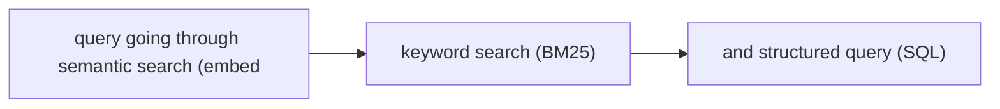
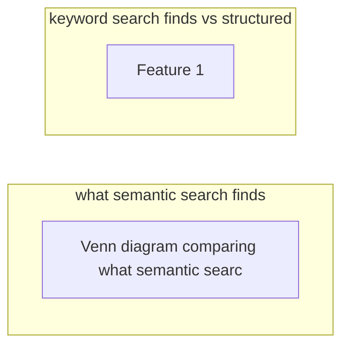

# Hybrid Search Strategies

**One-Line Summary**: Hybrid search combines semantic search (embeddings), keyword search (BM25), and structured queries (SQL/graph) to overcome the individual weaknesses of each approach, using fusion techniques to deliver more robust retrieval results.

**Prerequisites**: Embedding models, vector databases, BM25/TF-IDF, reciprocal rank fusion, SQL basics

## What Is Hybrid Search Strategies?

Imagine you are searching a library. Sometimes you know the exact title of a book -- you need an exact match. Sometimes you know the topic but not the specific words used -- you need conceptual matching. Sometimes you need all books by a certain author published after 2020 -- you need structured filtering. No single search method handles all three well, so a good library system combines a card catalog (keyword), a subject guide (semantic), and a database query system (structured).

Hybrid search applies this multi-strategy approach to AI agent retrieval. Semantic search using embeddings excels at finding conceptually related content even when vocabulary differs, but fails at exact matches (searching for error code "ERR_0x4F2A" via embeddings is unreliable). Keyword search (BM25) excels at exact term matching and is fast, but misses semantic equivalences ("automobile" vs "car"). Structured queries are precise for known schemas but require knowing the schema and cannot handle unstructured text.

By combining these methods and intelligently fusing their results, hybrid search provides robust retrieval that handles the full spectrum of query types. The agent either routes queries to the most appropriate strategy or runs multiple strategies in parallel and merges the results, achieving higher recall and precision than any single method alone.

## How It Works

### Semantic Search (Dense Retrieval)

Semantic search encodes both queries and documents into dense vector representations using embedding models (e.g., OpenAI text-embedding-3, Cohere embed-v3, or open-source models like BGE or E5). Retrieval finds documents whose vectors are closest to the query vector in embedding space, typically using approximate nearest neighbor (ANN) algorithms like HNSW or IVF. This catches conceptual similarity regardless of specific wording. The weakness: embeddings compress meaning into fixed-size vectors, losing precise details like numbers, codes, and proper nouns.

### Keyword Search (Sparse Retrieval)

BM25 is the gold standard for keyword-based retrieval. It scores documents based on term frequency (how often query terms appear in the document), inverse document frequency (how rare the terms are across the corpus), and document length normalization. BM25 is fast, interpretable, and excels at exact matching. When a user searches for a specific function name, API endpoint, error code, or person's name, BM25 reliably finds exact matches that embedding search may miss.

### Structured Queries

For data with known schemas -- relational databases, knowledge graphs, metadata stores -- structured queries (SQL, Cypher, SPARQL) provide precise, deterministic retrieval. "Show me all orders from customer X in the last 30 days with total > $1000" is trivially expressed in SQL but nearly impossible to handle well with either semantic or keyword search. Agents translate natural language into structured queries when the target data lives in a database.

### Fusion and Ranking

When multiple search strategies return results, they must be merged into a single ranked list. Reciprocal Rank Fusion (RRF) is the most common approach: for each document, compute `1 / (k + rank)` for each strategy's ranking, then sum the scores across strategies. Documents that rank highly in multiple strategies get the highest fused scores. RRF is simple, parameter-light (only `k`, typically 60), and consistently outperforms individual strategies. Alternative fusion methods include learned rankers (cross-encoders that rescore the combined candidate set) and weighted combinations based on query type.

## Why It Matters

### Robustness Across Query Types

Real-world user queries span the full spectrum: conceptual questions ("how does authentication work in our system"), exact lookups ("where is the JWT_SECRET_KEY defined"), and structured requests ("list all API endpoints with rate limits above 1000 per minute"). A system that only supports one search strategy will fail badly on the query types it is not designed for. Hybrid search provides consistent performance across all query types.

### Measurable Retrieval Improvements

Empirical studies consistently show hybrid search outperforming individual strategies. On the BEIR benchmark suite, hybrid BM25 + dense retrieval improves nDCG@10 by 5-15% over either method alone. The improvement is largest on diverse, real-world query sets where query types are mixed. For production RAG systems, this translates directly to better answer quality.

### Handling Edge Cases

The failure modes of semantic and keyword search are complementary. Semantic search fails on exact identifiers, numbers, and codes. Keyword search fails on paraphrases and conceptual queries. By running both and fusing results, the system handles edge cases that would trip up either approach individually. This is especially important for enterprise applications where queries often include specific product names, part numbers, or error codes mixed with natural language descriptions.

## Key Technical Details

- **BM25 parameters**: The standard BM25 formula uses `k1` (term frequency saturation, typically 1.2) and `b` (document length normalization, typically 0.75). These rarely need tuning for hybrid systems since RRF fusion is robust to individual ranker calibration.
- **RRF constant `k`**: The constant `k` in the RRF formula `1/(k+rank)` controls how much rank position matters. Higher `k` values flatten the score differences between ranks. The standard value of 60 works well across most datasets.
- **Query routing vs parallel execution**: Some systems route queries to the best strategy (using a query classifier), while others run all strategies in parallel and fuse. Parallel execution is simpler and more robust; routing is faster but risks misclassification. Many production systems use parallel execution with fast strategies (BM25) and selectively add slower strategies (cross-encoder reranking) only when initial results are poor.
- **Embedding model selection**: The embedding model significantly impacts semantic search quality. Models fine-tuned for retrieval (not just similarity) on domain-relevant data outperform general-purpose embeddings. Matryoshka embeddings allow trading off dimension size for speed.
- **Cross-encoder reranking**: After initial retrieval from multiple strategies, a cross-encoder reranker (e.g., Cohere Rerank, BGE-reranker) jointly encodes query-document pairs and produces a fine-grained relevance score. This is more accurate than bi-encoder similarity but too slow for first-stage retrieval.
- **Index synchronization**: Hybrid systems must keep multiple indexes (vector index, inverted index, database tables) synchronized. Document additions, deletions, and updates must propagate to all indexes atomically or with minimal lag.

## Common Misconceptions

- **"Semantic search is always better than keyword search."** Semantic search is better for conceptual queries but strictly worse for exact matches. Searching for a UUID, IP address, or function name via embeddings is unreliable because embeddings are not designed to preserve character-level precision.

- **"BM25 is outdated."** BM25 remains competitive with dense retrieval on many benchmarks and is the backbone of production search engines. It is fast, well-understood, and handles exact matching better than any embedding model. Reports of its death are greatly exaggerated.

- **"You need a complex fusion model."** Simple RRF fusion with no learned parameters consistently matches or outperforms learned fusion models in practice. The engineering simplicity and robustness of RRF make it the default choice for most production systems.

- **"Hybrid search doubles infrastructure costs."** The marginal cost of adding BM25 to an existing vector search system (or vice versa) is modest. BM25 indexes are compact and fast. Many vector databases (Weaviate, Qdrant, Vespa) natively support hybrid search, eliminating the need for separate systems.

## Connections to Other Concepts

- `agentic-rag.md` -- Hybrid search provides the retrieval backbone for agentic RAG, with the agent selecting which search strategies to invoke based on query analysis.
- `query-reformulation.md` -- When one search strategy fails, reformulation may include switching strategies (e.g., from semantic to keyword) as part of the refinement process.
- `knowledge-graph-navigation.md` -- Graph queries represent a third retrieval modality that complements semantic and keyword search, especially for multi-hop structured reasoning.
- `dynamic-retrieval-decisions.md` -- The choice of which search strategy to employ is a dynamic decision influenced by query type, available indexes, and past performance.
- `document-understanding.md` -- Effective hybrid search depends on how documents are processed and indexed, with different parsing strategies for different document types.

## Further Reading

- **Chen et al., 2024** -- "BGE M3-Embedding: Multi-Lingual, Multi-Functionality, Multi-Granularity Text Embeddings Through Self-Knowledge Distillation." Introduces a model that supports dense, sparse, and multi-vector retrieval in one model, enabling hybrid search without multiple indexes.
- **Cormack et al., 2009** -- "Reciprocal Rank Fusion Outperforms Condorcet and Individual Rank Learning Methods." The original RRF paper showing that simple rank fusion consistently outperforms more complex approaches.
- **Thakur et al., 2021** -- "BEIR: A Heterogeneous Benchmark for Zero-shot Evaluation of Information Retrieval Models." The standard benchmark for evaluating retrieval across diverse domains, demonstrating the strengths and weaknesses of different retrieval strategies.
- **Luan et al., 2021** -- "Sparse, Dense, and Attentional Representations for Text Retrieval." Analyzes the tradeoffs between sparse (keyword) and dense (semantic) retrieval and how they complement each other in hybrid systems.
