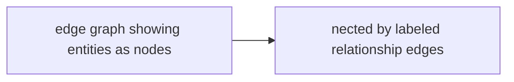
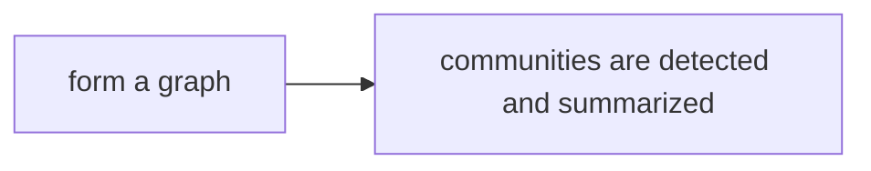

# Knowledge Graph Navigation

**One-Line Summary**: Knowledge graph navigation enables agents to traverse structured entity-relationship networks for multi-hop reasoning, answering questions that require connecting facts across multiple nodes in ways unstructured search cannot reliably achieve.

**Prerequisites**: Graph data structures, retrieval-augmented generation, entity recognition, multi-hop reasoning

## What Is Knowledge Graph Navigation?

Imagine a detective investigating a crime. They do not just search for random documents -- they follow connections. A suspect is linked to a location, that location to a vehicle, that vehicle to a purchase record, that record to a bank account. Each connection is a hop, and the chain of hops tells a story that no single document contains. Knowledge graph navigation gives AI agents this same ability to follow chains of relationships.

A knowledge graph is a structured representation of knowledge as entities (nodes) and relationships (edges). "Microsoft" is an entity, "Satya Nadella" is an entity, and "CEO of" is a relationship connecting them. Unlike vector databases that store flat text chunks, knowledge graphs preserve the structure of information, making it possible to answer questions like "Who leads the company that developed the Xbox?" by traversing edges: Xbox -> developed_by -> Microsoft -> CEO -> Satya Nadella.

For AI agents, knowledge graphs provide a complementary retrieval mechanism to vector search. When a question requires connecting multiple facts that live in different documents, vector search may retrieve each fact independently but fail to connect them. Graph traversal follows the connections explicitly, making multi-hop reasoning reliable rather than hoping the LLM can infer connections from retrieved text chunks.

## How It Works

### Graph Construction

Knowledge graphs can be built manually (curated knowledge bases like Wikidata with 100M+ entities), extracted automatically from documents using NLP (entity extraction + relation extraction), or generated by LLMs from text corpora. The LLM-based approach (used in GraphRAG) processes documents into entity-relationship triples, merges duplicates, and builds a graph structure. For enterprise use cases, domain-specific graphs are constructed from internal documents, databases, and APIs, typically containing thousands to millions of entities.

### Entity-Relationship Queries

The simplest graph queries resolve direct relationships: "Who is the CEO of OpenAI?" translates to a single-hop query: `(OpenAI) -[CEO]-> (?)`. Graph query languages like Cypher (Neo4j) or SPARQL (RDF stores) express these formally. The agent translates natural language questions into graph queries, either through direct LLM-based translation (text-to-Cypher) or through a series of API calls that traverse the graph programmatically.

### Multi-Hop Reasoning

Multi-hop questions require traversing multiple edges. "What university did the founder of SpaceX attend?" requires: SpaceX -> founded_by -> Elon Musk -> attended -> University of Pennsylvania. The agent plans the traversal path, executes each hop, and carries intermediate results forward. For complex queries, the agent may explore multiple paths simultaneously and prune dead ends. The key challenge is determining the correct path when multiple relationships exist at each node.

### GraphRAG: Graphs from Documents

GraphRAG, introduced by Microsoft Research, builds knowledge graphs from document collections and uses them for retrieval. The process has two phases: (1) indexing -- LLMs extract entities and relationships from text, cluster related entities into communities, and generate community summaries; (2) querying -- for local questions, the graph identifies relevant entities and their neighborhoods; for global questions, community summaries provide high-level understanding. GraphRAG excels at summarization and thematic questions that span entire corpora.

## Why It Matters

### Reliable Multi-Hop Answers

Vector search retrieves passages independently. When a question requires connecting facts from different passages, the LLM must infer the connection -- and often fails. Knowledge graphs make connections explicit. Experiments show that graph-based retrieval improves multi-hop question answering accuracy by 15-25% compared to vector-only retrieval, with the gap widening as the number of required hops increases.

### Structured Data Integration

Real-world enterprise data lives in databases, CRMs, ERPs, and other structured systems. Knowledge graphs provide a natural bridge between structured data (SQL tables) and unstructured data (documents). An agent navigating a graph can seamlessly combine facts from a product database, customer records, and support documentation because they all feed into the same entity-relationship structure.

### Explainable Reasoning Chains

When an agent answers a question using graph traversal, the traversal path serves as an explanation. "I found that SpaceX was founded by Elon Musk, who attended UPenn" is more transparent and verifiable than "Based on retrieved context..." The explicit reasoning chain allows users and auditors to verify each hop independently.

## Key Technical Details

- **Graph storage**: Neo4j (property graph model) and Amazon Neptune (RDF + property graph) are the most common production graph databases. For smaller graphs, in-memory libraries like NetworkX suffice.
- **Text-to-Cypher translation**: LLMs convert natural language to Cypher queries with 60-80% accuracy on standard benchmarks. Providing the graph schema (node types, relationship types) in the prompt is essential for accurate translation.
- **Entity resolution**: The same entity may appear with different names across documents ("Microsoft Corp," "MSFT," "Microsoft Corporation"). Entity resolution merges these into a single graph node, and failure to resolve leads to disconnected subgraphs.
- **Graph embedding**: For approximate or fuzzy graph queries, nodes and edges can be embedded in vector space (using TransE, RotatE, or similar methods), enabling similarity search over graph structures.
- **Hybrid graph-vector retrieval**: Many production systems combine graph traversal (for structured multi-hop queries) with vector search (for fuzzy semantic matching), using each where it is strongest.
- **Community detection**: GraphRAG uses Leiden algorithm to cluster densely connected entities into communities. Community summaries enable answering questions about themes and patterns in large corpora.
- **Scale considerations**: Knowledge graphs with millions of nodes require careful indexing and query optimization. Unbounded multi-hop queries can explode combinatorially, so hop limits (typically 2-4 hops) are essential.

## Common Misconceptions

- **"Knowledge graphs replace vector search."** They complement it. Vector search excels at fuzzy semantic matching and handling unstructured text. Graphs excel at structured relationships and multi-hop reasoning. The best systems use both.

- **"Building a knowledge graph requires manual curation."** While curated graphs are highest quality, LLM-based extraction can build useful graphs automatically from document collections. The quality is lower (expect 70-85% accuracy in extracted relations) but sufficient for many applications, especially when combined with human review of high-importance entities.

- **"Graph queries are always more accurate than vector search."** For single-hop factual questions or semantically nuanced questions, vector search often outperforms graph queries. Graphs win specifically on multi-hop, structured, and aggregation queries.

- **"Knowledge graphs are static."** Production knowledge graphs need continuous updating as new documents arrive, relationships change, and entities evolve. Graph maintenance is an ongoing operational concern, not a one-time setup.

## Connections to Other Concepts

- `agentic-rag.md` -- Knowledge graph navigation is one of several retrieval tools an agentic RAG system can invoke, selected when structured multi-hop reasoning is needed.
- `hybrid-search-strategies.md` -- Graph queries integrate with hybrid search as a third retrieval modality alongside semantic and keyword search.
- `query-reformulation.md` -- Complex natural language questions often need decomposition into sub-queries that map to individual graph traversal hops.
- `source-verification.md` -- The explicit traversal paths in knowledge graphs facilitate source verification, as each hop can be independently checked.
- `document-understanding.md` -- Extracting entities and relationships from complex documents (tables, PDFs) feeds the graph construction pipeline.

## Further Reading

- **Edge et al., 2024** -- "From Local to Global: A Graph RAG Approach to Query-Focused Summarization." Introduces GraphRAG, building knowledge graphs from documents and using community summaries for global queries.
- **Pan et al., 2024** -- "Unifying Large Language Models and Knowledge Graphs: A Roadmap." Comprehensive survey of LLM-KG integration methods, covering graph-enhanced LLMs and LLM-augmented graphs.
- **Baek et al., 2023** -- "Knowledge-Augmented Language Model Prompting for Zero-Shot Knowledge Graph Question Answering." Demonstrates LLM-based knowledge graph querying without task-specific training.
- **Sun et al., 2024** -- "Think-on-Graph: Deep and Responsible Reasoning of Large Language Model on Knowledge Graph." Proposes interleaving LLM reasoning with graph exploration for faithful multi-hop reasoning.
