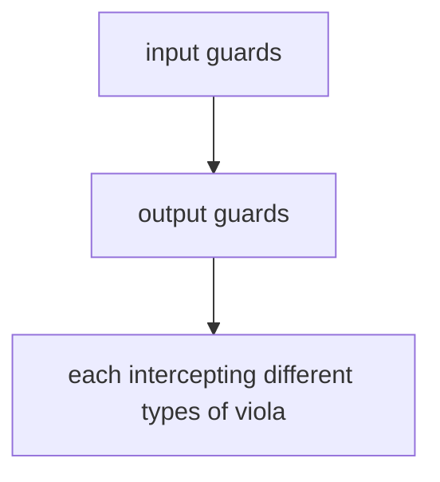
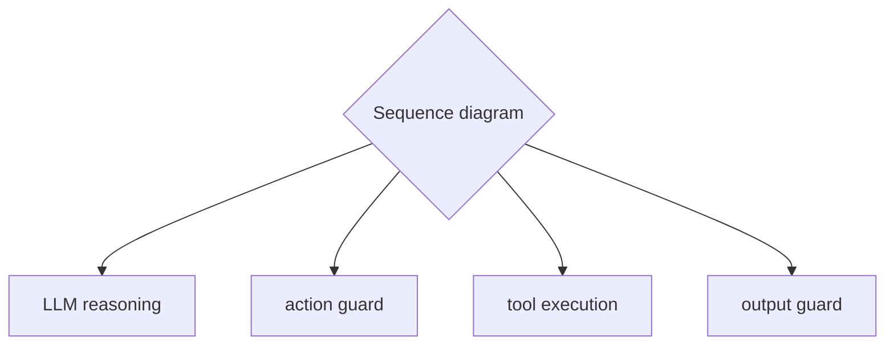

# Agent Guardrails

**One-Line Summary**: Agent guardrails are programmable safety layers that intercept agent inputs, outputs, and actions to detect and block harmful, unsafe, or policy-violating behavior through multi-layer defense including input guards, output guards, and action guards.

**Prerequisites**: Agent loop architecture, prompt injection, content moderation, tool use, safety classification

## What Is Agent Guardrails?

Imagine a highway with guardrails. Drivers (agents) have freedom to drive wherever they want within the lanes, but if they veer off course, the guardrails prevent them from going off a cliff. The guardrails do not steer the car -- they establish hard boundaries that cannot be crossed. Similarly, agent guardrails do not control what the agent does; they define what it absolutely must not do.

Agent guardrails are automated safety checks that run at multiple points in the agent's execution pipeline. Input guards screen incoming messages for prompt injection, harmful requests, or out-of-scope queries before they reach the agent. Output guards check the agent's generated responses for harmful content, leaked sensitive information, or policy violations before they reach the user. Action guards evaluate proposed tool calls for dangerous operations, unauthorized access, or policy-violating actions before they are executed.

The key principle is defense in depth. No single guard catches everything, but layered guards create a comprehensive safety net. An attack might slip past the input guard but be caught by the action guard. A hallucinated harmful response might not trigger the input guard (the input was benign) but will be caught by the output guard. Multiple independent safety layers dramatically reduce the probability that a harmful action or response reaches production.

## How It Works

### Input Guards

Input guards process every message before it reaches the agent's reasoning. They perform several checks: prompt injection detection (identifying attempts to override system instructions), content policy enforcement (blocking requests for illegal, harmful, or unethical actions), scope enforcement (rejecting queries outside the agent's intended domain), and PII detection (identifying and optionally redacting personally identifiable information in the input). Input guards can use classifiers, regex patterns, LLM-based evaluation, or combinations. A blocked input returns a safe refusal message without invoking the agent at all.

### Output Guards

Output guards evaluate the agent's generated response before it is delivered. They check for harmful content (violence, hate speech, explicit material), information leakage (system prompts, internal data, credentials appearing in the response), factual safety (medical, legal, or financial advice that should include disclaimers), and brand/policy alignment (ensuring the response matches organizational tone and policies). Output guards are particularly important because they catch problems that originate from the agent's reasoning, not from the input.

### Action Guards

Action guards intercept proposed tool calls and evaluate them before execution. They check: is this tool call syntactically valid? Does it target an authorized resource? Is the operation within policy (e.g., no bulk deletes, no external communications without approval)? Does it match the pattern of the original request (preventing the agent from taking actions unrelated to the user's query)? Action guards can enforce rate limits, validate parameters, and require additional confirmation for high-risk operations. A blocked action returns an error to the agent, which can then adjust its approach.

### Guardrail Frameworks

Dedicated frameworks simplify guardrail implementation. NVIDIA NeMo Guardrails provides a configuration language (Colang) for defining conversation flows and safety rules, integrating with any LLM. Guardrails AI offers a Python framework for defining input/output validators with automatic retry and correction. These frameworks handle the common patterns (PII detection, topic control, output formatting) while allowing custom guards for application-specific safety requirements.

## Why It Matters

### Automated Safety at Scale

Human-in-the-loop review does not scale to every agent interaction. Guardrails provide automated safety checks that run on every input, output, and action without human involvement. For a system handling thousands of requests per minute, automated guardrails are the only practical way to maintain safety standards consistently.

### Regulatory Compliance

Content moderation requirements, data protection regulations, and industry-specific compliance rules can be encoded as guardrails. This provides auditable, consistent enforcement of compliance policies. When regulations change, updating guardrails is more reliable than retraining or re-prompting the agent.

### Layered Defense Against Adversarial Attacks

Sophisticated adversarial attacks may bypass any single defense. Multi-layer guardrails force attackers to defeat multiple independent safety systems simultaneously, dramatically increasing attack difficulty. Input guards, output guards, and action guards each catch different attack vectors, and their combination is much stronger than any individual layer.

## Key Technical Details

- **Guardrail latency**: Each guardrail layer adds processing time. Input guards typically add 50-200ms (classifier inference). Output guards add 100-500ms (LLM-based evaluation is slowest). Action guards add 10-50ms (rule-based checks). Total guardrail overhead should be monitored and optimized to stay within latency budgets.
- **False positive rates**: Overly aggressive guardrails block legitimate requests (false positives). A false positive rate above 2-3% significantly degrades user experience. Guard sensitivity must be calibrated against a test set of both benign and adversarial inputs.
- **Guardrail bypass**: Determined attackers probe for guardrail weaknesses. Regular red-teaming and adversarial testing identify bypasses. Guardrails should be updated in response to new attack techniques, similar to antivirus signature updates.
- **Async vs sync execution**: Input and action guards must run synchronously (blocking execution until cleared). Output guards can sometimes run asynchronously (streaming the response while checking in parallel, with the ability to truncate if a violation is detected mid-stream).
- **Custom validators**: Application-specific guardrails (e.g., "never recommend competitor products," "always include safety disclaimers for medical information") are implemented as custom validators that plug into the guardrail framework.
- **Guardrail observability**: All guardrail decisions (pass, block, warn) should be logged with the trigger reason. Dashboards showing block rates, trigger reasons, and trends help identify emerging issues and calibrate sensitivity.

## Common Misconceptions

- **"System prompts are sufficient guardrails."** System prompts are instructions that the model may ignore, misinterpret, or be manipulated into overriding. Guardrails are code-level checks that run independently of the model's reasoning. They are complementary, not interchangeable.

- **"Guardrails eliminate the need for careful prompt engineering."** Guardrails are a safety net, not a primary defense. Well-engineered prompts reduce the frequency of unsafe outputs, and guardrails catch the cases that slip through. Relying solely on guardrails without good prompts results in high block rates and poor user experience.

- **"One guardrail layer is enough."** Different guard types catch different problems. Input guards cannot catch hallucinated harmful content (the input was benign). Output guards cannot prevent unauthorized tool executions (the output is the tool call, not the response). Action guards cannot catch harmful text responses (no tool call involved). All three layers are needed.

- **"Guardrails are set-and-forget."** The adversarial landscape evolves continuously. New jailbreak techniques, new policy requirements, and new attack surfaces require ongoing guardrail updates. A guardrail system from six months ago may have significant gaps against current attack techniques.

- **"Guardrails make agents less useful."** Well-calibrated guardrails have minimal impact on legitimate use. The goal is to block the 0.1% of harmful interactions without affecting the 99.9% of legitimate ones. Poor calibration causes problems; guardrails themselves do not.

## Connections to Other Concepts

- `prompt-injection-defense.md` -- Input guards are a primary defense against prompt injection, detecting and blocking adversarial inputs before they reach the agent.
- `human-in-the-loop.md` -- Guardrails and HITL work together: guardrails handle clear-cut safety violations automatically, while HITL handles ambiguous cases requiring human judgment.
- `trust-boundaries.md` -- Guard sensitivity should vary by trust level: inputs from low-trust sources (external users, retrieved documents) should face stricter guards than high-trust sources (system instructions).
- `monitoring-and-observability.md` -- Guardrail logs feed into the observability system, providing real-time visibility into safety events and trends.
- `alignment-for-agents.md` -- Guardrails enforce alignment constraints from the outside, complementing the agent's internal alignment from training and prompting.

## Further Reading

- **Rebedea et al., 2023** -- "NeMo Guardrails: A Toolkit for Controllable and Safe LLM Applications with Programmable Rails." Introduces NVIDIA's guardrails framework with Colang, a domain-specific language for defining safety flows.
- **Inan et al., 2023** -- "Llama Guard: LLM-based Input-Output Safeguard for Human-AI Conversations." Meta's safety classifier for evaluating both user inputs and model outputs against customizable safety taxonomies.
- **Dong et al., 2024** -- "Building Guardrails for Large Language Models." Survey of guardrail approaches including rule-based, classifier-based, and LLM-based methods with their tradeoffs.
- **Markov et al., 2023** -- "A Holistic Approach to Undesired Content Detection in the Real World." OpenAI's approach to content moderation that informs guardrail design for production AI systems.
