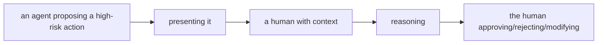

# Human-in-the-Loop

**One-Line Summary**: Human-in-the-loop patterns require agent actions to be approved by a human before execution, creating safety checkpoints for destructive, costly, or irreversible operations while balancing safety with usability.

**Prerequisites**: Agent loop architecture, tool use, action classification, user experience design

## What Is Human-in-the-Loop?

Imagine a new employee at a company. On their first day, they can read documents and draft emails freely. But before sending an email to a client, they need their manager's approval. Before making a purchase over $500, they need sign-off. Before deleting any files, they absolutely must get permission. Over time, as they build trust, some approvals are relaxed. This graduated approval system is exactly how human-in-the-loop works for AI agents.

Human-in-the-loop (HITL) is a design pattern where an AI agent pauses before executing certain actions and presents the proposed action to a human for approval. The human can approve, reject, or modify the action before it proceeds. This creates a safety net for actions that are dangerous, expensive, irreversible, or have external consequences that the agent cannot fully anticipate.

The fundamental challenge of HITL design is calibration. If every action requires approval, the agent becomes an expensive autocomplete system -- the human is doing all the real work. If no actions require approval, the agent is fully autonomous and any mistake goes unchecked. The art is finding the right threshold: approving enough to catch real problems while allowing enough autonomy to provide genuine value. This threshold depends on the action's reversibility, cost, blast radius, and the current trust level established through the agent's track record.

## How It Works

### Action Classification

The agent classifies every proposed action on a risk spectrum before deciding whether approval is needed. Read-only actions (searching, reading files, querying databases) are typically auto-approved. Reversible write actions (creating a draft, adding a record that can be deleted) may be auto-approved or require light confirmation. Irreversible actions (sending emails, deploying code, making payments, deleting data) require explicit approval. The classification can be rule-based (predefined action categories), model-based (the LLM assesses risk), or a combination.

### Approval Workflows

When approval is needed, the agent constructs an approval request that explains what action it wants to take, why it wants to take it, what the expected outcome is, and what the risks are. This request is presented through the appropriate channel -- inline in a chat interface, as a notification in a dashboard, as an email for asynchronous workflows, or as a mobile push notification for urgent items. The human reviews and responds with approve, reject, or modify (approve with changes).

### Escalation Triggers

Some situations demand escalation beyond the normal approval flow. These include: actions that affect multiple systems simultaneously, actions with estimated costs above a threshold, actions outside the agent's normal operating domain, situations where the agent expresses low confidence, and actions that contradict previous instructions. Escalation may route to a more senior approver, trigger a group review, or halt the agent entirely pending human investigation.

### Progressive Autonomy

Trust is built over time. An agent that has successfully completed 100 email drafts with zero rejection might be granted autonomous sending for routine emails. Progressive autonomy systems track the agent's approval-to-rejection ratio per action type and automatically adjust approval requirements. If rejections increase (indicating the agent is making more mistakes, perhaps due to a model update or new domain), the system tightens requirements back. This creates an adaptive safety system that responds to observed behavior.

## Why It Matters

### Catching Consequential Errors

Agents make mistakes. A coding agent might propose deleting a production database table instead of a test table. A communication agent might draft an email with incorrect information or inappropriate tone. A financial agent might initiate a transaction with the wrong amount. HITL catches these errors before they cause real damage, and the cost of a brief human review is vastly less than the cost of recovering from a consequential mistake.

### Legal and Compliance Requirements

Many regulated industries require human oversight for certain decisions. Healthcare regulations require physician review of AI-generated treatment recommendations. Financial regulations require human approval for transactions above certain thresholds. Data protection laws may require human review of automated decisions affecting individuals. HITL patterns provide the mechanism to satisfy these regulatory requirements.

### User Confidence and Adoption

Users adopt AI agents more readily when they have a safety net. Knowing that the agent will ask before doing anything dangerous reduces the fear of "what if it goes wrong?" This psychological safety accelerates adoption. Organizations that deploy agents with no human oversight often face internal resistance, while those with appropriate HITL patterns see smoother rollouts.

## Key Technical Details

- **Approval latency**: Synchronous approval (the agent waits for the human) is simplest but blocks the agent. For long-running tasks, asynchronous approval (the agent queues the action and continues other work) prevents idle time. Timeout policies define what happens if the human does not respond (typically: the action is not taken).
- **Approval context richness**: The approval request should include not just the proposed action but the full reasoning chain: what the user asked for, what the agent has done so far, why it chose this action, and what alternatives it considered. Richer context leads to better approval decisions.
- **Batch approval**: When an agent needs to perform many similar actions (e.g., sending 50 personalized emails), individual approval for each is impractical. Batch approval shows a summary ("Send 50 emails to customers in segment X with template Y") and a few representative examples for spot-checking.
- **Audit logging**: Every approval decision (approved, rejected, modified, timed out) is logged with timestamp, approver identity, and any modifications. This creates a complete audit trail for compliance and for training the progressive autonomy system.
- **Rejection feedback**: When a human rejects an action, the reason for rejection is captured and fed back to the agent. This in-context feedback helps the agent avoid similar proposals in the current session and, over time, improves the agent's judgment about what is acceptable.
- **Multi-level approval**: Critical actions may require approval from multiple humans (e.g., both a technical reviewer and a business owner). The approval workflow supports sequential or parallel multi-approver patterns.

## Common Misconceptions

- **"HITL means the agent is not autonomous."** HITL provides selective oversight, not constant supervision. A well-calibrated HITL system might auto-approve 90% of actions and only require approval for the 10% that are high-risk. The agent is autonomous for the vast majority of its operations.

- **"Approving every action is the safest approach."** Approval fatigue is a well-documented phenomenon. When humans are asked to approve too many actions, they start rubber-stamping without careful review. Paradoxically, requiring approval for everything makes the system less safe because the human stops paying attention.

- **"Users always want control."** Research on automation trust shows that users prefer appropriate autonomy. They want control over high-stakes decisions but find constant interruptions for low-stakes actions annoying and counterproductive. The optimal level of HITL depends on the user's trust and the action's stakes.

- **"HITL is a temporary measure until agents are reliable enough."** Even highly reliable agents benefit from HITL for truly consequential actions. Airline autopilot systems are extremely reliable, yet pilots retain override authority for critical situations. HITL is a permanent safety architecture, not a stopgap.

## Connections to Other Concepts

- `agent-guardrails.md` -- Guardrails are automated safety checks that complement HITL. Actions that pass guardrails may still require human approval; actions that fail guardrails are blocked automatically without bothering the human.
- `rollback-and-undo.md` -- When actions are reversible, the HITL threshold can be higher (more autonomy) because mistakes can be undone. Irreversibility lowers the threshold.
- `trust-boundaries.md` -- The trust level of the input (user request vs retrieved document) influences whether HITL is triggered. Actions proposed in response to low-trust inputs should have a lower approval threshold.
- `monitoring-and-observability.md` -- Monitoring data (agent error rates, rejection rates, near-miss events) informs the calibration of HITL thresholds and progressive autonomy policies.
- `authorization-and-permissions.md` -- HITL is one layer of access control. Permissions define what an agent can do; HITL defines what requires approval within those permissions.

## Further Reading

- **Amershi et al., 2019** -- "Guidelines for Human-AI Interaction." Microsoft's 18 guidelines for human-AI interaction, many directly applicable to designing HITL approval workflows.
- **Horvitz, 1999** -- "Principles of Mixed-Initiative User Interfaces." Foundational work on balancing human control with AI autonomy in interactive systems.
- **Lai et al., 2023** -- "Towards a Science of Human-AI Decision Making." Reviews research on how humans make decisions with AI assistance, relevant to understanding approval behavior.
- **Green & Chen, 2019** -- "The Principles and Limits of Algorithm-in-the-Loop Decision Making." Analyzes the effectiveness of human oversight over algorithmic decisions and conditions under which it succeeds or fails.
