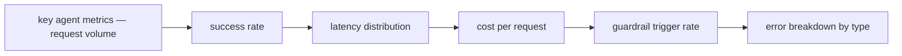
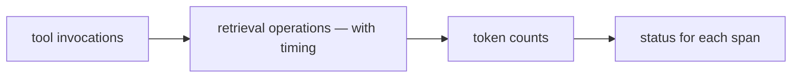

# Monitoring and Observability

**One-Line Summary**: Monitoring and observability provide real-time visibility into agent behavior through tracing, metrics, anomaly detection, and dashboards, enabling operators to detect problems, understand failures, and maintain production agent reliability.

**Prerequisites**: Distributed tracing, metrics and logging, agent loop architecture, tool use, production systems operations

## What Is Monitoring and Observability?

Imagine operating a nuclear power plant with no instrument panel -- no temperature gauges, no pressure readings, no radiation monitors. You would have no idea whether the plant was operating normally or heading toward a meltdown until it was too late. The instrument panel does not control the plant, but it makes control possible by providing the information operators need to make decisions. Monitoring and observability are the instrument panel for AI agents.

When an agent runs in production, it makes dozens of decisions, executes multiple tool calls, processes retrieved documents, and generates responses -- all within seconds. Without observability, operators have no visibility into this process. They see only the final output and whether the user was satisfied. When something goes wrong (and it will), they have no ability to diagnose what happened, what step failed, or why.

Observability for agents goes beyond traditional application monitoring. Agents are non-deterministic, multi-step systems that interact with external tools and services. A single agent request might involve 5-15 LLM calls, 3-8 tool invocations, and multiple retrieval operations. Each step can fail, produce unexpected results, or behave anomalously. Full observability means being able to reconstruct and understand the complete trajectory of any agent execution -- every reasoning step, every tool call, every decision, with timing, cost, and outcome data.

## How It Works

### Distributed Tracing

Each agent request generates a trace -- a hierarchical record of every operation the agent performed. The trace starts with the user request and branches into child spans for each agent step: LLM calls (with prompt, completion, model, tokens used), tool invocations (with parameters, results, duration), retrieval operations (with queries, results, relevance scores), and decision points (with the agent's reasoning). Traces are stored in tracing backends (Jaeger, Langfuse, LangSmith, Arize Phoenix) and can be searched, filtered, and visualized. A single trace answers the question: "What exactly did the agent do to handle this request?"

### Metrics Collection

Metrics aggregate behavior across many requests into quantitative measurements. Key agent metrics include: success rate (percentage of tasks completed successfully), latency (end-to-end time, time per step, time waiting for LLM vs tools), cost (tokens consumed, API calls made, dollar cost per request), tool usage (which tools are used most, which fail most), error rate (by error type, by step, by tool), and retrieval quality (relevance scores, number of retrieval rounds needed). Metrics are collected in time-series databases (Prometheus, Datadog, CloudWatch) and visualized on dashboards.

### Anomaly Detection

Normal agent behavior has characteristic patterns: typical token consumption ranges, expected tool call sequences, standard latency distributions. Anomaly detection identifies deviations from these patterns that may indicate problems. Anomalies include: unusually high token consumption (possible infinite loop), unexpected tool call patterns (possible prompt injection), sudden increase in error rates (possible external service failure), and latency spikes (possible resource contention). Anomaly detection uses statistical methods (z-score, IQR) on time-series metrics and pattern matching on trace data.

### Alerting and Dashboards

Metrics and anomalies feed into alerting systems that notify operators of problems requiring attention. Critical alerts (agent error rate above 20%, cost per request above 5x normal) page on-call engineers. Warning alerts (latency increase, retrieval quality decline) create tickets for investigation. Dashboards provide real-time and historical views of agent health, organized by: operational overview (request volume, success rate, latency), cost tracking (tokens, API calls, dollar spend), safety metrics (guardrail trigger rates, HITL escalation rates), and quality metrics (user satisfaction, task completion rates).

## Why It Matters

### Debugging Non-Deterministic Systems

Agents are non-deterministic -- the same input can produce different outputs and different trajectories. When a user reports a problem, reproducing it may be impossible. Traces capture what actually happened during the problematic request, making debugging possible even for non-reproducible issues. Without traces, diagnosing agent failures is guesswork.

### Cost Control

Agent costs can spike unexpectedly. A prompt change that causes more reasoning steps, a retrieval configuration that returns too many documents, or a tool integration that triggers excessive API calls can multiply costs overnight. Real-time cost monitoring with alerts catches these spikes before they become expensive. Many organizations have discovered cost overruns of 10-100x due to unmonitored agent behavior.

### Safety Assurance

Monitoring provides evidence that safety systems are working. Guardrail trigger rates show whether safety policies are being enforced. HITL escalation rates show whether the right actions are being flagged. Anomaly detection catches cases where safety systems themselves may be malfunctioning. For regulated applications, monitoring logs provide the audit trail required by compliance frameworks.

## Key Technical Details

- **Trace schema for agents**: A well-designed trace includes: request_id, user_id, session_id, timestamp, total_duration, total_tokens, total_cost, and a tree of spans. Each span records: span_type (llm_call, tool_call, retrieval, guardrail), input, output, duration, tokens (for LLM spans), status (success/error), and metadata.
- **Sampling strategies**: High-volume systems cannot store traces for every request. Head-based sampling (decide at request start) stores a percentage (1-10%) of all traces. Tail-based sampling (decide after completion) stores all traces for failed, slow, expensive, or anomalous requests. Tail-based sampling is more useful for debugging but requires buffering complete traces before the sampling decision.
- **LLM-specific metrics**: Beyond standard application metrics, agent systems track: tokens per request (prompt + completion), model selection distribution (which models are used), cache hit rate (for prompt caching), and reasoning-to-action ratio (thinking tokens vs tool call tokens).
- **Correlation with user outcomes**: The most valuable monitoring links agent behavior to user outcomes. Correlating trace data with user satisfaction scores, task completion signals, and follow-up queries reveals which agent behaviors predict good or bad outcomes.
- **Retention policies**: Traces and detailed logs are expensive to store. Typical retention: full traces for 7-30 days, aggregated metrics for 1-2 years, safety-relevant events (guardrail triggers, HITL decisions) for regulatory retention periods (often 5-7 years).
- **Real-time streaming**: For live debugging and demonstration purposes, real-time trace streaming shows the agent's behavior as it happens, similar to watching a live log but structured as a trace tree.

## Common Misconceptions

- **"Logging is the same as observability."** Logs are unstructured text records. Observability requires structured traces (hierarchical, searchable), metrics (aggregated, quantitative), and the tooling to correlate them. Logs alone are insufficient for understanding complex agent behavior.

- **"We only need monitoring when something goes wrong."** By the time you realize something is wrong, you need monitoring already in place with historical data to compare against. Monitoring must be implemented from the start and running continuously, not added reactively after incidents.

- **"Monitoring agent costs is optional."** Agent costs are uniquely unpredictable because they depend on model reasoning, which varies per request. A single bad prompt template can cause a 10x cost increase across all requests. Cost monitoring with alerts is essential, not optional.

- **"Agents are too non-deterministic to set meaningful thresholds."** While individual requests vary, aggregate metrics (average latency, p95 cost, success rate) are stable and meaningful. Thresholds should be set on aggregates over time windows, not on individual requests.

## Connections to Other Concepts

- `agent-guardrails.md` -- Guardrail events (triggers, blocks, passes) are key monitoring signals. Rising guardrail trigger rates may indicate new attack patterns or model behavior changes.
- `human-in-the-loop.md` -- HITL metrics (escalation rate, approval rate, response time) are monitored to ensure the approval workflow is functioning and not creating bottlenecks.
- `resource-limits.md` -- Resource limit violations are monitoring events. Tracking how often agents hit their limits informs whether limits need adjustment.
- `cost-efficiency-metrics.md` -- Production monitoring data feeds cost efficiency analysis, providing the raw data for cost-per-task calculations and cost optimization.
- `reliability-and-reproducibility.md` -- Monitoring provides the data for reliability measurement: success rates, failure distributions, and variance over time.

## Further Reading

- **Patel et al., 2024** -- "Langfuse: Open Source LLM Engineering Platform." Open-source tracing and analytics platform designed specifically for LLM application observability.
- **Chase, 2023** -- "LangSmith: Unified DevOps for LLM Applications." LangChain's observability platform covering tracing, evaluation, and monitoring for agent systems.
- **Gallagher et al., 2024** -- "Arize Phoenix: Open-Source Observability for LLM Applications." An observability tool focused on evaluation, tracing, and experimentation for AI applications.
- **Karve et al., 2023** -- "Operationalizing Machine Learning: An Interview Study." Research on the operational challenges of ML systems in production, many directly applicable to agent monitoring.
