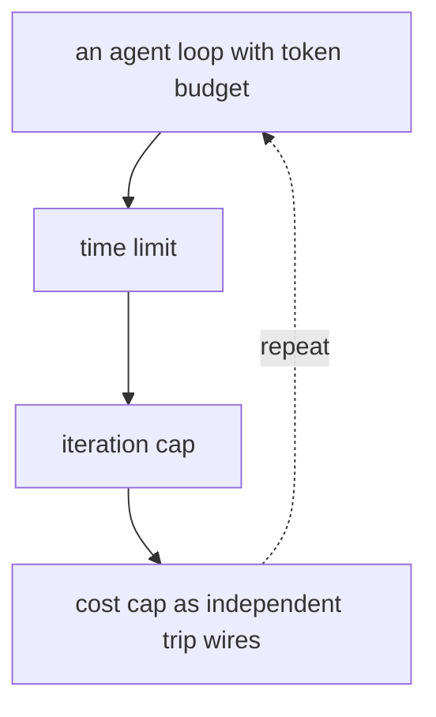
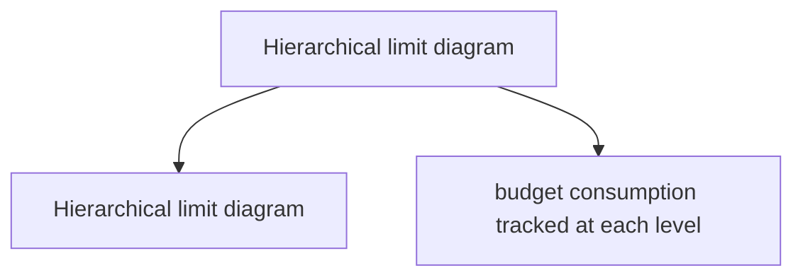

# Resource Limits

**One-Line Summary**: Resource limits prevent runaway agent execution by enforcing token budgets, time limits, cost caps, and iteration maximums, acting as circuit breakers that ensure agents fail safely rather than consuming unbounded resources.

**Prerequisites**: Agent loop architecture, token economics, LLM API pricing, circuit breaker pattern

## What Is Resource Limits?

Imagine a kitchen timer for a meal you are cooking. Without it, you might forget the oven is on and burn the food -- or worse, start a fire. The timer does not cook the food; it prevents unbounded cooking. Resource limits are the timer for AI agents: they do not help the agent complete its task, but they prevent the agent from running indefinitely, consuming unlimited resources, or spiraling into increasingly expensive failure modes.

An AI agent without resource limits is genuinely dangerous. Consider a coding agent that encounters a bug it cannot fix. Without limits, it might retry the same approach hundreds of times, each attempt consuming thousands of tokens. A research agent might follow an infinite chain of references, each retrieval spawning more retrievals. A web browsing agent might get stuck in a redirect loop. In each case, the agent is "trying its best" but consuming resources exponentially with no progress toward completion.

Resource limits establish hard boundaries on what an agent can consume: maximum tokens (input + output across all LLM calls), maximum wall-clock time, maximum number of tool calls or iterations, maximum dollar cost, and maximum concurrent operations. When any limit is hit, the agent stops executing, reports what it has accomplished so far, and returns control. These limits transform potentially catastrophic failures (a $10,000 API bill from an infinite loop) into bounded, manageable incidents.

## How It Works

### Token Budgets

Token budgets cap the total number of tokens an agent can consume across all LLM calls during a single task. This includes both input tokens (prompts, context, retrieved documents) and output tokens (reasoning, responses, tool call arguments). A typical budget might be 100,000-500,000 tokens for a complex task. The agent tracks cumulative token usage and receives warnings at 75% and 90% of the budget. At 100%, execution halts. Token budgets are the most direct cost control because tokens map directly to API costs.

### Time Limits

Time limits cap the wall-clock duration of agent execution. A simple query should complete in 30-60 seconds; a complex multi-step task might be allowed 5-15 minutes; a long-running automation might have a 1-hour limit. Time limits protect against agents that are making progress but too slowly (spending 2 hours on a task that should take 5 minutes), agents blocked on external resources (waiting for an API that will never respond), and agents in slow failure loops (each iteration succeeds but does not advance the task).

### Iteration and Step Limits

Iteration limits cap the number of agent loop cycles -- the number of times the agent can think and act before being forced to stop. A step limit of 25 means the agent gets 25 reasoning-action pairs. This prevents infinite loops where the agent repeats the same action, multi-step tasks from expanding unboundedly, and verbose agents that take many small steps instead of efficient large ones. Iteration limits should be calibrated per task type: a simple Q&A might need 1-3 steps, a coding task might need 10-20, and a complex research task might need 20-40.

### Cost Caps

Cost caps express limits in dollar amounts rather than tokens. A per-request cap of $0.50 means the entire agent execution must cost less than fifty cents regardless of which models, tools, or services it uses. Cost caps are useful because they naturally account for different model prices (GPT-4 costs more than GPT-3.5 per token), tool costs (API calls, compute), and the full economic picture. Cost tracking requires real-time price calculation based on models used, tokens consumed, and external service charges.

## Why It Matters

### Preventing Financial Disasters

Without cost limits, a single malfunctioning agent session can generate thousands of dollars in API charges. Multiply this by the number of concurrent users, and the exposure becomes enormous. Organizations have reported surprise bills of $50,000+ from uncontrolled agent execution. Resource limits make the maximum possible cost per session deterministic and bounded.

### Graceful Failure Over Catastrophic Failure

When an agent hits a resource limit, it fails gracefully: it reports its partial results, explains that it ran out of resources, and suggests next steps. This is far better than the alternative failure modes: running until the API key is exhausted, running until the server runs out of memory, or running until an engineer manually kills the process. Bounded failure is predictable and manageable.

### Forcing Efficient Agent Behavior

Resource limits create pressure for efficiency. An agent with unlimited resources might take a wasteful approach (retrieve 100 documents when 5 would suffice, reason for 50 steps when 10 would do). Constrained agents must be more strategic about resource allocation, often producing better results because they focus on the most promising approaches rather than exhaustively trying everything.

## Key Technical Details

- **Hierarchical limits**: Limits can be hierarchical: a per-step token limit (max 4,000 tokens per LLM call), a per-task limit (max 200,000 tokens total), and a per-user daily limit (max 2,000,000 tokens per day). Each level catches different failure modes.
- **Limit enforcement points**: Limits are enforced in the agent loop controller, not by the LLM itself. Before each LLM call or tool invocation, the controller checks remaining budget. If insufficient budget remains, it either forces a summary/completion step or halts execution.
- **Budget allocation within tasks**: Sophisticated agents allocate their budget across subtasks. A research task with a 200,000-token budget might allocate 50,000 to retrieval, 100,000 to analysis, and 50,000 to synthesis. If retrieval consumes more than its allocation, the agent must reduce analysis or synthesis.
- **Circuit breaker patterns**: If the agent fails N consecutive steps (e.g., 3 tool call errors in a row), a circuit breaker halts execution before the full budget is consumed. This catches fast-failing scenarios where continuing is futile.
- **Limit configuration**: Limits should be configurable per task type, user tier, and deployment environment. Development environments might have tighter limits (catch issues early); production environments scale limits based on task complexity and user subscription level.
- **Pre-flight estimation**: Before starting execution, the agent can estimate required resources based on task complexity. If the estimate exceeds available limits, the agent informs the user upfront rather than starting and failing mid-task.
- **Limit transparency**: Users should be informed of applicable limits ("This task has a budget of 200,000 tokens, estimated sufficient for most queries"). Transparency prevents confusion when limits are hit and helps users adjust their expectations.

## Common Misconceptions

- **"Unlimited agents produce better results."** Counterintuitively, unconstrained agents often produce worse results because they waste resources on unproductive paths. Research on cognitive forcing functions shows that bounded resources force more strategic behavior, similar to how chess players make better moves under time pressure up to a point.

- **"If the agent hits a limit, it failed."** Hitting a limit is not failure; it is controlled termination. The agent should return partial results, which are often useful. A research agent that hits its limit after collecting 80% of the information is more useful than one that runs forever trying to find the last 20%.

- **"Setting limits is easy."** Calibrating limits requires empirical data. Set too tight, and agents fail on legitimate tasks, frustrating users. Set too loose, and they do not prevent resource waste. Good limits come from analyzing production usage distributions: set limits at the 95th or 99th percentile of normal usage.

- **"Token limits are enough."** Token limits do not cap wall-clock time (an agent might spend all its tokens slowly over hours), tool costs (external API calls have their own pricing), or compute costs (code execution inside sandboxes). A comprehensive limit system covers all resource dimensions.

## Connections to Other Concepts

- `agent-sandboxing.md` -- Resource limits complement sandboxing: sandboxing constrains what the agent can access, limits constrain how much it can consume. Container-level resource limits (CPU, memory) enforce the compute dimension.
- `monitoring-and-observability.md` -- Resource consumption metrics (tokens per request, cost per request, steps per task) are critical monitoring signals. Limit-hit events should be tracked and analyzed.
- `cost-efficiency-metrics.md` -- Resource limits directly determine cost boundaries. Cost efficiency metrics evaluate how well the agent uses its allocated resources.
- `human-in-the-loop.md` -- When an agent approaches its limits on a critical task, escalating to a human ("I am running low on budget -- should I continue?") is better than silent termination.
- `dynamic-retrieval-decisions.md` -- Retrieval budgets are a specific form of resource limit applied to the retrieval subsystem.

## Further Reading

- **Nygard, 2018** -- "Release It! Design and Deploy Production-Ready Software." Covers circuit breaker patterns, bulkheads, and other stability patterns applicable to agent resource management.
- **Kang et al., 2023** -- "Frugal Prompting for Dialog Models." Investigates strategies for reducing token consumption in conversational AI while maintaining quality.
- **Chen et al., 2023** -- "FrugalGPT: How to Use Large Language Models While Reducing Cost and Improving Performance." Proposes strategies for cost-efficient LLM usage including model cascading and response caching, relevant to agent resource optimization.
- **Yao et al., 2023** -- "ReAct: Synergizing Reasoning and Acting in Language Models." The agent loop pattern where iteration limits are most naturally applied, with empirical data on typical step counts for different task types.
