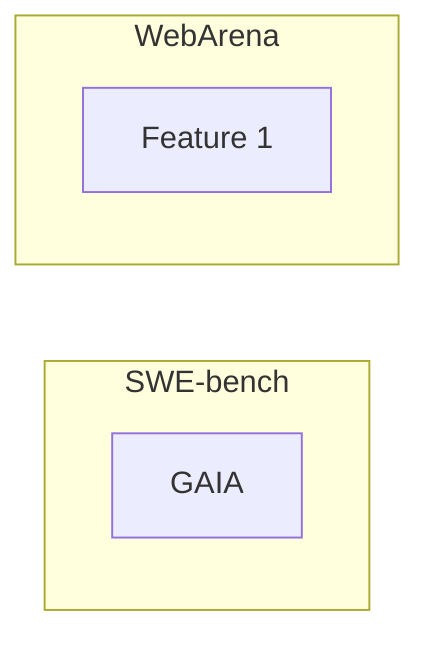
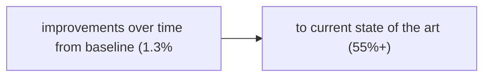

# Agent Benchmarks

**One-Line Summary**: Agent benchmarks are standardized evaluation suites -- including SWE-bench for coding, WebArena for web tasks, GAIA for general assistance, and others -- that provide reproducible task sets with defined metrics, enabling meaningful comparison of agent capabilities and tracking of state-of-the-art progress.

**Prerequisites**: Agent evaluation methods, task completion metrics, LLM benchmarks, reproducibility in evaluation

## What Is Agent Benchmarks?

Imagine trying to compare athletes without standardized events. One sprinter runs 100 meters on a track, another runs 100 meters uphill, and a third runs 90 meters on a flat road. Without a standard event (same distance, same conditions, same timing), comparison is meaningless. Agent benchmarks are the standardized events of the AI agent world: they define specific tasks, specific environments, specific evaluation criteria, and specific metrics so that different agents can be meaningfully compared.

Agent benchmarks emerged because the field needed a way to measure progress objectively. When every research paper evaluates on its own private dataset with its own metrics, it is impossible to determine which approaches actually work better. Benchmarks solve this by providing a shared evaluation framework: everyone runs the same tasks, in the same environment, with the same metrics, making results directly comparable.

Modern agent benchmarks go beyond simple question-answering. They place agents in realistic environments (real codebases, real websites, real operating systems) and require multi-step interaction to complete tasks. This makes them much more representative of real-world agent performance than traditional NLP benchmarks, but also much more expensive and complex to run. A single evaluation on SWE-bench requires resolving hundreds of real GitHub issues, each potentially taking minutes of agent computation.

## How It Works

### SWE-bench (Software Engineering)

SWE-bench evaluates coding agents on their ability to resolve real GitHub issues from popular Python repositories. Each task provides an issue description and a codebase, and the agent must produce a patch that resolves the issue and passes the repository's test suite. SWE-bench Lite contains 300 curated issues; the full set contains 2,294 issues. The metric is "resolved" -- the percentage of issues where the agent's patch passes all relevant tests. As of early 2025, top agents resolve 40-55% of SWE-bench Lite issues. SWE-bench is the most widely used agent benchmark, driving significant investment in coding agents.

### WebArena (Web Interaction)

WebArena evaluates agents on web-based tasks in realistic self-hosted web environments. Tasks span e-commerce sites, forums, content management systems, and maps. Each task specifies a goal (e.g., "find the cheapest red jacket under $50 and add it to cart") and the agent must navigate websites, interact with forms, and complete multi-step workflows. The environment includes 812 tasks across multiple websites. The metric is task success rate based on environment state checking (did the cart contain the right item?). Current top performance is around 35-40%.

### GAIA (General AI Assistants)

GAIA evaluates general-purpose assistant capabilities with questions that require multi-step reasoning and tool use. Questions are specifically designed so that an LLM alone cannot answer them -- they require web search, calculation, file processing, or multi-step reasoning. GAIA has three difficulty levels: Level 1 (straightforward, ~1 step), Level 2 (moderate, 2-5 steps), and Level 3 (hard, 5+ steps). The metric is exact match accuracy on final answers. Human performance is ~92%; top agents achieve 60-75% on Level 1 but drop to 15-30% on Level 3.

### Additional Benchmarks

**AgentBench** evaluates across diverse environments: operating systems, databases, knowledge graphs, card games, lateral thinking, and web browsing. **OSWorld** tests agents in full desktop operating system environments (Ubuntu, macOS, Windows), requiring GUI interaction to complete tasks like creating spreadsheets or configuring system settings. **TAU-bench** focuses specifically on tool use, evaluating how well agents select and use the right tools for various tasks. **MiniWob++** is a suite of simplified web interaction tasks useful for faster development iteration.

## Why It Matters

### Objective Progress Measurement

Without benchmarks, claims of "state-of-the-art agent performance" are unverifiable. Benchmarks provide the shared ruler that makes progress measurable. The coding agent field can say with confidence that resolve rates on SWE-bench improved from 1.3% (2023, baseline) to 55%+ (2025, best agents) -- this is only possible because the benchmark is standardized.

### Identifying Capability Gaps

Benchmarks reveal systematic weaknesses. If an agent scores well on WebArena but poorly on GAIA, it handles web interaction better than multi-step reasoning. If it scores well on SWE-bench Lite but poorly on the full set, it handles curated issues but struggles with harder, uncurated problems. These diagnostic insights guide research and development focus.

### Preventing Overclaiming

Benchmarks create accountability. A claim of "our agent can solve any coding task" is easily tested against SWE-bench. Benchmarks force honest assessment of capabilities and limitations, benefiting both the research community and practitioners evaluating tools for deployment.

## Key Technical Details

- **Environment reproducibility**: Agent benchmarks require reproducible environments. SWE-bench uses specific repository commits and test suites. WebArena uses self-hosted web applications with deterministic state reset. Environment drift (changes to underlying systems) can invalidate benchmark results.
- **Evaluation cost**: A full SWE-bench Lite evaluation (300 tasks, multiple runs) costs $500-5,000 in API fees depending on the agent. WebArena requires hosting the web environments. Benchmark evaluation is a significant cost, limiting how frequently it can be run.
- **Leaderboard contamination**: As benchmarks become popular, training data contamination becomes a concern. Models or agents may have been exposed to benchmark tasks during training, inflating scores. New benchmarks and held-out test sets are needed to maintain evaluation integrity.
- **Benchmark saturation**: When top performance approaches human-level or 100%, the benchmark can no longer discriminate between agents. SWE-bench Lite is approaching this point, motivating harder variants. The community continually needs harder benchmarks as capabilities improve.
- **Multi-run evaluation**: Due to agent non-determinism, benchmark results should be reported as mean and standard deviation over multiple runs (typically 3-5). A single-run result is unreliable. Some leaderboards require multiple-run reporting.
- **Pass@k metric**: For coding benchmarks, pass@k measures the probability that at least one of k independent attempts succeeds. pass@1 is the standard single-attempt metric. pass@5 shows the agent's capability ceiling with retries.
- **Cost-controlled evaluation**: Some benchmarks report cost-controlled results: performance at a fixed dollar budget per task. This prevents agents from achieving high scores through expensive brute-force approaches.

## Common Misconceptions

- **"High benchmark scores mean the agent works well in production."** Benchmarks test specific, well-defined tasks. Production tasks are diverse, messy, and often underspecified. An agent that scores 50% on SWE-bench might score 30% on your company's codebase due to different conventions, languages, and complexity patterns. Benchmarks measure capability, not production readiness.

- **"Benchmarks measure all important capabilities."** Current benchmarks focus on task completion in well-defined environments. They do not measure important real-world qualities like handling ambiguous instructions, maintaining context over long sessions, or recovering gracefully from unexpected errors. Benchmark scores are necessary but not sufficient for agent evaluation.

- **"The best agent on one benchmark is the best overall."** Different benchmarks measure different capabilities. An agent optimized for coding (SWE-bench) may perform poorly on web interaction (WebArena) and vice versa. No single benchmark captures overall agent quality.

- **"Benchmark improvements always reflect genuine capability gains."** Improvements can come from better prompting strategies, benchmark-specific optimizations, or even data contamination. Genuine capability improvements should transfer to new, unseen benchmarks and real-world tasks.

## Connections to Other Concepts

- `agent-evaluation-methods.md` -- Benchmarks provide the standardized task sets that evaluation methods (end-to-end, trajectory, LLM-as-judge) are applied to.
- `task-completion-metrics.md` -- Each benchmark defines its own completion metrics: SWE-bench uses "resolved," GAIA uses exact match, WebArena uses environment state checking.
- `cost-efficiency-metrics.md` -- Cost-controlled benchmark evaluation measures agent performance within dollar budgets, reflecting real-world cost constraints.
- `reliability-and-reproducibility.md` -- Multi-run benchmark evaluation with reported variance is essential for reliable comparison between agents.
- `regression-testing.md` -- A subset of benchmark tasks can serve as a regression test suite, run after every agent change to detect degradation.

## Further Reading

- **Jimenez et al., 2024** -- "SWE-bench: Can Language Models Resolve Real-World GitHub Issues?" The most influential agent benchmark, driving the coding agent ecosystem.
- **Zhou et al., 2024** -- "WebArena: A Realistic Web Environment for Building Autonomous Agents." Establishes realistic web-based evaluation for browsing and interaction agents.
- **Mialon et al., 2023** -- "GAIA: A Benchmark for General AI Assistants." Tests multi-step reasoning with tool use, specifically designed to be unsolvable by LLMs alone.
- **Liu et al., 2023** -- "AgentBench: Evaluating LLMs as Agents." Comprehensive multi-environment benchmark covering OS, database, knowledge graph, and web domains.
- **Xie et al., 2024** -- "OSWorld: Benchmarking Multimodal Agents for Open-Ended Tasks in Real Computer Environments." Evaluates agents on full desktop OS interaction, pushing toward general-purpose computer use.
