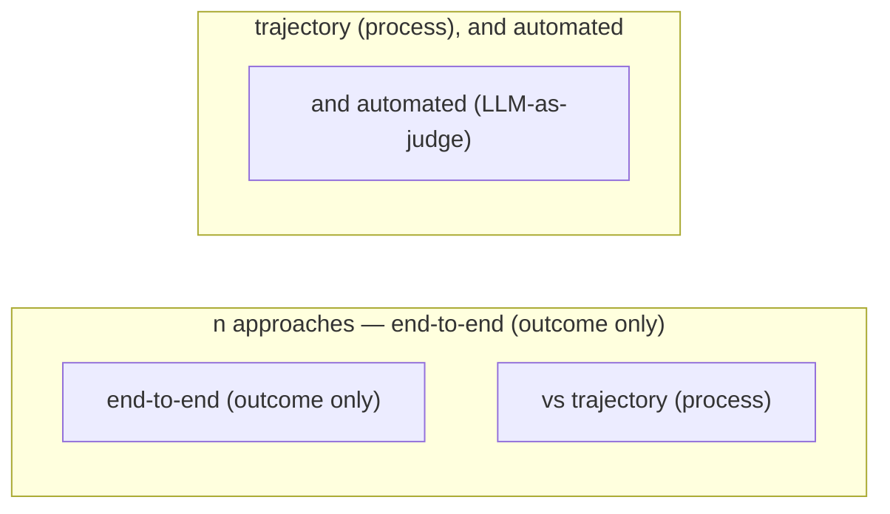
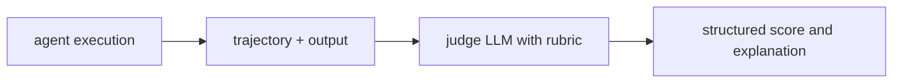

# Agent Evaluation Methods

**One-Line Summary**: Agent evaluation methods measure agent performance through end-to-end task completion assessment, step-by-step trajectory analysis, human evaluation, automated metrics, and LLM-as-judge approaches, each addressing different aspects of the fundamental challenge that agents are non-deterministic multi-step systems.

**Prerequisites**: Agent loop architecture, task completion, LLM evaluation, metrics design, statistical testing

## What Is Agent Evaluation Methods?

Imagine evaluating a chef. You could evaluate only the final dish: does it taste good? But this misses important information -- did they waste ingredients, take too long, make a mess of the kitchen, or get lucky with a technique they cannot reproduce? A proper evaluation considers both the final product and the process. Agent evaluation faces the same challenge: measuring the outcome alone misses crucial information about the agent's behavior, efficiency, and reliability.

Agent evaluation is fundamentally harder than LLM evaluation. A standard LLM evaluation compares a single output to a reference answer. An agent evaluation must assess a trajectory -- a sequence of reasoning steps, tool calls, and intermediate results that together produce a final outcome. The trajectory might span 5-30 steps, involve multiple tools and data sources, and take minutes to complete. Each step can be evaluated independently (was this a reasonable action?) and the whole trajectory evaluated holistically (was this an efficient path to the goal?).

Adding to the difficulty, agents are non-deterministic. Run the same task twice and the agent may take different paths, use different tools, and produce different outputs -- potentially with one succeeding and one failing. This means single-run evaluation is unreliable. Robust evaluation requires multiple runs, statistical aggregation, and careful experimental design. The field is still developing standard practices, but several evaluation paradigms have emerged as practical and informative.

## How It Works

### End-to-End Evaluation

End-to-end evaluation measures whether the agent completed the task successfully, ignoring the process. For a coding agent: did the code compile and pass tests? For a research agent: was the answer factually correct? For a customer service agent: was the issue resolved? This is the most user-relevant metric because users care about outcomes, not process. End-to-end evaluation is straightforward to implement (define success criteria, run the agent, check the output) but misses important quality dimensions.

### Step-by-Step Trajectory Evaluation

Trajectory evaluation examines each action the agent took. Was each tool call appropriate and well-parameterized? Did the agent recover gracefully from errors? Were there unnecessary or redundant steps? Did the agent take a reasonable path even if the final outcome was poor (or an unreasonable path that happened to succeed)? Trajectory evaluation requires either human annotators reviewing action logs or automated evaluators (often LLMs) scoring each step against criteria like relevance, efficiency, and correctness.

### LLM-as-Judge

Using a powerful LLM (often GPT-4 or Claude) to evaluate agent outputs has become the most practical automated evaluation approach. The judge LLM receives the original task, the agent's output (and optionally the trajectory), and evaluation criteria, then produces a score and explanation. LLM judges correlate reasonably well with human judgment (0.7-0.85 correlation) and scale infinitely. Key considerations: judges should not be the same model as the agent (to avoid self-preference bias), evaluation prompts must be carefully designed to reduce position and verbosity biases, and calibration against human judgment is essential.

### Human Evaluation

Human evaluation remains the gold standard for subjective quality dimensions: is the response helpful, is the tone appropriate, would you trust this agent? Human evaluation is expensive ($5-50 per task evaluation depending on complexity and annotator expertise), slow (days to weeks for a meaningful evaluation set), and variable (inter-annotator agreement is typically 70-85%). It is best used for calibrating automated metrics, evaluating new capabilities, and spot-checking production quality rather than as a primary ongoing evaluation method.

## Why It Matters

### Agents Cannot Be Evaluated Like Chatbots

Chatbot evaluation compares a single output to a reference. Agent evaluation must assess a dynamic, multi-step process that interacts with tools and external systems. Applying chatbot evaluation methods to agents misses most of the relevant quality dimensions: efficiency, tool usage, error recovery, and process quality.

### Non-Determinism Requires Statistical Rigor

A single evaluation run is nearly meaningless for a non-deterministic agent. An agent might succeed 80% of the time on a given task -- a single success or failure tells you almost nothing. Evaluation must run each task multiple times (typically 3-10 runs) and report distributions, not single numbers. This statistical reality multiplies the cost and time of evaluation but is essential for reliable results.

### Evaluation Drives Improvement

Without rigorous evaluation, agent development is blind iteration. Developers make prompt or tool changes and judge quality by vibes. Systematic evaluation reveals which changes actually improve performance, which dimensions improve or regress, and where the agent's weaknesses lie. Evaluation is not just a reporting tool; it is the steering mechanism for agent development.

## Key Technical Details

- **Evaluation dimensions**: A complete agent evaluation covers: task success (binary), output quality (graded), efficiency (steps taken, tokens consumed), reliability (variance across runs), safety (no harmful actions), and cost (dollar cost per task).
- **Statistical significance**: With non-deterministic agents, report confidence intervals, not just point estimates. A success rate of 80% with n=10 has a 95% CI of [44%, 97%]. Meaningful comparisons between agent versions require sufficient sample sizes (typically 50-100 tasks minimum).
- **Evaluation datasets**: Curate evaluation datasets with diverse task types, difficulty levels, and edge cases. Include tasks where the agent should refuse (safety evaluation), tasks with ambiguous instructions (alignment evaluation), and multi-step tasks with failure recovery opportunities (robustness evaluation).
- **Contamination concerns**: If the agent or its underlying model has seen the evaluation tasks during training, performance will be inflated. Use held-out evaluation sets, regularly rotate tasks, and include novel tasks that did not exist during training.
- **Pairwise comparison**: When comparing two agent versions, pairwise comparison (showing both outputs to an evaluator and asking which is better) is more reliable than independent scoring. This applies to both human and LLM-as-judge evaluation.
- **Evaluation cost model**: Budget evaluation effort based on the stakes: quick automated checks for development iterations, thorough multi-run evaluation for release candidates, and full human evaluation for major launches.

## Common Misconceptions

- **"Pass/fail on a test set is sufficient evaluation."** Binary pass/fail ignores partial success, quality of the solution, efficiency, and reliability. A 70% pass rate tells you nothing about why the 30% failed or whether the 70% that passed produced high-quality solutions.

- **"LLM-as-judge is objective."** LLM judges have systematic biases: they prefer longer responses (verbosity bias), prefer responses that appear first in the prompt (position bias), and may prefer responses from their own model family (self-preference bias). Careful prompt design and calibration mitigate but do not eliminate these biases.

- **"More evaluation tasks are always better."** A well-designed evaluation set of 100 diverse, representative tasks is more informative than 1000 similar tasks that test the same capability. Coverage of different task types, difficulty levels, and edge cases matters more than raw count.

- **"Evaluation is a one-time activity."** Agent performance changes with model updates, prompt changes, tool modifications, and data changes. Continuous evaluation (regression testing on every change) is necessary to maintain quality over time.

## Connections to Other Concepts

- `trajectory-evaluation.md` -- Detailed examination of trajectory-level evaluation, which complements the end-to-end evaluation covered here.
- `task-completion-metrics.md` -- Specific metrics for measuring task success, from binary pass/fail to graded and comparative scoring.
- `agent-benchmarks.md` -- Standard benchmarks that provide consistent evaluation frameworks and enable cross-system comparison.
- `reliability-and-reproducibility.md` -- Methods for measuring and reporting the non-deterministic variance that makes agent evaluation statistically challenging.
- `alignment-for-agents.md` -- Alignment evaluation is a specialized evaluation dimension that assesses whether the agent pursues intended goals faithfully.

## Further Reading

- **Liu et al., 2023** -- "AgentBench: Evaluating LLMs as Agents." A comprehensive benchmark evaluating LLMs on diverse agent tasks, establishing evaluation methodology for multi-step agent behavior.
- **Zhuge et al., 2024** -- "Agent-as-a-Judge: Evaluate Agents with Agents." Proposes using agent systems themselves as evaluators, extending LLM-as-judge to multi-step evaluation.
- **Kapoor et al., 2024** -- "AI Agents That Matter." Critical analysis of agent evaluation practices, identifying common pitfalls and proposing best practices for rigorous evaluation.
- **Zheng et al., 2024** -- "Judging LLM-as-a-Judge with MT-Bench and Chatbot Arena." Foundational work on using LLMs as evaluators, analyzing biases and establishing best practices applicable to agent evaluation.
