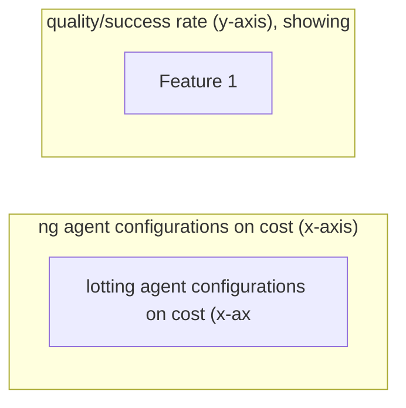
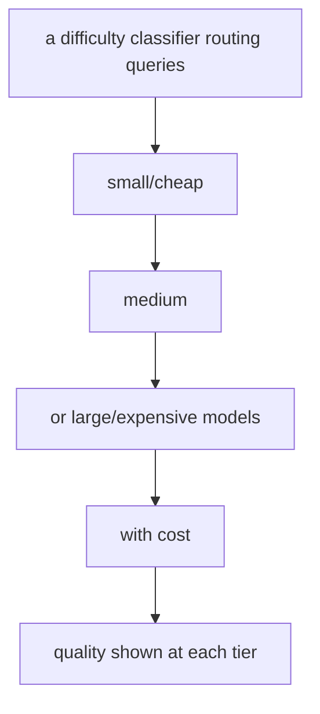

# Cost-Efficiency Metrics

**One-Line Summary**: Cost-efficiency metrics measure agent performance relative to resource consumption -- cost per task completion, tokens consumed, API calls made, and time elapsed -- revealing the Pareto frontier where cheaper approaches with more retries can outperform expensive single-shot attempts.

**Prerequisites**: Token economics, LLM pricing models, task completion metrics, agent evaluation methods, Pareto optimization

## What Is Cost-Efficiency Metrics?

Imagine two moving companies. Company A uses a single large truck and completes the move in one trip for $500. Company B uses a small van, making three trips, and charges $300 total. The outcome is identical -- your stuff is moved -- but the cost-efficiency is very different. Now imagine Company C uses a luxury truck with a professional crew, completing the move in one trip for $2,000. They are the "best" by some measures, but the marginal improvement over Company A does not justify the 4x cost. Cost-efficiency metrics help you find the sweet spot.

In the AI agent world, the "moving companies" are different agent configurations: models, prompting strategies, tool setups, and retry policies. A GPT-4-based agent might solve a task in one attempt for $0.50. A GPT-3.5-based agent might fail on the first attempt but succeed on the third for $0.15 total. A Claude-based agent might solve it reliably for $0.30. Without cost-efficiency metrics, you only see success rates. With them, you see the full picture: how much does each successful completion actually cost?

Cost-efficiency metrics are essential for production agent systems where scale matters. An agent that costs $1 per task is fine for 100 daily tasks ($100/day) but devastating at 100,000 daily tasks ($100,000/day). At scale, small cost differences compound into large dollar amounts, making cost efficiency not just a nice-to-have but a primary design constraint that shapes every architectural decision.

## How It Works

### Cost Per Successful Completion

The fundamental metric is cost per successful task completion. This is calculated as: total cost of all attempts (including failures) divided by the number of successful completions. If an agent costs $0.10 per attempt and succeeds 80% of the time, the cost per success is $0.10 / 0.80 = $0.125. This metric naturally accounts for retry costs: a cheap agent that needs many retries may cost more per success than an expensive agent that succeeds on the first try.

### Token Consumption Analysis

Tokens are the primary cost driver for LLM-based agents. Token analysis breaks down consumption by: input tokens (prompts, context, retrieved documents), output tokens (reasoning, tool call arguments, responses), and wasted tokens (tokens in failed attempts, unnecessary reasoning, verbose outputs). Optimization targets include reducing context size through better retrieval, reducing reasoning verbosity through better prompting, and eliminating unnecessary tool calls that generate input/output tokens.

### The Cost-Quality Pareto Frontier

Plot each agent configuration as a point on a graph where the x-axis is cost and the y-axis is quality (success rate, output quality score). The Pareto frontier is the set of configurations where no other configuration is both cheaper and better. Configurations below the frontier are dominated -- there exists a better option that costs the same or less. The frontier reveals the tradeoff: how much quality improvement does each additional dollar buy? Practitioners choose a point on the frontier based on their quality requirements and budget constraints.

### Model Cascading and Routing

A powerful cost-optimization strategy is model cascading: route easy tasks to cheap models and hard tasks to expensive models. A classifier (itself a cheap model or heuristic) estimates task difficulty. Easy tasks go to GPT-3.5/Claude Haiku ($0.01), medium tasks to GPT-4o-mini/Claude Sonnet ($0.05), and hard tasks to GPT-4/Claude Opus ($0.50). Since most real-world tasks are easy or medium, the average cost drops significantly while maintaining high quality on hard tasks. FrugalGPT demonstrated that cascading can reduce costs by 50-90% with minimal quality loss.

## Why It Matters

### Sustainable Scaling

A $0.50/task agent is not viable at 1M tasks/month ($500K). A $0.05/task agent costs $50K -- still significant but manageable. Cost efficiency determines whether an agent system can scale to real-world volumes. Many promising agent prototypes never reach production because their per-task cost is too high.

### Informed Architecture Decisions

Cost-efficiency data reveals which architectural choices drive cost and which drive quality. Perhaps 60% of token consumption comes from stuffing too many retrieved documents into the prompt. Perhaps the most expensive step (planning) could be handled by a cheaper model. Without cost breakdowns, optimization is blind.

### Competitive Benchmarking

When comparing agent systems, cost-efficiency enables fair comparison. An agent with 80% success rate at $0.10/task may be superior to one with 90% success rate at $2.00/task, depending on the application. Cost-controlled benchmarks (measuring performance at a fixed budget) provide the fairest comparison.

## Key Technical Details

- **Cost components**: Total cost = LLM inference cost (tokens x price per token) + tool execution cost (API calls, compute) + infrastructure cost (hosting, storage) + retrieval cost (embedding computation, vector DB queries). LLM inference typically dominates (60-90% of total cost).
- **Token price tracking**: Model providers change pricing frequently. Cost tracking systems should use real-time pricing or configurable price tables. Include both input and output token prices, which often differ significantly (output tokens typically cost 3-4x more than input tokens).
- **Cost attribution**: For multi-step agent tasks, attribute costs to each step. This reveals which steps are most expensive and where optimization effort should focus. Common finding: context-heavy steps (large prompts with retrieved documents) are often the biggest cost drivers.
- **Retry economics**: The expected cost with retries is: cost_per_attempt / success_probability_per_attempt (for independent attempts). If retries are not independent (the agent adapts its approach), the math is more complex. Track actual retry costs rather than relying on theoretical models.
- **Caching for cost reduction**: Prompt caching (reusing prefixes across calls) and result caching (storing outputs for repeated queries) can reduce costs by 30-60% on workloads with repetitive patterns. Track cache hit rates as a cost-efficiency metric.
- **Dollar-cost averaging**: For production systems, track the rolling average cost per task over time windows (hourly, daily, weekly). This smooths out variance from individual expensive tasks and reveals cost trends.
- **Cost anomaly detection**: Set alerts for per-task costs exceeding 3x the rolling average. Cost anomalies often indicate agent bugs (infinite loops, excessive retrieval) or provider pricing changes.

## Common Misconceptions

- **"The best model is always the most cost-efficient."** The best model achieves the highest quality, but cost-efficiency considers the ratio of quality to cost. A model that is 5% better but 10x more expensive is less cost-efficient. For most production applications, the sweet spot is not the most capable or cheapest model.

- **"Reducing token count always reduces cost."** Reducing input tokens reduces cost, but aggressively shortening prompts can reduce quality, requiring more retries and potentially increasing total cost. The goal is optimal token usage, not minimal.

- **"Cost-efficiency is a fixed property of an agent."** Cost-efficiency varies by task type, difficulty, and domain. An agent might be very cost-efficient for simple tasks and terribly inefficient for complex ones. Report cost-efficiency segmented by task characteristics.

- **"Cheaper models with retries always beat expensive models."** This holds when tasks are amenable to retry (the agent learns from failures) and the cheap model's success rate is not too low. If the cheap model succeeds 10% of the time, 10 retries average to $0.10 x 10 / 1.0 = $1.00 -- possibly more than a single $0.50 call to a better model that succeeds 95% of the time ($0.53 per success).

## Connections to Other Concepts

- `resource-limits.md` -- Resource limits set the maximum budget per task, and cost-efficiency metrics measure how well the agent uses that budget.
- `task-completion-metrics.md` -- Cost-efficiency is computed as cost divided by task completion metrics, making it a derived metric that depends on how completion is measured.
- `agent-benchmarks.md` -- Cost-controlled benchmark evaluation measures agent quality at fixed budgets, using cost-efficiency as the primary comparison metric.
- `monitoring-and-observability.md` -- Production cost monitoring provides the raw data for cost-efficiency analysis and detects cost anomalies in real-time.
- `dynamic-retrieval-decisions.md` -- Skipping unnecessary retrieval is a direct cost-efficiency optimization that reduces both token cost and latency.

## Further Reading

- **Chen et al., 2023** -- "FrugalGPT: How to Use Large Language Models While Reducing Cost and Improving Performance." Proposes model cascading, response caching, and other strategies for cost-efficient LLM usage.
- **Kapoor et al., 2024** -- "AI Agents That Matter." Emphasizes the importance of cost-controlled evaluation for agents, arguing that benchmark results without cost reporting are misleading.
- **Vsakota et al., 2024** -- "Fly-Swat or Cannon? Cost-Effective Language Model Choice via Meta-Modeling." Meta-model approach to routing queries to appropriately-sized models based on difficulty estimation.
- **Yue et al., 2024** -- "Large Language Model Cascades with Mixture of Thoughts Representations for Cost-efficient Reasoning." Advances model cascading with intelligent routing based on reasoning complexity.
