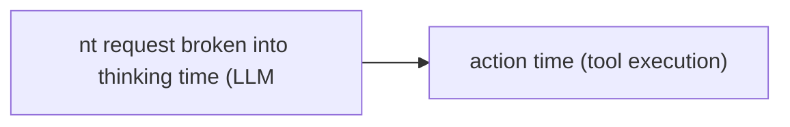
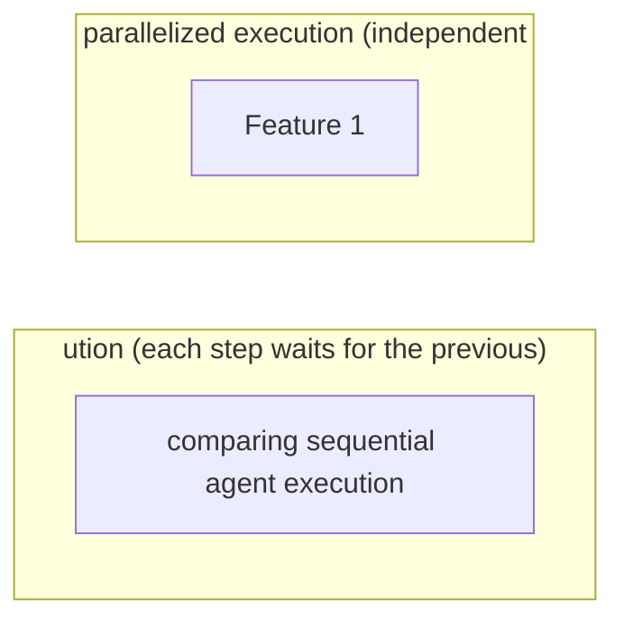

# Latency and Performance

**One-Line Summary**: Latency and performance metrics measure the time characteristics of agent execution -- time-to-first-action, end-to-end completion time, thinking versus action time -- and navigate the fundamental tradeoff where more reasoning steps produce better quality but slower responses.

**Prerequisites**: Agent loop architecture, LLM inference, streaming, tool execution, user experience design

## What Is Latency and Performance?

Imagine two consultants. Consultant A listens to your question, thinks for 30 seconds, and gives a perfect answer. Consultant B listens, thinks for 5 minutes, researches three sources, reconsiders twice, and gives an answer that is 10% better. Which do you prefer? It depends on the stakes: for a quick question, A is better; for a million-dollar decision, B is worth the wait. Agent latency faces this same tradeoff -- more processing time generally means better results, but users have finite patience and time constraints.

Latency in agent systems is fundamentally different from latency in traditional software. A web server's latency is dominated by network and database operations, typically 50-500ms. An agent's latency is dominated by LLM inference (1-30 seconds per call) and may involve multiple LLM calls (5-15 per task), tool executions (each adding its own latency), and retrieval operations. Total agent response times of 30 seconds to several minutes are common for complex tasks, orders of magnitude slower than traditional software.

Performance optimization for agents is about understanding where time is spent, which components can be parallelized, where caching can help, and where the quality-latency tradeoff can be navigated. The goal is not always to minimize latency -- sometimes longer processing produces genuinely better results -- but to ensure that every second of processing time adds proportional value and that users perceive the system as responsive even during longer operations.

## How It Works

### Time Decomposition

Agent execution time breaks down into several components: thinking time (LLM inference for reasoning and planning), action time (tool execution, API calls, code runs), retrieval time (embedding, searching, fetching documents), waiting time (queuing for rate-limited APIs, waiting for external services), and overhead time (prompt construction, context management, guardrail checks). A typical breakdown might be 60% thinking, 20% action, 10% retrieval, and 10% overhead. The dominant component varies by task type -- coding tasks are heavy on thinking, data tasks are heavy on tool execution, and research tasks are heavy on retrieval.

### Time-to-First-Token and Time-to-First-Action

Users perceive responsiveness not by total completion time but by how quickly they see the system responding. Time-to-first-token (TTFT) measures how long until the first output token appears -- typically 0.5-3 seconds. Time-to-first-action (TTFA) measures how long until the agent takes its first meaningful action. Both can be improved through streaming (showing tokens as they are generated) and progressive disclosure (showing the agent's plan before executing it). A system that streams its thinking feels responsive even if total completion takes minutes.

### Parallelization Strategies

Not all agent operations are sequential. Multiple retrieval queries can run in parallel. Independent tool calls can execute simultaneously. Even some LLM calls can be parallelized when sub-tasks are independent. An agent that decomposes "research competitors" into three independent sub-queries can run all three retrievals in parallel, reducing a 3x sequential latency to 1x parallel latency plus merge overhead. The agent architecture must be designed to identify and exploit parallelism opportunities.

### The Latency-Quality Tradeoff

More reasoning steps generally improve output quality. A coding agent that plans, implements, tests, reviews, and revises produces better code than one that generates in a single pass. But each step adds latency. The tradeoff can be navigated through: adaptive depth (simple tasks get fewer steps, complex tasks get more), early termination (stop reasoning when confidence is high enough), and quality thresholds (continue reasoning until quality meets the threshold, then stop). The optimal balance depends on user preferences, task stakes, and SLA requirements.

## Why It Matters

### User Experience and Adoption

Users have finite patience. Research on web application latency shows that user satisfaction drops sharply after 2-3 seconds, and abandonment increases after 10 seconds. Agent tasks often take 30-300 seconds. Without careful UX design (streaming, progress indicators, intermediate results), users will perceive the agent as broken or unacceptably slow. The perceived latency is as important as the actual latency.

### Cost Correlation

Latency directly correlates with cost for LLM-based systems. Longer reasoning (more tokens) costs more. More tool calls cost more. More retrieval rounds cost more. Optimizing latency often simultaneously optimizes cost, making performance improvement doubly valuable.

### Throughput and Scalability

For high-volume applications, per-request latency determines system throughput. If each request takes 60 seconds of agent processing and you have 10 concurrent workers, maximum throughput is 10 requests per minute. Reducing per-request latency to 30 seconds doubles throughput without additional infrastructure. Latency optimization directly impacts scalability.

## Key Technical Details

- **LLM inference optimization**: The largest latency contributor. Optimizations include: prompt caching (reuse common prefixes, saving 50-80% of input processing time), model selection (smaller models for simpler sub-tasks), speculative decoding (use a small model to draft tokens, large model to verify), and batching (process multiple requests simultaneously for higher throughput).
- **Streaming architecture**: Implement server-sent events (SSE) or WebSocket connections that stream agent output progressively. Show reasoning traces as they happen, tool call results as they return, and final responses token by token. This transforms a 60-second wait into a 60-second engagement.
- **Async tool execution**: Tool calls that do not depend on each other should execute asynchronously in parallel. Use a tool execution pool that dispatches independent calls simultaneously and aggregates results.
- **Latency budgets**: Allocate time budgets to each agent phase: 5 seconds for planning, 10 seconds for retrieval, 30 seconds for execution, 5 seconds for synthesis. If a phase exceeds its budget, the agent adapts (simpler plan, fewer retrievals, early termination).
- **P50/P95/P99 tracking**: Average latency hides tail latency. Track percentile latencies: P50 (median), P95 (1 in 20 requests), P99 (1 in 100 requests). Tail latency often comes from retry cascades, tool timeouts, or unusually complex reasoning. P95 and P99 are what users remember.
- **Cold start vs warm**: First requests after agent initialization may be significantly slower (model loading, cache population, connection establishment). Track cold-start latency separately and implement warm-up strategies.

## Common Misconceptions

- **"Faster is always better."** For many agent tasks, spending more time produces genuinely better results. A research agent that takes 3 minutes to produce a thorough, well-sourced analysis is more valuable than one that produces a superficial answer in 10 seconds. The goal is appropriate speed, not maximum speed.

- **"Streaming solves the latency problem."** Streaming improves perceived latency but does not reduce actual completion time. Users still wait the same total time for the final answer. Streaming is a UX improvement, not a performance improvement. Both actual latency reduction and perceived latency improvement are needed.

- **"Single LLM call latency is the bottleneck."** For multi-step agents, total latency is the sum of all LLM calls, tool calls, and retrieval operations. Optimizing a single call from 3 seconds to 2 seconds saves little when there are 10 calls. Architecture-level optimization (fewer calls, parallelization, caching) usually provides larger improvements.

- **"Model size determines latency."** While larger models are generally slower per token, other factors often dominate: prompt length (input processing scales with token count), provider load (shared infrastructure varies in speed), and output length (longer responses take longer regardless of model size). A well-cached large model can be faster than an uncached small model.

## Connections to Other Concepts

- `cost-efficiency-metrics.md` -- Latency correlates with cost because longer processing means more tokens and API calls. Latency optimization often produces cost savings as a side effect.
- `resource-limits.md` -- Time limits are a form of resource constraint that directly governs latency by forcing the agent to complete within a time budget.
- `monitoring-and-observability.md` -- Latency metrics (P50, P95, P99, time decomposition) are core monitoring signals for production agent systems.
- `agent-evaluation-methods.md` -- Latency should be reported alongside quality metrics in agent evaluations, since users care about both.
- `reliability-and-reproducibility.md` -- Latency variance affects reliability: occasional slow responses may cause timeouts that are recorded as failures.

## Further Reading

- **Leviathan et al., 2023** -- "Fast Inference from Transformers via Speculative Decoding." Proposes using small draft models to accelerate large model inference, applicable to reducing agent LLM call latency.
- **Kwon et al., 2023** -- "Efficient Memory Management for Large Language Model Serving with PagedAttention." Introduces vLLM and PagedAttention for efficient LLM serving, enabling higher throughput and lower latency.
- **Agrawal et al., 2024** -- "Taming Throughput-Latency Tradeoff in LLM Inference with Sarathi-Serve." Addresses the fundamental throughput-latency tradeoff in LLM serving, relevant to agent system design.
- **Nielsen, 1993** -- "Response Times: The 3 Important Limits." Foundational HCI research on human perception of latency thresholds (0.1s, 1s, 10s), directly applicable to designing agent interaction patterns.
