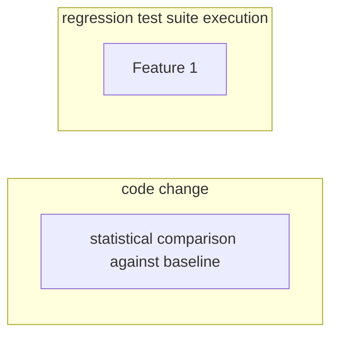
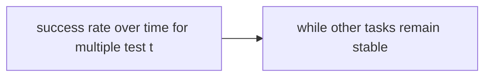

# Regression Testing

**One-Line Summary**: Regression testing for agents ensures that changes to prompts, tools, models, or configurations do not degrade previously working capabilities, using test suites of known-good task completions run through CI/CD pipelines to detect regressions from any source of change.

**Prerequisites**: Agent evaluation methods, CI/CD pipelines, version control, task completion metrics, reliability and reproducibility

## What Is Regression Testing?

Imagine a hospital where every time a doctor prescribes a new medication for a patient, nobody checks whether it interacts badly with the patient's existing medications. Eventually, a new prescription causes a dangerous interaction that would have been easily caught by checking against the existing regimen. Regression testing is that interaction check for agent systems -- every time something changes, you verify that existing capabilities still work.

In traditional software, regression testing is well-established: you maintain a test suite, run it after every code change, and investigate any failures. For AI agents, regression testing is both more important and more challenging. More important because agents have many more sources of change that can cause regressions: the underlying LLM model (provider updates), the system prompt (prompt engineering iterations), tool implementations (API changes), retrieval systems (knowledge base updates), guardrails (safety policy changes), and the orchestration logic. More challenging because agents are non-deterministic, so a "regression" might be a genuine degradation or just natural variance.

Effective agent regression testing maintains a curated suite of tasks with known-good outcomes, runs this suite automatically after every change (or periodically for external changes like model updates), uses statistical methods to distinguish real regressions from noise, and provides actionable diagnostics when regressions are detected.

## How It Works

### Test Suite Construction

A regression test suite consists of representative tasks spanning the agent's capabilities, with defined expected outcomes. Tasks are selected to cover: core capabilities (the most common and important tasks), edge cases (boundary conditions that have caused problems before), previously fixed bugs (tasks that triggered past failures, to prevent re-introduction), safety-critical scenarios (tasks where failure has serious consequences), and diverse difficulty levels (easy tasks that should always pass and hard tasks that test capability limits). Each task includes the input, expected output or outcome criteria, and optionally a reference trajectory.

### Continuous Integration Pipeline

The regression suite runs automatically in CI/CD pipelines triggered by: prompt changes (committed to version control), tool implementation changes, orchestration code changes, and scheduled runs (daily or weekly) to catch external changes like model updates. The pipeline executes each test task (ideally 3-5 runs per task for statistical confidence), evaluates outcomes against expected results, compares metrics to the baseline, and reports pass/fail with diagnostics for failures.

### Statistical Regression Detection

Because agents are non-deterministic, a single failure does not necessarily indicate regression. Statistical regression detection compares the current run's success distribution against the historical baseline. If a task previously succeeded 90% of the time (over many runs) and now succeeds 60% of the time, that is statistically significant and likely a real regression. If it went from 90% to 85%, the difference might be noise. Statistical tests (chi-squared, Fisher's exact test, or binomial tests) determine whether the change is significant at a given confidence level.

### Root Cause Diagnosis

When a regression is detected, diagnosis determines the cause. The pipeline provides: which specific tasks regressed, what changed since the last passing run (commit log, model version, config diff), trajectory comparison (how the agent's behavior on the regressed tasks differs from baseline), and step-level analysis (which step in the trajectory first diverges from expected behavior). Good diagnostics transform a "something broke" signal into "the agent now incorrectly handles the file-writing tool after the prompt change in commit abc123."

## Why It Matters

### Silent Degradation Prevention

Without regression testing, agent quality degrades silently. A prompt tweak that improves one capability might subtly break three others. A model update might change behavior on edge cases. A knowledge base update might introduce contradictions. Each individual change seems fine, but the cumulative effect is significant degradation that is only noticed when users complain -- by which time many changes have accumulated and the cause is nearly impossible to identify.

### Safe Iteration Speed

Regression testing enables faster development iteration. Without it, developers are afraid to make changes because they cannot predict the impact. With it, they can make changes confidently, knowing that the regression suite will catch problems immediately. This is especially important for prompt engineering, where small changes can have unexpected ripple effects.

### Model Update Protection

LLM providers update models regularly, sometimes without notice. These updates can change agent behavior in subtle ways: different reasoning patterns, changed tool call formatting, altered response styles, or shifted capability boundaries. Scheduled regression testing (daily or weekly) catches model-induced regressions even when no internal changes were made, alerting the team to investigate and adapt.

## Key Technical Details

- **Test suite size**: A practical regression suite contains 50-200 tasks. Fewer tasks miss important capabilities; more tasks increase CI run time and cost. Prioritize breadth of coverage over depth in any single capability.
- **Run budget**: Each regression run costs money (LLM API calls). Budget approximately: (number of tasks) x (runs per task) x (cost per run). A 100-task suite with 3 runs each at $0.10/run costs $30 per CI run. Balance thoroughness against cost.
- **Baseline management**: Maintain a versioned baseline of expected performance metrics per task. Update the baseline when intentional changes shift the expected behavior (e.g., a capability improvement that changes the "correct" output for some tasks).
- **Flaky test handling**: Some tasks are inherently unreliable (50-70% success rate even in the baseline). These "flaky" tasks generate noise in regression results. Either improve them (make them more deterministic), exclude them from regression (but track separately), or use wider statistical thresholds for naturally variable tasks.
- **Test isolation**: Each test task should be independent. Shared state between tests (reused sandbox, cached results, cumulative context) can cause cascade failures where one test's failure affects subsequent tests.
- **Evaluation oracle selection**: For each test, choose the appropriate evaluation method: exact match (deterministic outputs), test suite execution (coding tasks), LLM-as-judge (quality assessment), or custom validators (domain-specific criteria). The oracle must be more reliable than the agent being tested.
- **Time-based baselines**: Track performance over time to distinguish trends from noise. A gradual decline over 10 runs is more concerning than a single bad run. Time-series analysis on regression metrics reveals slow degradation patterns.

## Common Misconceptions

- **"Unit tests are sufficient for agent testing."** Unit tests verify individual components (tool implementations, prompt formatting) but miss integration issues (does the agent use the tool correctly in context?). Agent regression testing is integration testing by nature -- it tests the full agent pipeline end-to-end.

- **"You can pin the model version to prevent regressions."** Model pinning prevents provider-induced regressions but freezes improvements and may not be available for all providers. Some providers update models in-place without version changes. Even with pinned models, changes to prompts, tools, and knowledge bases can cause regressions.

- **"Regression testing is too expensive for AI agents."** A well-designed suite of 100 tasks with 3 runs each costs $20-50 per CI run. This is far less than the cost of shipping a regression to production and debugging it after user complaints. The cost of not testing is higher than the cost of testing.

- **"If the success rate is stable, there are no regressions."** Stable aggregate success rates can mask compensating regressions: the agent might have regressed on some tasks but improved on others, keeping the overall rate stable. Per-task regression tracking is essential, not just aggregate metrics.

- **"Regression testing catches all problems."** Regression testing catches problems on tasks in the test suite. It cannot catch problems on task types that are not represented. Regular test suite expansion, guided by production failure analysis, is necessary to maintain coverage.

## Connections to Other Concepts

- `agent-evaluation-methods.md` -- Regression testing applies evaluation methods repeatedly over time, using the same metrics but comparing against historical baselines rather than absolute standards.
- `task-completion-metrics.md` -- Regression tests use task completion metrics as their scoring mechanism, with regressions detected as statistically significant declines in these metrics.
- `reliability-and-reproducibility.md` -- Non-determinism in agents is the core challenge in regression testing, requiring statistical methods to distinguish real regressions from natural variance.
- `monitoring-and-observability.md` -- Production monitoring complements regression testing: monitoring catches issues that the test suite does not cover, and monitoring data guides test suite expansion.
- `trajectory-evaluation.md` -- Trajectory-level regression analysis reveals how agent behavior changed, not just whether outcomes changed, providing diagnostic information for fixing regressions.

## Further Reading

- **Breck et al., 2017** -- "The ML Test Score: A Rubric for ML Production Readiness and Technical Debt." Proposes a testing framework for ML systems including regression testing categories, directly applicable to agent systems.
- **Shankar et al., 2024** -- "Who Validates the Validators? Aligning LLM-Assisted Evaluation of LLM Outputs." Addresses the challenge of using LLMs as evaluation oracles in testing pipelines, relevant to automated regression test evaluation.
- **Srivastava et al., 2023** -- "Beyond the Imitation Game: Quantifying and Extrapolating the Capabilities of Language Models (BIG-Bench)." Large-scale benchmark that demonstrates the importance of comprehensive test coverage across diverse capabilities.
- **Kim et al., 2024** -- "Evaluating LLM Agent Group Performance with Regression." Studies regression patterns in LLM agents and proposes statistical methods for reliable regression detection.
