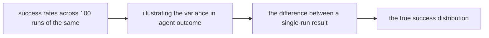
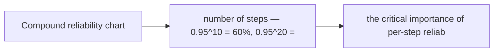

# Reliability and Reproducibility

**One-Line Summary**: Reliability and reproducibility measure an agent's consistency across repeated runs, quantifying variance through multi-run success rate distributions, deterministic testing strategies, and the critical insight that a 90% success rate means 1 in 10 production failures.

**Prerequisites**: Statistical distributions, confidence intervals, agent evaluation methods, non-determinism in LLMs, production systems

## What Is Reliability and Reproducibility?

Imagine a car that starts 90% of the time. On paper, 90% sounds acceptable -- it is an A-minus. In practice, it means roughly once every two weeks, you are stranded. You cannot trust the car for a job interview, an airport trip, or any situation where failure has consequences. Now imagine an AI agent with a 90% task success rate deployed to handle 1,000 customer requests daily. That is 100 failures every day -- 100 frustrated customers, 100 escalations, 100 potential reputation hits. Reliability is about understanding what success rates actually mean at scale.

Reproducibility is the related concept of getting the same result when you run the same task multiple times. Traditional software is deterministic: the same input always produces the same output. LLM-based agents are inherently non-deterministic due to sampling (temperature > 0), hardware floating-point variations, and the chaotic sensitivity of autoregressive generation where a tiny probability difference in one token cascades through the entire output. Run the same task 10 times and you might get 8 successes and 2 failures, with different trajectories each time.

This non-determinism fundamentally changes how agents must be evaluated, tested, and deployed. A single test run proving the agent can complete a task is almost meaningless. What matters is the distribution of outcomes across many runs: the success rate, the variance, the failure modes, and the conditions under which reliability degrades. Building reliable agents requires treating non-determinism as a first-class engineering challenge, not an inconvenience to ignore.

## How It Works

### Multi-Run Evaluation

The foundation of reliability measurement is running each evaluation task multiple times -- typically 5-100 runs depending on the desired statistical confidence. The results are analyzed as a distribution: what percentage succeeded? What is the standard deviation? Are failures random (suggesting noise) or systematic (suggesting a bug)? For a task with 80% success rate over 100 runs, the 95% confidence interval is [71%, 87%]. For the same rate over only 10 runs, the interval widens to [44%, 97%]. Sample size matters enormously for reliability estimation.

### Variance Decomposition

Not all variance is equal. Variance can be decomposed into several sources: model sampling variance (different token choices on different runs), prompt sensitivity (small phrasing changes causing different behaviors), environmental variance (tool response times, API availability), and task-inherent difficulty variance (some tasks are borderline for the agent's capability). Understanding which source dominates helps target reliability improvements. High model sampling variance might be addressed by lowering temperature. High environmental variance suggests improving tool reliability.

### Deterministic Testing Strategies

While production agents are non-deterministic, testing can be made more deterministic through several techniques: setting temperature to 0 (reduces but does not eliminate non-determinism), seeding random number generators, mocking external tool calls with fixed responses, and caching LLM responses for regression testing. Deterministic tests are useful for catching clear regressions but do not replace multi-run evaluation for measuring true reliability.

### Failure Mode Analysis

Reliability measurement is not just about the success rate but about understanding how and why failures occur. Failure mode analysis categorizes failures: wrong tool selection, incorrect parameter generation, reasoning errors, retrieval failures, timeout/resource exhaustion, and external service failures. Each failure mode has different mitigation strategies. A reliability report should include not just "90% success" but "90% success: 4% fail from wrong tool selection, 3% from reasoning errors, 2% from retrieval failures, 1% from timeouts."

## Why It Matters

### Production Reality Check

Development evaluation typically runs each task once. If it works, it ships. But a task that works 80% of the time will fail 200 times per day at 1,000 daily requests. Reliability measurement forces developers to confront the production reality of their agent's consistency before deployment, not after.

### SLA and User Expectation Management

Users and businesses have reliability expectations. A 99% reliability target (industry-standard for many services) means the agent can fail only 1 in 100 requests. Many current agents operate at 70-90% reliability -- far below typical software SLAs. Measuring reliability accurately is prerequisite to setting realistic expectations and identifying what needs to improve.

### Compound Reliability in Multi-Step Tasks

An agent that succeeds 95% on each individual step has a dramatically lower success rate on multi-step tasks. For a 10-step task: 0.95^10 = 60% end-to-end success. For a 20-step task: 0.95^20 = 36%. This compound effect means that per-step reliability must be very high (99%+) for multi-step tasks to be reliable. Understanding compound reliability is essential for designing agents for complex workflows.

## Key Technical Details

- **Confidence intervals**: Always report confidence intervals with success rates. For n trials with k successes, use the Wilson score interval or Clopper-Pearson interval for small samples. Report 95% CIs as standard practice.
- **Required sample sizes**: To distinguish between 80% and 90% success rates with 95% confidence, you need approximately 200 runs. To distinguish 95% from 99%, you need approximately 1,000 runs. Plan evaluation budgets accordingly.
- **Stratified reliability**: Report reliability stratified by task difficulty, task type, and domain. An overall 85% success rate might hide 95% on easy tasks and 60% on hard tasks. Stratified reporting reveals where reliability needs improvement.
- **Temperature and reliability**: Setting temperature to 0 maximizes determinism but may reduce quality on creative or open-ended tasks. Temperature 0.1-0.3 provides a good balance of consistency and diversity for most agent tasks.
- **Retry-adjusted reliability**: With automatic retries, effective reliability improves. If per-attempt success rate is p, success rate with up to k retries is 1 - (1-p)^k (assuming independent attempts). Two retries at 80% per-attempt success yield 96% effective reliability.
- **Mean time between failures (MTBF)**: For production agents, track MTBF as a reliability metric. At 95% success rate with 1,000 requests/day, MTBF is approximately 20 requests (3 minutes at consistent throughput). Present MTBF in addition to percentage rates to make failure frequency concrete.
- **Reliability degradation signals**: Track reliability over time. Gradual declines may indicate model drift, knowledge base staleness, or environmental changes. Sudden drops suggest breaking changes in tools, APIs, or model versions.

## Common Misconceptions

- **"90% success rate is good enough."** Whether 90% is acceptable depends entirely on the application, volume, and consequences of failure. For a coding assistant used 10 times a day, 90% means roughly one failure per day -- tolerable. For an automated customer service agent handling 10,000 requests daily, 90% means 1,000 failures -- a crisis.

- **"Non-determinism is always bad."** Some non-determinism is actually beneficial. An agent that takes slightly different paths on different runs may find solutions that a fully deterministic agent would miss. The goal is not to eliminate non-determinism but to ensure that the distribution of outcomes is consistently good.

- **"A single successful test means the agent works."** A single success on a non-deterministic system provides almost no reliability information. The agent might succeed 99% of the time or 10% of the time -- you cannot tell from one run. Multi-run evaluation is essential.

- **"Reliability is the same as correctness."** An agent can be reliably wrong (consistently producing the same incorrect output) or correctly unreliable (sometimes right, sometimes wrong). Reliability is about consistency; correctness is about accuracy. Both matter, independently.

## Connections to Other Concepts

- `agent-evaluation-methods.md` -- Multi-run evaluation with statistical reporting is a core evaluation methodology, and reliability measurement shapes how other evaluation results are interpreted.
- `agent-benchmarks.md` -- Benchmark results should always include variance information: mean and standard deviation over multiple runs, or confidence intervals.
- `regression-testing.md` -- Reliability baselines from multi-run evaluation form the reference points for detecting regressions in subsequent testing.
- `monitoring-and-observability.md` -- Production monitoring provides real-world reliability data that may differ from evaluation results due to distribution shift in real tasks.
- `resource-limits.md` -- Retry strategies that improve reliability consume additional resources, creating a direct tradeoff between reliability and cost.

## Further Reading

- **Kapoor et al., 2024** -- "AI Agents That Matter." Argues that agent evaluations without variance reporting are misleading and proposes standards for reliability reporting in agent research.
- **Ouyang et al., 2024** -- "The Unreliability of LLM Agent Benchmarks: A Case Study on SWE-bench." Analyzes the reliability of benchmark results themselves, finding significant variance across runs.
- **Agrawal et al., 2023** -- "Do Language Models Know When They Don't Know?" Studies the calibration and consistency of LLM confidence, relevant to predicting when agents will fail.
- **Brown et al., 2024** -- "Large Language Monkeys: Scaling Inference Compute with Repeated Sampling." Demonstrates that repeated attempts can dramatically improve success rates, quantifying the reliability-cost tradeoff.
