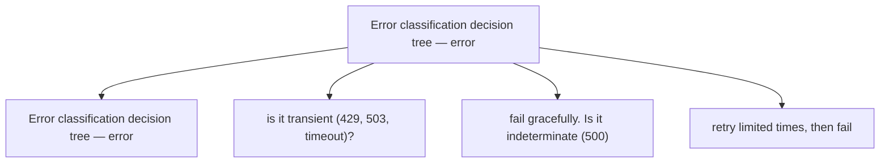

# Error Handling and Retries

**One-Line Summary**: Robust agent execution requires systematic error classification, intelligent retry policies, circuit breakers, and graceful degradation to handle the inevitable failures in multi-step, multi-service agent workflows.

**Prerequisites**: Agent orchestration, tool use and function calling, state machines and graphs

## What Is Error Handling and Retries?

Consider a postal service delivering a package. If the recipient is not home, the carrier does not throw the package away -- they leave a notice and try again tomorrow. If the address does not exist, retrying is pointless -- they return to sender. If there is a blizzard, they stop all deliveries until conditions improve. Agent error handling works on the same principles: classify the failure, decide whether to retry or abort, implement a backoff strategy to avoid making things worse, and have fallback plans when all retries are exhausted.

Agents are unusually error-prone because they chain multiple unreliable components. An LLM might hallucinate a malformed tool call. A web API might return a 429 rate limit error. A web scraping step might encounter an unexpected page layout. A file system operation might hit a permission error. In a 20-step agent task, if each step has a 95% success rate, the probability of completing all steps without error is 0.95^20 = 36%. Without error handling, most non-trivial agent tasks would fail.

The distinction between transient and permanent errors is fundamental. Transient errors (rate limits, network timeouts, temporary service outages) are worth retrying because the underlying condition is likely to resolve. Permanent errors (invalid API key, file not found, malformed request) will never succeed no matter how many times you retry. Misclassifying errors -- retrying permanent failures or giving up on transient ones -- is one of the most common bugs in production agent systems.

## How It Works

### Error Classification
The first step in handling an error is classifying it. The primary taxonomy: **Transient errors** are temporary and likely to resolve on retry. HTTP 429 (rate limit), 503 (service unavailable), network timeouts, and connection resets are transient. **Permanent errors** will not resolve on retry. HTTP 400 (bad request), 401 (unauthorized), 404 (not found), and validation errors are permanent. **Indeterminate errors** might be either. HTTP 500 (internal server error) could be a transient server issue or a permanent bug triggered by your input. A practical approach: treat 500 errors as transient for the first 2-3 retries, then classify as permanent.

### Retry Policies
Once you have decided to retry, the retry policy determines when and how. **Fixed delay**: wait N seconds between retries. Simple but suboptimal -- all retrying clients synchronize their retries, creating thundering herd effects. **Exponential backoff**: wait 1s, 2s, 4s, 8s, 16s between retries. Spreads out retry load over time. **Exponential backoff with jitter**: add a random component (e.g., wait `2^attempt * (0.5 + random(0, 0.5))` seconds). The jitter desynchronizes retrying clients, preventing correlated retry storms. This is the recommended default for production systems. **Maximum retries**: cap at 3-5 attempts for most operations. **Maximum elapsed time**: cap total retry duration at 30-60 seconds to prevent indefinite waiting.

### Circuit Breakers
A circuit breaker prevents an agent from repeatedly calling a service that is clearly down. It works in three states: **Closed** (normal operation -- requests flow through), **Open** (service is failing -- requests are immediately rejected without calling the service), and **Half-open** (after a cooldown period, allow one test request through to check if the service has recovered). The circuit opens when the failure rate exceeds a threshold (e.g., 5 failures in 60 seconds). This protects both the agent (from wasting time and tokens on doomed requests) and the failing service (from being overwhelmed by retry traffic).

### Graceful Degradation
When all retries are exhausted, the agent must degrade gracefully rather than crash. Strategies include: **Fallback to cached data** -- use the last known good result from a previous successful call. **Partial results** -- if 3 of 4 data sources responded, synthesize a report from the 3 available sources and note the gap. **Alternative tools** -- if the primary search engine is down, fall back to a secondary one. **Human escalation** -- flag the task for human attention when automated recovery is impossible. **Skip and continue** -- for non-critical steps, log the failure and proceed with the remaining workflow.

## Why It Matters

### Production Reliability
In production, agents run thousands of tasks per day across unreliable networks, rate-limited APIs, and occasionally buggy tools. Without systematic error handling, failure rates compound across steps. With proper retry logic, a step that fails 10% of the time on the first attempt fails only 0.1% of the time with 2 retries (assuming independent failures). This transforms a fragile agent into a reliable one.

### Cost Control
Uncontrolled retries waste money. An agent that retries a failed LLM call immediately, 10 times, burns 10x the tokens for no benefit. Exponential backoff with a maximum retry count limits the blast radius of failures. Circuit breakers prevent runaway costs when a service is completely down. Proper error handling is also a cost optimization strategy.

### User Experience
An agent that silently fails or returns cryptic error messages destroys user trust. Graceful degradation means the user gets a useful (if incomplete) result rather than nothing. Clear error reporting ("I could not access the financial database, so this analysis covers only publicly available data") lets the user make informed decisions about the partial result.

## Key Technical Details

- **The `tenacity` library** in Python provides configurable retry decorators with exponential backoff, jitter, retry conditions, and stop conditions out of the box
- **LLM-specific retries** should handle both API errors (rate limits, timeouts) and semantic errors (malformed tool calls, invalid JSON output) -- the latter require re-prompting, not just re-calling
- **Idempotency** is essential for safe retries: if a tool call has side effects (sending an email, creating a file), retrying after an ambiguous failure risks duplicate execution. Use idempotency keys where available.
- **Error budgets** set a maximum acceptable failure rate (e.g., 1% of tasks may fail completely). When the error budget is exceeded, the system pauses to investigate rather than continuing to fail.
- **Timeout hierarchies**: individual tool calls might timeout at 30 seconds, individual steps at 2 minutes, and the overall task at 30 minutes. Each level has its own handling logic.
- **Structured error responses** from tools should include error type, a human-readable message, and whether the error is retryable, enabling automated classification
- **Retry context** should include the error from the previous attempt when re-prompting the LLM, allowing the model to adjust its approach (e.g., reformulate a malformed query)

## Common Misconceptions

- **"Just retry everything three times."** Retrying permanent errors wastes time and money. Retrying without backoff can worsen rate limiting. Retrying non-idempotent operations can cause duplicates. Intelligent error classification must precede retry decisions.
- **"LLM errors are always transient."** LLM hallucinations, malformed outputs, and reasoning errors are not transient in the traditional sense -- retrying with the exact same prompt often produces the same bad output. These require re-prompting with additional guidance or error context.
- **"Circuit breakers are overkill for agents."** An agent calling a rate-limited API without a circuit breaker can burn through its entire rate limit budget in seconds during an error cascade. Circuit breakers are essential for any agent that makes external API calls.
- **"Error handling makes agents slower."** Well-implemented error handling adds negligible overhead on the happy path. The latency cost of retries on the unhappy path is far less than the cost of task failure and manual recovery.

## Connections to Other Concepts

- `agent-orchestration.md` -- The orchestrator is where error handling policies are configured and enforced across the agent's execution flow
- `state-machines-and-graphs.md` -- Graph-based agents can define explicit error nodes and recovery edges as first-class parts of the control flow
- `logging-tracing-and-debugging.md` -- Error handling produces structured error logs and traces that are essential for diagnosing and preventing recurring failures
- `cost-optimization.md` -- Uncontrolled retries are a significant source of cost overruns; error handling directly supports cost management
- `agent-deployment.md` -- Production deployment must include monitoring for error rates, circuit breaker states, and retry patterns

## Further Reading

- **Nygard, "Release It! Design and Deploy Production-Ready Software" (2018)** -- Definitive guide to stability patterns including circuit breakers, bulkheads, and timeouts, directly applicable to agent systems
- **AWS Architecture Blog, "Exponential Backoff and Jitter" (2015)** -- Classic analysis of retry strategies with jitter, showing why randomized backoff outperforms deterministic approaches
- **"Tenacity Documentation" (Python, 2024)** -- Reference for the most popular Python retry library, with examples of configuring backoff, stop conditions, and retry predicates
- **Polly Documentation (.NET, 2024)** -- Comprehensive resilience library implementing retry, circuit breaker, timeout, bulkhead, and fallback patterns in a composable pipeline
- **"Error Handling Patterns for LLM Applications" (Anthropic Cookbook, 2024)** -- Practical patterns for handling both API-level and semantic-level errors in Claude-based applications
