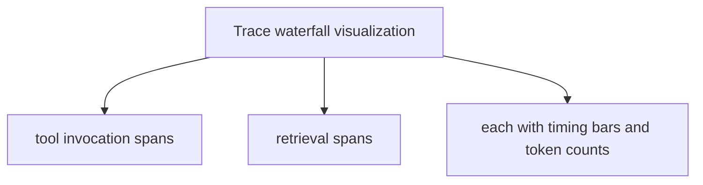
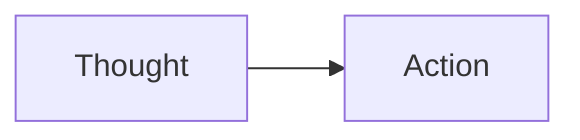

# Logging, Tracing, and Debugging

**One-Line Summary**: Observability for agents requires capturing structured traces of thought-action-observation chains, enabling developers to replay, diagnose, and optimize multi-step agent behavior.

**Prerequisites**: Agent orchestration, ReAct pattern, error handling and retries

## What Is Logging, Tracing, and Debugging?

Imagine debugging a car that drove itself across the country and arrived at the wrong destination. You cannot simply check the final position -- you need the complete route log: every turn decision, every GPS reading, every detour. Agent debugging faces the same challenge. A 30-step agent that produces a wrong answer could have gone wrong at any step. Without traces, you are left guessing which of the 30 steps introduced the error. With traces, you can replay the execution, inspect each decision, and pinpoint exactly where reasoning diverged from the correct path.

Traditional software logging captures discrete events: "request received," "database query executed," "response sent." Agent tracing captures a richer structure: the chain of thought (what the model was thinking), the action (what tool it decided to call), the observation (what the tool returned), and the decision (what the model concluded from the observation). This thought-action-observation trace is the fundamental unit of agent observability, and it must be captured for every step of every agent execution.

The tooling ecosystem for agent observability is maturing rapidly. LangSmith (from LangChain) provides trace visualization, evaluation, and dataset management. Braintrust offers logging with built-in evaluation scoring. Arize Phoenix provides open-source tracing with LLM-as-judge evaluation. These tools share a common model: capture structured traces, visualize execution flows, enable filtering and search across runs, and support automated evaluation of agent quality.

## How It Works

### Trace Formats and Structure
An agent trace is a tree of spans. The root span represents the entire agent invocation. Child spans represent individual steps: LLM calls, tool invocations, retrieval operations. Each span captures: start time, end time, input (the prompt or tool arguments), output (the LLM response or tool result), metadata (model name, token count, cost), and status (success, error, timeout). For LLM spans, the input includes the full prompt and the output includes the complete response, enabling exact reproduction of the model's behavior. The OpenTelemetry standard is increasingly adopted for agent tracing, with semantic conventions for LLM spans.

### Step-by-Step Execution Logs
Beyond structured traces, human-readable logs capture the agent's progression. A typical log format shows: `[Step 1] Thought: I need to find the user's account details. Action: search_database(user_id="123"). [Step 2] Observation: {name: "Alice", plan: "Pro", ...}. Thought: Alice is on the Pro plan, I can proceed with...`. These logs make the agent's reasoning chain legible to developers. Best practice: log at INFO level for the thought-action-observation chain, DEBUG level for full prompt/response payloads, and ERROR level for failures with stack traces.

### Replay Debugging
Replay debugging re-executes an agent from a specific state in its execution history. If an agent failed at step 15, you can reconstruct the state at step 14 (from checkpoints) and re-run step 15 with different parameters, a modified prompt, or additional context. LangGraph's checkpointing enables this natively: each step's state is persisted, and any checkpoint can be loaded and resumed. This is dramatically more efficient than re-running the entire agent from scratch, especially for long-running tasks where the first 14 steps took minutes and significant API costs.

### Evaluation and Scoring
Traces enable systematic evaluation beyond pass/fail. You can score individual steps: Did the model choose the right tool? Did it extract the correct information? Did it reason correctly about the observation? LLM-as-judge evaluation uses a separate model to score trace steps against criteria. For example, scoring whether the agent's search query was well-formed, whether its synthesis was faithful to the sources, or whether it asked for clarification when it should have. Aggregate scores across many traces reveal systematic weaknesses.

## Why It Matters

### Debugging Non-Deterministic Systems
LLMs are stochastic. The same agent with the same input might take different paths and produce different outputs. Without tracing, debugging becomes nearly impossible -- you cannot reproduce the failure because the next run might succeed. Traces capture the exact execution path, including the model's specific outputs at each step, enabling deterministic analysis of non-deterministic behavior. This is the single most important capability for maintaining production agents.

### Performance Optimization
Traces reveal performance bottlenecks. You might discover that 60% of execution time is spent in a single tool call, or that the model consistently makes 3 unnecessary intermediate steps, or that context assembly is taking 500ms per step. Without traces, these bottlenecks are invisible. With traces, you can measure latency per step, token usage per call, and identify optimization targets with data rather than intuition.

### Continuous Improvement
Production agents should improve over time. Traces provide the data for this improvement. By reviewing traces of failed tasks, you identify common failure modes and address them with prompt improvements, better tool descriptions, or additional guardrails. By reviewing traces of slow tasks, you optimize for latency. Trace datasets also serve as test suites: you can replay historical traces against updated agent configurations to verify that changes improve behavior without introducing regressions.

## Key Technical Details

- **LangSmith** stores traces as hierarchical run trees with parent-child relationships, supports filtering by metadata, latency, token count, and error status, and enables annotation for human evaluation
- **OpenTelemetry (OTel) integration** uses the `gen_ai` semantic conventions for LLM spans, capturing `gen_ai.system`, `gen_ai.request.model`, `gen_ai.usage.prompt_tokens`, and similar attributes
- **Trace sampling** is necessary at scale: logging every trace for an agent handling 10,000 requests/day is expensive. Sample 100% of errors, 10% of successes, and 100% of slow requests (above a latency threshold)
- **PII redaction** must be applied to traces before storage: user messages, tool outputs, and LLM responses often contain personal information that must be masked or removed for compliance
- **Cost attribution** tags each trace span with its token cost, enabling per-task, per-step, and per-model cost breakdowns across the agent fleet
- **Correlation IDs** link traces across services: if an agent calls an external API, the correlation ID connects the agent trace to the API's server-side trace, enabling end-to-end debugging

## Common Misconceptions

- **"print() statements are sufficient for agent debugging."** Print statements capture point-in-time values but lack structure, hierarchy, timing, and the ability to search across thousands of executions. Structured tracing is fundamentally different in capability.
- **"You only need traces when something goes wrong."** Traces of successful executions are equally valuable -- they reveal optimization opportunities, establish performance baselines, and serve as regression test data.
- **"Tracing adds significant overhead."** Modern tracing libraries add microseconds per span. The overhead is negligible compared to LLM call latency (typically 1-30 seconds per call). Async trace export ensures tracing does not block agent execution.
- **"LLM-as-judge evaluation is unreliable."** When calibrated with human-labeled examples and used with strong models (GPT-4o, Claude Sonnet), LLM-as-judge achieves 80-90% agreement with human evaluators, sufficient for automated monitoring and trend detection.

## Connections to Other Concepts

- `agent-orchestration.md` -- Orchestration frameworks emit traces automatically; LangGraph produces detailed traces of graph execution including state at each node
- `error-handling-and-retries.md` -- Error traces include retry attempts, backoff delays, and final failure reasons, essential for diagnosing reliability issues
- `state-machines-and-graphs.md` -- Graph-based execution produces traces that map directly to graph nodes, enabling visual debugging overlaid on the graph structure
- `cost-optimization.md` -- Trace-based cost attribution reveals which steps, tools, and models consume the most tokens, guiding optimization decisions
- `agent-deployment.md` -- Production deployment requires monitoring dashboards built from trace data: success rates, latency percentiles, error distributions

## Further Reading

- **LangSmith Documentation (LangChain, 2024)** -- Comprehensive platform for agent tracing, evaluation, dataset management, and prompt versioning with visual trace exploration
- **Braintrust Documentation (2024)** -- Logging and evaluation platform with built-in scoring, A/B testing, and dataset management for LLM applications
- **"Observability for LLM Applications" (Arize AI, 2024)** -- Open-source Phoenix library for tracing LLM applications with OpenTelemetry-compatible instrumentation
- **OpenTelemetry Semantic Conventions for GenAI (2024)** -- Emerging standard for LLM span attributes, enabling interoperability across tracing backends
- **"Evaluating LLM Agents" (Anthropic, 2024)** -- Patterns for using traces to evaluate agent behavior including step-level scoring, trajectory comparison, and regression detection
