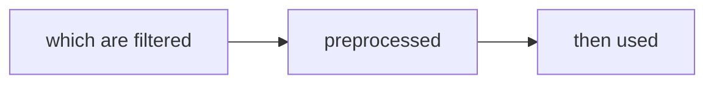
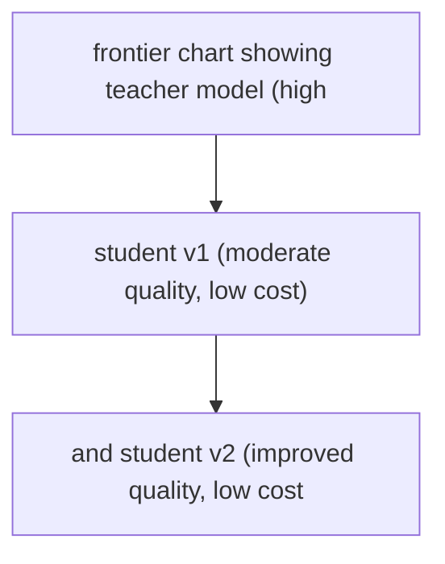

# Agent Distillation

**One-Line Summary**: Agent distillation trains smaller, faster, cheaper models on successful trajectories collected from expensive frontier agents, trading inference-time compute for training-time compute to reduce production costs by 10-100x.

**Prerequisites**: Fine-tuning, agent evaluation, autonomous coding agents, cost optimization

## What Is Agent Distillation?

Think of a master chef training an apprentice. The master spends years developing recipes through costly experimentation -- failed dishes, wasted ingredients, long hours of trial and error. The apprentice watches the master's finished techniques, practices the established recipes, and reaches competency in months rather than years. They may not innovate like the master, but they execute the known recipes reliably and quickly. Agent distillation works the same way: a powerful frontier model (the master) solves tasks through expensive multi-step reasoning, and its successful solution paths are used to train a smaller model (the apprentice) that reproduces those solutions at a fraction of the cost.

The economics are compelling. A frontier model like Claude Opus or GPT-4o might cost $15 per million input tokens and require 50K tokens per task, costing $0.75 per task. A distilled model based on Claude Haiku or a fine-tuned open-source model might cost $0.25 per million tokens and require only 5K tokens (because it has internalized the reasoning patterns), costing $0.00125 per task -- a 600x cost reduction. At scale (100K tasks/day), this is the difference between $75,000 and $125 daily.

The key insight is that inference-time compute and training-time compute are substitutable. The frontier model "thinks hard" at inference time, spending many tokens on chain-of-thought reasoning, exploration, and self-correction. The distilled model has internalized these reasoning patterns during training, so it can produce the correct action sequence in fewer steps with less deliberation. You pay the compute cost once (during training) instead of on every inference.

## How It Works

### Trajectory Collection
The first step is collecting successful agent trajectories from the frontier model. A trajectory is the complete sequence of (state, action, observation) triples from a task's start to its successful completion. For a coding agent, this includes: the issue description, each file read/edit/search action, each test execution, each debugging step, and the final passing state. You run the frontier model on hundreds or thousands of tasks, filter for successful completions, and store the trajectories as training data. Quality filtering is critical: include only trajectories that solved the task correctly and efficiently, excluding ones that wandered or used excessive steps.

### Trajectory Preprocessing
Raw trajectories from frontier models are often noisy. The model may have taken exploratory detours, made mistakes that it later corrected, or included verbose reasoning that is not necessary for the solution. Preprocessing cleans trajectories by: **Removing failed branches** (if the model tried approach A, failed, then succeeded with approach B, keep only approach B). **Compressing reasoning** (replace 500 tokens of chain-of-thought with a 50-token summary of the key insight). **Standardizing format** (ensure consistent action formatting across all trajectories). **Deduplicating** (if multiple trajectories solve the same task, keep the most efficient one).

### Fine-Tuning the Student Model
The preprocessed trajectories become supervised training data. The student model is fine-tuned to predict the correct action given the current state. Training approaches include: **Behavioral cloning** -- train the student to exactly replicate the teacher's action at each step (supervised learning on (state, action) pairs). **Trajectory-level training** -- train on complete trajectories as multi-turn conversations, teaching the model the full task completion pattern. **Filtered behavioral cloning** -- weight training examples by trajectory quality (shorter, more efficient trajectories get higher weight). The base model is typically a smaller variant from the same family (Haiku instead of Opus) or an open-source model (Llama, Mistral).

### Iterative Distillation
A single round of distillation rarely achieves optimal results. Iterative distillation improves the student across multiple rounds: (1) Collect trajectories from the teacher. (2) Train the student. (3) Run the student on new tasks. (4) The student succeeds on some tasks but fails on others. (5) Run the teacher on the tasks the student failed. (6) Add these new trajectories to the training set. (7) Retrain the student. Each round focuses the training data on the student's weaknesses, progressively closing the performance gap with the teacher.

## Why It Matters

### Production Cost Reduction
The cost difference between frontier and distilled models is the difference between economically viable and unviable agent products. A customer support agent costing $2 per interaction cannot compete with human agents. The same agent distilled to $0.05 per interaction is transformatively cheaper than any alternative. Distillation is often the step that takes an agent from "impressive demo" to "deployed product."

### Latency Improvement
Smaller models generate tokens faster. A distilled model with 7B parameters runs 5-10x faster than a 175B+ parameter frontier model. For agents where latency matters (interactive coding assistants, real-time customer support), distillation reduces per-step latency from seconds to hundreds of milliseconds. Combined with fewer required steps (the distilled model has internalized efficient patterns), end-to-end task completion time can improve by 10-50x.

### Deployment Flexibility
Frontier models require massive GPU clusters and are available only through API providers. Distilled models can run on a single GPU, enabling on-premise deployment, offline operation, and edge deployment scenarios. An enterprise that cannot send data to external APIs for compliance reasons can deploy a distilled agent model within their own infrastructure.

## Key Technical Details

- **Trajectory quality filtering**: only include trajectories that solve the task in fewer than the median number of steps; this teaches the student efficient behavior rather than wandering exploration
- **Data volume**: effective distillation typically requires 1,000-10,000 successful trajectories, depending on task diversity and model size. More diverse tasks require more data
- **Base model selection**: the student should be capable enough to learn the task. Distilling complex coding agent behavior into a 1B parameter model usually fails; 7B-13B models are the practical minimum for complex tasks
- **Evaluation parity**: the distilled model must be evaluated on the same benchmark as the teacher to measure the quality gap. A distilled coding agent should be tested on SWE-bench, not just simple coding tasks
- **Overfitting risk**: fine-tuning on a narrow set of trajectories can cause the student to memorize specific solutions rather than learning generalizable patterns. Hold out 20% of trajectories for validation and monitor validation loss
- **Action format consistency**: the student must generate actions in the exact format expected by the agent framework (correct JSON tool calls, valid file paths). Format errors that the teacher never makes can be a significant source of student failures
- **Cost-quality Pareto frontier**: plot cost vs quality for teacher, student-v1, student-v2, etc. to find the optimal operating point. Sometimes a student that matches 80% of teacher quality at 5% of the cost is preferable to one that matches 95% at 20% of the cost

## Common Misconceptions

- **"Distillation preserves 100% of the teacher's capability."** There is always a quality gap. Typical distillation achieves 70-90% of the teacher's benchmark performance. The gap is larger for tasks requiring complex multi-step reasoning and smaller for pattern-matching tasks.
- **"You need millions of training examples."** Agent trajectories are information-rich (each contains many reasoning steps). A few thousand high-quality trajectories often suffice, especially when combined with iterative distillation that targets the student's specific weaknesses.
- **"Distillation is just fine-tuning."** Distillation specifically involves transferring capability from a more capable model to a less capable one using the more capable model's outputs as training data. Fine-tuning is a broader term that includes training on human-generated data, which is not distillation.
- **"Smaller models cannot handle agent tasks."** Fine-tuned 7B models have demonstrated strong performance on specific agent tasks when distilled from frontier models. The key is that the student specializes in the distilled task domain rather than being a general-purpose model.
- **"You only need to distill once."** As the teacher model improves (new versions, better prompts), the student should be re-distilled to benefit from the improvements. Distillation is an ongoing process, not a one-time event.

## Connections to Other Concepts

- `cost-optimization.md` -- Distillation is the most impactful cost optimization technique for high-volume agent deployments, reducing per-task cost by orders of magnitude
- `autonomous-coding-agents.md` -- Coding agent trajectories from SWE-bench are a prime distillation target: well-defined tasks, objective evaluation, and high frontier model performance
- `self-improving-agents.md` -- Distillation is a form of self-improvement where the agent's own successful behavior is used to train a faster version of itself
- `agent-deployment.md` -- Distilled models change the deployment calculus: smaller models enable on-premise deployment and reduce infrastructure requirements
- `simulation-environments.md` -- Simulated environments provide the controlled setting for collecting large numbers of teacher trajectories efficiently

## Further Reading

- **Hinton, Vinyals, and Dean, "Distilling the Knowledge in a Neural Network" (2015)** -- Foundational paper on knowledge distillation, introducing the concept of training smaller models on the soft outputs of larger models
- **Mukherjee et al., "Orca: Progressive Learning from Complex Explanation Traces of GPT-4" (2023)** -- Demonstrates distillation from GPT-4 explanation traces to train smaller models that preserve reasoning capabilities
- **Xu et al., "WizardLM: Empowering Large Language Models to Follow Complex Instructions" (2023)** -- Uses evolutionary prompt generation and distillation to create smaller models with strong instruction-following capability
- **Hsieh et al., "Distilling Step-by-Step! Outperforming Larger Language Models with Less Training Data and Smaller Model Sizes" (2023)** -- Shows that distilling reasoning rationales (not just final answers) enables smaller models to match or exceed larger models
- **Chen et al., "Fireact: Toward Language Agent Fine-tuning" (2023)** -- Directly addresses fine-tuning language agents on ReAct-style trajectories, comparing trajectory distillation across multiple models
