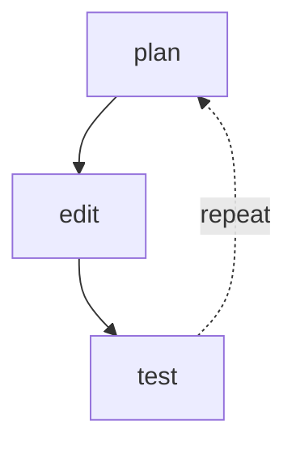
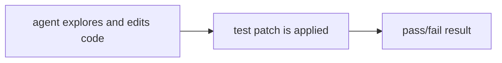

# Autonomous Coding Agents

**One-Line Summary**: Autonomous coding agents write, test, debug, and iterate on code with minimal human intervention, representing the most mature and practically impactful category of AI agents today.

**Prerequisites**: Tool use and function calling, ReAct pattern, planning and decomposition, error handling and retries

## What Is Autonomous Coding Agents?

Imagine a junior developer who never sleeps, never gets frustrated, reads documentation instantly, and can try a hundred different approaches in the time a human tries one. They are not as creative as your best senior engineer, but they handle the grunt work -- bug fixes, test writing, refactoring, boilerplate -- with remarkable consistency. Autonomous coding agents are this junior developer, operating in an edit-test-debug loop that mirrors how human programmers work: read the issue, understand the codebase, write a fix, run the tests, read the error, adjust, and repeat.

Coding is an ideal domain for agents because it has a tight feedback loop with objective evaluation. When an agent writes code, it can run the tests immediately and get unambiguous feedback: the tests pass or they do not. This is fundamentally different from, say, a writing agent where quality is subjective. The ability to self-evaluate by executing code turns the coding task into a search problem: try approaches, evaluate results, refine until the tests pass. This is why coding agents have advanced faster than agents in most other domains.

The landscape of coding agents evolved rapidly from 2023 to 2025. GitHub Copilot pioneered inline code completion. Cursor extended this to multi-file editing with AI. Devin (Cognition Labs, 2024) demonstrated end-to-end autonomous coding. Claude Code (Anthropic, 2025) brought terminal-based autonomous coding with direct file system and shell access. SWE-bench became the standard benchmark, with verified scores climbing from under 5% in early 2024 to over 50% by late 2024. The field is converging on a common architecture: a capable LLM with file system access, terminal access, and a structured edit-test-debug loop.

## How It Works

### The Edit-Test-Debug Loop
The core execution pattern: (1) **Understand** -- read the issue description, explore relevant source files, understand the codebase structure. (2) **Plan** -- decide which files to modify and what changes to make. (3) **Edit** -- make the code changes using file editing tools. (4) **Test** -- run the test suite (or relevant subset) to check if the changes work. (5) **Debug** -- if tests fail, read the error output, diagnose the issue, and return to step 3. This loop continues until tests pass or a maximum iteration count is reached. The best agents iterate 5-15 times on complex tasks, each iteration refining the approach based on test feedback.

### Codebase Understanding
Before writing code, the agent must understand the existing codebase. This involves: **File exploration** using directory listings and file reading to understand project structure. **Symbol search** using grep, ripgrep, or AST-based tools to find relevant functions, classes, and variables. **Dependency analysis** to understand how components interact. **Test analysis** to understand what the existing tests expect. The agent builds a mental model of the codebase through these exploration tools, similar to how a new developer onboards. Current agents struggle with very large codebases (100K+ files) where the relevant context is spread across many locations.

### Tool Arsenal
Coding agents typically have access to: **File operations** (read, write, edit, create, delete files). **Terminal access** (run arbitrary shell commands: tests, builds, linters, git operations). **Search tools** (grep for content search, find/glob for file search, sometimes AST-based semantic search). **Browser access** (for reading documentation, understanding API references). These tools give the agent the same capabilities as a developer working in a terminal. More advanced setups include LSP (Language Server Protocol) integration for go-to-definition, find-references, and type-checking.

### Benchmarking with SWE-bench
SWE-bench (Software Engineering Benchmark) is the standard evaluation for coding agents. It consists of real GitHub issues from popular Python repositories (Django, scikit-learn, Flask, etc.) with corresponding test patches. The agent receives the issue description and repository state, makes code changes, and is evaluated against the test patch. SWE-bench Lite contains 300 curated instances; SWE-bench Verified contains 500 instances verified by human software engineers. Top systems achieve 40-55% on SWE-bench Verified as of early 2025, meaning they solve roughly half of real-world GitHub issues autonomously.

## Why It Matters

### Developer Productivity
Coding agents handle the tasks developers find tedious: writing unit tests, fixing linter errors, implementing boilerplate CRUD endpoints, migrating API versions, refactoring patterns across files. By offloading these tasks, developers focus on architecture, design, and novel problem-solving. Early data from Copilot studies suggests 30-50% productivity improvement for code completion alone; autonomous agents that handle entire tasks promise even larger gains.

### 24/7 Development Capacity
Coding agents do not have working hours. A team can queue up 50 bug fixes before leaving for the day and find many resolved by morning. CI/CD integration enables agents to pick up failing tests, attempt fixes, and submit pull requests autonomously. This transforms development from a purely human-hours-constrained activity to one where AI handles routine work continuously.

### Democratization of Software
People who understand problems but cannot write code can now describe what they need and have an agent build it. A researcher who needs a data analysis script, a small business owner who needs a simple web application, a designer who needs a prototype -- coding agents lower the barrier from "must know a programming language" to "must be able to describe the desired behavior." This is not yet reliable for complex software but is increasingly viable for small to medium projects.

## Key Technical Details

- **SWE-bench Verified scores** (as of early 2025): Claude 3.5 Sonnet with scaffolding achieves ~50%, GPT-4o with scaffolding achieves ~30-40%, open-source solutions achieve ~20-30%
- **Token consumption per task**: solving a SWE-bench issue typically requires 50K-500K tokens across multiple LLM calls, costing $0.15-$7.50 at Sonnet pricing
- **Iteration count**: successful solutions average 3-8 edit-test-debug iterations; failures often exhaust the maximum iteration budget (typically 15-25 iterations)
- **File editing strategies**: diff-based patching (apply a unified diff), search-and-replace (find exact string, replace with new string), and whole-file rewrite. Search-and-replace is most reliable for targeted changes; whole-file rewrite works for small files
- **Test selection** matters: running the full test suite after each edit is slow. Agents that identify and run only the relevant test subset iterate faster and solve more problems within time budgets
- **Repository context limits**: most agents can explore and understand repositories up to ~10K files. Beyond that, search and navigation becomes the bottleneck
- **Language coverage**: Python is best-supported due to SWE-bench focus. TypeScript/JavaScript, Java, Go, and Rust support varies by agent. Language-specific tooling (type checkers, linters) significantly improves agent performance

## Common Misconceptions

- **"Coding agents will replace developers."** Current agents solve 50% of well-specified GitHub issues -- tasks with clear descriptions and test cases. They struggle with ambiguous requirements, system design, performance optimization, and tasks requiring deep domain knowledge. They augment developers rather than replace them.
- **"If it works on SWE-bench, it works in production."** SWE-bench tasks have clean issue descriptions, well-defined test suites, and isolated changes. Real-world development involves vague requirements, missing tests, complex multi-service architectures, and code review feedback loops. Production performance is lower than benchmark performance.
- **"Coding agents just generate code."** The agent spends more time reading, searching, and understanding than writing. The edit step is typically 10-20% of total agent activity; the rest is exploration, planning, and debugging.
- **"More iterations always help."** After 10-15 failed iterations, agents often enter loops where they try the same unsuccessful approaches repeatedly. Knowing when to stop and request human help is as important as knowing how to fix the code.

## Connections to Other Concepts

- `computer-use-agents.md` -- Some coding agents interact with IDEs through computer use; most prefer direct file system and terminal access for speed and reliability
- `deep-research-agents.md` -- Coding agents perform research-like exploration when understanding codebases and reading documentation before writing code
- `self-improving-agents.md` -- Coding agents that learn from past successes (which approaches worked for which types of bugs) improve over time
- `simulation-environments.md` -- SWE-bench provides a simulation environment for evaluating coding agents on reproducible tasks with deterministic test suites
- `agent-distillation.md` -- Successful coding trajectories can be used to fine-tune smaller models that solve common coding tasks at lower cost

## Further Reading

- **Jimenez et al., "SWE-bench: Can Language Models Resolve Real-World GitHub Issues?" (2024)** -- Introduces the standard benchmark for coding agents with 2,294 real GitHub issues from 12 Python repositories
- **Yang et al., "SWE-agent: Agent-Computer Interfaces Enable Automated Software Engineering" (2024)** -- Shows that purpose-built agent-computer interfaces significantly improve coding agent performance over generic tool use
- **Anthropic, "Claude Code Documentation" (2025)** -- Reference for Anthropic's terminal-based coding agent with direct file system access, test execution, and git integration
- **Cognition Labs, "Devin: The First AI Software Engineer" (2024)** -- Demonstrates end-to-end autonomous coding including environment setup, multi-file editing, and web browsing for documentation
- **Zhang et al., "AutoCodeRover: Autonomous Program Improvement" (2024)** -- Combines program analysis (AST parsing, spectrum-based fault localization) with LLM reasoning for more targeted code modifications
