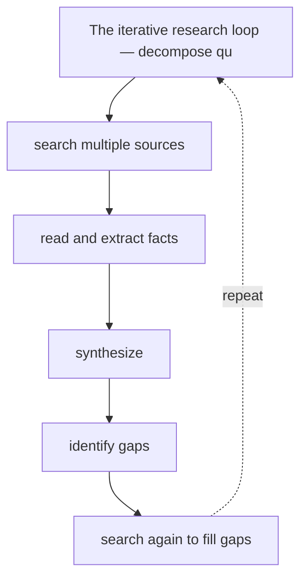
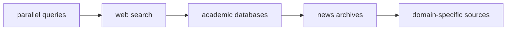

# Deep Research Agents

**One-Line Summary**: Deep research agents perform multi-step investigation by iteratively searching, reading, extracting, synthesizing, identifying gaps, and refining -- producing comprehensive reports that would take a human researcher hours or days.

**Prerequisites**: Retrieval-augmented generation, planning and decomposition, tool use and function calling, context window management

## What Is Deep Research Agents?

Imagine a research assistant who, given a question like "What are the economic impacts of universal basic income?", does not just return the first Google result. Instead, they search academic databases, read 30 papers, extract key findings, notice contradictions between studies, search for more sources to resolve those contradictions, organize the findings by theme, and write a structured report with citations. They spend 3 hours and produce a 10-page analysis. Deep research agents replicate this process: iterative, multi-source, gap-aware research that produces synthesis rather than search results.

The fundamental difference between a deep research agent and a simple RAG system is iteration. RAG performs one retrieval pass: query the knowledge base, get relevant chunks, generate a response. A deep research agent performs many passes: the initial search reveals that Study A claims UBI reduces poverty by 30%, but Study B shows no effect. This gap triggers a new search for methodological differences. The agent discovers that Study A measured absolute poverty while Study B measured relative poverty. This nuance gets incorporated into the synthesis. Each search-read-synthesize cycle deepens understanding.

OpenAI launched Deep Research in early 2025, demonstrating o3-based agents that spend 5-30 minutes researching complex questions and produce detailed reports. Google followed with Gemini Deep Research. Perplexity's Pro Search performs lighter-weight research with real-time web access. These products have demonstrated strong user demand: people want answers that are researched, not just generated. The challenge is ensuring the research is thorough, the sources are reliable, and the synthesis is faithful to the evidence.

## How It Works

### The Research Loop
The core algorithm: (1) **Decompose** the question into sub-questions ("What are the economic impacts of UBI?" becomes: "What do RCTs show about employment effects?", "What are the fiscal costs?", "How does it affect entrepreneurship?"). (2) **Search** for each sub-question across multiple sources (web search, academic databases, news archives). (3) **Read** the retrieved documents, extracting relevant facts, data points, and arguments. (4) **Synthesize** findings across documents, identifying agreements, contradictions, and gaps. (5) **Identify gaps** in the current knowledge and formulate new search queries to fill them. (6) **Repeat** until the research is sufficiently comprehensive or a time/token budget is exhausted. (7) **Write** the final report, organized by theme with inline citations.

### Multi-Source Search
Effective research queries multiple source types: **Web search** (Google, Bing) for general information and recent developments. **Academic search** (Semantic Scholar, Google Scholar, PubMed) for peer-reviewed research. **News search** for current events and real-world examples. **Domain-specific databases** (financial data, patent databases, government statistics) for specialized information. Each source type has different strengths: academic sources are authoritative but lag current events; news sources are timely but may lack rigor; web sources are comprehensive but vary in quality. The agent must assess source reliability and weight findings accordingly.

### Extraction and Fact Management
Raw documents are too long to include in full. The agent must extract the relevant information: key findings, methodology details, data points, author conclusions, and limitations. This extraction step transforms a 20-page paper into 200-500 tokens of structured facts. The agent maintains a "fact store" -- a growing collection of extracted facts tagged with source, confidence level, and relevance to each sub-question. This fact store is the agent's working memory for the research task.

### Synthesis and Report Generation
The final synthesis step transforms extracted facts into a coherent narrative. The agent must: **Organize by theme** rather than by source (a thematic structure is more useful than a list of summaries). **Handle contradictions** explicitly ("Study A found X while Study B found Y, likely due to methodological differences in Z"). **Qualify claims** based on evidence strength ("Strong evidence from 5 RCTs supports X" vs "Preliminary evidence from one study suggests Y"). **Cite sources** inline so the reader can verify claims. The synthesis model must have strong instruction-following and long-form writing capabilities.

## Why It Matters

### Democratizing Expert Research
Professional research is expensive. A McKinsey analyst spends days on competitive intelligence. A legal researcher bills $200/hour reviewing case law. A medical researcher spends weeks on a literature review. Deep research agents perform comparable work in minutes to hours at a fraction of the cost. This makes expert-level research accessible to individuals, small businesses, and organizations that could never afford traditional research services.

### Information Overload
The volume of published information doubles every few years. No human can keep up with even a narrow research field. Deep research agents can process hundreds of documents in a single session, identify patterns across sources that no individual researcher would have time to notice, and surface the most relevant findings from an overwhelming corpus. They function as cognitive amplifiers for human researchers.

### Decision Quality
Better research leads to better decisions. A product manager deciding on a market entry strategy, a doctor evaluating treatment options, a policy maker weighing intervention approaches -- all benefit from comprehensive, multi-source research. When the research is done by a human under time pressure, it is often incomplete (checked 3 sources instead of 30) or biased (stopped searching after finding confirming evidence). Agents can be designed to search exhaustively and present balanced findings.

## Key Technical Details

- **Search breadth**: top deep research agents issue 20-100 search queries per research task, reading 30-200 documents before synthesizing
- **Time budget**: OpenAI's Deep Research spends 5-30 minutes per query; Gemini's Deep Research takes similar time. The time is dominated by sequential search-read cycles, each requiring LLM processing
- **Token consumption**: a deep research task may consume 500K-2M tokens across all LLM calls (search query generation, document reading, extraction, synthesis), costing $1.50-$30 depending on model
- **Source verification**: the agent should check whether multiple independent sources confirm a claim before stating it as fact; single-source claims should be qualified
- **Hallucination risk in synthesis**: the agent may blend facts from different sources incorrectly or generate plausible-sounding claims not present in any source. Citation verification (checking that cited claims actually appear in the cited source) is a critical quality measure
- **Structured output**: research reports benefit from structured formats -- executive summary, key findings by theme, methodology notes, limitations, bibliography -- that the agent should follow consistently
- **Iterative deepening**: the agent should allocate more research depth to sub-questions where initial findings are contradictory or sparse, and less depth to well-established sub-questions

## Common Misconceptions

- **"Deep research agents just search and summarize."** The critical difference is iteration: identifying gaps in the current synthesis and performing targeted follow-up research. A single search-summarize pass is RAG; iterative gap-filling is deep research.
- **"More sources always mean better research."** Source quality matters more than quantity. Ten authoritative papers provide better grounding than 100 blog posts. The agent must evaluate source reliability, not just accumulate volume.
- **"The agent's report is always factually accurate."** Deep research agents can hallucinate in synthesis, misattribute findings, or miss critical nuances. The output should be treated as a highly useful draft that requires human verification of key claims, not as ground truth.
- **"Deep research replaces domain experts."** The agent excels at breadth (covering many sources) but lacks domain expertise for evaluating methodology quality, identifying subtle flaws in studies, or placing findings in the broader disciplinary context. Expert review of agent-generated research is still essential for high-stakes decisions.
- **"Real-time web search is sufficient for deep research."** Many important sources are behind paywalls (academic papers), in databases (financial data), or require specialized access (government records). Effective deep research agents need access to diverse source types beyond web search.

## Connections to Other Concepts

- `autonomous-coding-agents.md` -- Both follow an iterative loop (search-read-synthesize for research; edit-test-debug for coding) with objective evaluation of intermediate results
- `web-navigation-agents.md` -- Research agents that need to access web-based sources may use web navigation capabilities for sites that require interaction beyond simple search
- `context-window-management.md` -- Managing the growing fact store within context limits is a core challenge; prioritizing the most relevant extracted facts for the synthesis step
- `cost-optimization.md` -- Deep research is expensive (many LLM calls, many searches); model routing (cheap model for extraction, expensive model for synthesis) is essential
- `self-improving-agents.md` -- Research agents can improve by learning which search strategies and source types produce the most useful results for different question types

## Further Reading

- **OpenAI, "Introducing Deep Research" (2025)** -- Announcement and technical overview of o3-powered research agents that iteratively search and synthesize across multiple sources
- **Nakano et al., "WebGPT: Browser-assisted Question-answering with Human Feedback" (2022)** -- Early work on training LLMs to search the web and synthesize answers, with human feedback for quality improvement
- **Shao et al., "Assisting in Writing Wikipedia-like Articles From Scratch with Large Language Models" (2024)** -- STORM system that generates comprehensive articles through multi-perspective research and outline-driven writing
- **Anthropic, "Research Best Practices for Claude" (2024)** -- Guidance on using Claude for research tasks including prompt patterns, source evaluation, and citation verification
- **Press et al., "Measuring and Narrowing the Compositionality Gap in Language Models" (2023)** -- Introduces self-ask decomposition, a technique directly applicable to breaking research questions into searchable sub-questions
