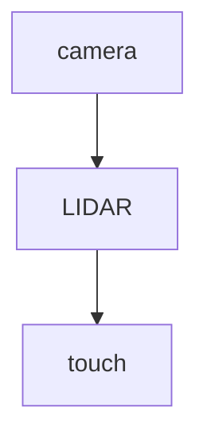

# Embodied Agents

**One-Line Summary**: Embodied agents are AI systems with physical bodies (robots) that perceive the world through sensors, reason with language models, and act in continuous physical space -- bridging the gap between digital intelligence and the real world.

**Prerequisites**: Tool use and function calling, planning and decomposition, multi-modal models, computer use agents

## What Is Embodied Agents?

Imagine giving an AI assistant a body. Instead of operating in the clean, discrete world of text and APIs, it must navigate a messy, continuous, physical world. It sees through cameras with limited field of view. It grips objects with imprecise manipulators. It moves through space where a miscalculation of a few centimeters means dropping a glass instead of placing it on the table. The floor is uneven, the lighting changes, objects look different from different angles, and actions are irreversible -- you cannot "undo" a dropped plate.

Embodied agents represent the convergence of two previously separate fields: large language models (which understand natural language instructions and can reason about tasks) and robotics (which has developed the hardware and low-level control systems for physical manipulation). The insight driving this convergence is that LLMs can serve as the "brain" of a robot, translating high-level instructions ("clean up the kitchen") into plans ("pick up the dishes, put them in the dishwasher, wipe the counter"), which are then executed by low-level motor controllers. The LLM handles the reasoning; the robot body handles the physics.

PaLM-E (Driess et al., 2023) demonstrated that a single model could process both text and sensor data (images, robot state) to generate robotic control plans. RT-2 (Brohan et al., 2023) showed that vision-language models trained on web data could be adapted to directly output robot actions. These systems represent a paradigm shift from traditional robotics, where every behavior was manually programmed, to a world where robots can follow natural language instructions for tasks they have never encountered before.

## How It Works

### Sensor Integration
Embodied agents perceive the world through multiple sensor modalities. **Cameras** (RGB, depth, stereo) provide visual information about objects, surfaces, obstacles, and the robot's own body. **LIDAR** (Light Detection And Ranging) creates precise 3D point clouds of the environment, essential for navigation and obstacle avoidance. **Touch/force sensors** in the gripper detect object contact, grip strength, and surface properties. **Proprioception** (joint angle sensors, IMUs) tells the robot where its limbs are in space. **Microphones** capture audio for voice commands and environmental sounds. The challenge is fusing these diverse sensor streams into a coherent world model that the LLM can reason about.

### From Language to Action
The pipeline from instruction to physical action has multiple stages. **Instruction understanding**: the LLM parses the natural language command ("put the red cup on the top shelf"). **Task planning**: the LLM decomposes the instruction into a sequence of sub-tasks (locate the red cup, navigate to it, grasp it, navigate to the shelf, place it on the top shelf). **Motion planning**: each sub-task is translated into a trajectory of joint angles and gripper commands that achieve the physical goal (move arm from current position to grasp position along a collision-free path). **Low-level control**: the motor controllers execute the trajectory in real-time, using feedback from sensors to adjust for disturbances.

### Continuous vs Discrete Action Spaces
Digital agents operate in discrete action spaces: click button A, type text B, call API C. Embodied agents operate in continuous spaces: move the arm to (x=0.45, y=0.32, z=0.78) with gripper openness 0.6. This continuity introduces challenges that digital agents never face: small errors compound across action sequences, actions are slow (moving a physical arm takes seconds, not milliseconds), and actions are partially irreversible (you cannot un-knock over a vase). Planning must account for physical constraints: the robot's reach, the weight of objects, the friction of surfaces, the risk of collision.

### Sim-to-Real Transfer
Training robots in the real world is slow (one trial per attempt), expensive (robot hardware costs), and dangerous (the robot might break things or itself). Sim-to-real transfer trains agents in physics simulators (MuJoCo, Isaac Sim, PyBullet) and transfers the learned policies to real hardware. The challenge: simulators imperfectly model real physics. A grasp that works in simulation might fail on a real object because the simulator did not accurately model the object's weight, surface friction, or deformability. Techniques to bridge this "reality gap" include: **Domain randomization** (randomly varying simulation parameters so the policy becomes robust to variations), **System identification** (calibrating the simulator to match real-world physics), and **Fine-tuning on real data** (small amounts of real-world experience to adapt the simulated policy).

## Why It Matters

### Physical World Automation
The physical world contains the vast majority of human labor: manufacturing, logistics, healthcare, agriculture, construction, household chores. Digital agents can automate digital tasks (writing, coding, data analysis), but they cannot stock shelves, assemble products, clean rooms, or sort packages. Embodied agents bridge this gap, potentially automating physical tasks that represent trillions of dollars of human labor annually.

### Natural Human-Robot Interaction
Traditional robots are programmed by engineers who write code specifying every motion. LLM-powered embodied agents accept natural language instructions from non-engineers: "put the groceries away" rather than a 500-line motion planning script. This democratizes robot interaction, allowing anyone to direct robot behavior through conversation rather than programming.

### Generalization Across Tasks
Traditional robotics builds task-specific systems: a welding robot welds, a pick-and-place robot picks and places. LLM-powered embodied agents generalize across tasks because the LLM can reason about novel instructions. A robot with PaLM-E can interpret "bring me something to clean up this spill" even if it has never been explicitly programmed for spill cleanup -- it reasons about what objects could help (paper towels, a mop) and plans the appropriate actions.

## Key Technical Details

- **PaLM-E** (562B parameters) processes interleaved text and sensor data (images, robot state vectors) and outputs text including robotic action plans. It achieves positive transfer: training on diverse visual-language tasks improves robotic task performance
- **RT-2** (Robotics Transformer 2) is a vision-language-action model that directly outputs robot actions (7-dimensional: 3 translation, 3 rotation, 1 gripper) as text tokens, treating robotic control as a language generation problem
- **Action frequency**: robot control requires 10-50 Hz update rates for smooth motion. LLMs generate at 10-100 tokens/second. This mismatch requires a hierarchical approach: the LLM generates high-level plans (1-5 Hz), and a low-level controller executes them at high frequency
- **Safety constraints** are non-negotiable: force limits on the gripper (to avoid crushing objects), speed limits (to avoid collisions), workspace boundaries (to keep the arm within safe zones), and emergency stops. These are implemented in the low-level controller, not the LLM
- **Real-world evaluation** is expensive: each trial takes 30-300 seconds of robot time, requires human supervision, and may require physical reset of the environment. A 1,000-trial evaluation takes days
- **Common benchmark tasks**: pick-and-place (move object from A to B), navigation (move to a specified location while avoiding obstacles), manipulation (open a drawer, turn a knob), and compositional tasks (fetch the blue cup from the kitchen)
- **Latency pipeline**: camera capture (10ms) + image processing (50ms) + LLM inference (500-5000ms) + motion planning (100ms) + execution (1-10s). The LLM inference bottleneck makes real-time reactive behavior challenging

## Common Misconceptions

- **"LLMs can directly control robots."** LLMs generate plans and high-level actions. Low-level motor control (joint torques, PID loops, trajectory interpolation) requires specialized controllers. The LLM is the brain, not the spinal cord.
- **"Sim-to-real transfer works out of the box."** The reality gap remains a major challenge. Policies trained purely in simulation often fail in the real world due to unmodeled physics. Domain randomization and real-world fine-tuning are necessary but not sufficient for all tasks.
- **"Humanoid robots are necessary for general-purpose embodied agents."** Many embodied agent tasks can be accomplished with simpler form factors: wheeled bases for navigation, single arms for manipulation, drones for inspection. Humanoid form factors add complexity without necessarily adding capability.
- **"Embodied agents will replace industrial robots."** Traditional industrial robots excel at high-speed, high-precision, repetitive tasks in structured environments. LLM-powered embodied agents are better suited for novel, unstructured tasks requiring flexibility. They complement rather than replace each other.
- **"The hard problem is the AI, not the hardware."** Hardware limitations (gripper dexterity, sensor resolution, battery life, durability) remain critical bottlenecks. The best AI cannot overcome a gripper that cannot grasp the target object.

## Connections to Other Concepts

- `computer-use-agents.md` -- Both involve perception-action loops, but computer use operates on pixels/GUIs while embodied agents operate in 3D physical space with continuous dynamics
- `simulation-environments.md` -- Physics simulators serve as simulation environments for embodied agents, enabling safe training and evaluation before real-world deployment
- `generative-agents.md` -- Generative agents in virtual worlds and embodied agents in physical worlds both require spatial reasoning, planning, and environment interaction
- `task-decomposition.md` -- Physical task execution requires hierarchical planning (high-level task decomposition into sub-tasks, then motion planning within each sub-task)
- `agent-operating-systems.md` -- Embodied agents need OS-like abstractions for managing sensor streams, motor commands, safety systems, and communication with other agents

## Further Reading

- **Driess et al., "PaLM-E: An Embodied Multimodal Language Model" (2023)** -- Demonstrates a single model that processes visual and sensor inputs alongside text to generate robotic plans, achieving positive transfer from web-scale visual-language training
- **Brohan et al., "RT-2: Vision-Language-Action Models Transfer Web Knowledge to Robotic Control" (2023)** -- Shows that vision-language models can be fine-tuned to directly output robot actions, inheriting web knowledge that enables novel task generalization
- **Ahn et al., "Do As I Can, Not As I Say: Grounding Language in Robotic Affordances" (SayCan, 2022)** -- Combines LLM task knowledge with learned robotic affordances to generate physically feasible plans
- **Brohan et al., "RT-1: Robotics Transformer for Real-World Control at Scale" (2023)** -- Transformer architecture for robotic control trained on 130K real-world demonstrations across 700+ tasks
- **Huang et al., "VoxPoser: Composable 3D Value Maps for Robotic Manipulation with Language Models" (2023)** -- Uses LLMs to compose 3D spatial objectives for robotic manipulation without task-specific training
