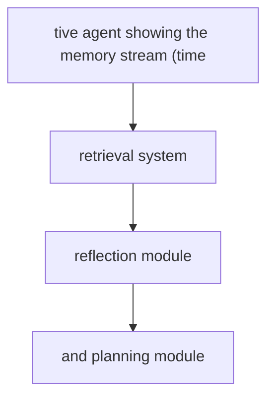
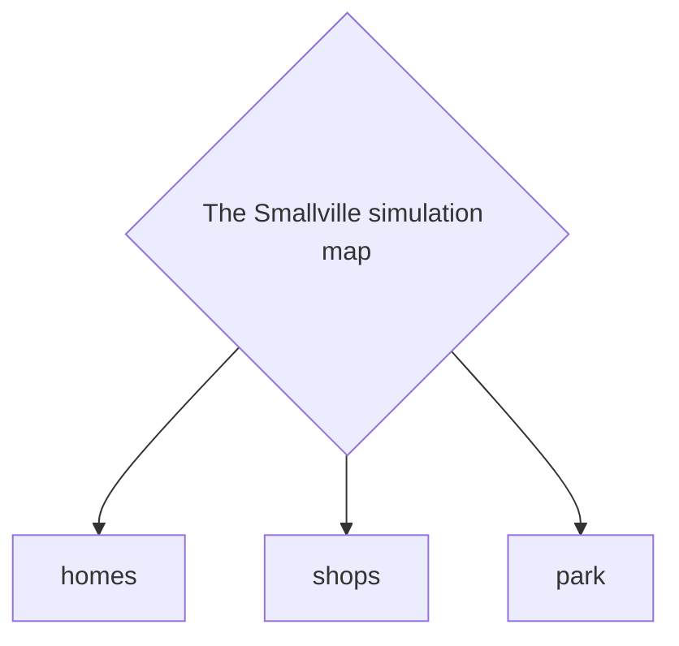

# Generative Agents

**One-Line Summary**: Generative agents are AI entities with persistent personalities, goals, memories, and social behaviors that produce believable human-like conduct in simulated environments through memory retrieval, reflection, and planning.

**Prerequisites**: Memory systems, planning and decomposition, multi-agent systems, retrieval-augmented generation

## What Is Generative Agents?

Imagine populating a small town with 25 characters, each with a name, a job, relationships, daily routines, and personal goals. Now imagine these characters are not scripted -- they wake up in the morning, decide what to do based on their personality and current circumstances, have conversations with neighbors, form opinions, plan events, and evolve over time. No human writes their dialogue or plots their activities. They generate their behavior from internal models of who they are and what they have experienced. This is exactly what Park et al. (2023) built: 25 generative agents in a sandbox town called Smallville, where agents autonomously planned activities, had conversations, formed relationships, and even organized a Valentine's Day party -- all emergent from their individual goals and memories.

Generative agents differ from task-oriented agents in a fundamental way. A task agent receives an instruction ("book a flight"), executes it, and terminates. A generative agent has no specific task -- it exists continuously, making decisions about what to do based on its personality, current situation, memories, and goals. It is more like a simulation of a person than a tool executing commands. The agent does not optimize for task completion; it optimizes for behaving consistently with its defined character.

The applications span entertainment (believable NPCs in games), social science (simulating population-level behavior), product research (how would users react to a new feature?), education (interactive historical figures for students to converse with), and therapy training (simulated patients for counselors to practice with). Anywhere you need believable, consistent, autonomous human-like behavior, generative agents provide a foundation.

## How It Works

### Memory Stream
The memory stream is the generative agent's autobiography. Every experience -- observations, conversations, actions, internal thoughts -- is recorded as a timestamped memory with an importance score. When the agent observes "Isabella is setting up the coffee shop for the morning," that observation is stored with its timestamp, a natural language description, and an importance score (1-10). Mundane observations (the sun is shining) receive low importance (2-3); significant events (a friend confided a secret) receive high importance (8-9). The memory stream grows continuously, creating a rich experiential history for the agent.

### Memory Retrieval
When the agent needs to make a decision or respond in a conversation, it retrieves relevant memories from the stream. Retrieval uses three factors: **Recency** (recent memories are weighted higher using an exponential decay function), **Importance** (high-importance memories are weighted higher regardless of age), and **Relevance** (memories semantically similar to the current context, measured by embedding similarity). The weighted combination of these three factors produces a ranked list of memories. The top-K memories are included in the agent's prompt, providing contextual information for the current decision.

### Reflection
Periodically (triggered when the sum of recent memory importance scores exceeds a threshold), the agent reflects on its experiences. Reflection generates higher-level abstractions from specific memories. The agent asks itself: "Given my recent experiences, what are the 3 most salient high-level questions I can answer?" Then it retrieves relevant memories and generates insight statements. For example, from memories of multiple conversations about art, an agent might reflect: "I am increasingly interested in digital art and should explore classes at the community center." These reflection insights are stored back in the memory stream and can be retrieved like any other memory, creating a hierarchy of abstraction.

### Planning and Reacting
Each morning (in simulation time), the agent generates a high-level plan for the day: "Wake up at 7am, have breakfast, work at the pharmacy from 9am-5pm, attend the town meeting at 6pm, read before bed." This plan is recursively decomposed into finer-grained actions (15-minute to 1-hour blocks). During execution, the agent can react to unexpected events. If another agent initiates a conversation, the current plan is interrupted, the conversation is processed, and the plan may be revised ("After talking to Sam about the party, I should buy decorations after work"). This interleaving of planned and reactive behavior produces natural-seeming daily routines with spontaneous social interactions.

## Why It Matters

### Believable NPCs and Interactive Narratives
Current game NPCs follow scripted behavior trees with limited dialogue options. Generative agents produce characters that remember past player interactions, form opinions about the player, gossip with other NPCs, and evolve over the course of the game. A shopkeeper who remembers that you helped her find her lost cat will greet you differently than a stranger. This level of emergent narrative is impossible with scripted approaches and represents a qualitative leap in game design.

### Social Science Simulation
Researchers can test social theories at scale. How does misinformation spread through a community? How do economic incentives affect cooperative behavior? How do cultural norms emerge in a new group? Instead of expensive, slow, ethically complex human studies, generative agent simulations can explore these questions rapidly. While the results must be validated against real human behavior, they provide hypotheses and directional insights that guide more targeted human studies.

### Prototype User Behavior
Product teams can simulate how users might react to a new feature, policy change, or communication. Populate a simulation with 100 agents representing different user personas, introduce the change, and observe emergent behavior. Do users adopt the feature? Do they find workarounds? Do they complain to other users? This is faster and cheaper than focus groups, though less reliable for predicting specific real-world outcomes.

## Key Technical Details

- **Memory importance scoring** uses the LLM to rate each observation on a 1-10 scale. Calibrating this scale is important: if everything is rated 8+, the recency and relevance signals dominate; if everything is rated 3-, important events are not distinguished from mundane ones
- **Retrieval scoring formula**: `score = alpha * recency + beta * importance + gamma * relevance`, where alpha, beta, gamma are tunable weights. Park et al. used equal weights (alpha = beta = gamma = 1) with normalized component scores
- **Reflection frequency**: triggered when the cumulative importance of new memories since the last reflection exceeds a threshold (e.g., 150 importance points). Too-frequent reflection wastes tokens; too-rare reflection fails to generate useful abstractions
- **Planning granularity**: top-level plans are 5-8 items spanning the day; each is decomposed into 30-60 minute blocks; each block may be further decomposed into specific actions. Plans are stored in the memory stream and revised when circumstances change
- **Token cost per agent per day**: simulating one agent's full day (plan generation, ~50 observations, ~5 conversations, 1-2 reflections) costs approximately 50K-200K tokens, or $0.15-$3.00 depending on model
- **25-agent simulation cost**: Park et al.'s 2-day simulation with 25 agents consumed approximately 6,000 LLM calls. At current pricing, this would cost $50-300 depending on model selection
- **Conversation modeling**: when two agents converse, each generates dialogue turns based on their own memories, personality, and relationship with the other agent. Conversations terminate when one agent decides they have said what they needed to

## Common Misconceptions

- **"Generative agents are conscious or sentient."** They are LLM inference wrapped in memory and planning architectures. They have no subjective experience, no genuine emotions, and no understanding of their own existence. Their "behavior" is generated text, not felt experience.
- **"More agents mean more interesting simulations."** Scaling to hundreds or thousands of agents creates combinatorial complexity in interactions but does not necessarily produce richer behavior. The quality of individual agent modeling (memory, reflection, personality) matters more than quantity.
- **"Generative agents accurately predict human behavior."** They produce plausible behavior that appears human-like, but they are biased toward the LLM's training distribution. They do not capture the full complexity of human cognition, culture, and irrationality. Simulation results are suggestive, not predictive.
- **"Any LLM can power generative agents."** The quality of the underlying LLM matters enormously. Weaker models produce inconsistent personalities, forget character details mid-conversation, and generate generic rather than character-specific behavior. Strong instruction-following and long-context capabilities are essential.

## Connections to Other Concepts

- `simulation-environments.md` -- Generative agents operate within simulation environments that define the physical and social world they inhabit
- `self-improving-agents.md` -- Generative agents exhibit a form of self-improvement through accumulated memory and reflection that shapes future behavior
- `agent-operating-systems.md` -- Running many generative agents simultaneously requires process management, memory management, and scheduling similar to an OS
- `embodied-agents.md` -- Generative agents in virtual worlds parallel embodied agents in physical worlds; both need perception, planning, and action in spatial environments
- `deep-research-agents.md` -- Reflection in generative agents resembles the synthesis step in research agents: generating high-level insights from accumulated lower-level observations

## Further Reading

- **Park et al., "Generative Agents: Interactive Simulacra of Human Behavior" (2023)** -- The foundational paper describing the memory stream, reflection, and planning architecture for 25 agents in Smallville, demonstrating emergent social behaviors
- **Park et al., "Social Simulacra: Creating Populated Prototyping Spaces for Social Computing Systems" (2022)** -- Precursor work generating simulated user communities for testing social platform designs
- **Lin et al., "AgentSims: An Open-Source Sandbox for Large Language Model Evaluation" (2023)** -- Open-source infrastructure for building and evaluating generative agent simulations with customizable environments
- **Gao et al., "S3: Social-Network Simulation System with Large Language Model-Empowered Agents" (2023)** -- Extends generative agents to social network simulation, studying information propagation and opinion formation
- **Kaiya et al., "Lyfe Agents: Generative Agents for Low-Cost Real-Time Social Interactions" (2023)** -- Addresses the cost challenge of generative agents with techniques for reducing LLM calls while maintaining believable behavior
