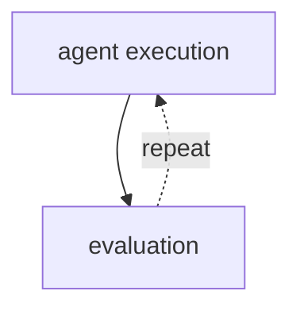
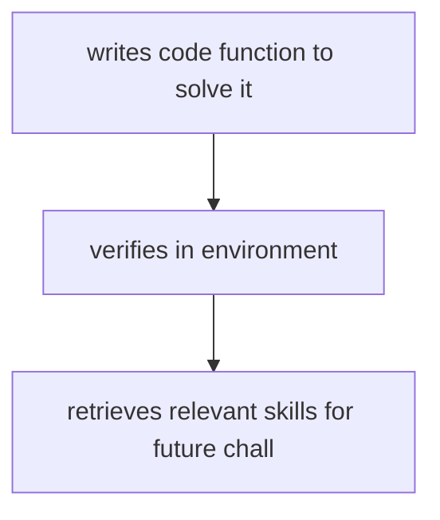

# Self-Improving Agents

**One-Line Summary**: Self-improving agents get better over time by learning from user feedback, optimizing their own prompts, acquiring new skills, and refining their tool usage -- without requiring manual re-engineering.

**Prerequisites**: Agent evaluation, ReAct pattern, planning and decomposition, retrieval-augmented generation

## What Is Self-Improving Agents?

Consider how a new employee improves. On day one, they follow procedures mechanically. After a week, they start recognizing patterns: "when the client says X, they usually mean Y." After a month, they develop shortcuts and heuristics. After a year, they have internalized hundreds of lessons that make them dramatically more effective than on day one. Self-improving agents replicate this learning curve. They start with a base configuration and improve through experience: learning which approaches work for which tasks, which tool sequences are most efficient, and which phrasings produce the best results.

The challenge is that most AI agents today are static. Deploy an agent on Monday, and it operates identically on Friday, regardless of what it encountered during the week. Every mistake is repeated. Every inefficiency persists. Every user correction is forgotten after the conversation ends. Self-improving agents break this pattern by creating feedback loops that convert experience into capability. A user corrects the agent's output -> the correction is stored -> future similar tasks benefit from the correction. A tool call fails in a specific way -> the failure pattern is learned -> the agent avoids that pattern in the future.

Self-improvement spans a spectrum from simple (storing user preferences in a memory bank) to profound (rewriting one's own system prompt based on performance data). DSPy (Khattab et al., 2023) automates prompt optimization using training examples. Voyager (Wang et al., 2023) demonstrated a Minecraft agent that acquires new skills by writing and verifying code functions, building a skill library that grows with experience. The bootstrapping problem is central: how does an agent improve without large amounts of human-labeled training data?

## How It Works

### Learning from User Feedback
The most accessible form of self-improvement: the user tells the agent what it did wrong, and the agent remembers. Implementation: when a user corrects an output ("actually, our company uses British spelling, not American"), the agent stores this as a persistent memory or preference. On future tasks, this preference is retrieved from the memory store and included in the prompt. Over hundreds of interactions, the agent accumulates a rich model of user preferences, domain-specific conventions, and common corrections. This is lightweight self-improvement -- no model weights change, but behavior adapts through accumulated context.

### Prompt Optimization with DSPy
DSPy treats prompt engineering as an optimization problem. Instead of manually crafting prompts, you define: **Signatures** (input/output specifications for each LLM call), **Modules** (composable prompt components), and **Metrics** (how to score outputs). DSPy's optimizers (BootstrapFewShot, MIPRO, BayesianSignatureOptimizer) then search the space of possible prompts (instructions, few-shot examples, prompt structures) to maximize the metric. For agents, this means each step's prompt can be automatically tuned based on performance data. The bootstrapping technique generates training examples from the model itself, reducing dependence on human labels.

### Skill Acquisition
Voyager introduced the concept of agents learning new "skills" -- reusable capabilities stored as verified code functions. When the Minecraft agent encounters a novel challenge (build a shelter before nightfall), it writes a function to solve it, verifies the function works in the game, and stores it in a skill library. On future encounters, it retrieves the relevant skill rather than reasoning from scratch. This pattern generalizes beyond Minecraft: a coding agent could store verified solutions to common patterns (setting up a test framework, configuring a CI pipeline), retrieving them when similar tasks arise.

### Tool Improvement
Agents can learn to use tools more effectively. If a search tool consistently returns irrelevant results for a certain type of query, the agent can learn to reformulate those queries. If a tool call fails with a specific error pattern, the agent can learn the correct input format. This learning can be implemented through: **Prompt refinement** (adding learned tool-use tips to the system prompt), **Few-shot examples** (storing successful tool usage patterns and retrieving relevant ones), or **Tool wrapper functions** that encode learned preprocessing and postprocessing steps.

## Why It Matters

### Compounding Returns
A static agent delivers the same value on day 1,000 as on day 1. A self-improving agent delivers increasing value over time. Each interaction is an opportunity to learn, and accumulated learning compounds. An enterprise agent that has processed 10,000 customer interactions has learned 10,000 lessons about customer needs, product edge cases, and effective responses. This accumulated knowledge is a durable competitive advantage.

### Reduced Maintenance Burden
Static agents require manual prompt engineering and tool configuration updates as user needs evolve. Self-improving agents adapt automatically. When a company changes its refund policy, users will start correcting the agent, and the corrections will be incorporated. This does not eliminate the need for human oversight (the corrections must be validated), but it reduces the frequency and urgency of manual updates.

### The Bootstrapping Problem
The hardest challenge in self-improvement is bootstrapping: how to improve without a large labeled dataset. DSPy addresses this by generating training examples from the model itself (the model generates outputs, a metric scores them, the highest-scoring examples become training data for the next optimization round). Voyager addresses it by using the environment as a verifier (if the code runs and achieves the goal, it is correct). Both approaches reduce dependence on expensive human annotation.

## Key Technical Details

- **DSPy optimizers** explore prompt variations (instructions, few-shot examples, chain-of-thought structure) using techniques like random search, Bayesian optimization, and bootstrap sampling from the model's own outputs
- **Memory-based improvement** requires a retrieval system that matches current tasks to stored corrections and preferences. Embedding-based similarity search with a threshold (cosine > 0.85) prevents irrelevant memories from being injected
- **Skill libraries** in Voyager store functions as (name, description, code) triples, retrieved via description similarity when the agent encounters a new task. The library grows from 0 to 300+ skills over extended play sessions
- **Validation loops** prevent incorrect self-improvement: a correction from a user might be wrong, a bootstrapped prompt optimization might overfit. Validation on held-out examples catches degradation before it reaches production
- **Improvement velocity** varies by mechanism: memory-based improvement shows immediate effect on the next interaction; prompt optimization requires 50-500 training examples to show significant gains; skill acquisition requires repeated encounters with similar challenges
- **Catastrophic forgetting** risk: when prompt optimization improves performance on one task type, it may degrade performance on others. Multi-task evaluation during optimization mitigates this
- **Human-in-the-loop validation**: in production, self-improvements should be staged (tested on a subset of traffic) before full deployment, similar to A/B testing code changes

## Common Misconceptions

- **"Self-improving agents recursively improve themselves to superintelligence."** Current self-improvement is incremental and bounded: better prompts, accumulated memories, learned tool usage patterns. There is no evidence of recursive unbounded improvement. Each improvement is small and specific.
- **"Self-improvement means the model's weights change."** Most practical self-improvement operates at the prompt/context level, not the weight level. The base model remains unchanged; what changes is the information provided to the model (memories, optimized prompts, skill libraries).
- **"More feedback always leads to improvement."** Low-quality feedback (contradictory corrections, edge-case preferences treated as general rules) can degrade agent performance. Feedback must be filtered, validated, and potentially weighted by source reliability.
- **"Self-improving agents do not need human oversight."** Self-improvement amplifies whatever signal it receives. If the feedback loop includes biased or incorrect signals, the agent will amplify those biases. Human review of the improvement process is essential.

## Connections to Other Concepts

- `agent-distillation.md` -- Distillation is a form of self-improvement where successful agent trajectories are used to train smaller, faster models
- `autonomous-coding-agents.md` -- Coding agents benefit from skill acquisition (learned solution patterns) and tool improvement (learned debugging strategies)
- `deep-research-agents.md` -- Research agents can improve by learning which search strategies produce the best results for different question types
- `generative-agents.md` -- Generative agents with persistent memory naturally exhibit a form of self-improvement as their accumulated experiences shape future behavior
- `simulation-environments.md` -- Simulated environments enable safe self-improvement experimentation where failures have no real-world consequences

## Further Reading

- **Wang et al., "Voyager: An Open-Ended Embodied Agent with Large Language Models" (2023)** -- Minecraft agent that acquires and stores skills as code functions, building a growing skill library through autonomous exploration
- **Khattab et al., "DSPy: Compiling Declarative Language Model Calls into Self-Improving Pipelines" (2023)** -- Framework for automatic prompt optimization that treats LLM pipelines as programs to be compiled and optimized
- **Shinn et al., "Reflexion: Language Agents with Verbal Reinforcement Learning" (2023)** -- Agents that improve by reflecting on failures, storing verbal feedback in memory, and using it to avoid repeating mistakes
- **Madaan et al., "Self-Refine: Iterative Refinement with Self-Feedback" (2023)** -- Technique where the model critiques and improves its own outputs through iterative self-evaluation
- **Fernando et al., "Promptbreeder: Self-Referential Self-Improvement via Prompt Evolution" (2023)** -- Evolutionary approach to prompt optimization where prompts and the meta-prompts that generate them co-evolve
