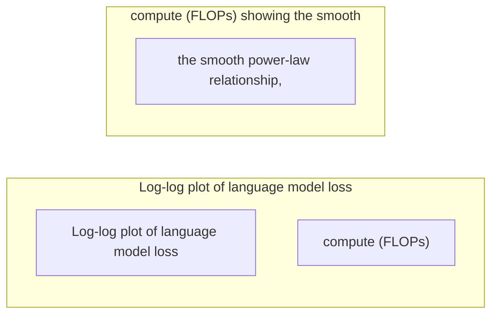
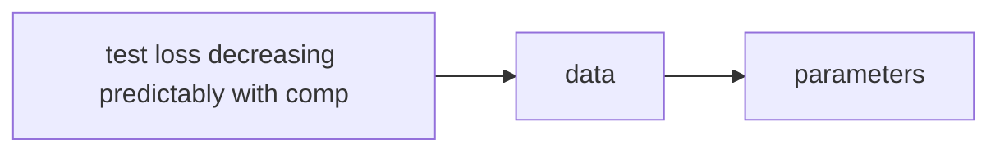

# Scaling Laws

**One-Line Summary**: Scaling laws are empirically discovered power-law relationships showing that LLM performance improves predictably and smoothly as you increase model parameters, training data, and compute -- enabling researchers to forecast the capabilities of models costing hundreds of millions of dollars before training them.

**Prerequisites**: Pre-training basics, the concept of loss (cross-entropy/perplexity), log-log plots and power laws, basic understanding of compute (FLOPs), model parameters, and training tokens.

## What Are Scaling Laws?

Imagine you are planning to build the world's tallest skyscraper. Before committing billions of dollars, you build a series of smaller buildings -- 5 stories, 10 stories, 50 stories -- and carefully measure how construction cost, stability, and usable space scale with height. You discover that these relationships follow clean, predictable mathematical curves. Using these curves, you can forecast the cost and characteristics of a 200-story building without building it first.

Scaling laws for LLMs work the same way. By training a series of small, medium, and large models and plotting their performance, researchers discovered that **loss decreases as a smooth power law** with respect to three variables: the number of model parameters ($N$), the amount of training data ($D$), and the total training compute ($C$). These relationships are remarkably consistent across orders of magnitude, allowing teams to make informed decisions about how to allocate billion-dollar compute budgets.

## How It Works

*See the Chinchilla compute-optimal frontier in: [Hoffmann et al., "Training Compute-Optimal Large Language Models" (arXiv:2203.15556)](https://arxiv.org/abs/2203.15556), Figure 1, which plots loss isocontours as a function of model size and token count, showing the optimal allocation curve where parameters and data should scale equally.*

### The Kaplan et al. Power Laws (2020)

The foundational scaling laws paper from OpenAI (Kaplan et al., 2020) established that cross-entropy loss $L$ follows power-law relationships:

**Scaling with parameters** (at sufficient data):
$$L(N) = \left(\frac{N_c}{N}\right)^{\alpha_N}$$

**Scaling with data** (at sufficient model size):
$$L(D) = \left(\frac{D_c}{D}\right)^{\alpha_D}$$

**Scaling with compute**:
$$L(C) = \left(\frac{C_c}{C}\right)^{\alpha_C}$$

where $N_c, D_c, C_c$ are constants and the exponents were empirically measured as approximately:
- $\alpha_N \approx 0.076$ (loss improves slowly with parameters)
- $\alpha_D \approx 0.095$ (loss improves slightly faster with data)
- $\alpha_C \approx 0.050$ (loss improves with compute)

On a log-log plot, these power laws appear as straight lines, making them easy to identify and extrapolate. The smoothness is striking -- there are no sudden jumps or plateaus; performance improves continuously and predictably.

### The Combined Scaling Law

When both $N$ and $D$ are finite, the loss follows:

$$L(N, D) = \left[\left(\frac{N_c}{N}\right)^{\alpha_N / \alpha_D} + \frac{D_c}{D}\right]^{\alpha_D}$$

This captures the interaction: making the model larger only helps if you also provide enough data, and adding more data only helps if the model is large enough to learn from it.

### The Kaplan Recommendation

The original scaling laws suggested that for a given compute budget, you should **train a very large model on relatively little data**. Specifically, they recommended scaling parameters much faster than data: if you 10x your compute, put most of it into a larger model rather than more training tokens.

This led to models like GPT-3 (175B parameters, 300B tokens) -- enormous models trained on comparatively modest datasets.

### The Chinchilla Insight (2022)

DeepMind's Chinchilla paper (Hoffmann et al., 2022) fundamentally revised this understanding. By training over 400 models of varying sizes and data amounts, they discovered that the Kaplan analysis had a flaw: it did not properly account for the learning rate schedule's interaction with training duration.

Chinchilla's corrected finding: **parameters and training tokens should be scaled roughly equally**. The compute-optimal ratio is approximately:

$$D_{\text{optimal}} \approx 20 \times N$$

That is, a compute-optimal model with $N$ parameters should be trained on approximately $20N$ tokens. This means:

| Model Size | Chinchilla-Optimal Tokens |
|-----------|--------------------------|
| 1B parameters | ~20B tokens |
| 7B parameters | ~140B tokens |
| 70B parameters | ~1.4T tokens |
| 175B parameters | ~3.5T tokens |

The implication was explosive: **most existing models were significantly undertrained**. GPT-3 (175B parameters, 300B tokens) was trained on roughly 60x fewer tokens than optimal. Chinchilla (70B parameters, 1.4T tokens) matched GPT-3's performance with less than half the parameters, simply by training on much more data.

### Compute-Optimal Training

The total training compute (in FLOPs) is approximately:

$$C \approx 6 \times N \times D$$

where the factor of 6 accounts for the forward pass (2 multiplications per parameter per token) and backward pass (approximately 4 multiplications). Given a fixed compute budget $C$, the Chinchilla-optimal allocation is:

$$N_{\text{optimal}} \propto C^{0.5}, \quad D_{\text{optimal}} \propto C^{0.5}$$

Both scale equally with compute -- a dramatic shift from the Kaplan recommendation of scaling $N$ faster.

### Beyond Chinchilla: The Over-Training Regime

In practice, many production models are deliberately trained **beyond the Chinchilla-optimal** token count. This is because:

*See also the original Kaplan scaling law figures at: [Kaplan et al., "Scaling Laws for Neural Language Models" (arXiv:2001.08361)](https://arxiv.org/abs/2001.08361), Figures 1-3, which show the separate power-law relationships between loss and model parameters, dataset size, and total compute.*

1. **Inference cost matters**: A smaller model trained on more data (e.g., LLaMA 7B on 1T+ tokens) is cheaper to deploy than a compute-optimal larger model, even if the training run is "compute-inefficient."
2. **Data is cheaper than GPUs**: Training a 7B model on 2T tokens uses more FLOPs than Chinchilla suggests, but the marginal cost of additional data processing is small compared to using 10x more GPUs for a larger model.
3. **Deployment constraints**: Edge devices, real-time applications, and cost-sensitive APIs favor smaller, over-trained models.

This has led to the "LLaMA scaling" philosophy: train models well past the Chinchilla optimum, accepting worse compute-efficiency for better inference-efficiency.

### Inference-Aware Scaling Laws

Sardana and Frankle (2024) formalized the over-training regime with **inference-aware scaling laws** that jointly optimize for training cost *and* inference cost. The key insight: the Chinchilla-optimal model minimizes training FLOPs, but the total cost of an LLM includes both training *and* all future inference. When you account for inference (which dominates lifetime cost for popular models), the optimal model is significantly smaller and more overtrained.

Their framework introduces a total cost function:

$$C_{\text{total}} = C_{\text{train}} + C_{\text{inference}} \times \text{expected\_queries}$$

Under this lens, a 7B model trained on 4T tokens (28x over Chinchilla ratio) may be more cost-efficient lifetime than a 70B model trained on 1.4T tokens, even though the 70B model has lower loss -- because the 7B model costs 10x less per inference query.

This framework predicted the LLaMA 3 design point: Meta trained LLaMA 3 8B on 15T tokens (~1900x the Chinchilla ratio), achieving loss comparable to much larger compute-optimal models while being dramatically cheaper to serve.

### Data-Constrained Scaling Laws

Muennighoff et al. (2023) extended scaling laws to the regime where unique data runs out and models must train with **repeated data** (multiple epochs). Their key findings:

- Training on repeated data yields diminishing but non-zero returns. The value of each additional epoch follows its own power law: $L(R) \propto R^{-\alpha_R}$ where $R$ is the number of repetitions.
- **4 epochs** of the same data is roughly equivalent to **0.7x** the value of unique data for each additional epoch beyond the first.
- Data augmentation (e.g., different tokenizations, paraphrasing) partially recovers the value lost from repetition.
- The optimal strategy when data-constrained: increase model size faster than Chinchilla recommends, since additional parameters benefit even from repeated data.

This work is increasingly relevant as frontier models approach the estimated ceiling of ~10 trillion high-quality unique tokens available on the public internet.

### The Two-Axis Scaling Paradigm: Training + Inference

The most important evolution of scaling laws since Chinchilla is the recognition that **performance depends on both training compute and inference compute**. Snell et al. (2024) demonstrated that test-time compute (repeated sampling, search, chain-of-thought reasoning) follows its own scaling law:

$$\text{Performance} = f(C_{\text{train}}, C_{\text{inference}})$$

Key findings:
- Training compute and inference compute are **partially substitutable**: a smaller model with more inference-time thinking can match a 14x larger model with standard inference.
- The marginal return on inference compute depends on problem difficulty. Easy problems saturate quickly; hard problems show log-linear improvement with additional thinking tokens.
- The optimal allocation between training and inference compute depends on the deployment scenario. A chatbot answering millions of simple queries should prioritize training-time scaling. A system solving rare, hard math problems should prioritize inference-time scaling.

This has profound implications for AI strategy: it is no longer sufficient to ask "how big should the model be?" You must also ask "how hard should each query think?"

## Why It Matters

Scaling laws are arguably the most strategically important discovery in modern AI. They transform LLM development from guesswork into engineering:

- **Predictability**: Before committing $100M+ to a training run, teams can predict the final loss (and roughly the capability level) based on smaller experiments. This turns AI development into a more predictable, plannable process.
- **Resource allocation**: Should you build a 70B or 200B model? Train on 2T or 10T tokens? Scaling laws provide quantitative answers.
- **Competition**: Organizations that understand scaling laws can make better bets about where to invest. The Chinchilla insight gave DeepMind a significant advantage over competitors who were building oversized, undertrained models.
- **Capability forecasting**: By extrapolating scaling curves, researchers can estimate what capabilities will emerge at various compute levels, informing both capability development and safety planning.

The billion-dollar decisions in AI -- how many GPUs to buy, what size model to train, how much data to collect -- are all guided by scaling laws.

## Key Technical Details

- **Power laws hold over many orders of magnitude**: The relationships are consistent from models with thousands to hundreds of billions of parameters, spanning 7+ orders of magnitude in compute.
- **Loss is not the whole picture**: Scaling laws predict cross-entropy loss, but downstream task performance can behave differently (see: Emergent Abilities). A smooth decrease in loss can correspond to sharp jumps in benchmark accuracy.
- **Architecture matters less than scale**: Within the transformer family, the specific architecture (number of layers vs. width, attention head count) has a relatively small effect on the scaling exponents. Scale dominates.
- **Data quality shifts the curve**: Higher-quality data does not change the scaling exponent but shifts the entire curve downward -- achieving the same loss with less compute.
- **Repeat data degrades scaling**: When models see the same data multiple times, the effective value of additional epochs diminishes. This has motivated the search for more and better data.
- **Token-level prediction improves before task-level**: A 0.01 improvement in training loss can translate to significant improvements on downstream tasks, but the mapping is complex and task-dependent.

## Common Misconceptions

- **"Scaling laws say bigger is always better."** Scaling laws say performance improves with scale, but with diminishing returns (power law, not linear). They also show that scale must be allocated correctly (Chinchilla) -- blindly making models bigger without enough data wastes compute.
- **"Scaling laws predict specific capabilities."** They predict aggregate loss, not whether a model will solve any particular task. Two models with the same loss can differ dramatically in specific capabilities.
- **"The Chinchilla ratio is a universal constant."** The 20:1 token-to-parameter ratio is an approximation that depends on data quality, architecture, and other factors. It is a guideline, not a law of physics.
- **"Scaling laws will hold forever."** There is growing evidence that scaling exponents may change at very large scales, that data availability limits may create a "data wall," and that architectural innovations could shift the curves. The laws are empirical regularities, not fundamental physics.
- **"Diminishing returns means scaling is pointless."** Even with diminishing returns, the absolute improvement from doubling compute is still substantial. Going from 70B to 700B parameters yields meaningful capability gains, even though the per-FLOP improvement is smaller.
- **"Training-time scaling is the only way to improve models."** Inference-time scaling (test-time compute) provides a complementary axis. A smaller model that "thinks harder" can match or exceed a larger model that answers immediately. The two axes interact: better-trained models also benefit more from inference-time compute.
- **"Scaling laws are only about loss."** Recent work has extended scaling laws to downstream capabilities, reasoning accuracy, and even alignment properties. While the original formulation focused on cross-entropy loss, the broader scaling law paradigm applies more generally.

## Connections to Other Concepts

- `pre-training.md`: Scaling laws describe how pre-training performance depends on resources.
- `training-data-curation.md`: Data quality and quantity directly affect where a model sits on the scaling curve.
- `emergent-abilities.md`: The tension between smooth scaling of loss and potentially sudden emergence of capabilities.
- `mixed-precision-training.md`: Enables the compute throughput necessary to operate at the scales described by scaling laws.
- `05-distributed-training-infrastructure.md`: The infrastructure that makes billion-parameter, trillion-token training possible.
- `03-chinchilla-and-compute-optimal-training.md`: The direct practical application of Chinchilla-style scaling analysis.
- `test-time-compute.md`: The inference-time scaling paradigm that extends the scaling law framework to a second compute axis.
- `reasoning-models.md`: o1/R1 models empirically validate inference-time scaling laws on math, code, and science benchmarks.
- `model-collapse.md`: Recursive training on synthetic data may impose limits on data scaling by degrading the available data distribution.

## Further Reading

- Kaplan, J., et al. (2020). "Scaling Laws for Neural Language Models" -- The foundational paper establishing power-law relationships between performance and scale for language models.
- Hoffmann, J., et al. (2022). "Training Compute-Optimal Large Language Models" (Chinchilla) -- The landmark paper that corrected the Kaplan scaling recommendations and showed that models should be trained on far more data than previously thought.
- Muennighoff, N., et al. (2023). "Scaling Data-Constrained Language Models" -- Explores what happens when data is limited and models must be trained with repeated data, extending scaling laws to the data-constrained regime.
- Sardana, N. & Frankle, J. (2024). "Beyond Chinchilla-Optimal: Accounting for Inference in Language Model Scaling Laws" -- Introduces inference-aware scaling that jointly optimizes training and deployment cost, explaining the LLaMA over-training strategy.
- Snell, C., et al. (2024). "Scaling LLM Test-Time Compute Optimally Can Be More Effective Than Scaling Model Parameters" -- Formalizes the inference-time scaling law showing that test-time compute and model size are partially substitutable.
