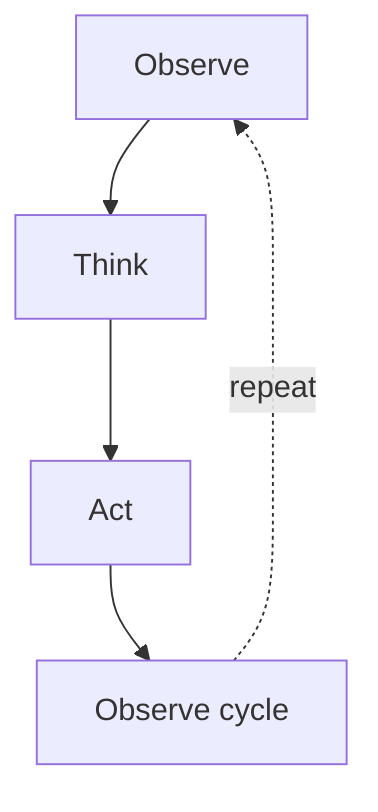

# AI Agents

**One-Line Summary**: AI agents are systems where LLMs operate in autonomous loops -- reasoning about a task, taking actions through tools, observing results, and iterating until the goal is achieved -- moving beyond single-response generation into multi-step problem solving.

**Prerequisites**: Understanding of how LLMs generate text, function calling and tool use, the concept of a context window, and basic familiarity with prompt engineering (especially chain-of-thought reasoning).

## What Are AI Agents?

Imagine hiring a contractor to renovate your kitchen. You do not stand over them dictating every hammer swing. Instead, you describe the end goal ("modern kitchen, white cabinets, quartz countertops"), and they plan the work, use various tools, handle unexpected problems (finding old wiring behind a wall), adjust their plan, and deliver the finished result. An AI agent works the same way: you give it a goal, and it autonomously figures out the steps.


*Source: [Lilian Weng – LLM Powered Autonomous Agents](https://lilianweng.github.io/posts/2023-06-23-agent/)*


A standard LLM interaction is one turn: you ask, it answers. An agent interaction is a *loop*: the model thinks about what to do, takes an action (calls a tool, writes code, searches the web), observes the result, and decides what to do next. This loop continues -- sometimes for dozens or hundreds of iterations -- until the task is complete or the agent determines it cannot proceed.

The key distinction is *autonomy*. A chatbot responds to individual prompts. An agent pursues goals across multiple steps, managing its own workflow.

## How It Works




### The Agent Loop

The fundamental pattern underlying all agent architectures is:

```
while task_not_complete:
    1. THINK  - Reason about current state, what's been done, what's needed next
    2. ACT    - Choose and execute a tool/action
    3. OBSERVE - Process the result of the action
    4. UPDATE - Update internal state and assess progress
```

This loop runs within the LLM's context window. Each iteration adds tokens: the model's reasoning, the tool call, and the tool's result. The context window is therefore both the agent's working memory and its limiting factor.

### The ReAct Pattern

ReAct (Reasoning + Acting), introduced by Yao et al. (2023), formalized the most common agent architecture. The model alternates between:

- **Thought**: "I need to find the quarterly revenue figures. Let me search the financial database."
- **Action**: `search_database(query="Q3 2024 revenue")`
- **Observation**: "Revenue was $4.2B, up 12% YoY"
- **Thought**: "Now I need to compare this with analyst expectations..."

By interleaving reasoning traces with actions, the model maintains a coherent problem-solving narrative. The reasoning steps help the model plan, recover from errors, and explain its process.

### Plan-and-Execute Agents

An alternative to the reactive ReAct pattern is plan-and-execute: the agent first creates a complete plan (a list of steps), then executes each step, potentially replanning if results diverge from expectations.

This approach works better for well-defined tasks with clear milestones. It reduces the chance of the agent going in circles and makes progress more transparent. However, it is less flexible than ReAct for tasks where the path forward only becomes clear as you go.

### Multi-Agent Systems

Complex tasks can be decomposed across multiple specialized agents. In a multi-agent architecture:

- A **supervisor agent** breaks down the task and delegates sub-tasks.
- **Specialist agents** handle specific domains (one for code generation, one for research, one for testing).
- Agents communicate through shared message channels or structured handoff protocols.

Multi-agent systems can tackle problems that would overwhelm a single agent's context window or expertise. They also enable parallel work on independent sub-tasks. Frameworks like AutoGen, CrewAI, and LangGraph support multi-agent orchestration.

### Memory Systems

Agents need memory at multiple timescales:

**Short-term memory (context window)**: The conversation history within the current context window. This is the agent's working memory -- everything it has thought, done, and observed in the current session. The context window limit (typically 128K-200K tokens) constrains how long an agent can work before losing early context.

**Long-term memory (external retrieval)**: For tasks spanning multiple sessions or requiring large knowledge bases, agents use external memory systems -- typically vector databases storing past interactions, learned facts, or retrieved documents. This is essentially RAG applied to the agent's own history.

**Episodic memory**: Some advanced agents maintain structured logs of past task completions, enabling them to learn from experience. If the agent successfully completed a similar task before, it can retrieve that episode and follow a similar approach.

## Real-World Agent Examples

**Claude Code**: An agentic coding assistant that operates in a terminal environment. Given a task like "fix this bug" or "add a feature," it reads files, understands the codebase, writes code, runs tests, and iterates until the implementation is correct. It demonstrates the agent loop clearly: think about what to do, use file and terminal tools, observe results, adjust approach.

**Coding agents (Claude Code, Codex, Devin, SWE-Agent, OpenHands)**: These agents take a GitHub issue or feature description and autonomously write code, create tests, and submit pull requests. They navigate complex codebases, handle build errors, and iterate on failing tests. Claude Code (Anthropic, 2025) operates as a terminal-based agentic coding assistant, achieving state-of-the-art performance on SWE-bench Verified. OpenAI's Codex (2025) provides a cloud-based coding agent that operates in sandboxed environments. These represent the most commercially successful agent applications to date.

**Research agents**: Given a research question, these agents search the web, read papers, synthesize findings, and produce reports. They decompose complex questions into sub-queries and recursively gather information. OpenAI's Deep Research and Google's AI research modes exemplify this pattern.

**Computer-use agents**: Agents that interact with a computer through screenshots and mouse/keyboard actions, enabling them to use any software without API integration. Anthropic's Computer Use API (2024) and OpenAI's Operator provide this capability, with agents perceiving screen state visually and acting through simulated mouse/keyboard input. This unlocks automation of tasks that lack API interfaces.

### Agent Evaluation and Benchmarks

Measuring agent capability has become a critical research area:

- **SWE-bench Verified** (2024): The gold standard for coding agents, containing 500 real GitHub issues from popular Python repositories. Agents must read issue descriptions, navigate codebases, and produce patches. Top agents solve 50-70% of issues as of early 2026.
- **WebArena** (2024): Tests agents on realistic web tasks (shopping, forum posting, content management) requiring multi-step interaction with live websites.
- **GAIA** (2024): A general AI assistant benchmark testing real-world tasks requiring tool use, multi-step reasoning, and information synthesis.
- **τ-bench** (2024): Tests agent reliability across retail and airline customer service scenarios, measuring not just success but also safety (avoiding incorrect actions).

### Model Context Protocol (MCP)

Anthropic introduced MCP (Model Context Protocol) in late 2024 as an open standard for connecting LLMs to external tools and data sources. MCP defines a client-server protocol where:

- **MCP servers** expose tools, resources, and prompt templates through a standardized interface.
- **MCP clients** (LLM applications) discover and invoke these capabilities.
- The protocol handles capability negotiation, tool invocation, and result passing.

MCP's significance: it transforms tool integration from a per-application engineering problem into a standardized ecosystem, analogous to how USB standardized peripheral connections. A tool integration written once as an MCP server works with any MCP-compatible LLM application.

## When Agents Work Well vs. When They Fail

**Agents excel when**:
- The task has clear success criteria (tests pass, output matches spec)
- Tools provide reliable, interpretable feedback
- The task naturally decomposes into discrete steps
- Individual steps are within the model's capability
- Error recovery is possible (can retry, try alternative approaches)

**Agents struggle when**:
- Success criteria are subjective or ambiguous
- Tools are unreliable or return noisy results
- The task requires more working memory than the context window provides
- The task requires capabilities the model fundamentally lacks
- There is no feedback signal to guide correction

The most common failure mode is **compounding errors**: each step has some probability of going wrong, and over many steps, these errors accumulate. An agent with 95% accuracy per step has only a 60% chance of completing a 10-step task perfectly. Robust error detection and recovery mechanisms are essential.

## Why It Matters

Agents represent the current frontier of practical LLM applications. They extend LLMs from being tools you use to being collaborators that work alongside you -- or autonomously on your behalf. The economic implications are significant: agents can automate complex knowledge work that previously required human judgment at every step.

The agent paradigm also changes how we think about AI capability. Individual model capabilities (reasoning, coding, knowledge) combine multiplicatively in an agent context. A model that is 80% as good as a human at coding but can work 24/7 with perfect patience and instant access to all documentation represents a qualitative shift in what is possible.

## Key Technical Details

- **Context window management**: Long-running agents must manage context carefully. Strategies include summarizing older interactions, dropping low-relevance messages, and maintaining a structured scratchpad of key findings.
- **Token cost**: Agent loops are expensive. A complex task might involve 50+ LLM calls, each consuming thousands of tokens. Cost management is a real engineering concern.
- **Latency**: Each loop iteration involves at least one LLM call plus tool execution. Agents measured in minutes or hours of wall-clock time are common for complex tasks.
- **Evaluation is hard**: Agent behavior is non-deterministic and path-dependent. The same task might be completed via entirely different tool sequences across runs.
- **Sandboxing**: Agents that can execute code or interact with external systems must run in sandboxed environments to prevent unintended consequences.

## Common Misconceptions

**"Agents are just chatbots with tools."** The autonomous loop -- deciding what to do next, handling failures, maintaining state across many steps -- is qualitatively different from single-turn tool-augmented chat.

**"Agents can do anything a human can."** Current agents are brittle on tasks requiring common sense, creative judgment, or recovery from novel failure modes. They work best within well-defined domains with clear feedback signals.

**"More autonomy is always better."** Highly autonomous agents can go badly wrong in hard-to-predict ways. The most effective production systems often use "human-in-the-loop" designs where the agent handles routine steps and escalates to humans for critical decisions.

**"Agent = single LLM."** Production agents typically involve multiple LLM calls with different prompts, temperatures, and even different models for different stages (a fast model for routing, a powerful model for reasoning).

## Connections to Other Concepts

- **Function calling and tool use** is the mechanism through which agents interact with their environment.
- **RAG** provides agents with long-term memory and knowledge retrieval capabilities.
- **Prompt engineering** (especially chain-of-thought and system prompts) shapes how agents reason and plan.
- **Structured output** ensures reliable communication between the agent's reasoning and its tool invocations.
- **Safety and alignment** become paramount when agents act autonomously -- misaligned goals combined with tool access can produce harmful outcomes.

## Further Reading

- Yao, S. et al. (2023). "ReAct: Synergizing Reasoning and Acting in Language Models." *ICLR 2023.* The paper that established the dominant reasoning-plus-acting agent pattern.
- Wang, L. et al. (2024). "A Survey on Large Language Model Based Autonomous Agents." A comprehensive survey of agent architectures, capabilities, and evaluation.
- Anthropic (2024). "Building Effective Agents." A practical guide to agent design patterns, failure modes, and best practices from production experience.
- Anthropic (2024). "Model Context Protocol (MCP) Specification." The open standard for connecting LLMs to external tools and data sources.
- Jimenez, C. et al. (2024). "SWE-bench: Can Language Models Resolve Real-World GitHub Issues?" The benchmark that catalyzed the coding agent revolution.
- Xie, T. et al. (2024). "OSWorld: Benchmarking Multimodal Agents for Open-Ended Tasks in Real Computer Environments." Evaluation framework for computer-use agents.
