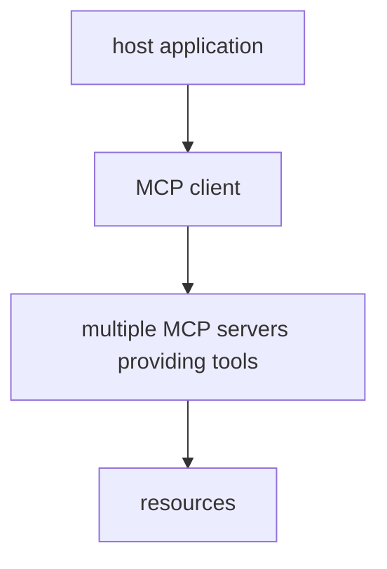
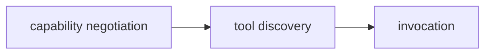

# Model Context Protocol (MCP)

**One-Line Summary**: MCP is an open standard that provides a universal interface for connecting LLM applications to external data sources, tools, and services -- replacing fragile, custom integrations with a single, composable protocol.

**Prerequisites**: Understanding of AI agents, function calling and tool use, client-server architecture, and JSON-RPC.

## What Is MCP?

Imagine every appliance in your kitchen required a unique, proprietary power outlet. Your toaster needs a hexagonal plug, your microwave needs a triangular one, and every new gadget requires you to rewire your kitchen. That is the state of LLM integrations today: every tool, every data source, every service requires a custom connector. MCP is the universal power outlet -- a single standard interface that any tool can plug into and any LLM application can consume.

The Model Context Protocol, introduced by Anthropic in November 2024, is an open protocol that standardizes how LLM applications communicate with external systems. Rather than building bespoke integrations for each data source (a Slack connector, a GitHub connector, a database connector, each with its own API surface), MCP defines a common protocol layer. Any MCP-compatible server can provide tools and data to any MCP-compatible client, creating a composable ecosystem of AI capabilities.

## How It Works

### Architecture

MCP follows a client-server model with three key components:

**MCP Host**: The LLM application (Claude Desktop, an IDE, a custom agent) that wants to use external tools and data. The host manages the lifecycle of MCP clients.

**MCP Client**: Maintains a stateful session with an MCP server. Each client connects to one server. The host may run multiple clients simultaneously, connecting to different servers.

**MCP Server**: A lightweight program that exposes capabilities through the MCP protocol. A server might provide access to a database, a file system, a web API, or any other resource. Servers can be local processes or remote services.

### Primitives

MCP defines three core primitives that servers can expose:

**Tools**: Executable functions that the LLM can invoke. Tools have typed input schemas (JSON Schema) and return structured results. Examples: `search_database(query)`, `create_issue(title, body)`, `run_sql(statement)`. Tools are the primary mechanism for LLM *actions*.

**Resources**: Data that the application can read. Resources are identified by URIs and can represent files, database records, API responses, or any other data. Unlike tools, resources are *read-only* and do not perform side effects. They provide context for the model.

**Prompts**: Reusable prompt templates with arguments that servers can offer. These encode best practices for interacting with specific tools or data sources, and can be surfaced as user-facing slash commands or completion options.

### Communication

MCP uses JSON-RPC 2.0 as its wire format, supporting two transport mechanisms:

- **stdio**: The server runs as a local subprocess, communicating over standard input/output. This is the simplest setup and is used for local tools like file system access, Git operations, and database queries.
- **Streamable HTTP**: The server runs as a remote HTTP service using Server-Sent Events for streaming. This enables cloud-hosted servers, shared team servers, and remote service access.

### Session Lifecycle

1. **Initialization**: Client sends an `initialize` request with its supported protocol version and capabilities. Server responds with its capabilities and version.
2. **Capability Discovery**: Client calls `tools/list`, `resources/list`, or `prompts/list` to discover what the server offers.
3. **Operation**: The LLM application uses discovered capabilities. When the model decides to use a tool, the client sends a `tools/call` request; the server executes the function and returns the result.
4. **Termination**: Either side can close the connection gracefully.

### Sampling: Servers Requesting LLM Completions

A distinctive MCP feature is **sampling** -- the ability for servers to request LLM completions from the host. This inverts the typical flow: instead of only the LLM calling tools, tools can ask the LLM for help. Use cases include agentic workflows where a server needs to analyze data, generate content, or make decisions as part of a tool execution. The host controls approval and privacy, ensuring the server cannot bypass the user's permissions.

## Why It Matters

1. **Ecosystem composability**: A single MCP server for Slack works with Claude Desktop, Cursor, Windsurf, custom agents, and any future MCP-compatible application. Write once, use everywhere.
2. **Reduced integration burden**: Instead of N applications times M tools requiring N*M custom integrations, MCP creates an N+M ecosystem where each application and each tool needs only one implementation.
3. **Security through standardization**: MCP defines explicit capability negotiation, permission boundaries, and approval flows. Standardized security is easier to audit and harder to get wrong than bespoke solutions.
4. **Open ecosystem**: The protocol specification, SDKs (TypeScript, Python, Java, Kotlin, C#), and a growing registry of community-built servers are all open-source, preventing vendor lock-in.
5. **Agentic foundation**: As AI agents become more capable, they need a reliable way to interact with the real world. MCP provides the plumbing that makes tool use robust and interoperable across agent frameworks.

## Key Technical Details

- MCP is transport-agnostic: stdio for local servers, Streamable HTTP with SSE for remote servers. The protocol layer is identical regardless of transport.
- Tool schemas use JSON Schema, the same format used by OpenAI function calling and other tool-use interfaces, making migration straightforward.
- The protocol supports **notifications** for real-time updates: servers can notify clients when resources change, and clients can notify servers of context updates.
- **Roots** allow servers to understand which parts of the filesystem or project they should operate on, scoping their behavior appropriately.
- As of 2025, MCP has been adopted by Claude Desktop, Claude Code, Cursor, Windsurf, Zed, Sourcegraph Cody, and numerous other development tools.
- The MCP server ecosystem includes hundreds of community-built servers for databases (PostgreSQL, SQLite), version control (GitHub, GitLab), communication (Slack, Discord), cloud platforms (AWS, GCP), and more.
- MCP servers can be stateful, maintaining context across multiple tool invocations within a session.

## Common Misconceptions

- **"MCP is just function calling with extra steps."** Function calling defines how a single model invokes a single tool. MCP defines how *any* application connects to *any* tool provider, including capability discovery, session management, security boundaries, and bidirectional communication. It operates at the ecosystem level, not the model level.
- **"MCP requires Anthropic's models."** MCP is model-agnostic. Any LLM application can implement an MCP client, and servers have no knowledge of which model is calling them. The protocol is open and not tied to any specific AI provider.
- **"MCP replaces existing APIs."** MCP wraps existing APIs rather than replacing them. An MCP server for GitHub still calls the GitHub API internally; MCP provides a standardized way for LLM applications to discover and invoke that functionality.
- **"Every tool needs to be an MCP server."** Simple, application-specific tools may not benefit from MCP's standardization overhead. MCP is most valuable when tools need to work across multiple applications or when building composable agent systems.

## Connections to Other Concepts

- **Function Calling & Tool Use**: MCP builds on the function calling paradigm, providing the infrastructure layer that makes tool use interoperable across applications (see `function-calling-and-tool-use.md`).
- **AI Agents**: MCP is becoming the standard connectivity layer for AI agents, providing reliable tool access for autonomous operation (see `ai-agents.md`).
- **Compound AI Systems**: MCP enables the modular composition that compound AI systems require -- each capability can be a pluggable MCP server (see `compound-ai-systems.md` in Advanced & Emerging).
- **Multi-Agent Systems**: MCP's standardized tool access allows multiple agents to share the same tool infrastructure (see `multi-agent-systems.md`).
- **Structured Output**: MCP's JSON Schema-based tool definitions connect naturally to structured output generation for reliable tool invocation (see `structured-output.md`).

## Further Reading

- **Model Context Protocol Specification** (Anthropic, 2024) -- The full protocol specification at spec.modelcontextprotocol.io, defining all primitives, transports, and lifecycle management.
- **"Introducing the Model Context Protocol" (Anthropic Blog, November 2024)** -- The announcement post explaining the motivation and design principles behind MCP.
- **MCP SDKs** -- Official TypeScript and Python SDKs at github.com/modelcontextprotocol, with community SDKs for Java, Kotlin, C#, Go, and Rust.
