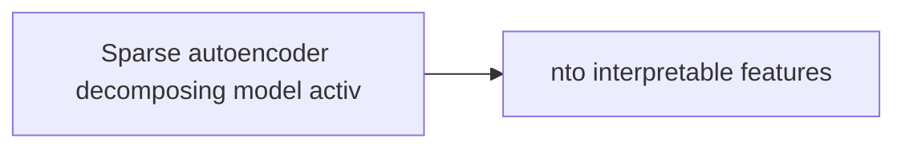
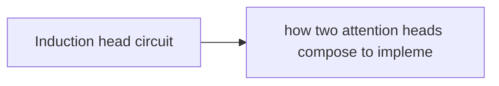

# Mechanistic Interpretability

**One-Line Summary**: Mechanistic interpretability is the scientific effort to reverse-engineer neural networks at the level of individual computations, identifying the specific features models represent, the circuits that connect them, and how these give rise to complex behaviors like reasoning, factual recall, and potentially deception.

**Prerequisites**: Understanding of neural network architecture (neurons, layers, activations), Transformer internals (attention heads, MLP layers, residual streams), linear algebra (basis vectors, projections, subspaces), the concept of representation learning, and basic familiarity with autoencoders.

## What Is Mechanistic Interpretability?

Imagine you have a working computer but no documentation -- no source code, no circuit diagrams, no manuals. You can see what goes in and what comes out, but you want to understand **how** it works internally. You start probing individual components, tracing signals, mapping circuits. That is mechanistic interpretability applied to neural networks.




Unlike behavioral evaluation (testing what a model does) or probing (asking if information exists somewhere inside), mechanistic interpretability seeks to understand the **causal computational structure**: what does each component compute, how do components connect to form circuits, and how do these circuits produce the model's observed behavior? The goal is not just correlation but mechanism.

This matters enormously for AI safety. If we cannot understand what a model is computing internally, we cannot verify that it is being honest, detect hidden objectives, or predict failures in novel situations. Mechanistic interpretability is the long-term path toward trustworthy AI.

## How It Works




### Features: The Atoms of Representation

A **feature** is an interpretable concept that a model represents in its activations. Examples: "this token is a proper noun," "this text discusses legal proceedings," "this sentence has a sarcastic tone." Features are the fundamental units of meaning inside the network.

The critical challenge is that features do not map neatly onto individual neurons.

### Superposition: More Concepts Than Neurons

Anthropic's research (Elhage et al., 2022) revealed a fundamental property: neural networks represent **far more features than they have neurons** through a phenomenon called superposition. Features are encoded as directions in activation space, and because most features are sparse (rarely active), the network can pack many more features than dimensions by using almost-orthogonal directions.

This is analogous to compressed sensing in signal processing. If a signal is sparse, you can encode it in a lower-dimensional space and reconstruct it. Neural networks do this naturally: a layer with 4,096 dimensions might represent 100,000+ sparse features as nearly-orthogonal directions.

The cost of superposition is interference: when two superposed features happen to be active simultaneously, they create noise. Networks manage this by putting frequently co-occurring features in more orthogonal directions and accepting some interference for rare feature combinations.

### Sparse Autoencoders: Disentangling Features

Since features are superposed in the residual stream, we cannot directly read them off neurons. **Sparse Autoencoders (SAEs)** decompose model activations into interpretable, monosemantic features:

```
# Encode: project activation into high-dimensional sparse space
z = ReLU(W_enc * (x - b_dec) + b_enc)

# Decode: reconstruct activation from sparse features
x_hat = W_dec * z + b_dec

# Loss: reconstruction + sparsity
L = ||x - x_hat||^2 + lambda * ||z||_1
```

Where:
- **W_enc** maps activations to a much larger feature space (e.g., 4,096 -> 65,536)
- **ReLU + L1 sparsity** ensures only a few features are active per input
- **W_dec** columns are the feature directions in activation space

Each column of W_dec represents a learned feature direction. When feature j activates (z_j > 0), we can examine what inputs trigger it and what downstream effects it has, building an interpretable picture of the model's representations.

### Anthropic's Monosemanticity Research

In "Towards Monosemanticity" (Bricken et al., 2023), Anthropic trained sparse autoencoders on a small Transformer and found strikingly interpretable features: features for specific languages, programming constructs, emotional tones, and even specific entities. In "Scaling Monosemanticity" (Templeton et al., 2024), they scaled this to Claude 3 Sonnet, extracting millions of features including ones for:

- Specific cities, people, and concepts
- Safety-relevant behaviors (deception, power-seeking)
- Abstract reasoning patterns

Critically, they showed these features are **causally active**: artificially activating the "Golden Gate Bridge" feature makes the model talk about the Golden Gate Bridge, demonstrating that these are genuine computational elements, not mere correlations.

### Circuit Tracing and "On the Biology of a Large Language Model"

Anthropic's 2025 research represents a major leap from individual features to full **computational graphs**. Their "Circuit Tracing" work and companion publications applied attribution-based methods to trace complete causal pathways through Claude 3.5 Haiku, revealing how the model implements complex behaviors at a mechanistic level.

The methodology combines sparse autoencoders with **attribution graphs**: for a given model behavior, they trace which features in each layer causally contribute to which features in the next layer, through both attention and MLP operations. The result is a readable computational graph showing exactly how information flows from input to output.

Key discoveries include:

- **Multi-step reasoning circuits**: When asked "What is the capital of the country containing Marseille?", the model activates a "Marseille → France" feature in early layers, which feeds into a "France → Paris" feature in later layers -- a genuine two-hop reasoning chain implemented as a feature cascade.
- **Planning in poetry**: When generating a rhyming couplet, features representing the target rhyme word activate *before* the model begins generating the line, showing the model plans ahead from constraints.
- **Hallucination mechanisms**: Specific circuits where the model "fills in" plausible-sounding but fabricated information, mechanistically distinct from genuine knowledge retrieval pathways.
- **Sycophancy circuits**: Features that detect user disagreement and activate an "agree with the user" pathway, providing mechanistic explanations for sycophantic behavior.
- **Safety-relevant circuits**: Identifiable pathways that detect potentially harmful requests and trigger refusal, which can be artificially suppressed or strengthened, demonstrating causal control.

Earlier foundational circuit discoveries include:
- **Induction circuits**: Attention heads implementing in-context pattern matching ("A B ... A → B")
- **Factual recall circuits**: MLP layers storing and retrieving entity-attribute associations
- **Indirect object identification**: Multi-head circuits tracking referents across sentences

### Crosscoders

Crosscoders (Lindsey et al., 2024) extend sparse autoencoders to operate across **multiple models or model versions simultaneously**. Instead of training separate SAEs for each model, a crosscoder learns a shared dictionary that identifies common features while capturing model-specific ones.

This enables:
- **Diff-in-diff analysis**: Understanding what changes between a base model and its RLHF-tuned version by identifying which features are strengthened, weakened, or newly created by alignment.
- **Transfer of interpretability**: Features identified in one model can be matched to corresponding features in related models, reducing the cost of interpretability across model families.
- **Safety verification across training stages**: Verifying that safety-relevant features are preserved through fine-tuning and alignment.

## Why It Matters

The stakes for mechanistic interpretability extend beyond scientific curiosity:

- **AI Safety**: Can we detect if a model has learned deceptive strategies? If we can map the circuits responsible for truthfulness, we might detect when a model "knows" something but chooses not to say it.
- **Alignment Verification**: Rather than relying on behavioral tests (which a sophisticated model could game), understanding internals provides a more robust verification path.
- **Targeted Editing**: If we identify the circuit responsible for a harmful behavior, we can surgically remove it rather than relying on blunt fine-tuning.
- **Predicting Failures**: Understanding internal mechanisms allows predicting how a model will behave on novel inputs, rather than relying only on empirical testing.

## Key Technical Details

- **Residual stream as the communication channel**: In Transformers, the residual stream is the central highway. Attention heads and MLPs read from and write to it. Features exist as directions in this stream.
- **SAE dictionary size**: Typical ratios are 8x to 16x the model dimension. A 4,096-dimensional residual stream might use a 65,536-feature SAE. Larger dictionaries recover more features but are more expensive to train.
- **Feature splitting**: As SAE dictionary size increases, coarse features split into finer sub-features. "Code" might split into "Python code" and "JavaScript code."
- **Dead features**: A practical challenge -- many SAE features never activate and waste capacity. Training techniques like re-initialization are used to combat this.
- **Polysemanticity vs. monosemanticity**: A polysemantic neuron responds to multiple unrelated concepts. SAEs aim to decompose polysemantic neurons into monosemantic features.
- **Computational cost**: Training SAEs on large models is expensive. Extracting and analyzing millions of features across a frontier model requires significant infrastructure.

## Common Misconceptions

- **"We can fully interpret large language models today"**: Current mechanistic interpretability captures a fraction of model behavior. We can identify individual features and small circuits, but fully mapping the computational structure of a 100B+ parameter model remains far beyond current capabilities.
- **"Neurons are the right unit of analysis"**: Individual neurons are typically polysemantic (responding to multiple unrelated concepts). Features -- directions in activation space -- are the more natural unit, which is why sparse autoencoders are necessary.
- **"Interpretability means we can explain every output"**: Even with perfect feature extraction, the combinatorial complexity of how features interact makes full explanation of arbitrary outputs intractable. The goal is understanding classes of behavior and detecting specific concerning patterns.
- **"Probing and mechanistic interpretability are the same thing"**: Probing trains classifiers on model activations to detect information, showing what information is *available*. Mechanistic interpretability aims to show how the model *uses* that information causally -- a much stronger claim.
- **"This is only relevant for safety researchers"**: Mechanistic interpretability insights have practical applications in model editing, debugging, improving training, and understanding failures -- relevant to any practitioner.

## Connections to Other Concepts

- **Transformer Architecture**: Mechanistic interpretability requires detailed understanding of attention heads, MLP layers, layer normalization, and the residual stream to trace computations.
- **RLHF and Alignment**: Interpretability provides a verification tool for alignment -- checking whether RLHF has genuinely aligned a model's reasoning or merely taught it to produce aligned-looking outputs.
- **Representation Learning**: Features in mechanistic interpretability are the specific representations the model has learned. Understanding feature geometry is central.
- **AI Safety**: The primary motivation for much interpretability research. Detecting deception, power-seeking, and value misalignment all require understanding internal computations.
- **Model Editing**: Once circuits are identified, targeted editing (activation patching, feature clamping) can modify specific behaviors without retraining.
- **Neuroscience**: The methodology draws parallels to neuroscience -- probing, ablation studies, and circuit mapping are inspired by techniques used to study biological brains.

## Further Reading

- **"Toy Models of Superposition" (Elhage et al., 2022)**: Foundational work demonstrating how and why neural networks represent more features than neurons through superposition, establishing the theoretical basis for the field.
- **"Scaling Monosemanticity: Extracting Interpretable Features from Claude 3 Sonnet" (Templeton et al., 2024)**: Demonstrates that sparse autoencoders scale to production models, extracting millions of interpretable features from a frontier LLM.
- **"Circuit Tracing: Revealing Computational Graphs in Language Models" (Anthropic, 2025)**: Maps the causal computational structure connecting features across layers, showing how models implement specific behaviors through identifiable circuits.
- **"On the Biology of a Large Language Model" (Anthropic, 2025)**: Applies circuit tracing to reveal multi-step reasoning, planning, hallucination mechanisms, and sycophancy circuits in Claude 3.5 Haiku, advancing interpretability from features to full behavioral explanations.
- **"Crosscoders: Learning Shared Features Across Multiple Models" (Lindsey et al., 2024)**: Introduces shared sparse autoencoders across model versions, enabling comparison of internal representations before and after alignment training.
